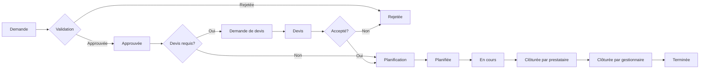

# SEIDO - Plateforme de Gestion Immobilière Multi-Rôles

<div align="center">

[](https://nextjs.org/)
[](https://reactjs.org/)
[](https://www.typescriptlang.org/)
[](https://supabase.com/)
[](https://tailwindcss.com/)
[](https://github.com/aumugisha-umu/seido)

**Plateforme SaaS de gestion immobilière pour gestionnaires, prestataires et locataires**

[🚀 Démo Live](https://seido-app.vercel.app) • [📖 Documentation](./docs/) • [🐛 Signaler un bug](https://github.com/aumugisha-umu/seido/issues)

</div>

---

## 🎯 Vue d'ensemble

**SEIDO** est une application web de gestion immobilière en production qui permet la gestion complète du cycle de vie des interventions de maintenance dans un contexte multi-rôles. L'application gère des bâtiments, lots, interventions, devis, et coordonne les interactions entre gestionnaires immobiliers, prestataires de services et locataires.

### ✨ Caractéristiques principales

- 🏢 **Gestion de patrimoine** - Bâtiments, lots, contacts, documents
- 🔧 **Workflow d'interventions** - Cycle complet avec 11 statuts
- 💰 **Système de devis** - Demandes multi-prestataires et comparaison
- 📅 **Planification** - Gestion des disponibilités et créneaux horaires
- 👥 **Multi-rôles** - Admin, Gestionnaire, Prestataire, Locataire
- 📊 **Analytics** - Statistiques et rapports en temps réel
- 🔐 **Sécurité** - RLS (Row Level Security) au niveau base de données
- 📧 **Notifications** - Emails transactionnels via Resend
- 🎨 **UI/UX** - 50+ composants shadcn/ui avec Tailwind v4
- ⚡ **Performance** - Cache multi-niveaux (Redis + LRU)

---

## 🏗️ Architecture Technique

### Stack Technologique

| Couche | Technologie | Version | Utilisation |
|--------|-------------|---------|-------------|
| **Framework** | Next.js | 15.2.4 | App Router, SSR, Server Actions |
| **Language** | TypeScript | 5.x | Strict mode, type-safety |
| **UI** | React | 19.x | Server Components, Suspense |
| **Styling** | Tailwind CSS | 4.1.9 | OKLCH colors, utility-first |
| **Components** | shadcn/ui | 50+ | Radix UI primitives |
| **Database** | PostgreSQL | via Supabase | 22 migrations appliquées |
| **Auth** | Supabase Auth | 2.57.0 | PKCE flow, RLS integration |
| **Cache** | Redis + LRU | ioredis 5.8.0 | Multi-level caching |
| **Email** | Resend | 6.1.2 | Transactional emails |
| **Forms** | React Hook Form | 7.60.0 | + Zod validation |
| **Testing** | Vitest + Playwright | 2.1.9 / 1.55.1 | Unit + E2E tests |
| **Logging** | Pino | 9.12.0 | Structured logging |

### Architecture Pattern

```
┌─────────────────────────────────────────────────────────────┐
│                      Next.js 15 App Router                  │
│  ┌──────────────┐  ┌──────────────┐  ┌──────────────┐     │
│  │  UI Layer    │  │ Server       │  │ API Routes   │     │
│  │  (React 19)  │  │ Actions      │  │ (70+ routes) │     │
│  └──────┬───────┘  └──────┬───────┘  └──────┬───────┘     │
└─────────┼──────────────────┼──────────────────┼────────────┘
          │                  │                  │
          └──────────────────┼──────────────────┘
                             │
          ┌──────────────────┴──────────────────┐
          │      Domain Services Layer          │
          │  (10+ services - Business Logic)    │
          │  - InterventionService              │
          │  - BuildingService, LotService      │
          │  - TeamService, StatsService        │
          └──────────────┬─────────────────────┘
                         │
          ┌──────────────┴─────────────────────┐
          │    Repository Pattern Layer         │
          │  (8 repositories - Data Access)     │
          │  - BaseRepository (Generic CRUD)    │
          │  - InterventionRepository           │
          │  - BuildingRepository, etc.         │
          └──────────────┬─────────────────────┘
                         │
          ┌──────────────┴─────────────────────┐
          │        Infrastructure Layer         │
          │  ┌────────────┐  ┌──────────────┐  │
          │  │ Supabase   │  │ Cache        │  │
          │  │ PostgreSQL │  │ Redis + LRU  │  │
          │  │ + RLS      │  │              │  │
          │  └────────────┘  └──────────────┘  │
          └────────────────────────────────────┘
```

### Structure du Projet

```
seido-app/
├── app/                          # Next.js App Router
│   ├── [role]/                   # Routes dynamiques par rôle
│   │   ├── admin/                # Dashboard admin
│   │   ├── gestionnaire/         # Dashboard gestionnaire
│   │   ├── prestataire/          # Dashboard prestataire
│   │   └── locataire/            # Dashboard locataire
│   ├── api/                      # 70+ API routes
│   ├── actions/                  # Server Actions
│   └── auth/                     # Authentication pages
│
├── components/                   # React Components
│   ├── ui/                       # 50+ shadcn/ui components
│   ├── dashboards/               # Role-specific dashboards
│   └── intervention/             # Intervention workflow UI
│
├── lib/                          # Core Business Logic
│   ├── services/                 # Repository Pattern
│   │   ├── core/                 # Infrastructure
│   │   │   ├── supabase-client.ts
│   │   │   ├── base-repository.ts
│   │   │   └── error-handler.ts
│   │   ├── repositories/         # 8 Data Repositories
│   │   └── domain/               # 10 Domain Services
│   ├── auth-dal.ts               # Auth Data Access Layer
│   ├── database.types.ts         # Generated Supabase types
│   └── utils.ts
│
├── hooks/                        # 30+ Custom React Hooks
├── supabase/migrations/          # 22 Database Migrations
├── tests-new/                    # E2E Test Suite (Playwright)
├── docs/                         # Documentation
└── package.json
```

---

## 🚀 Installation & Démarrage Rapide

### Prérequis

- **Node.js** 18+ et npm
- **Compte Supabase** (gratuit sur [supabase.com](https://supabase.com))
- **Compte Resend** (optionnel, pour emails - [resend.com](https://resend.com))

### 1. Clone et Installation

```bash
# Cloner le repository
git clone https://github.com/aumugisha-umu/seido.git
cd seido

# Installer les dépendances
npm install
```

### 2. Configuration Environnement

Créer un fichier `.env.local` à la racine :

```bash
# Supabase Configuration
NEXT_PUBLIC_SUPABASE_URL=https://your-project-id.supabase.co
NEXT_PUBLIC_SUPABASE_ANON_KEY=your-anon-key
SUPABASE_SERVICE_ROLE_KEY=your-service-role-key

# Application URL
NEXT_PUBLIC_SITE_URL=http://localhost:3000

# Email Configuration (Optionnel)
RESEND_API_KEY=re_your_api_key
RESEND_FROM_EMAIL="SEIDO <noreply@yourdomain.com>"

# Redis Cache (Optionnel - désactivé en dev par défaut)
REDIS_URL=redis://localhost:6379
```

> 📘 **Guide détaillé** : Voir [docs/VERCEL_ENV_SETUP.md](./docs/VERCEL_ENV_SETUP.md) pour la configuration complète

### 3. Configuration Base de Données

```bash
# Appliquer les migrations Supabase
npx supabase db push

# Générer les types TypeScript
npm run supabase:types
```

### 4. Lancer l'Application

```bash
# Mode développement
npm run dev

# L'application sera disponible sur http://localhost:3000
```

**Utilisateurs de test** (après seed de la base) :
- **Admin**: `admin@seido.pm`
- **Gestionnaire**: `gestionnaire@seido.pm`
- **Prestataire**: `prestataire@seido.pm`
- **Locataire**: `locataire@seido.pm`

---

## 👥 Système Multi-Rôles

SEIDO implémente 4 rôles distincts avec permissions granulaires :

### 🔑 Rôles et Permissions

| Rôle | Permissions Clés | Dashboard | Cas d'usage |
|------|------------------|-----------|-------------|
| **Admin** | Administration système complète | KPIs globaux, gestion users | Supervision plateforme |
| **Gestionnaire** | Gestion patrimoine, validation interventions | Portfolio, interventions en attente | Gestion immobilière |
| **Prestataire** | Exécution travaux, création devis | Tâches assignées, planning | Maintenance & réparations |
| **Locataire** | Création demandes, suivi interventions | Mes demandes, historique | Vie quotidienne logement |

### 📋 Workflow d'Intervention (11 Statuts)



---

## 🔐 Sécurité & Authentification

### Row Level Security (RLS)

Toutes les tables sensibles sont protégées par des politiques RLS Supabase :

```sql
-- Exemple : Les gestionnaires voient uniquement leurs bâtiments
CREATE POLICY "Gestionnaires access own buildings" ON buildings
FOR SELECT USING (
  is_gestionnaire() AND
  team_id = auth.jwt() ->> 'team_id'
);

-- Les locataires voient uniquement leurs interventions
CREATE POLICY "Tenants view own interventions" ON interventions
FOR SELECT USING (
  is_tenant_of_lot(lot_id)
);
```

**Helper Functions RLS** :
- `is_admin()`, `is_gestionnaire()`, `is_team_manager()`
- `can_view_building()`, `can_view_lot()`
- `is_tenant_of_lot()`, `get_building_team_id()`

### Multi-layered Security

1. **Database Level** : RLS policies pour isolation multi-tenant
2. **Application Level** : Server-side validation dans services
3. **UI Level** : Role-based rendering avec `requireAuth()`, `requireRole()`

---

## 🧪 Tests & Qualité

### Infrastructure de Tests

- **Unit Tests** : Vitest avec 60% coverage (cible 80%)
- **Integration Tests** : Service layer testing
- **E2E Tests** : Playwright avec 12 scénarios
- **Performance** : Lighthouse CI pour monitoring

### Exécuter les Tests

```bash
# Tests unitaires
npm test
npm run test:coverage

# Tests E2E
npm run test:new                    # Tous les tests E2E
npx playwright test --grep="Phase 2"  # Tests spécifiques

# Linting
npm run lint
```

### Métriques Qualité

| Métrique | Actuel | Cible | Statut |
|----------|--------|-------|--------|
| Unit Test Coverage | 60% | 80% | 🟡 En cours |
| E2E Pass Rate | 58% | 95% | 🟡 Amélioration nécessaire |
| API Response Time | <100ms | <100ms | ✅ Atteint |
| E2E Test Duration | <5min | <5min | ✅ Optimal |

---

## ⚡ Performance & Optimisation

### Stratégie de Caching

```typescript
// L1 Cache : LRU In-Memory (rapide, volatile)
const lruCache = new LRU<string, CachedData>({
  max: 500,
  ttl: 1000 * 60 * 5 // 5 minutes
})

// L2 Cache : Redis (persistant, partagé)
const redisCache = new Redis(process.env.REDIS_URL)

// Pattern : Cache-Aside
async function getData(key: string) {
  // 1. Check L1
  let data = lruCache.get(key)
  if (data) return data

  // 2. Check L2
  data = await redisCache.get(key)
  if (data) {
    lruCache.set(key, data)
    return data
  }

  // 3. Fetch from DB
  data = await database.fetch(key)
  await redisCache.set(key, data, 'EX', 300)
  lruCache.set(key, data)
  return data
}
```

### Optimisations Implémentées

- ✅ **DataLoader Pattern** : Batch loading pour éviter N+1 queries
- ✅ **Server Components** : Rendu côté serveur par défaut
- ✅ **Query Optimization** : SELECT spécifiques, indexes DB
- ✅ **Code Splitting** : Route-based + dynamic imports
- ✅ **Image Optimization** : Next.js Image component

---

## 📧 Système d'Emails

### Intégration Resend

Types d'emails transactionnels :
- ✉️ **Confirmation d'inscription** (signup)
- 🔑 **Réinitialisation mot de passe**
- 📝 **Notifications d'intervention** (création, validation, clôture)
- 💰 **Demandes de devis**
- ✅ **Confirmation de rendez-vous**

```typescript
// Exemple : Email de confirmation signup
await emailService.sendSignupConfirmationEmail(
  'user@example.com',
  {
    firstName: 'Arthur',
    confirmationUrl: 'https://seido.pm/auth/confirm?token=...',
    expiresIn: 60
  }
)
```

---

## 📚 Scripts de Développement

```bash
# Développement
npm run dev                # Dev server (localhost:3000)
npm run dev:utf8           # Force UTF-8 encoding (Windows)
npm run build              # Production build
npm run start              # Production server

# Base de données
npm run supabase:types     # Générer types TypeScript
npx supabase db push       # Appliquer migrations
npx supabase db reset      # Reset + seed

# Tests
npm test                   # Unit tests
npm run test:coverage      # Coverage report
npm run test:new           # E2E tests Playwright
npx playwright test --ui   # Mode UI interactif

# Code Quality
npm run lint               # ESLint
npm run lint:fix           # Auto-fix issues
npm run type-check         # TypeScript validation
```

---

## 🗄️ Base de Données

### Statut des Migrations

| Phase | Description | Tables | Statut |
|-------|-------------|--------|--------|
| **Phase 1** | Users, Teams, Companies | 5 tables | ✅ Appliquée |
| **Phase 2** | Buildings, Lots, Documents | 4 tables | ✅ Appliquée |
| **Phase 2.5** | Enhancements (apartment_number, vues) | Updates | ✅ Appliquée |
| **Phase 3** | Interventions + Sharing (prévu) | 6 tables | 📋 Planifiée |

### Schéma Principal

```sql
-- Tables Core (Phase 1 & 2)
users (id, email, role, team_id, ...)
teams (id, name, manager_id, ...)
buildings (id, name, address, team_id, ...)
lots (id, building_id, apartment_number, tenant_id, ...)
property_documents (id, lot_id, visibility_level, ...)
building_contacts (contact_id, building_id, role_type)
lot_contacts (contact_id, lot_id, role_type)

-- Enums
user_role: 'admin' | 'gestionnaire' | 'prestataire' | 'locataire'
document_visibility_level: 'equipe' | 'locataire'
lot_category: 'appartement' | 'maison' | 'garage' | ...
```

---

## 📖 Documentation Supplémentaire

| Document | Description |
|----------|-------------|
| [CLAUDE.md](./.claude/CLAUDE.md) | Guidelines développement pour AI assistants |
| [VERCEL_ENV_SETUP.md](./docs/VERCEL_ENV_SETUP.md) | Configuration déploiement Vercel |
| [backend-architecture-report.md](./docs/backend-architecture-report.md) | Architecture backend détaillée |
| [rapport-audit-complet-seido.md](./docs/rapport-audit-complet-seido.md) | Audit complet de l'application |
| [HANDOVER.md](./docs/HANDOVER.md) | Documentation review sécurité/performance |
| [Tests HELPERS-GUIDE.md](./docs/refacto/Tests/HELPERS-GUIDE.md) | Patterns de tests E2E |

---

## 🚢 Déploiement Production

### Vercel (Recommandé)

```bash
# 1. Connecter à Vercel
npx vercel

# 2. Configurer les variables d'environnement (voir .env.example)
npx vercel env add NEXT_PUBLIC_SUPABASE_URL
npx vercel env add NEXT_PUBLIC_SUPABASE_ANON_KEY
npx vercel env add SUPABASE_SERVICE_ROLE_KEY
npx vercel env add RESEND_API_KEY

# 3. Déployer
npx vercel --prod
```

**Important** : Toutes les variables `NEXT_PUBLIC_*` nécessitent un redéploiement après modification.

### Configuration Supabase Production

1. Créer un projet Supabase production
2. Appliquer les migrations : `npx supabase db push`
3. Configurer les email templates dans Supabase Auth
4. Vérifier les RLS policies sont actives

---

## 🤝 Contribution

Les contributions sont les bienvenues ! Pour contribuer :

1. Fork le projet
2. Créer une branche feature (`git checkout -b feature/amazing-feature`)
3. Commit les changements (`git commit -m '✨ Add amazing feature'`)
4. Push vers la branche (`git push origin feature/amazing-feature`)
5. Ouvrir une Pull Request

**Guidelines** :
- Code en TypeScript strict
- Tests pour nouvelles features
- Documentation des API/composants
- Commits conventionnels (feat, fix, docs, etc.)

---

## 📝 License

Ce projet est sous licence MIT. Voir [LICENSE](./LICENSE) pour plus de détails.

---

## 🙏 Remerciements

- [Next.js](https://nextjs.org/) - Framework React
- [Supabase](https://supabase.com/) - Backend-as-a-Service
- [shadcn/ui](https://ui.shadcn.com/) - Composants UI
- [Tailwind CSS](https://tailwindcss.com/) - Framework CSS
- [Resend](https://resend.com/) - Email transactionnel
- [Vercel](https://vercel.com/) - Hosting & déploiement

---

<div align="center">

**Fait avec ❤️ par l'équipe SEIDO**

[⬆ Retour en haut](#seido---plateforme-de-gestion-immobilière-multi-rôles)

</div>
