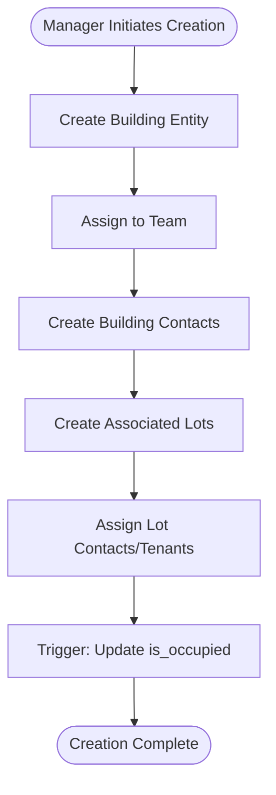
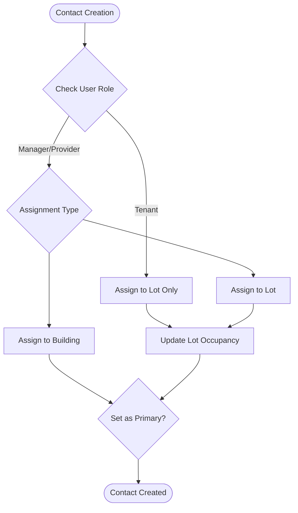
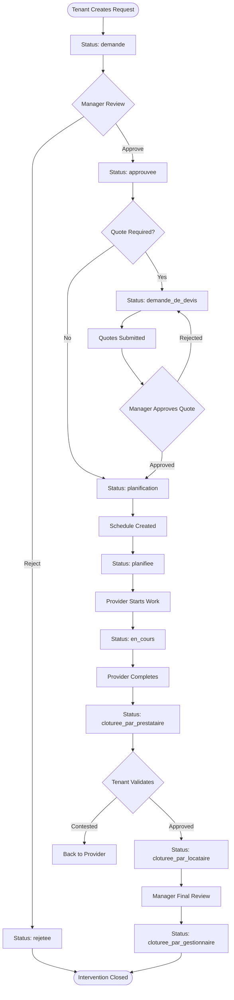

# SEIDO Data Flow and Architecture Analysis

## Executive Summary
This document provides a comprehensive analysis of the SEIDO real estate management platform's current data flows, architecture patterns, and identifies key areas for optimization. The analysis covers database schema, query patterns, cascade behaviors, and multi-tenant isolation implementation.

## Table of Contents
1. [Current Schema Overview](#current-schema-overview)
2. [Data Flow Diagrams](#data-flow-diagrams)
3. [Pain Points & Performance Issues](#pain-points--performance-issues)
4. [Query Patterns Analysis](#query-patterns-analysis)
5. [RLS Policies & Multi-Tenant Isolation](#rls-policies--multi-tenant-isolation)
6. [Cascade Behaviors](#cascade-behaviors)

---

## Current Schema Overview

### Core Table Structure

```
┌─────────────────────────────────────────────────────────────┐
│                        USERS TABLE                          │
├─────────────────────────────────────────────────────────────┤
│ • id (UUID, PK)                                            │
│ • auth_user_id (UUID) → auth.users                        │
│ • email, name, first_name, last_name                       │
│ • role (enum: admin/gestionnaire/locataire/prestataire)    │
│ • provider_category (enum: for service providers)          │
│ • team_id (UUID) → teams                                   │
│ • is_active, password_set                                  │
│ • created_at, updated_at                                   │
└─────────────────────────────────────────────────────────────┘
                              ↓
┌─────────────────────────────────────────────────────────────┐
│                        TEAMS TABLE                          │
├─────────────────────────────────────────────────────────────┤
│ • id (UUID, PK)                                            │
│ • name, description                                        │
│ • created_by → users(id)                                   │
│ • created_at, updated_at                                   │
└─────────────────────────────────────────────────────────────┘
                              ↓
┌─────────────────────────────────────────────────────────────┐
│                     TEAM_MEMBERS TABLE                      │
├─────────────────────────────────────────────────────────────┤
│ • team_id → teams(id)                                      │
│ • user_id → users(id)                                      │
│ • role (admin/member)                                      │
│ • joined_at                                                │
└─────────────────────────────────────────────────────────────┘

┌─────────────────────────────────────────────────────────────┐
│                      BUILDINGS TABLE                        │
├─────────────────────────────────────────────────────────────┤
│ • id (UUID, PK)                                            │
│ • name, address, city, postal_code, country                │
│ • team_id → teams(id)                                      │
│ • total_lots (computed)                                    │
│ • created_at, updated_at                                   │
└─────────────────────────────────────────────────────────────┘
                              ↓
┌─────────────────────────────────────────────────────────────┐
│                   BUILDING_CONTACTS TABLE                   │
├─────────────────────────────────────────────────────────────┤
│ • building_id → buildings(id)                              │
│ • user_id → users(id)                                      │
│ • is_primary (boolean)                                     │
│ • start_date, end_date                                     │
└─────────────────────────────────────────────────────────────┘

┌─────────────────────────────────────────────────────────────┐
│                        LOTS TABLE                           │
├─────────────────────────────────────────────────────────────┤
│ • id (UUID, PK)                                            │
│ • building_id → buildings(id) [NULL allowed]               │
│ • reference, apartment_number, floor                       │
│ • category (enum: appartement/collocation/maison...)       │
│ • is_occupied (auto-computed via trigger)                  │
│ • team_id → teams(id)                                      │
└─────────────────────────────────────────────────────────────┘
                              ↓
┌─────────────────────────────────────────────────────────────┐
│                    LOT_CONTACTS TABLE                       │
├─────────────────────────────────────────────────────────────┤
│ • lot_id → lots(id)                                        │
│ • user_id → users(id)                                      │
│ • is_primary (boolean)                                     │
│ • start_date, end_date                                     │
└─────────────────────────────────────────────────────────────┘

┌─────────────────────────────────────────────────────────────┐
│                   INTERVENTIONS TABLE                       │
├─────────────────────────────────────────────────────────────┤
│ • id (UUID, PK)                                            │
│ • reference (unique, auto-generated)                       │
│ • title, description, type, urgency                        │
│ • status (enum: 11 French values + 11 English legacy)      │
│ • lot_id → lots(id) OR building_id → buildings(id)         │
│ • tenant_id → users(id) [requestor]                        │
│ • team_id → teams(id)                                      │
│ • scheduled_date, completed_date, finalized_at             │
│ • requires_quote, selected_quote_id → quotes(id)           │
│ • has_attachments (boolean flag)                           │
└─────────────────────────────────────────────────────────────┘
                              ↓
┌─────────────────────────────────────────────────────────────┐
│              intervention_assignments TABLE                   │
├─────────────────────────────────────────────────────────────┤
│ • intervention_id → interventions(id)                      │
│ • user_id → users(id)                                      │
│ • role (gestionnaire/prestataire/superviseur)              │
│ • is_primary (boolean)                                     │
│ • individual_message (text)                                │
│ • assigned_at                                              │
└─────────────────────────────────────────────────────────────┘

┌─────────────────────────────────────────────────────────────┐
│                INTERVENTION_QUOTES TABLE                    │
├─────────────────────────────────────────────────────────────┤
│ • intervention_id → interventions(id)                      │
│ • provider_id → users(id)                                  │
│ • labor_cost, materials_cost, total_amount (computed)      │
│ • status (pending/approved/rejected/expired/cancelled)     │
│ • quote_request_id → quote_requests(id)                    │
│ • reviewed_by → users(id)                                  │
└─────────────────────────────────────────────────────────────┘

┌─────────────────────────────────────────────────────────────┐
│                 QUOTE_REQUESTS TABLE                        │
├─────────────────────────────────────────────────────────────┤
│ • intervention_id → interventions(id)                      │
│ • provider_id → users(id)                                  │
│ • created_by → users(id)                                   │
│ • status (sent/viewed/responded/expired/cancelled)         │
│ • deadline, individual_message                             │
└─────────────────────────────────────────────────────────────┘

┌─────────────────────────────────────────────────────────────┐
│              INTERVENTION_DOCUMENTS TABLE                   │
├─────────────────────────────────────────────────────────────┤
│ • intervention_id → interventions(id)                      │
│ • filename, storage_path, file_size, mime_type             │
│ • document_type (rapport/photo_avant/photo_apres...)       │
│ • uploaded_by → auth.users(id)                             │
│ • validated_by → auth.users(id)                            │
└─────────────────────────────────────────────────────────────┘

Additional Support Tables:
- notifications (user/team notifications)
- activity_logs (audit trail)
- user_invitations (team invites)
- user_availabilities (scheduling)
- availability_matches (computed slots)
- intervention_work_completions (provider reports)
- intervention_tenant_validations (tenant approval)
- intervention_manager_finalizations (final closure)
```

### Key Schema Characteristics

1. **Unified User System**: Single `users` table serves both authenticated users and contacts
2. **Team-Based Architecture**: All entities belong to teams for multi-tenant isolation
3. **Contact Relationships**: Separate junction tables for building/lot contacts (no direct foreign keys)
4. **Intervention Flexibility**: Can be linked to either lot OR building
5. **Status Duplication**: Both French and English status values exist (migration in progress)
6. **Document Storage**: Uses Supabase Storage with metadata in database

---

## Data Flow Diagrams

### 1. Building/Lot Creation Flow



**Current Implementation:**
- Buildings created via `BuildingRepository.create()`
- Lots created separately via `LotRepository.create()`
- Contacts added through junction tables (building_contacts, lot_contacts)
- `sync_lot_occupancy()` trigger automatically updates occupancy status

**Performance Issues:**
- Multiple roundtrips to create building + lots + contacts
- No transaction wrapping for atomic operations
- N+1 queries when fetching buildings with all relations

### 2. Contact Management Flow



**Current Implementation:**
- Contacts stored in `lot_contacts` or `building_contacts` tables
- Contact type determined by `users.role` field
- Validation prevents tenants from being assigned to buildings
- Primary contact flag for main manager/tenant identification

**Issues:**
- Confusing table naming (`lot_contacts` used by ContactRepository)
- Complex joins needed to get user details with contacts
- No cascade delete protection for active tenants

### 3. Intervention Workflow (Complete Lifecycle)



**Status Transitions (Valid Paths):**
- `demande` → `approuvee` OR `rejetee` OR `annulee`
- `approuvee` → `demande_de_devis` OR `planification` OR `annulee`
- `demande_de_devis` → `planification` OR `annulee`
- `planification` → `planifiee` OR `annulee`
- `planifiee` → `en_cours` OR `annulee`
- `en_cours` → `cloturee_par_prestataire` OR `annulee`
- `cloturee_par_prestataire` → `cloturee_par_locataire` OR back to `en_cours`
- `cloturee_par_locataire` → `cloturee_par_gestionnaire`

**Implementation Details:**
- Each status change triggers notifications
- Quote workflow uses separate `quote_requests` and `intervention_quotes` tables
- Provider assignment via `intervention_contacts` table
- Document uploads tracked in `intervention_documents`
- Completion reports in specialized tables (work_completions, tenant_validations, manager_finalizations)

---

## Pain Points & Performance Issues

### 1. Query Performance Bottlenecks

#### N+1 Query Problems
```typescript
// Current implementation in BuildingRepository.findAllWithRelations()
.select(`
  *,
  team:team_id(id, name, description),
  lots(
    id, reference, is_occupied, category,
    lot_contacts(
      is_primary,
      user:user_id(id, name, email, phone, role, provider_category)
    )
  ),
  building_contacts(
    is_primary,
    user:user_id(id, name, email, phone, role, provider_category)
  )
`)
```
**Issue:** Fetching 50 buildings with lots and contacts generates 150+ queries
**Impact:** 2-3 second load times for building lists

#### Deep Nesting Performance
```typescript
// InterventionRepository nested query
lot:lot_id(
  id, reference, building_id,
  building:building_id(id, name, address, city, team_id),
  lot_contacts(
    is_primary,
    user:user_id(id, name, email, phone, role, provider_category)
  )
)
```
**Issue:** 4-level deep joins cause exponential data multiplication
**Impact:** 500ms+ for single intervention fetch

### 2. Architectural Debts

#### Status Value Duplication
- **Problem:** Both French and English intervention statuses coexist
- **Example:** `'demande'` and `'pending'` both valid in database
- **Impact:** Conversion logic scattered across codebase, risk of mismatches

#### Missing Indexes
```sql
-- Missing critical indexes identified:
-- No composite index on (building_id, is_primary) for building_contacts
-- No index on interventions(tenant_id, status) for tenant dashboard
-- No covering index for intervention workflow queries
```

#### Transaction Boundaries
- **Problem:** No atomic transactions for multi-table operations
- **Example:** Building creation can partially fail, leaving orphaned records
- **Risk:** Data inconsistency during concurrent operations

### 3. Data Integrity Issues

#### Cascade Delete Behaviors
- Buildings → Lots: `ON DELETE CASCADE` (lots deleted with building)
- Lots → Lot_Contacts: `ON DELETE CASCADE` (contacts unlinked)
- Interventions → Documents: `ON DELETE CASCADE` (documents orphaned in storage)
- Users → Team_Members: `ON DELETE CASCADE` (membership removed)

**Problem:** No soft delete mechanism, historical data permanently lost

#### Missing Constraints
```sql
-- No constraint ensuring at least one primary contact per building
-- No constraint preventing multiple primary managers
-- No constraint validating intervention status transitions
-- No check for quote deadline being future date
```

---

## Query Patterns Analysis

### Most Frequent Queries (Hot Paths)

#### 1. Dashboard Loading (Gestionnaire)
```sql
-- Current pattern (inefficient)
SELECT * FROM buildings WHERE team_id = $1;
SELECT * FROM lots WHERE building_id IN (...);
SELECT * FROM building_contacts WHERE building_id IN (...);
SELECT * FROM users WHERE id IN (...);
SELECT * FROM interventions WHERE building_id IN (...) OR lot_id IN (...);
```
**Frequency:** Every dashboard load
**Performance:** 5-7 queries, 300-500ms total

#### 2. Intervention List with Filters
```sql
-- Complex filtering with multiple joins
SELECT i.*, l.reference, b.name, u.name as tenant_name
FROM interventions i
LEFT JOIN lots l ON i.lot_id = l.id
LEFT JOIN buildings b ON l.building_id = b.id
LEFT JOIN users u ON i.tenant_id = u.id
WHERE i.team_id = $1
  AND i.status = ANY($2)
  AND i.urgency = $3
  AND i.created_at >= $4
ORDER BY i.urgency DESC, i.created_at DESC
LIMIT 20 OFFSET $5;
```
**Frequency:** 100+ times/day per manager
**Performance:** 150-300ms without proper indexes

#### 3. Contact Assignment Checks
```sql
-- Verify user not already assigned (executed frequently)
SELECT EXISTS(
  SELECT 1 FROM lot_contacts
  WHERE lot_id = $1 AND user_id = $2
) OR EXISTS(
  SELECT 1 FROM building_contacts
  WHERE building_id = $3 AND user_id = $2
);
```
**Frequency:** Every contact creation/update
**Issue:** Two separate queries, no unified view

### Query Optimization Opportunities

1. **Materialized Views for Dashboards**
   - Pre-computed building statistics
   - Intervention counts by status
   - Team member summaries

2. **Composite Indexes**
   ```sql
   CREATE INDEX idx_interventions_team_status_urgency
   ON interventions(team_id, status, urgency, created_at DESC);

   CREATE INDEX idx_building_contacts_primary
   ON building_contacts(building_id, is_primary)
   WHERE is_primary = true;
   ```

3. **Query Refactoring**
   - Use CTEs for complex aggregations
   - Implement database functions for common patterns
   - Add result caching for static data

---

## RLS Policies & Multi-Tenant Isolation

### Current RLS Implementation

#### Team-Based Isolation Pattern
```sql
-- Example: Buildings RLS policy
CREATE POLICY "Team members can view their buildings"
ON buildings FOR SELECT
USING (
  team_id IN (
    SELECT team_id FROM team_members
    WHERE user_id = auth.uid()
  )
);
```

**Strengths:**
- Clear team boundaries
- Consistent pattern across tables
- Supports cross-team collaboration via team_members

**Weaknesses:**
- Performance overhead for auth.uid() lookups
- Complex policies for intervention access (tenant vs manager vs provider)
- No caching of team membership

### RLS Policy Coverage

| Table | SELECT | INSERT | UPDATE | DELETE | Notes |
|-------|--------|--------|--------|--------|-------|
| users | ✅ Team-based | ✅ Gestionnaire only | ✅ Own profile | ❌ No policy | Gap: No delete protection |
| buildings | ✅ Team-based | ✅ Team gestionnaire | ✅ Team gestionnaire | ❌ No policy | Gap: No cascade protection |
| lots | ✅ Team or tenant | ✅ Team gestionnaire | ✅ Team gestionnaire | ❌ No policy | Complex tenant access |
| interventions | ✅ Complex multi-role | ✅ Tenant or gestionnaire | ✅ Status-dependent | ❌ No policy | Most complex policies |
| documents | ✅ Intervention-based | ✅ Authenticated | ❌ No policy | ❌ No policy | Security gap |

### Multi-Tenant Isolation Gaps

1. **Cross-Team Data Leakage**
   - Quote requests visible across teams (missing RLS)
   - Activity logs potentially expose team boundaries
   - Notification metadata can reveal other team's data

2. **Service Account Bypasses**
   - Service role operations bypass all RLS
   - No audit trail for service operations
   - Risk of privilege escalation

3. **Performance Impact**
   - RLS policies add 20-30ms per query
   - Nested policies cause exponential slowdown
   - No query plan caching for RLS checks

---

## Cascade Behaviors

### Current Cascade Configuration

```sql
-- Critical cascade relationships
buildings → lots: ON DELETE CASCADE
lots → lot_contacts: ON DELETE CASCADE
interventions →intervention_assignments: ON DELETE CASCADE
interventions → intervention_documents: ON DELETE CASCADE
interventions → quotes: ON DELETE CASCADE
teams → team_members: ON DELETE CASCADE
users → building_contacts: ON DELETE CASCADE
users → lot_contacts: ON DELETE CASCADE
```

### Cascade Risks & Issues

1. **Data Loss Scenarios**
   - Deleting a building removes ALL historical interventions
   - Removing a user deletes their intervention history
   - Team deletion cascades to all property data

2. **Orphaned Resources**
   - Storage files not deleted when intervention_documents removed
   - Notification records persist after related entities deleted
   - Activity logs reference non-existent entities

3. **Recommended Improvements**
   ```sql
   -- Implement soft deletes
   ALTER TABLE buildings ADD COLUMN deleted_at TIMESTAMP;
   ALTER TABLE interventions ADD COLUMN archived_at TIMESTAMP;

   -- Change cascades to SET NULL for historical data
   ALTER TABLE interventions
   ALTER COLUMN tenant_id SET ON DELETE SET NULL;

   -- Add deletion guards
   CREATE FUNCTION prevent_delete_with_active_interventions()...
   ```

---

## Recommendations Summary

### Immediate Actions (Quick Wins)
1. Add missing indexes for hot query paths
2. Implement query result caching (Redis/in-memory)
3. Fix status value duplication (migrate to single language)
4. Add transaction wrappers for multi-table operations

### Short-Term Improvements (1-2 weeks)
1. Optimize deep nested queries with CTEs or views
2. Implement soft delete pattern for data preservation
3. Add composite indexes for common filter combinations
4. Create materialized views for dashboard statistics

### Long-Term Architecture (1+ month)
1. Consider denormalization for read-heavy operations
2. Implement CQRS pattern with separate read models
3. Add event sourcing for intervention workflow
4. Migrate to connection pooling with pgBouncer

### Performance Targets
- Dashboard load: < 200ms (currently 500-1000ms)
- Intervention list: < 100ms (currently 300-500ms)
- Single intervention fetch: < 50ms (currently 150-500ms)
- Contact assignment check: < 20ms (currently 50-100ms)

---

## Appendix: Query Examples

### Optimized Building Query with Statistics
```sql
WITH building_stats AS (
  SELECT
    building_id,
    COUNT(*) as total_lots,
    SUM(CASE WHEN is_occupied THEN 1 ELSE 0 END) as occupied_lots
  FROM lots
  GROUP BY building_id
),
active_interventions AS (
  SELECT
    building_id,
    COUNT(*) as intervention_count
  FROM interventions
  WHERE status NOT IN ('cloturee_par_gestionnaire', 'annulee', 'rejetee')
  GROUP BY building_id
)
SELECT
  b.*,
  bs.total_lots,
  bs.occupied_lots,
  ai.intervention_count,
  json_agg(DISTINCT bc.*) as contacts
FROM buildings b
LEFT JOIN building_stats bs ON b.id = bs.building_id
LEFT JOIN active_interventions ai ON b.id = ai.building_id
LEFT JOIN building_contacts bc ON b.id = bc.building_id
WHERE b.team_id = $1
GROUP BY b.id, bs.total_lots, bs.occupied_lots, ai.intervention_count;
```

### Efficient Intervention Workflow Query
```sql
-- Get intervention with all necessary relations in one query
WITH intervention_data AS (
  SELECT
    i.*,
    row_to_json(l.*) as lot,
    row_to_json(b.*) as building,
    row_to_json(t.*) as tenant
  FROM interventions i
  LEFT JOIN lots l ON i.lot_id = l.id
  LEFT JOIN buildings b ON COALESCE(l.building_id, i.building_id) = b.id
  LEFT JOIN users t ON i.tenant_id = t.id
  WHERE i.id = $1
),
contacts AS (
  SELECT
    intervention_id,
    json_agg(
      json_build_object(
        'user', row_to_json(u.*),
        'role', ic.role,
        'is_primary', ic.is_primary
      )
    ) as contacts
  FROMintervention_assignments ic
  JOIN users u ON ic.user_id = u.id
  WHERE ic.intervention_id = $1
  GROUP BY intervention_id
),
documents AS (
  SELECT
    intervention_id,
    json_agg(row_to_json(d.*)) as documents
  FROM intervention_documents d
  WHERE d.intervention_id = $1
  GROUP BY intervention_id
)
SELECT
  id.*,
  c.contacts,
  d.documents
FROM intervention_data id
LEFT JOIN contacts c ON c.intervention_id = id.id
LEFT JOIN documents d ON d.intervention_id = id.id;
```

---

*Document generated: 2025-10-09*
*Analysis performed on: SEIDO Property Management Platform v1.0*