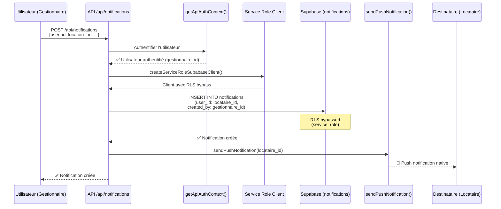

# Architecture du système de notifications SEIDO

## 📋 Vue d'ensemble

Le système de notifications SEIDO permet de créer des notifications pour **n'importe quel utilisateur** (pas seulement l'utilisateur authentifié), ce qui est essentiel pour les workflows multi-rôles :

- **Gestionnaire** crée intervention → notification envoyée au **locataire** ET au **prestataire**
- **Prestataire** soumet devis → notification envoyée au **gestionnaire**
- **Locataire** marque intervention terminée → notification envoyée au **gestionnaire**
- etc.

## 🔐 Architecture de sécurité

### Problème RLS classique

Avec Row Level Security (RLS) standard, une politique INSERT typique serait :

```sql
CREATE POLICY "notifications_insert" ON notifications
  FOR INSERT
  WITH CHECK (user_id = get_current_user_id())
```

**Limitation :** Cette politique empêche un utilisateur A de créer une notification pour un utilisateur B.

### Solution : Service Role Client (RLS Bypass)

**Architecture choisie :**
1. L'API `/api/notifications` est **sécurisée** par `getApiAuthContext()` (authentification obligatoire)
2. L'API utilise `createServiceRoleSupabaseClient()` pour **bypass RLS** lors de l'insertion
3. Les politiques RLS protègent SELECT/UPDATE/DELETE (lecture/modification par le destinataire uniquement)

**Fichier : `app/api/notifications/route.ts`**

```typescript
import { createServiceRoleSupabaseClient } from '@/lib/services/core/supabase-client'

export async function POST(request: NextRequest) {
  // ✅ 1. Authentification obligatoire
  const authResult = await getApiAuthContext()
  if (!authResult.success) return authResult.error

  const { userProfile: dbUserPost } = authResult.data

  // ✅ 2. Validation des données
  const { user_id, team_id, type, title, message, ... } = await request.json()
  if (!user_id || !team_id || !type || !title || !message) {
    return NextResponse.json({ error: 'Missing required fields' }, { status: 400 })
  }

  // ✅ 3. Utilisation du service role client (bypass RLS)
  const supabaseAdmin = createServiceRoleSupabaseClient()

  // ✅ 4. Insertion de la notification pour N'IMPORTE QUEL utilisateur
  const { data: notification, error } = await supabaseAdmin
    .from('notifications')
    .insert({
      user_id,          // Peut être différent de l'utilisateur authentifié
      team_id,
      created_by: dbUserPost.id,  // Traçabilité : qui a créé la notification
      type,
      title,
      message,
      is_personal,
      metadata,
      related_entity_type,
      related_entity_id
    })
    .select('*')
    .single()

  // ✅ 5. Envoi push notification si is_personal = true
  if (is_personal && notification) {
    sendPushNotification(user_id, { title, message, url, ... })
  }

  return NextResponse.json({ success: true, data: notification })
}
```

## 🔒 Politiques RLS en place

### SELECT (Lecture)

```sql
CREATE POLICY "notifications_select" ON public.notifications
  FOR SELECT
  USING (user_id = get_current_user_id());
```

**Permet :** Un utilisateur ne voit que **ses propres notifications**.

### UPDATE (Modification)

```sql
CREATE POLICY "notifications_update" ON public.notifications
  FOR UPDATE
  USING (user_id = get_current_user_id())
  WITH CHECK (user_id = get_current_user_id());
```

**Permet :** Un utilisateur ne peut modifier que **ses propres notifications** (marquer comme lu, archiver, etc.).

### DELETE (Suppression)

```sql
CREATE POLICY "notifications_delete" ON public.notifications
  FOR DELETE
  USING (user_id = get_current_user_id());
```

**Permet :** Un utilisateur ne peut supprimer que **ses propres notifications**.

### INSERT (Création)

**❌ Pas de politique INSERT !**

L'insertion se fait **uniquement via l'API** avec service_role client (bypass RLS).

## 📊 Flux de création de notification



## 🛠️ Fichiers clés

### 1. Service Role Client

**Fichier :** `lib/services/core/supabase-client.ts`

```typescript
export function createServiceRoleSupabaseClient() {
  const supabaseServiceRoleKey = process.env.SUPABASE_SERVICE_ROLE_KEY

  if (!supabaseServiceRoleKey) {
    throw new Error('SUPABASE_SERVICE_ROLE_KEY is required')
  }

  return createClient<Database>(supabaseUrl, supabaseServiceRoleKey, {
    auth: { autoRefreshToken: false, persistSession: false },
    global: {
      headers: {
        'x-client-info': 'seido-app/1.0.0 (service-role)',
        'x-elevated-privileges': 'true'
      }
    }
  })
}
```

### 2. API Route

**Fichier :** `app/api/notifications/route.ts`

- **GET :** Récupération des notifications (RLS client)
- **POST :** Création de notifications (service_role client)
- **PATCH :** Modification de notifications (RLS client)

### 3. Migration RLS

**Fichier :** `supabase/migrations/20251027055325_add_notifications_insert_policy.sql`

```sql
-- Supprimer la politique INSERT si elle existe
DROP POLICY IF EXISTS "notifications_insert" ON public.notifications;

COMMENT ON TABLE public.notifications IS
'Table des notifications. INSERT via service_role uniquement (API /api/notifications). SELECT/UPDATE/DELETE proteges par RLS.';
```

## 🧪 Test Panel

**Fichier :** `components/test-notifications-panel.tsx`

Panel de test avec 4 boutons pour tester chaque type de notification :
- 🚨 **Intervention** - Notification liée à une intervention (haute priorité)
- 📋 **Assignment** - Notification d'affectation à un prestataire
- 📄 **Document** - Upload de document sur une intervention
- 🔄 **Status Change** - Changement de statut d'intervention

### Types de notifications disponibles

L'enum PostgreSQL `notification_type` contient les valeurs suivantes :

```typescript
type NotificationType =
  | 'intervention'      // Notification liée intervention
  | 'chat'              // Nouveau message chat
  | 'document'          // Document uploadé/partagé
  | 'system'            // Notification système
  | 'team_invite'       // Invitation équipe
  | 'assignment'        // Assignation intervention
  | 'status_change'     // Changement statut
  | 'reminder'          // Rappel
  | 'deadline'          // Échéance approchante
```

**Utilisation :**
1. Ouvrir la page profil (`/[role]/profile`)
2. Activer les notifications push
3. Cliquer sur un bouton de test
4. Vérifier la réception de la notification native

## 🔐 Variables d'environnement requises

```env
# .env.local
SUPABASE_SERVICE_ROLE_KEY=eyJhbGciOiJIUzI1NiIsInR5cCI6IkpXVCJ9...
```

**Où trouver la clé :**
Supabase Dashboard → Settings → API → `service_role` key (secret)

⚠️ **IMPORTANT :** Ne JAMAIS exposer cette clé côté client !

## ✅ Avantages de cette architecture

1. **Flexibilité :** Permet la création de notifications pour n'importe quel utilisateur
2. **Sécurité :** L'API est protégée par authentification
3. **Traçabilité :** `created_by` enregistre qui a créé la notification
4. **Simplicité :** Pas de logique RLS complexe pour INSERT
5. **Performance :** Bypass RLS = requête plus rapide

## 🚨 Cas d'usage typiques

### 1. Intervention approuvée

```typescript
// Gestionnaire approuve intervention
await fetch('/api/notifications', {
  method: 'POST',
  body: JSON.stringify({
    user_id: prestataire_id,        // Notification pour le prestataire
    team_id: team_id,
    type: 'assignment',
    title: 'Nouvelle intervention assignée',
    message: 'Intervention #12345 vous a été assignée',
    is_personal: true,
    related_entity_type: 'intervention',
    related_entity_id: intervention_id
  })
})
```

### 2. Document uploadé

```typescript
// Prestataire uploade un document (devis, facture, etc.)
await fetch('/api/notifications', {
  method: 'POST',
  body: JSON.stringify({
    user_id: gestionnaire_id,       // Notification pour le gestionnaire
    team_id: team_id,
    type: 'document',
    title: 'Nouveau document ajouté',
    message: 'Le prestataire a ajouté un document (devis: 450€)',
    is_personal: true,
    related_entity_type: 'intervention',
    related_entity_id: intervention_id
  })
})
```

### 3. Changement de statut

```typescript
// Changement de statut d'intervention (système ou utilisateur)
await fetch('/api/notifications', {
  method: 'POST',
  body: JSON.stringify({
    user_id: gestionnaire_id,       // Notification pour le gestionnaire
    team_id: team_id,
    type: 'status_change',
    title: 'Statut modifié',
    message: 'L\'intervention #12345 est passée en "Terminée"',
    is_personal: true,
    related_entity_type: 'intervention',
    related_entity_id: intervention_id
  })
})
```

## 📚 Références

- [Supabase Service Role](https://supabase.com/docs/guides/auth/auth-helpers/nextjs#server-side-rendering-ssr)
- [Row Level Security](https://supabase.com/docs/guides/auth/row-level-security)
- [Next.js API Routes](https://nextjs.org/docs/app/building-your-application/routing/route-handlers)

---

**Dernière mise à jour :** 2025-10-27
**Status :** ✅ Production Ready
