# SEIDO - UX Guidelines : Gestionnaire

> **Fichier parent** : [ux-ui-decision-guide.md](./ux-ui-decision-guide.md)
> **Persona associé** : [persona-gestionnaire-unifie.md](./persona-gestionnaire-unifie.md)
> **Version** : 1.1 | **Date** : 2025-12-07

---

## Contexte

**Rôle principal** : 70% des utilisateurs de SEIDO

**Profil type** : Thomas Marchal
- **Portefeuille** : 10-500 logements
- **Temps** : 60h/semaine
- **Mobile** : 80% du travail
- **Frustration principale** : "Je perds 2h/jour à chercher des informations"

---

## User Journey Map

```mermaid
graph LR
  A[Login] --> B[Dashboard KPIs]
  B --> C{Urgences?}
  C -->|Oui| D[Traiter urgence]
  C -->|Non| E[Planifier journée]
  D --> F[Assigner prestataire]
  F --> G[Suivre progression]
  G --> H[Clôturer]
  E --> I[Créer interventions]
  I --> F
```



---

## Écrans Critiques

### 1. Dashboard (Page d'atterrissage)

**Priorité #1** : Actions en attente visibles immédiatement

```tsx
<Dashboard>
  <AlertBanner variant="urgent" visible={pendingCount > 0}>
    ⚠️ {pendingCount} actions en attente de votre validation
    <Button>Voir maintenant</Button>
  </AlertBanner>

  <KPISection />
  <UrgentInterventionsSection />
  <ActivitySection />
</Dashboard>
```

**Micro-interactions** :
| Interaction | Action |
|------------|--------|
| Hover KPI | Tooltip avec trend détaillé |
| Click KPI | Navigation vers liste filtrée |
| Badge count | Animation pulse si nouveautés |

---

### 2. Liste Interventions (Écran le plus utilisé)

**Priorité #1** : Filtrage intelligent

```tsx
<InterventionsPage>
  <QuickFilters className="sticky top-0 bg-white z-10">
    <Filter active>Toutes (127)</Filter>
    <Filter>Urgentes (12)</Filter>
    <Filter>En attente (34)</Filter>
    <Filter>Mes interventions (45)</Filter>
  </QuickFilters>

  <BulkActions visible={selected.length > 0}>
    Sélectionné: {selected.length}
    <Button>Assigner prestataire</Button>
    <Button>Changer urgence</Button>
    <Button>Archiver</Button>
  </BulkActions>

  <InterventionList>
    {interventions.map(i => (
      <InterventionRow
        key={i.id}
        selectable
        onSelect={toggleSelect}
        onQuickAction={showQuickActions}
      />
    ))}
  </InterventionList>
</InterventionsPage>
```

**Micro-interactions** :
| Plateforme | Interaction | Action |
|------------|-------------|--------|
| Mobile | Swipe right | Clôturer |
| Mobile | Swipe left | Archiver |
| Mobile | Long press | Sélection multiple |
| Desktop | ↑↓ | Navigation |
| Desktop | Enter | Ouvrir |
| Desktop | Shift+Click | Sélection |

---

### 3. Détail Intervention (Decision-making)

**Priorité #1** : Timeline visible + Actions contextuelles

```tsx
<InterventionDetail>
  <Header>
    <Breadcrumbs />
    <Title editable />
    <StatusBadge />
    <ActionMenu />
  </Header>

  <TwoColumnLayout>
    <MainColumn>
      <TimelineSection>
        <Timeline events={interventionHistory} />
        <AddComment />
      </TimelineSection>

      <DetailsSection>
        <Description editable />
        <Metadata />
        <Documents />
      </DetailsSection>
    </MainColumn>

    <Sidebar>
      <ContextPanel>
        <BuildingPreview />
        <LotPreview />
        <TenantPreview />
        <ProviderPreview />
      </ContextPanel>

      <QuickActions>
        <Button variant="primary">Assigner prestataire</Button>
        <Button>Demander devis</Button>
        <Button>Planifier intervention</Button>
      </QuickActions>

      <RelatedInterventions />
    </Sidebar>
  </TwoColumnLayout>
</InterventionDetail>
```

**Micro-interactions** :
| Interaction | Action |
|------------|--------|
| Timeline event click | Expand détails |
| Hover provider | Preview card (contact, rating, disponibilités) |
| Drag document | Upload instantané |
| @ mention | Notification prestataire |

---

### 4. Création Intervention (Flow critique)

**Priorité #1** : Guidage étape par étape

```tsx
<CreateIntervention>
  <ProgressSteps
    steps={['Lieu', 'Problème', 'Urgence', 'Prestataire']}
    currentStep={currentStep}
  />

  {/* Step 1: Lieu */}
  <Step visible={currentStep === 1}>
    <BuildingSelector
      placeholder="Rechercher un immeuble..."
      onSelect={setBuilding}
      recentBuildings={recentlyViewed}
    />
    <LotSelector
      buildingId={building.id}
      placeholder="Sélectionner un lot..."
      onSelect={setLot}
    />
  </Step>

  {/* Step 2: Problème */}
  <Step visible={currentStep === 2}>
    <TemplateSelector
      templates={commonIssues}
      onSelect={applyTemplate}
    />
    <TitleInput placeholder="Ex: Fuite évier cuisine" />
    <DescriptionTextarea placeholder="Décrivez le problème..." />
    <PhotoUpload onUpload={addPhotos} preview />
  </Step>

  {/* Step 3: Urgence */}
  <Step visible={currentStep === 3}>
    <UrgencySelector
      options={['urgente', 'normale', 'basse']}
      recommended="normale"
      tooltips={{
        urgente: 'Intervention sous 24h',
        normale: 'Intervention sous 72h',
        basse: 'Intervention sous 7 jours'
      }}
    />
  </Step>

  {/* Step 4: Prestataire (optionnel) */}
  <Step visible={currentStep === 4}>
    <ProviderRecommendations
      interventionType={type}
      location={building.address}
    />
    <ProviderSelector onSelect={setProvider} optional />
    <Checkbox label="Envoyer demande de devis automatique" />
  </Step>

  <Actions>
    <Button variant="secondary" onClick={previousStep}>Précédent</Button>
    <Button variant="primary" onClick={nextStep}>
      {currentStep === 4 ? 'Créer intervention' : 'Suivant'}
    </Button>
  </Actions>
</CreateIntervention>
```

**Micro-interactions** :
| Interaction | Action |
|------------|--------|
| Template click | Auto-fill title + description |
| Photo upload | Preview instant + compression |
| Provider hover | Rating + prix moyen + délai |
| Auto-save | Draft sauvegardé toutes les 30s |

---

## États Vides / Erreurs / Loading

### Empty State - Première utilisation
```tsx
<EmptyState>
  <Icon name="rocket" size="xl" />
  <Title>Bienvenue sur SEIDO!</Title>
  <Description>
    Commencez par ajouter votre premier immeuble pour gérer votre parc immobilier.
  </Description>
  <Button variant="primary">Ajouter un immeuble</Button>
  <Link href="/docs/getting-started">Guide de démarrage</Link>
</EmptyState>
```

### Empty State - Filtres actifs
```tsx
<EmptyState>
  <Icon name="filter" size="lg" />
  <Title>Aucune intervention trouvée</Title>
  <Description>
    Essayez de modifier vos filtres ou d'élargir votre recherche.
  </Description>
  <Button onClick={resetFilters}>Réinitialiser les filtres</Button>
</EmptyState>
```

### Error State - Chargement échoué
```tsx
<ErrorState>
  <Icon name="alert-triangle" size="lg" color="red" />
  <Title>Impossible de charger les données</Title>
  <Description>
    Une erreur s'est produite lors du chargement des interventions.
  </Description>
  <Button variant="primary" onClick={retry}>Réessayer</Button>
  <Button variant="ghost" onClick={contactSupport}>Contacter le support</Button>
</ErrorState>
```

### Loading State - Skeleton screens
```tsx
<LoadingState>
  <Skeleton variant="card" count={3} />
  <SkeletonText lines={5} />
</LoadingState>
```

---

## Dashboard Mobile (80% du travail)

```tsx
<MobileDashboard>
  {/* Sticky header avec actions */}
  <StickyHeader className="bg-white shadow-sm">
    <UserAvatar />
    <NotificationBell count={unreadCount} />
    <QuickCreateButton />
  </StickyHeader>

  {/* KPIs en carousel swipeable */}
  <KPICarousel className="px-4 py-6">
    <KPISlide>
      <LargeNumber>12</LargeNumber>
      <Label>Actions en attente</Label>
      <MiniChart data={pendingHistory} />
    </KPISlide>
    <KPISlide>
      <LargeNumber>94%</LargeNumber>
      <Label>Taux occupation</Label>
    </KPISlide>
  </KPICarousel>

  {/* Interventions urgentes - Cards swipeable */}
  <Section title="🚨 Urgent" badge={urgentCount}>
    <SwipeableCardList>
      {urgentInterventions.map(i => (
        <InterventionCard
          key={i.id}
          onSwipeLeft={archive}
          onSwipeRight={close}
        />
      ))}
    </SwipeableCardList>
  </Section>

  {/* Quick actions - Bottom sheet */}
  <FloatingActionButton icon={Plus} onClick={showQuickActions} />
</MobileDashboard>
```

---

## Voir aussi

- [Principes UX Communs](./ux-common-principles.md)
- [Composants UI](./ux-components.md)
- [Anti-Patterns à éviter](./ux-anti-patterns.md)
- [Persona Gestionnaire](./persona-gestionnaire-unifie.md)
