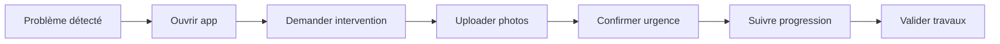

# SEIDO - UX Guidelines : Locataire

> **Fichier parent** : [ux-ui-decision-guide.md](./ux-ui-decision-guide.md)
> **Persona associé** : [persona-locataire.md](./persona-locataire.md)
> **Version** : 1.1 | **Date** : 2025-12-07

---

## Contexte

**Rôle** : End users - Simplicité MAX

**Profil type** : Emma Dubois
- **Âge** : 29 ans (Millennial)
- **Usage** : Occasionnel (1-2x/an)
- **Device** : Mobile-first
- **Attentes** : Simplicité, rapidité, transparence
- **Tech-savviness** : Non-tech

---

## User Journey Map



---

## Écrans Critiques

### 1. Dashboard Locataire (Minimal)

**Interface accueillante et guidée**

```tsx
<TenantDashboard>
  <WelcomeHeader className="bg-gradient-to-r from-blue-500 to-blue-600 text-white p-6">
    <Avatar src={tenant.avatar} />
    <Greeting>Bonjour {tenant.first_name} 👋</Greeting>
    <Subtitle>Logement: {lot.address}</Subtitle>
  </WelcomeHeader>

  <MainContent className="p-6 space-y-6">
    {/* CTA principal */}
    <Button
      variant="primary"
      size="xl"
      onClick={createIntervention}
      className="w-full h-16 text-lg"
    >
      <Icon name="wrench" size={24} className="mr-3" />
      Demander une intervention
    </Button>

    {/* Interventions actives */}
    <Section title="Mes interventions">
      {activeInterventions.length === 0 ? (
        <EmptyState>
          <Icon name="check-circle" color="green" />
          <Text>Aucune intervention en cours</Text>
        </EmptyState>
      ) : (
        <SimpleList>
          {activeInterventions.map(i => (
            <SimpleCard key={i.id}>
              <Title>{i.title}</Title>
              <Status>{getSimpleStatus(i.status)}</Status>
              <Button onClick={() => navigate(`/interventions/${i.id}`)}>
                Voir détails
              </Button>
            </SimpleCard>
          ))}
        </SimpleList>
      )}
    </Section>

    {/* Contacts */}
    <Section title="Contacts utiles">
      <ContactCard
        name={gestionnaire.name}
        role="Votre gestionnaire"
        phone={gestionnaire.phone}
        email={gestionnaire.email}
      />
    </Section>
  </MainContent>
</TenantDashboard>
```

---

### 2. Demande Intervention (Wizard guidé)

**Flow ultra-simplifié, 3 étapes max**

```tsx
<TenantInterventionRequest>
  <ProgressIndicator currentStep={1} totalSteps={3} />

  {/* Step 1: Quel problème? */}
  <Step visible={step === 1}>
    <Question>Quel est le problème?</Question>
    <IconGrid>
      <IssueOption icon={Droplets} label="Plomberie" />
      <IssueOption icon={Zap} label="Électricité" />
      <IssueOption icon={Flame} label="Chauffage" />
      <IssueOption icon={Key} label="Serrurerie" />
      <IssueOption icon={Home} label="Autre" />
    </IconGrid>
  </Step>

  {/* Step 2: Décrivez (optionnel) */}
  <Step visible={step === 2}>
    <Question>Pouvez-vous décrire le problème?</Question>
    <Textarea
      placeholder="Ex: L'évier de la cuisine fuit..."
      rows={4}
    />
    <PhotoUpload
      label="Ajouter des photos (optionnel)"
      maxFiles={3}
    />
  </Step>

  {/* Step 3: C'est urgent? */}
  <Step visible={step === 3}>
    <Question>C'est urgent?</Question>
    <UrgencyOptions>
      <Option
        value="urgente"
        icon={AlertCircle}
        label="Oui, c'est urgent"
        description="Intervention sous 24h"
      />
      <Option
        value="normale"
        icon={Clock}
        label="Non, ça peut attendre"
        description="Intervention sous 72h"
      />
    </UrgencyOptions>
  </Step>

  <Actions className="sticky bottom-0 p-4 bg-white">
    {step > 1 && (
      <Button variant="ghost" onClick={previousStep}>
        Précédent
      </Button>
    )}
    <Button
      variant="primary"
      size="lg"
      onClick={step === 3 ? submitRequest : nextStep}
    >
      {step === 3 ? 'Envoyer la demande' : 'Suivant'}
    </Button>
  </Actions>
</TenantInterventionRequest>
```

**Micro-interactions** :
| Interaction | Action |
|------------|--------|
| Issue selection | Vibration haptic (mobile) |
| Photo upload | Preview instant |
| Submit | Confetti animation + "Demande envoyée!" |

---

### 3. Suivi Intervention (Statuts simplifiés)

**Statuts compréhensibles par tous**

```tsx
const TENANT_STATUS_LABELS = {
  demande: '📝 Demande envoyée',
  approuvee: '✅ Demande acceptée',
  planifiee: '📅 Intervention planifiée',
  en_cours: '🔧 Intervention en cours',
  cloturee_par_prestataire: '✅ Travaux terminés',
  cloturee_par_gestionnaire: '✅ Intervention terminée'
}

<TenantInterventionDetail>
  <StatusHeader className="bg-blue-50 p-6 text-center">
    <StatusEmoji>{getStatusEmoji(status)}</StatusEmoji>
    <StatusLabel>{TENANT_STATUS_LABELS[status]}</StatusLabel>
  </StatusHeader>

  <SimpleTimeline>
    <TimelineStep
      icon={FileText}
      label="Demande envoyée"
      date={intervention.created_at}
      completed
    />
    <TimelineStep
      icon={CheckCircle}
      label="Demande acceptée"
      date={intervention.approved_at}
      completed={status !== 'demande'}
    />
    <TimelineStep
      icon={Calendar}
      label="Intervention planifiée"
      date={intervention.slot?.slot_date}
      completed={!!intervention.slot}
    />
    <TimelineStep
      icon={Wrench}
      label="Travaux effectués"
      date={intervention.closed_at}
      completed={status.includes('cloturee')}
    />
  </SimpleTimeline>

  {/* Validation travaux */}
  {status === 'cloturee_par_prestataire' && (
    <ValidationCard>
      <Question>Les travaux sont-ils satisfaisants?</Question>
      <Actions>
        <Button variant="primary" size="lg" onClick={approveWork}>
          👍 Oui, tout est ok
        </Button>
        <Button variant="secondary" onClick={reportIssue}>
          ⚠️ Il y a un problème
        </Button>
      </Actions>
    </ValidationCard>
  )}
</TenantInterventionDetail>
```

---

## Principes UX Spécifiques

### 1. Simplicité Absolue
- **3 étapes max** pour créer une demande
- **Langage clair** : Pas de jargon technique
- **Icônes parlantes** : Reconnaissance visuelle

### 2. Feedback Immédiat
- **Confirmation visuelle** : Animation à la soumission
- **Statuts clairs** : Emojis + texte simple
- **Timeline visuelle** : Progression facilement compréhensible

### 3. Transparence
- **Suivi en temps réel** : Où en est ma demande ?
- **Contact direct** : Gestionnaire accessible
- **Historique** : Mes interventions passées

### 4. Accessibilité
- **Touch targets larges** : Boutons 48px minimum
- **Contraste élevé** : Lisibilité optimale
- **Multi-langue** : Support i18n prévu

---

## Voir aussi

- [Principes UX Communs](./ux-common-principles.md)
- [Composants UI](./ux-components.md)
- [Persona Locataire](./persona-locataire.md)
