# SEIDO - UX Guidelines : Prestataire

> **Fichier parent** : [ux-ui-decision-guide.md](./ux-ui-decision-guide.md)
> **Persona associé** : [persona-prestataire.md](./persona-prestataire.md)
> **Version** : 1.1 | **Date** : 2025-12-07

---

## Contexte

**Rôle** : Exécution interventions, gestion devis, planning

**Profil type** : Marc Dufour
- **Âge** : 38 ans
- **Métier** : Artisan plombier
- **Terrain** : 75% du temps en déplacement
- **Device** : Smartphone (majoritairement)
- **Frustration principale** : "Je perds du temps à naviguer entre les apps"

---

## User Journey Map

```mermaid
graph LR
  A[Login] --> B[Interventions assignées]
  B --> C[Accepter intervention]
  C --> D[Planifier rendez-vous]
  D --> E[Exécuter travaux]
  E --> F[Uploader photos]
  F --> G[Clôturer]
  B --> H[Créer devis]
  H --> I[Envoyer devis]
  I --> J[Attente validation]
  J --> K[Validation] --> C
```



---

## Écrans Critiques

### 1. Dashboard Prestataire

**Focus** : Actions immédiates

```tsx
<ProviderDashboard>
  <TodaySchedule>
    <SectionHeader>
      <Title>📅 Aujourd'hui</Title>
      <Badge>{todayInterventions.length} interventions</Badge>
    </SectionHeader>
    <TimelineView>
      {todayInterventions.map(i => (
        <TimeSlot
          time={i.slot.start_time}
          intervention={i}
          onNavigate={openMaps}
          onCall={callTenant}
        />
      ))}
    </TimelineView>
  </TodaySchedule>

  <PendingActions>
    <SectionHeader>
      <Title>⏳ En attente</Title>
      <Badge variant="warning">{pendingCount}</Badge>
    </SectionHeader>
    <ActionList>
      <ActionItem type="quote_request">
        3 demandes de devis en attente
        <Button>Créer devis</Button>
      </ActionItem>
      <ActionItem type="time_slot">
        2 créneaux à confirmer
        <Button>Planifier</Button>
      </ActionItem>
    </ActionList>
  </PendingActions>
</ProviderDashboard>
```

**Micro-interactions** :
| Interaction | Action |
|------------|--------|
| Intervention card | Swipe right pour "Démarrer" |
| Address tap | Open Google Maps |
| Phone tap | Call tenant |

---

### 2. Détail Intervention (Mobile-first)

```tsx
<ProviderInterventionDetail>
  <StickyHeader className="bg-white shadow-sm">
    <BackButton />
    <InterventionStatus />
    <ActionMenu />
  </StickyHeader>

  <Content className="px-4 py-6 space-y-6">
    {/* Location avec navigation */}
    <LocationCard>
      <AddressHeader>
        <Icon name="map-pin" />
        <Address>{building.address}</Address>
      </AddressHeader>
      <Actions>
        <Button variant="primary" onClick={openMaps} icon={Navigation}>
          Itinéraire
        </Button>
        <Button variant="secondary" onClick={callTenant} icon={Phone}>
          Appeler
        </Button>
      </Actions>
    </LocationCard>

    {/* Description problème */}
    <ProblemCard>
      <Title>{intervention.title}</Title>
      <Description>{intervention.description}</Description>
      <PhotoGallery photos={intervention.photos} />
    </ProblemCard>

    {/* Timeline travaux */}
    <WorkProgressCard>
      <Title>Avancement</Title>
      <ChecklistInput items={workSteps} onToggle={updateProgress} />
      <PhotoUpload label="Photos des travaux" onUpload={addWorkPhotos} />
    </WorkProgressCard>

    {/* Actions principales */}
    <Actions className="sticky bottom-0 bg-white p-4 shadow-top">
      <Button variant="primary" size="lg" onClick={markComplete}>
        ✅ Travaux terminés
      </Button>
      <Button variant="secondary" size="lg" onClick={createQuote}>
        📝 Créer un devis
      </Button>
    </Actions>
  </Content>
</ProviderInterventionDetail>
```

---

### 3. Création Devis (Quick flow)

```tsx
<QuoteCreation>
  <Header>
    <Title>Nouveau devis</Title>
    <InterventionPreview />
  </Header>

  <LineItems>
    <LineItem>
      <DescriptionInput placeholder="Main d'œuvre" />
      <QuantityInput />
      <UnitPriceInput />
      <TotalDisplay />
    </LineItem>
    <AddLineButton>+ Ajouter une ligne</AddLineButton>
  </LineItems>

  <TotalSection>
    <Row>
      <Label>Sous-total HT</Label>
      <Value>{subtotal}€</Value>
    </Row>
    <Row>
      <Label>TVA (20%)</Label>
      <Value>{vat}€</Value>
    </Row>
    <Row className="font-bold text-lg">
      <Label>Total TTC</Label>
      <Value>{total}€</Value>
    </Row>
  </TotalSection>

  <Actions>
    <Button variant="secondary">Sauvegarder brouillon</Button>
    <Button variant="primary">Envoyer au gestionnaire</Button>
  </Actions>
</QuoteCreation>
```

---

## Principes UX Spécifiques

### 1. Mobile-First Absolu
- **Touch targets** : 44x44px minimum
- **Actions en bas** : Sticky bottom pour accès pouce
- **Gestes** : Swipe pour actions rapides

### 2. Accès Rapide Terrain
- **1-tap GPS** : Navigation vers chantier
- **1-tap Appel** : Contact locataire/gestionnaire
- **Offline mode** : Infos de base accessibles sans réseau

### 3. Suivi Travaux Simplifié
- **Checklist** : Étapes prédéfinies à cocher
- **Photos** : Upload direct depuis caméra
- **Notes vocales** : Alternative à la saisie texte

---

## Voir aussi

- [Principes UX Communs](./ux-common-principles.md)
- [Composants UI](./ux-components.md)
- [Anti-Patterns à éviter](./ux-anti-patterns.md)
- [Persona Prestataire](./persona-prestataire.md)
