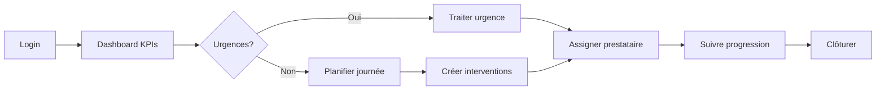
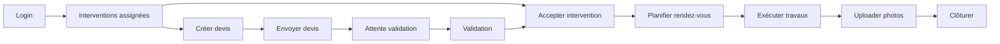
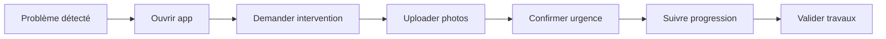

# SEIDO - UX/UI Decision Guide
## Guide de Décisions Design pour Application de Gestion Immobilière Multi-Rôles

**Version**: 1.1
**Date**: 2025-12-06
**Statut**: Production Ready

---

> **📌 Personas de référence pour la décision UX/UI :**
> - [Gestionnaire Unifié](./persona-gestionnaire-unifie.md) — Composite des 3 profils, priorité Agent en Agence
> - [Locataire](./persona-locataire.md) — Emma Dubois, 29 ans, Millennial, mobile-first
> - [Prestataire](./persona-prestataire.md) — Marc Dufour, 38 ans, artisan, 75% terrain
>
> Voir aussi : [Personas détaillés](./persona.md)

---

## Table des Matières

1. [Executive Summary](#executive-summary)
2. [Principes UX Fondamentaux](#principes-ux-fondamentaux)
3. [Stratégies pour la Densité de Données](#stratégies-pour-la-densité-de-données)
4. [Guidelines par Rôle](#guidelines-par-rôle)
5. [Composants UI Recommandés](#composants-ui-recommandés)
6. [Anti-Patterns à Éviter](#anti-patterns-à-éviter)
7. [Métriques UX à Suivre](#métriques-ux-à-suivre)
8. [Références & Inspirations](#références--inspirations)

---

## Executive Summary

### Synthèse des Insights Personas

L'analyse des 3 personas SEIDO révèle des **patterns critiques** qui doivent guider toutes les décisions UX/UI:

#### PERSONA 1: Philippe Vandenberghe - Grand Multipropriétaire
**Age**: 55 ans | **Portefeuille**: 18 logements | **Temps**: 30h/semaine

**Citations clés**:
> "Je passe mon temps à éteindre des feux"
> "Impossible de partir en vacances sereinement"
> "Je refais 5 fois les mêmes calculs dans différents fichiers"

**Besoins UX**:
- Dashboard KPIs centralisé avec **drill-down progressif**
- Alertes automatiques **intelligentes** (pas de spam)
- Historique complet **facilement accessible**
- Templates documents **automatisés**

#### PERSONA 2: Thomas Marchal - Gestionnaire Indépendant
**Age**: 38 ans | **Portefeuille**: 120 logements | **Temps**: 60h/semaine | **Mobile**: 80%

**Citations clés**:
> "Je perds 2h/jour à chercher des informations"
> "Mon téléphone sonne 50 fois par jour"
> "Je refais les mêmes tâches 10 fois par jour"
> "Impossible de déléguer, personne ne connaît mes dossiers"

**Besoins UX**:
- **Mobile-first ABSOLU** (80% du travail)
- Ticketing intelligent avec **priorisation automatique**
- Planning **géolocalisé** pour optimiser déplacements
- Templates **automatisés** pour actions répétitives

#### PERSONA 3: Julien Lebrun - Agent en Agence
**Age**: 42 ans | **Portefeuille**: 350 logements | **Équipe**: 5 personnes

**Citations clés**:
> "On utilise 5 logiciels différents qui ne se parlent pas"
> "Je saisis 3 fois les mêmes infos"
> "Pas d'app mobile digne de ce nom"
> "L'agence fonctionne comme il y a 20 ans"

**Besoins UX**:
- **Multi-utilisateurs** avec droits granulaires
- **Portails clients** automatisés
- **Intégrations** tierces (comptabilité, CRM)
- **Signature électronique** native

---

### Challenges UX Principaux Identifiés

#### 1. Mode "Pompier" Permanent (70-80% du temps)
**Symptôme**: Gestion réactive permanente, impossibilité de planifier

**Solutions UX**:
- **Priorisation intelligente** visible (badges, couleurs, tri automatique)
- **Filtres rapides** par urgence/statut/type
- **Inbox zéro** design (encourager la résolution complète)
- **Dashboard "Focus Mode"** (masquer le bruit, afficher l'essentiel)

#### 2. Trou Noir Prestataires
**Symptôme**: Aucune visibilité sur l'avancement, relances manuelles

**Solutions UX**:
- **Tracking end-to-end** visible (timeline interactive)
- **Statuts en temps réel** avec notifications push
- **Chatbot automatique** pour relances
- **SLA timers** visuels (compte à rebours)

#### 3. Multi-Canal Ingérable
**Symptôme**: WhatsApp + Email + Téléphone + SMS = chaos

**Solutions UX**:
- **Inbox unifiée** (tous canaux en un seul endroit)
- **Conversation threading** intelligent (regrouper par intervention)
- **Quick replies** pré-remplies
- **Auto-routing** par type de demande

#### 4. Peur de Perdre le Contrôle
**Symptôme**: Impossibilité de déléguer, méfiance envers l'automatisation

**Solutions UX**:
- **Permissions granulaires** visuelles (qui peut faire quoi)
- **Audit trail** complet (historique des actions)
- **Validation workflow** explicite (approuver/rejeter)
- **Notifications sur-mesure** (configurer ce qu'on veut voir)

#### 5. Burn-Out Imminent
**Symptôme**: 60-70h/semaine, téléphone qui sonne 50x/jour

**Solutions UX**:
- **Automatisations poussées** (réduire tâches manuelles)
- **Batch actions** (traiter 10 interventions en 1 clic)
- **Smart scheduling** (AI propose horaires optimaux)
- **Do Not Disturb** intelligent (filtrer selon urgence réelle)

---

### Philosophie Design SEIDO

> **"Professional without being corporate, powerful without being complex"**

#### Principes Directeurs

1. **Mobile-First Absolu**
   - 80% des gestionnaires travaillent en déplacement
   - Toute fonctionnalité DOIT fonctionner sur mobile
   - Touch targets minimum 44x44px
   - Navigation thumb-zone optimized

2. **Progressive Disclosure**
   - Afficher l'essentiel d'abord
   - Drill-down pour détails
   - Éviter la surcharge cognitive
   - Information layering intelligent

3. **Action-Oriented Design**
   - Boutons d'action toujours visibles
   - Raccourcis clavier (desktop)
   - Swipe actions (mobile)
   - Bulk actions (sélection multiple)

4. **Trust Through Transparency**
   - Statuts en temps réel
   - Historique complet accessible
   - Notifications explicatives (pourquoi cette alerte?)
   - Permissions visuelles claires

5. **Consistency Across Roles**
   - Même design system pour tous les rôles
   - Adaptations contextuelles (pas refonte)
   - Terminologie unifiée
   - Patterns réutilisables

---

## Principes UX Fondamentaux

### 1. Heuristiques de Nielsen Appliquées à SEIDO

#### 1.1 Visibility of System Status
**Contexte**: Les gestionnaires veulent savoir où en est chaque intervention 24/7

**Applications SEIDO**:
```tsx
// ✅ BON - Statut intervention avec contexte
<InterventionCard>
  <StatusBadge
    status="en_cours"
    lastUpdate="Il y a 2h"
    nextAction="Attente devis prestataire"
  />
  <ProgressBar value={60} label="60% complété" />
  <TimelinePreview steps={5} currentStep={3} />
</InterventionCard>

// ❌ MAUVAIS - Statut cryptique
<div>Status: 4</div>
```

**Règles**:
- Toujours afficher le **statut actuel** + **prochaine action attendue**
- Utiliser des **couleurs sémantiques** (vert=ok, orange=attention, rouge=urgent)
- Afficher **timestamp** de dernière mise à jour
- **Progress indicators** pour processus longs (upload, sync)

#### 1.2 Match Between System and Real World
**Contexte**: Les gestionnaires parlent métier, pas tech

**Applications SEIDO**:
```tsx
// ✅ BON - Langage métier
<Button>Demander un devis</Button>
<Status>En attente du plombier</Status>
<Alert>Fuite détectée - Urgent</Alert>

// ❌ MAUVAIS - Jargon technique
<Button>POST /api/quotes</Button>
<Status>Status code 202</Status>
<Alert>Error: NULL_REFERENCE</Alert>
```

**Vocabulaire SEIDO**:
- **Intervention** (pas "ticket" ou "request")
- **Prestataire** (pas "provider" ou "vendor")
- **Lot** (pas "unit" ou "property")
- **Gestionnaire** (pas "manager" ou "admin")

#### 1.3 User Control and Freedom
**Contexte**: Erreurs fréquentes en mobilité, besoin de "undo"

**Applications SEIDO**:
```tsx
// ✅ BON - Actions réversibles
<Toast variant="success">
  Intervention archivée
  <Button variant="ghost" onClick={undo}>Annuler</Button>
</Toast>

// ✅ BON - Confirmation pour actions critiques
<ConfirmDialog
  title="Supprimer l'intervention INT-2025-001 ?"
  description="Cette action est définitive. Historique et documents seront supprimés."
  confirmText="Oui, supprimer"
  cancelText="Annuler"
/>

// ❌ MAUVAIS - Suppression sans confirmation
<Button onClick={deleteIntervention}>Supprimer</Button>
```

**Règles**:
- **Toast avec "Undo"** pour actions réversibles (archive, assignation)
- **Confirmation modale** pour actions destructives (suppression)
- **Auto-save** formulaires (brouillons)
- **Breadcrumbs** pour navigation complexe

#### 1.4 Consistency and Standards
**Contexte**: Multi-rôles = risque d'incohérence

**Applications SEIDO**:
```tsx
// ✅ BON - Design tokens centralisés
// Tous les rôles utilisent les mêmes patterns
<Card variant="intervention">
  <Card.Header>
    <InterventionBadge /> {/* Même component partout */}
  </Card.Header>
</Card>

// Color coding cohérent
const URGENCY_COLORS = {
  urgente: 'bg-red-100 text-red-800',
  normale: 'bg-blue-100 text-blue-800',
  basse: 'bg-gray-100 text-gray-800'
}

// ❌ MAUVAIS - Incohérence par rôle
// Gestionnaire: <Badge color="red">Urgent</Badge>
// Prestataire: <Tag variant="danger">Urgent</Tag>
// Locataire: <Label className="urgent">Urgent</Label>
```

**Standards SEIDO**:
- **shadcn/ui** comme base (50+ components)
- **Tailwind v4** tokens pour couleurs/spacing
- **Lucide React** pour icônes
- **WCAG 2.1 AA** pour contraste/accessibilité

#### 1.5 Error Prevention
**Contexte**: Saisie mobile = erreurs fréquentes

**Applications SEIDO**:
```tsx
// ✅ BON - Validation inline + auto-complétion
<AddressInput
  value={address}
  onChange={setAddress}
  autoComplete="google-places"
  validate={validateAddress}
  error={errors.address}
  suggestions={nearbyAddresses}
/>

// ✅ BON - Désactivation smart
<Button
  disabled={!canSubmit}
  tooltip={!canSubmit ? "Champs obligatoires manquants" : ""}
>
  Créer intervention
</Button>

// ❌ MAUVAIS - Validation au submit uniquement
<form onSubmit={handleSubmit}>
  <Input /> {/* Pas de validation */}
  <Button>Submit</Button>
</form>
```

**Patterns**:
- **Validation en temps réel** (onBlur, pas onChange pour éviter frustration)
- **Auto-complétion** (adresses, contacts, prestataires)
- **Smart defaults** (date=aujourd'hui, urgence=normale)
- **Constraints UI** (date picker bloque dates passées)

#### 1.6 Recognition Rather Than Recall
**Contexte**: Gestionnaires gèrent 50-500 logements, impossible de mémoriser

**Applications SEIDO**:
```tsx
// ✅ BON - Contexte visible partout
<InterventionHeader>
  <BuildingPreview id={intervention.building_id} />
  <LotPreview id={intervention.lot_id} />
  <ContactPreview id={intervention.tenant_id} />
  <ProviderPreview id={intervention.provider_id} />
</InterventionHeader>

// ✅ BON - Historique récent accessible
<RecentlyViewedPanel>
  {recentBuildings.map(b => <QuickLink key={b.id} {...b} />)}
</RecentlyViewedPanel>

// ❌ MAUVAIS - IDs cryptiques
<div>Intervention for LOT-1234 in BLDG-5678</div>
```

**Patterns**:
- **Autocomplete** avec preview (nom + adresse + photo)
- **Recently viewed** sidebar
- **Breadcrumbs** avec infos contextuelles
- **Related entities** toujours visibles

#### 1.7 Flexibility and Efficiency of Use
**Contexte**: Power users (gestionnaires pro) vs novices (locataires)

**Applications SEIDO**:
```tsx
// ✅ BON - Shortcuts pour experts
<Tooltip content="Raccourci: Ctrl+N">
  <Button onClick={createIntervention}>
    Nouvelle intervention
  </Button>
</Tooltip>

// ✅ BON - Bulk actions
<InterventionList>
  <SelectAll />
  {selected.length > 0 && (
    <BulkActions>
      <Button>Assigner à prestataire</Button>
      <Button>Changer urgence</Button>
      <Button>Archiver</Button>
    </BulkActions>
  )}
</InterventionList>

// ✅ BON - Templates pour tâches répétitives
<TemplateSelector
  templates={['Fuite évier', 'Problème chauffage', 'Serrure bloquée']}
  onSelect={applyTemplate}
/>
```

**Patterns**:
- **Keyboard shortcuts** (desktop)
- **Swipe actions** (mobile)
- **Bulk operations** (sélection multiple)
- **Templates** (interventions récurrentes)
- **Quick filters** (favoris, récents, assignés à moi)

#### 1.8 Aesthetic and Minimalist Design
**Contexte**: Densité de données MAIS éviter surcharge cognitive

**Applications SEIDO**:
```tsx
// ✅ BON - Information layering
<InterventionCard variant="compact">
  {/* Layer 1: Essentiel visible immédiatement */}
  <Title>Fuite évier cuisine</Title>
  <Status>En attente devis</Status>
  <Urgency>Urgente</Urgency>

  {/* Layer 2: Détails au hover/click */}
  <ExpandableSection>
    <Description />
    <History />
    <Documents />
  </ExpandableSection>
</InterventionCard>

// ❌ MAUVAIS - Tout affiché d'un coup
<InterventionCard>
  <div>ID: 123</div>
  <div>Created: 2025-01-15 14:32:18</div>
  <div>Updated: 2025-01-16 09:12:45</div>
  <div>Created by: user@example.com</div>
  <div>Status: pending</div>
  <div>Priority: high</div>
  {/* 20 lignes de plus... */}
</InterventionCard>
```

**Règles**:
- **Primary info** = titre + statut + urgence (3 éléments max)
- **Secondary info** = dates, contacts, prestataire (expandable)
- **Tertiary info** = historique, documents (modal/page dédiée)
- **White space** généreux (min 16px entre sections)

#### 1.9 Help Users Recognize, Diagnose, and Recover from Errors
**Contexte**: Erreurs fréquentes (mobile, multi-tâches)

**Applications SEIDO**:
```tsx
// ✅ BON - Message d'erreur explicatif + action
<Alert variant="error">
  <AlertTitle>Impossible de créer l'intervention</AlertTitle>
  <AlertDescription>
    Le lot sélectionné n'a pas de locataire assigné.
    Vous devez d'abord assigner un locataire au lot.
  </AlertDescription>
  <AlertActions>
    <Button onClick={assignTenant}>Assigner un locataire</Button>
    <Button variant="ghost" onClick={dismiss}>Annuler</Button>
  </AlertActions>
</Alert>

// ❌ MAUVAIS - Message cryptique
<div className="error">
  Error: FOREIGN_KEY_VIOLATION tenant_id
</div>
```

**Patterns**:
- **Plain language** (pas de codes d'erreur techniques)
- **Root cause** expliquée
- **Action corrective** proposée (bouton direct)
- **Toast persistent** pour erreurs critiques

#### 1.10 Help and Documentation
**Contexte**: Onboarding rapide nécessaire (burn-out)

**Applications SEIDO**:
```tsx
// ✅ BON - Contextual help
<FormField>
  <Label>
    Urgence
    <TooltipIcon content="Urgente = intervention sous 24h, Normale = sous 72h" />
  </Label>
  <Select />
</FormField>

// ✅ BON - Empty states avec guidance
<EmptyState>
  <Icon name="building" />
  <Title>Aucun immeuble</Title>
  <Description>
    Commencez par ajouter votre premier immeuble pour gérer votre parc immobilier.
  </Description>
  <Button>Ajouter un immeuble</Button>
  <Link href="/docs/buildings">En savoir plus</Link>
</EmptyState>

// ✅ BON - Onboarding interactif
<OnboardingTour
  steps={[
    { target: '#dashboard', content: 'Voici vos KPIs' },
    { target: '#interventions', content: 'Gérez vos interventions ici' }
  ]}
/>
```

---

### 2. Material Design 3 Principles

#### 2.1 Material You - Personnalisation

**Contexte SEIDO**: Multi-tenant, chaque agence veut sa marque

**Applications**:
```tsx
// ✅ BON - Theming dynamique
<ThemeProvider theme={team.branding}>
  <App />
</ThemeProvider>

// Team branding config
const teamTheme = {
  primaryColor: '#0066CC', // Couleur agence
  logo: 'https://cdn.seido.fr/team-123/logo.png',
  typography: 'Inter' // ou autre font
}

// ❌ MAUVAIS - Hard-coded colors
<div className="bg-blue-500">...</div>
```

**Customization levels**:
- **Logo** agence (navbar, emails, PDF)
- **Primary color** (boutons, accents)
- **Typography** (optionnel)
- **Light/Dark mode** (préférence utilisateur)

#### 2.2 Material Motion - Animations Signifiantes

**Contexte SEIDO**: Mobile = transitions importantes pour orientation

**Applications**:
```tsx
// ✅ BON - Shared element transition
<InterventionCard
  layoutId={intervention.id}
  onClick={() => router.push(`/interventions/${intervention.id}`)}
/>

// Page détail avec même layoutId
<InterventionDetail layoutId={intervention.id} />

// ✅ BON - Loading states fluides
<motion.div
  initial={{ opacity: 0, y: 20 }}
  animate={{ opacity: 1, y: 0 }}
  transition={{ duration: 0.3 }}
>
  <InterventionList />
</motion.div>

// ❌ MAUVAIS - Pas de transition (jarring)
{showModal && <Modal />} // Apparaît brutalement
```

**Animation rules**:
- **Duration**: 200-300ms (rapide mais perceptible)
- **Easing**: `ease-out` pour entrées, `ease-in` pour sorties
- **Shared elements**: Card → Detail page
- **Skeleton loaders**: Pendant chargement données

#### 2.3 Material Elevation - Hiérarchie Visuelle

**Contexte SEIDO**: Beaucoup de cartes/modales = besoin hiérarchie claire

**Applications**:
```tsx
// ✅ BON - Elevation cohérente
<div className="elevation-hierarchy">
  <Page className="elevation-0"> {/* Base */}
    <Card className="elevation-1"> {/* Contenu */}
      <Button className="elevation-2"> {/* Actions */}
        <Tooltip className="elevation-3"> {/* Overlay */}
      </Button>
    </Card>
    <Modal className="elevation-4"> {/* Maximum */}
  </Page>
</div>

// Tailwind shadows
// elevation-0: shadow-none
// elevation-1: shadow-sm
// elevation-2: shadow-md
// elevation-3: shadow-lg
// elevation-4: shadow-xl
```

**Elevation scale SEIDO**:
| Level | Usage | Shadow |
|-------|-------|--------|
| 0 | Page background | none |
| 1 | Cards, Panels | sm |
| 2 | Buttons, Chips | md |
| 3 | Dropdowns, Tooltips | lg |
| 4 | Modals, Dialogs | xl |
| 5 | Reserved (notifications importantes) | 2xl |

---

### 3. Apple Human Interface Guidelines

#### 3.1 Clarity - Lisibilité Avant Tout

**Contexte SEIDO**: Mobile en extérieur (soleil, mouvement)

**Applications**:
```tsx
// ✅ BON - Contraste fort, texte lisible
<InterventionCard className="bg-white border border-gray-200">
  <Title className="text-gray-900 font-semibold text-lg">
    Fuite évier cuisine
  </Title>
  <Status className="text-gray-600 text-sm">
    En attente prestataire
  </Status>
</InterventionCard>

// ✅ BON - Typography scale
const FONT_SIZES = {
  xs: '0.75rem',    // 12px - Metadata
  sm: '0.875rem',   // 14px - Body secondary
  base: '1rem',     // 16px - Body primary
  lg: '1.125rem',   // 18px - Subtitle
  xl: '1.25rem',    // 20px - Title
  '2xl': '1.5rem',  // 24px - Page heading
  '3xl': '1.875rem' // 30px - Hero
}

// ❌ MAUVAIS - Contraste faible (illisible au soleil)
<div className="bg-gray-100">
  <span className="text-gray-400">Status</span>
</div>
```

**Rules**:
- **Minimum font size**: 16px (mobile), 14px (desktop)
- **Minimum contrast**: 4.5:1 (WCAG AA)
- **Line height**: 1.5 (body text), 1.2 (headings)
- **Max line length**: 70 caractères (prose)

#### 3.2 Deference - Le Contenu Prime

**Contexte SEIDO**: Gestionnaires veulent infos, pas décorations

**Applications**:
```tsx
// ✅ BON - UI discrète, contenu mis en avant
<Dashboard className="bg-gray-50"> {/* Fond neutre */}
  <StatsSection className="bg-white rounded-lg p-6">
    <Stat label="Interventions actives" value="12" />
    <Stat label="Taux occupation" value="94%" />
  </StatsSection>
</Dashboard>

// ❌ MAUVAIS - UI trop présente
<Dashboard className="bg-gradient-to-r from-purple-500 to-pink-500">
  <AnimatedBackground />
  <ParticleEffect />
  <Stat>...</Stat> {/* Noyé dans décorations */}
</Dashboard>
```

**Rules**:
- **Backgrounds**: Gris clairs (50-100), pas de gradients flashy
- **Borders**: Subtiles (gray-200), pas de borders épaisses
- **Animations**: Fonctionnelles uniquement (pas décoratives)
- **Icons**: Cohérents (Lucide React), taille 20-24px

#### 3.3 Depth - Hiérarchie Par Layers

**Contexte SEIDO**: Information architecture complexe

**Applications**:
```tsx
// ✅ BON - Z-index scale
const Z_INDEX = {
  base: 0,           // Page content
  dropdown: 10,      // Dropdowns, popovers
  sticky: 20,        // Sticky headers
  modal: 30,         // Modals, dialogs
  toast: 40,         // Notifications
  tooltip: 50        // Tooltips (toujours au-dessus)
}

// ✅ BON - Layer visuelle claire
<Page>
  <StickyHeader className="z-20 shadow-md" />
  <Content className="z-0" />
  {showModal && <Modal className="z-30" />}
  <ToastContainer className="z-40" />
</Page>
```

---

### 4. Patterns des Apps de Référence

#### 4.1 Linear - Project Management Excellence

**Ce qu'on adopte**:
```tsx
// ✅ Command Palette (Ctrl+K)
<CommandPalette>
  <CommandInput placeholder="Rechercher ou créer..." />
  <CommandList>
    <CommandGroup heading="Actions rapides">
      <CommandItem onSelect={createIntervention}>
        Nouvelle intervention
      </CommandItem>
      <CommandItem onSelect={createBuilding}>
        Nouveau bâtiment
      </CommandItem>
    </CommandGroup>
    <CommandGroup heading="Récent">
      {recentItems.map(...)}
    </CommandGroup>
  </CommandList>
</CommandPalette>

// ✅ Keyboard-first navigation
<InterventionList>
  {interventions.map((i, idx) => (
    <InterventionRow
      key={i.id}
      shortcut={idx + 1} // Touche 1-9 pour sélectionner
      onSelect={handleSelect}
    />
  ))}
</InterventionList>

// ✅ Inline editing
<InterventionTitle
  editable
  onSave={updateTitle}
  placeholder="Titre intervention"
/>
```

**Ce qu'on adapte**:
- **Command palette** → Recherche universelle (interventions, biens, contacts)
- **Keyboard shortcuts** → Desktop uniquement (mobile = swipe)
- **Inline editing** → Champs non-critiques uniquement

#### 4.2 Notion - Data Organization

**Ce qu'on adopte**:
```tsx
// ✅ Database views switcher
<ViewSwitcher>
  <ViewOption icon={Table} label="Tableau" />
  <ViewOption icon={Grid} label="Cartes" />
  <ViewOption icon={Calendar} label="Calendrier" />
  <ViewOption icon={Map} label="Carte" />
</ViewSwitcher>

// ✅ Flexible filtering
<FilterBuilder>
  <Filter field="urgency" operator="is" value="urgente" />
  <Filter field="status" operator="not" value="cloturee" />
  <Filter field="created_at" operator="within" value="7days" />
</FilterBuilder>

// ✅ Properties panel
<PropertiesPanel>
  <Property label="Statut" type="select" />
  <Property label="Urgence" type="select" />
  <Property label="Prestataire" type="relation" />
  <Property label="Budget" type="number" />
</PropertiesPanel>
```

**Ce qu'on adapte**:
- **Database views** → Interventions (table, cards, calendar, map)
- **Filters** → Sauvegardables comme "vues" (Mes interventions urgentes)
- **Properties** → Metadata interventions

#### 4.3 Airbnb - Property Management

**Ce qu'on adopte**:
```tsx
// ✅ Property card design
<PropertyCard>
  <ImageCarousel images={building.photos} />
  <PropertyHeader>
    <Address>{building.address}</Address>
    <Rating value={4.8} />
  </PropertyHeader>
  <PropertyStats>
    <Stat icon={Home} label="Lots" value="12" />
    <Stat icon={Users} label="Occupés" value="10" />
  </PropertyStats>
  <PropertyActions>
    <Button variant="primary">Voir détails</Button>
  </PropertyActions>
</PropertyCard>

// ✅ Map view with clusters
<MapView>
  <BuildingMarkers
    buildings={buildings}
    clustering={true}
    onClick={selectBuilding}
  />
  <SelectedBuildingPreview />
</MapView>

// ✅ Calendar availability
<AvailabilityCalendar>
  <DayCell
    date="2025-01-15"
    status="occupied"
    tenant={tenant}
  />
  <DayCell
    date="2025-01-16"
    status="available"
    price="€850/mois"
  />
</AvailabilityCalendar>
```

**Ce qu'on adapte**:
- **Property cards** → Building/Lot cards
- **Map view** → Géolocalisation biens (utile pour Thomas en déplacement)
- **Calendar** → Planning interventions

#### 4.4 Revolut - Premium Mobile UX

**Ce qu'on adopte**:
```tsx
// ✅ Bottom sheet (mobile)
<BottomSheet
  open={showActions}
  onClose={() => setShowActions(false)}
>
  <ActionList>
    <Action icon={Edit} label="Modifier" />
    <Action icon={Archive} label="Archiver" />
    <Action icon={Trash} label="Supprimer" variant="destructive" />
  </ActionList>
</BottomSheet>

// ✅ Pull to refresh
<ScrollView
  onPullToRefresh={async () => {
    await refetchInterventions()
  }}
>
  <InterventionList />
</ScrollView>

// ✅ Swipe actions
<SwipeableRow
  leftActions={[
    { icon: Check, label: 'Cloturer', color: 'green' }
  ]}
  rightActions={[
    { icon: Archive, label: 'Archiver', color: 'gray' },
    { icon: Trash, label: 'Supprimer', color: 'red' }
  ]}
>
  <InterventionRow />
</SwipeableRow>

// ✅ Biometric auth (mobile)
<BiometricAuth
  onSuccess={login}
  fallback={<PinCode />}
/>
```

**Ce qu'on adapte**:
- **Bottom sheets** → Actions mobiles (remplace dropdowns)
- **Swipe actions** → Interventions list (quick actions)
- **Pull to refresh** → Toutes les listes
- **Biometric** → Login rapide (optionnel)

---

## Stratégies pour la Densité de Données

### 1. Progressive Disclosure

**Problème**: Dashboard gestionnaire = 350 logements, 50 interventions actives, 200 contacts

**Solution**: Information layering avec 3 niveaux

#### Layer 1: Glanceable (Coup d'œil rapide)
```tsx
// ✅ Dashboard Level 1: KPIs uniquement
<DashboardGlance>
  <KPI label="Interventions" value="12" trend="+3" />
  <KPI label="Occupation" value="94%" trend="-2%" />
  <KPI label="Revenus" value="€45K" trend="+12%" />
</DashboardGlance>

// Mobile: Swipe horizontal entre KPIs
<KPICarousel>
  {kpis.map(kpi => <KPICard key={kpi.id} {...kpi} />)}
</KPICarousel>
```

#### Layer 2: Scannable (Scan rapide)
```tsx
// ✅ Interventions Level 2: Liste compacte
<InterventionCompactList>
  {interventions.map(i => (
    <CompactRow key={i.id}>
      <StatusDot color={i.urgency} />
      <Title>{i.title}</Title>
      <Meta>{i.building.address} · {i.created_at}</Meta>
    </CompactRow>
  ))}
</InterventionCompactList>

// Expandable au click/tap
<ExpandableRow onExpand={() => setExpanded(true)}>
  {expanded && (
    <Details>
      <Description />
      <Provider />
      <Timeline />
    </Details>
  )}
</ExpandableRow>
```

#### Layer 3: Deep Dive (Analyse approfondie)
```tsx
// ✅ Intervention Level 3: Page dédiée
<InterventionDetailPage>
  <Header>
    <Breadcrumbs />
    <Title />
    <Actions />
  </Header>

  <MainContent>
    <DetailsSection />
    <TimelineSection />
    <DocumentsSection />
    <CommentsSection />
  </MainContent>

  <Sidebar>
    <RelatedEntities />
    <QuickActions />
  </Sidebar>
</InterventionDetailPage>
```

---

### 2. Information Hierarchy

**Principe**: L'œil doit trouver l'info critique en < 2 secondes

#### Hiérarchie Visuelle par Importance

```tsx
// ✅ BON - Hiérarchie claire
<InterventionCard>
  {/* Primary: Titre + Urgence (text-lg, font-bold) */}
  <div className="flex items-center justify-between mb-2">
    <h3 className="text-lg font-bold text-gray-900">
      Fuite évier cuisine
    </h3>
    <Badge variant="urgent" className="text-sm font-semibold">
      Urgent
    </Badge>
  </div>

  {/* Secondary: Métadonnées (text-sm, font-normal) */}
  <div className="flex items-center gap-2 text-sm text-gray-600 mb-3">
    <Icon name="building" className="w-4 h-4" />
    <span>Résidence Parc · Appt 23</span>
  </div>

  {/* Tertiary: Actions (text-sm, subtle) */}
  <div className="flex gap-2">
    <Button variant="ghost" size="sm">Voir détails</Button>
  </div>
</InterventionCard>

// ❌ MAUVAIS - Tout au même niveau
<div className="text-base">
  <div>Fuite évier cuisine</div>
  <div>Urgent</div>
  <div>Résidence Parc</div>
  <div>Appt 23</div>
  <div>Voir détails</div>
</div>
```

#### Taille/Poids Typographique

| Importance | Font Size | Font Weight | Color | Usage |
|------------|-----------|-------------|-------|-------|
| Critical | 18-24px | Bold (700) | gray-900 | Titres, montants |
| High | 16px | Semibold (600) | gray-800 | Sous-titres, labels |
| Medium | 14px | Normal (400) | gray-600 | Body text |
| Low | 12px | Normal (400) | gray-500 | Metadata, timestamps |

---

### 3. Data Visualization Guidelines

**Contexte**: KPIs dashboard = beaucoup de chiffres

#### 3.1 Charts Types par Use Case

```tsx
// ✅ BON - Line chart pour trends
<TrendChart
  title="Interventions mensuelles"
  data={monthlyInterventions}
  timeRange="12months"
  comparison="year-over-year"
/>

// ✅ BON - Bar chart pour comparaisons
<BarChart
  title="Interventions par type"
  data={[
    { type: 'Plomberie', count: 45 },
    { type: 'Électricité', count: 32 },
    { type: 'Chauffage', count: 28 }
  ]}
/>

// ✅ BON - Pie chart pour répartition (max 5 segments)
<PieChart
  title="Statuts interventions"
  data={[
    { label: 'En cours', value: 12, color: 'blue' },
    { label: 'En attente', value: 8, color: 'orange' },
    { label: 'Clôturées', value: 135, color: 'green' }
  ]}
/>

// ✅ BON - Sparkline pour KPIs compacts
<KPICard
  label="Taux occupation"
  value="94%"
  sparkline={last30DaysOccupancy}
  trend="+2%"
/>

// ❌ MAUVAIS - 3D pie chart illisible
<Chart3D type="pie" /> // JAMAIS
```

#### 3.2 Color Coding Sémantique

```tsx
// ✅ BON - Couleurs signifiantes
const STATUS_COLORS = {
  // Success/Positive
  cloturee: 'bg-emerald-100 text-emerald-800',
  approuvee: 'bg-green-100 text-green-800',

  // Warning/Attention
  en_attente: 'bg-amber-100 text-amber-800',
  demande_devis: 'bg-orange-100 text-orange-800',

  // Error/Urgent
  urgente: 'bg-red-100 text-red-800',
  rejetee: 'bg-red-100 text-red-800',

  // Neutral/Info
  demande: 'bg-blue-100 text-blue-800',
  en_cours: 'bg-sky-100 text-sky-800',

  // Inactive
  annulee: 'bg-gray-100 text-gray-800'
}

// ❌ MAUVAIS - Couleurs arbitraires
const COLORS = {
  cloturee: 'pink',
  urgente: 'purple',
  en_attente: 'cyan'
}
```

#### 3.3 Responsive Charts

```tsx
// ✅ BON - Adaptation mobile
<ResponsiveChart>
  {/* Desktop: Chart + Legend side-by-side */}
  <div className="hidden lg:flex">
    <Chart width="70%" />
    <Legend width="30%" />
  </div>

  {/* Mobile: Chart vertical, legend below */}
  <div className="lg:hidden">
    <Chart width="100%" height="200px" />
    <Legend orientation="horizontal" />
  </div>
</ResponsiveChart>
```

---

### 4. Filtering & Search UX

**Contexte**: Thomas cherche 2h/jour → Search doit être EXCELLENT

#### 4.1 Universal Search (Ctrl+K)

```tsx
// ✅ BON - Omni-search avec scopes
<UniversalSearch>
  <SearchInput
    placeholder="Rechercher interventions, biens, contacts..."
    shortcut="⌘K"
  />

  <SearchResults>
    <ResultGroup title="Interventions" icon={Wrench}>
      {interventionResults.map(i => (
        <ResultItem
          key={i.id}
          title={i.title}
          subtitle={i.building.address}
          meta={i.status}
          onClick={() => navigate(`/interventions/${i.id}`)}
        />
      ))}
    </ResultGroup>

    <ResultGroup title="Biens" icon={Building}>
      {buildingResults.map(...)}
    </ResultGroup>

    <ResultGroup title="Contacts" icon={Users}>
      {contactResults.map(...)}
    </ResultGroup>
  </SearchResults>
</UniversalSearch>

// Search intelligence
const searchConfig = {
  fuzzyMatch: true, // "plmbre" → "plomberie"
  synonyms: true,   // "fuite" → "eau" → "plomberie"
  recency: true,    // Boost résultats récents
  relevance: true   // ML scoring
}
```

#### 4.2 Faceted Filters

```tsx
// ✅ BON - Filters cumulatifs
<FilterPanel>
  <FilterGroup title="Statut">
    <Checkbox label="En attente" count={12} />
    <Checkbox label="En cours" count={8} />
    <Checkbox label="Urgent" count={3} />
  </FilterGroup>

  <FilterGroup title="Type">
    <Checkbox label="Plomberie" count={15} />
    <Checkbox label="Électricité" count={10} />
    <Checkbox label="Chauffage" count={8} />
  </FilterGroup>

  <FilterGroup title="Période">
    <Radio label="Aujourd'hui" />
    <Radio label="Cette semaine" />
    <Radio label="Ce mois" />
    <DateRange /> {/* Custom */}
  </FilterGroup>

  {/* Active filters chips */}
  <ActiveFilters>
    <Chip onRemove={() => removeFilter('status', 'en_attente')}>
      Statut: En attente ×
    </Chip>
  </ActiveFilters>

  {/* Save as view */}
  <Button variant="ghost" onClick={saveView}>
    💾 Sauvegarder cette vue
  </Button>
</FilterPanel>

// Mobile: Bottom sheet
<MobileFilters>
  <BottomSheet>
    <FilterPanel />
    <Button onClick={applyFilters}>
      Appliquer ({activeFilters.length} filtres)
    </Button>
  </BottomSheet>
</MobileFilters>
```

#### 4.3 Saved Views (Notion-style)

```tsx
// ✅ BON - Vues sauvegardées
<ViewSelector>
  <View name="Toutes les interventions" default />
  <View name="Mes interventions urgentes" filters={[
    { field: 'assigned_to', value: currentUser.id },
    { field: 'urgency', value: 'urgente' }
  ]} />
  <View name="En attente devis" filters={[
    { field: 'status', value: 'demande_devis' }
  ]} />

  <CreateView onSave={createView}>
    + Créer une vue
  </CreateView>
</ViewSelector>

// Team views (partagées)
<TeamViews>
  <View name="📌 Dashboard équipe" shared />
  <View name="🚨 Urgences du jour" shared />
</TeamViews>
```

---

### 5. Table vs Card Views

**Règle**: Table pour analyse, Cards pour action

#### 5.1 Table View (Desktop, Dense Data)

```tsx
// ✅ BON - Table desktop avec actions inline
<DataTable>
  <TableHeader>
    <TableColumn sortable>Intervention</TableColumn>
    <TableColumn sortable>Statut</TableColumn>
    <TableColumn sortable>Urgence</TableColumn>
    <TableColumn sortable>Prestataire</TableColumn>
    <TableColumn sortable>Date</TableColumn>
    <TableColumn>Actions</TableColumn>
  </TableHeader>

  <TableBody>
    {interventions.map(i => (
      <TableRow key={i.id} onClick={() => navigate(`/interventions/${i.id}`)}>
        <TableCell>
          <div className="flex items-center gap-2">
            <TypeIcon type={i.type} />
            <span className="font-medium">{i.title}</span>
          </div>
        </TableCell>
        <TableCell>
          <StatusBadge status={i.status} />
        </TableCell>
        <TableCell>
          <UrgencyBadge urgency={i.urgency} />
        </TableCell>
        <TableCell>
          <ProviderAvatar provider={i.provider} />
        </TableCell>
        <TableCell>
          <RelativeTime date={i.created_at} />
        </TableCell>
        <TableCell>
          <DropdownMenu>
            <DropdownItem icon={Edit}>Modifier</DropdownItem>
            <DropdownItem icon={Archive}>Archiver</DropdownItem>
            <DropdownItem icon={Trash} variant="destructive">
              Supprimer
            </DropdownItem>
          </DropdownMenu>
        </TableCell>
      </TableRow>
    ))}
  </TableBody>
</DataTable>

// Table features
<TableFeatures>
  <ColumnResizer />
  <ColumnReorder />
  <ColumnVisibility />
  <BulkSelection />
  <BulkActions />
  <Pagination itemsPerPage={25} />
</TableFeatures>
```

#### 5.2 Card View (Mobile, Visual)

```tsx
// ✅ BON - Cards mobile avec swipe
<CardGrid>
  {interventions.map(i => (
    <SwipeableCard
      key={i.id}
      leftActions={[
        { icon: Check, label: 'Cloturer', action: close }
      ]}
      rightActions={[
        { icon: Archive, label: 'Archiver', action: archive },
        { icon: Trash, label: 'Supprimer', action: remove }
      ]}
    >
      <InterventionCard>
        <CardHeader>
          <TypeBadge type={i.type} />
          <UrgencyBadge urgency={i.urgency} />
        </CardHeader>

        <CardTitle>{i.title}</CardTitle>

        <CardMeta>
          <Icon name="building" />
          <span>{i.building.address}</span>
        </CardMeta>

        <CardMeta>
          <Icon name="calendar" />
          <span>{formatDate(i.created_at)}</span>
        </CardMeta>

        <CardFooter>
          <StatusBadge status={i.status} />
          <ProviderAvatar provider={i.provider} size="sm" />
        </CardFooter>
      </InterventionCard>
    </SwipeableCard>
  ))}
</CardGrid>

// Card layout variations
<ViewMode>
  <Option value="list">Liste compacte</Option>
  <Option value="grid">Grille 2 colonnes</Option>
  <Option value="comfortable">Confortable</Option>
</ViewMode>
```

#### 5.3 Hybrid View (Responsive)

```tsx
// ✅ BON - Adaptation automatique
<ResponsiveView>
  {/* Desktop: Table */}
  <div className="hidden lg:block">
    <DataTable />
  </div>

  {/* Mobile: Cards */}
  <div className="lg:hidden">
    <CardGrid />
  </div>
</ResponsiveView>

// View switcher (desktop)
<DesktopViewSwitcher>
  <Button
    active={view === 'table'}
    onClick={() => setView('table')}
    icon={Table}
  />
  <Button
    active={view === 'cards'}
    onClick={() => setView('cards')}
    icon={Grid}
  />
  <Button
    active={view === 'calendar'}
    onClick={() => setView('calendar')}
    icon={Calendar}
  />
</DesktopViewSwitcher>
```

---

### 6. Dashboard Design

**Contexte**: 3 KPIs critiques pour gestionnaire

#### 6.1 Dashboard Gestionnaire (Philippe & Thomas)

```tsx
// ✅ BON - Dashboard hiérarchisé
<ManagerDashboard>
  {/* Layer 1: Hero KPIs */}
  <HeroSection className="grid grid-cols-1 md:grid-cols-3 gap-6">
    <KPICard
      label="Actions en attente"
      value={pendingCount}
      trend={pendingTrend}
      icon={AlertCircle}
      color="red"
      onClick={() => navigate('/interventions?filter=pending')}
    />
    <KPICard
      label="Taux occupation"
      value="94%"
      trend="+2%"
      icon={Home}
      color="green"
      sparkline={occupancyHistory}
    />
    <KPICard
      label="Revenus mensuels"
      value="€45,230"
      trend="+12%"
      icon={Euro}
      color="blue"
      sparkline={revenueHistory}
    />
  </HeroSection>

  {/* Layer 2: Interventions urgentes */}
  <UrgentSection>
    <SectionHeader>
      <Title>🚨 Interventions urgentes</Title>
      <Badge variant="destructive">{urgentCount}</Badge>
    </SectionHeader>
    <InterventionList
      interventions={urgentInterventions}
      variant="compact"
      limit={5}
    />
    <SeeAllLink href="/interventions?urgency=urgent">
      Voir toutes ({urgentCount})
    </SeeAllLink>
  </UrgentSection>

  {/* Layer 3: Activité récente */}
  <ActivitySection>
    <SectionHeader>
      <Title>Activité récente</Title>
      <TimeRangeSelector />
    </SectionHeader>
    <ActivityTimeline
      events={recentActivity}
      limit={10}
    />
  </ActivitySection>

  {/* Layer 4: Quick actions */}
  <QuickActions className="grid grid-cols-2 md:grid-cols-4 gap-4">
    <QuickAction
      icon={Plus}
      label="Nouvelle intervention"
      href="/interventions/nouvelle"
    />
    <QuickAction
      icon={Building}
      label="Ajouter immeuble"
      href="/biens/nouveau"
    />
    <QuickAction
      icon={Users}
      label="Ajouter contact"
      href="/contacts/nouveau"
    />
    <QuickAction
      icon={FileText}
      label="Générer rapport"
      onClick={generateReport}
    />
  </QuickActions>
</ManagerDashboard>
```

#### 6.2 Dashboard Mobile (Thomas - 80% mobile)

```tsx
// ✅ BON - Mobile dashboard optimisé
<MobileDashboard>
  {/* Sticky header avec actions */}
  <StickyHeader className="bg-white shadow-sm">
    <div className="flex items-center justify-between p-4">
      <UserAvatar />
      <NotificationBell count={unreadCount} />
      <QuickCreateButton />
    </div>
  </StickyHeader>

  {/* KPIs en carousel swipeable */}
  <KPICarousel className="px-4 py-6">
    <KPISlide>
      <LargeNumber>12</LargeNumber>
      <Label>Actions en attente</Label>
      <MiniChart data={pendingHistory} />
    </KPISlide>
    <KPISlide>
      <LargeNumber>94%</LargeNumber>
      <Label>Taux occupation</Label>
      <MiniChart data={occupancyHistory} />
    </KPISlide>
    <KPISlide>
      <LargeNumber>€45K</LargeNumber>
      <Label>Revenus mois</Label>
      <MiniChart data={revenueHistory} />
    </KPISlide>
  </KPICarousel>

  {/* Interventions urgentes - Cards swipeable */}
  <Section title="🚨 Urgent" badge={urgentCount}>
    <SwipeableCardList>
      {urgentInterventions.map(i => (
        <InterventionCard
          key={i.id}
          {...i}
          onSwipeLeft={archive}
          onSwipeRight={close}
        />
      ))}
    </SwipeableCardList>
  </Section>

  {/* Quick actions - Bottom sheet */}
  <FloatingActionButton
    icon={Plus}
    onClick={() => setShowQuickActions(true)}
  />

  <BottomSheet open={showQuickActions}>
    <QuickActionList>
      <QuickAction icon={Wrench} label="Nouvelle intervention" />
      <QuickAction icon={Building} label="Nouveau bien" />
      <QuickAction icon={Users} label="Nouveau contact" />
    </QuickActionList>
  </BottomSheet>
</MobileDashboard>
```

#### 6.3 Widgets Personnalisables

```tsx
// ✅ BON - Dashboard customizable
<CustomizableDashboard>
  <WidgetGrid>
    {widgets.map(w => (
      <DraggableWidget
        key={w.id}
        type={w.type}
        size={w.size}
        position={w.position}
        onReorder={reorderWidgets}
      >
        {renderWidget(w)}
      </DraggableWidget>
    ))}
  </WidgetGrid>

  <WidgetLibrary>
    <AvailableWidget type="kpi" label="KPI Card" />
    <AvailableWidget type="chart" label="Chart" />
    <AvailableWidget type="list" label="List" />
    <AvailableWidget type="calendar" label="Calendar" />
  </WidgetLibrary>
</CustomizableDashboard>

// Sauvegarde layout par utilisateur
const saveLayout = async (layout) => {
  await userService.updatePreferences({
    dashboardLayout: layout
  })
}
```

---

## Guidelines par Rôle

### 1. Gestionnaire (PRIORITAIRE - Philippe & Thomas)

**Contexte**: Rôle principal, 70% des users, gère 10-500 logements

#### User Journey Map Simplifié



#### Écrans Critiques

##### 1.1 Dashboard (Page d'atterrissage)
```tsx
// ✅ PRIORITE 1: Actions en attente visibles immédiatement
<Dashboard>
  <AlertBanner variant="urgent" visible={pendingCount > 0}>
    ⚠️ {pendingCount} actions en attente de votre validation
    <Button>Voir maintenant</Button>
  </AlertBanner>

  <KPISection />
  <UrgentInterventionsSection />
  <ActivitySection />
</Dashboard>
```

**Micro-interactions**:
- **Hover KPI** → Tooltip avec trend détaillé
- **Click KPI** → Navigation vers liste filtrée
- **Badge count** → Animation pulse si nouveautés

##### 1.2 Liste Interventions (Écran le plus utilisé)
```tsx
// ✅ PRIORITE 1: Filtrage intelligent
<InterventionsPage>
  <QuickFilters className="sticky top-0 bg-white z-10">
    <Filter active>Toutes (127)</Filter>
    <Filter>Urgentes (12)</Filter>
    <Filter>En attente (34)</Filter>
    <Filter>Mes interventions (45)</Filter>
  </QuickFilters>

  <BulkActions visible={selected.length > 0}>
    Sélectionné: {selected.length}
    <Button>Assigner prestataire</Button>
    <Button>Changer urgence</Button>
    <Button>Archiver</Button>
  </BulkActions>

  <InterventionList>
    {interventions.map(i => (
      <InterventionRow
        key={i.id}
        selectable
        onSelect={toggleSelect}
        onQuickAction={showQuickActions}
      />
    ))}
  </InterventionList>
</InterventionsPage>
```

**Micro-interactions**:
- **Swipe right** (mobile) → Clôturer
- **Swipe left** → Archiver
- **Long press** → Sélection multiple
- **Keyboard** (desktop): ↑↓ navigation, Enter ouvrir, Shift+Click sélection

##### 1.3 Détail Intervention (Decision-making)
```tsx
// ✅ PRIORITE 1: Timeline visible + Actions contextuelles
<InterventionDetail>
  <Header>
    <Breadcrumbs />
    <Title editable />
    <StatusBadge />
    <ActionMenu />
  </Header>

  <TwoColumnLayout>
    <MainColumn>
      <TimelineSection>
        <Timeline events={interventionHistory} />
        <AddComment />
      </TimelineSection>

      <DetailsSection>
        <Description editable />
        <Metadata />
        <Documents />
      </DetailsSection>
    </MainColumn>

    <Sidebar>
      <ContextPanel>
        <BuildingPreview />
        <LotPreview />
        <TenantPreview />
        <ProviderPreview />
      </ContextPanel>

      <QuickActions>
        <Button variant="primary">Assigner prestataire</Button>
        <Button>Demander devis</Button>
        <Button>Planifier intervention</Button>
      </QuickActions>

      <RelatedInterventions />
    </Sidebar>
  </TwoColumnLayout>
</InterventionDetail>
```

**Micro-interactions**:
- **Timeline event click** → Expand détails
- **Hover provider** → Preview card (contact, rating, disponibilités)
- **Drag document** → Upload instantané
- **@ mention** dans commentaire → Notification prestataire

##### 1.4 Création Intervention (Flow critique)
```tsx
// ✅ PRIORITE 1: Guidage étape par étape
<CreateIntervention>
  <ProgressSteps
    steps={['Lieu', 'Problème', 'Urgence', 'Prestataire']}
    currentStep={currentStep}
  />

  {/* Step 1: Lieu */}
  <Step visible={currentStep === 1}>
    <BuildingSelector
      placeholder="Rechercher un immeuble..."
      onSelect={setBuilding}
      recentBuildings={recentlyViewed}
    />
    <LotSelector
      buildingId={building.id}
      placeholder="Sélectionner un lot..."
      onSelect={setLot}
    />
  </Step>

  {/* Step 2: Problème */}
  <Step visible={currentStep === 2}>
    <TemplateSelector
      templates={commonIssues}
      onSelect={applyTemplate}
    />
    <TitleInput
      placeholder="Ex: Fuite évier cuisine"
      value={title}
    />
    <DescriptionTextarea
      placeholder="Décrivez le problème..."
      value={description}
    />
    <PhotoUpload
      onUpload={addPhotos}
      preview
    />
  </Step>

  {/* Step 3: Urgence */}
  <Step visible={currentStep === 3}>
    <UrgencySelector
      options={['urgente', 'normale', 'basse']}
      recommended="normale"
      tooltips={{
        urgente: 'Intervention sous 24h',
        normale: 'Intervention sous 72h',
        basse: 'Intervention sous 7 jours'
      }}
    />
  </Step>

  {/* Step 4: Prestataire (optionnel) */}
  <Step visible={currentStep === 4}>
    <ProviderRecommendations
      interventionType={type}
      location={building.address}
      providers={recommendedProviders}
    />
    <ProviderSelector
      onSelect={setProvider}
      optional
    />
    <Checkbox label="Envoyer demande de devis automatique" />
  </Step>

  <Actions>
    <Button variant="secondary" onClick={previousStep}>
      Précédent
    </Button>
    <Button variant="primary" onClick={nextStep}>
      {currentStep === 4 ? 'Créer intervention' : 'Suivant'}
    </Button>
  </Actions>
</CreateIntervention>
```

**Micro-interactions**:
- **Template click** → Auto-fill title + description
- **Photo upload** → Preview instant + compression
- **Provider hover** → Rating + prix moyen + délai
- **Auto-save** → Draft sauvegardé toutes les 30s

#### États Vides / Erreurs / Loading

```tsx
// ✅ Empty state - Première utilisation
<EmptyState>
  <Icon name="rocket" size="xl" />
  <Title>Bienvenue sur SEIDO!</Title>
  <Description>
    Commencez par ajouter votre premier immeuble pour gérer votre parc immobilier.
  </Description>
  <Button variant="primary">Ajouter un immeuble</Button>
  <Link href="/docs/getting-started">Guide de démarrage</Link>
</EmptyState>

// ✅ Empty state - Filtres actifs
<EmptyState>
  <Icon name="filter" size="lg" />
  <Title>Aucune intervention trouvée</Title>
  <Description>
    Essayez de modifier vos filtres ou d'élargir votre recherche.
  </Description>
  <Button onClick={resetFilters}>Réinitialiser les filtres</Button>
</EmptyState>

// ✅ Error state - Chargement échoué
<ErrorState>
  <Icon name="alert-triangle" size="lg" color="red" />
  <Title>Impossible de charger les données</Title>
  <Description>
    Une erreur s'est produite lors du chargement des interventions.
  </Description>
  <Button variant="primary" onClick={retry}>Réessayer</Button>
  <Button variant="ghost" onClick={contactSupport}>Contacter le support</Button>
</ErrorState>

// ✅ Loading state - Skeleton screens
<LoadingState>
  <Skeleton variant="card" count={3} />
  <SkeletonText lines={5} />
</LoadingState>
```

---

### 2. Prestataire (Julien - Agent Agence)

**Contexte**: Exécution interventions, gestion devis, planning

#### User Journey Map



#### Écrans Critiques

##### 2.1 Dashboard Prestataire
```tsx
// ✅ Focus sur actions immédiate
<ProviderDashboard>
  <TodaySchedule>
    <SectionHeader>
      <Title>📅 Aujourd'hui</Title>
      <Badge>{todayInterventions.length} interventions</Badge>
    </SectionHeader>
    <TimelineView>
      {todayInterventions.map(i => (
        <TimeSlot
          time={i.slot.start_time}
          intervention={i}
          onNavigate={openMaps}
          onCall={callTenant}
        />
      ))}
    </TimelineView>
  </TodaySchedule>

  <PendingActions>
    <SectionHeader>
      <Title>⏳ En attente</Title>
      <Badge variant="warning">{pendingCount}</Badge>
    </SectionHeader>
    <ActionList>
      <ActionItem type="quote_request">
        3 demandes de devis en attente
        <Button>Créer devis</Button>
      </ActionItem>
      <ActionItem type="time_slot">
        2 créneaux à confirmer
        <Button>Planifier</Button>
      </ActionItem>
    </ActionList>
  </PendingActions>
</ProviderDashboard>
```

**Micro-interactions**:
- **Intervention card** → Swipe right pour "Démarrer"
- **Address tap** → Open Google Maps
- **Phone tap** → Call tenant

##### 2.2 Détail Intervention (Mobile-first)
```tsx
// ✅ Mobile UX optimized
<ProviderInterventionDetail>
  <StickyHeader className="bg-white shadow-sm">
    <BackButton />
    <InterventionStatus />
    <ActionMenu />
  </StickyHeader>

  <Content className="px-4 py-6 space-y-6">
    {/* Location avec navigation */}
    <LocationCard>
      <AddressHeader>
        <Icon name="map-pin" />
        <Address>{building.address}</Address>
      </AddressHeader>
      <Actions>
        <Button
          variant="primary"
          onClick={openMaps}
          icon={Navigation}
        >
          Itinéraire
        </Button>
        <Button
          variant="secondary"
          onClick={callTenant}
          icon={Phone}
        >
          Appeler
        </Button>
      </Actions>
    </LocationCard>

    {/* Description problème */}
    <ProblemCard>
      <Title>{intervention.title}</Title>
      <Description>{intervention.description}</Description>
      <PhotoGallery photos={intervention.photos} />
    </ProblemCard>

    {/* Timeline travaux */}
    <WorkProgressCard>
      <Title>Avancement</Title>
      <ChecklistInput
        items={workSteps}
        onToggle={updateProgress}
      />
      <PhotoUpload
        label="Photos des travaux"
        onUpload={addWorkPhotos}
      />
    </WorkProgressCard>

    {/* Actions principales */}
    <Actions className="sticky bottom-0 bg-white p-4 shadow-top">
      <Button
        variant="primary"
        size="lg"
        onClick={markComplete}
      >
        ✅ Travaux terminés
      </Button>
      <Button
        variant="secondary"
        size="lg"
        onClick={createQuote}
      >
        📝 Créer un devis
      </Button>
    </Actions>
  </Content>
</ProviderInterventionDetail>
```

##### 2.3 Création Devis (Quick flow)
```tsx
// ✅ Flow rapide, mobile-optimized
<QuoteCreation>
  <Header>
    <Title>Nouveau devis</Title>
    <InterventionPreview />
  </Header>

  <LineItems>
    <LineItem>
      <DescriptionInput placeholder="Main d'œuvre" />
      <QuantityInput />
      <UnitPriceInput />
      <TotalDisplay />
    </LineItem>
    <AddLineButton>+ Ajouter une ligne</AddLineButton>
  </LineItems>

  <TotalSection>
    <Row>
      <Label>Sous-total HT</Label>
      <Value>{subtotal}€</Value>
    </Row>
    <Row>
      <Label>TVA (20%)</Label>
      <Value>{vat}€</Value>
    </Row>
    <Row className="font-bold text-lg">
      <Label>Total TTC</Label>
      <Value>{total}€</Value>
    </Row>
  </TotalSection>

  <Actions>
    <Button variant="secondary">Sauvegarder brouillon</Button>
    <Button variant="primary">Envoyer au gestionnaire</Button>
  </Actions>
</QuoteCreation>
```

---

### 3. Locataire (End users - Simplicité MAX)

**Contexte**: Non-tech, utilisation occasionnelle (1-2x/an)

#### User Journey Map



#### Écrans Critiques

##### 3.1 Dashboard Locataire (Minimal)
```tsx
// ✅ Interface accueillante, guidée
<TenantDashboard>
  <WelcomeHeader className="bg-gradient-to-r from-blue-500 to-blue-600 text-white p-6">
    <Avatar src={tenant.avatar} />
    <Greeting>Bonjour {tenant.first_name} 👋</Greeting>
    <Subtitle>Logement: {lot.address}</Subtitle>
  </WelcomeHeader>

  <MainContent className="p-6 space-y-6">
    {/* CTA principal */}
    <Button
      variant="primary"
      size="xl"
      onClick={createIntervention}
      className="w-full h-16 text-lg"
    >
      <Icon name="wrench" size={24} className="mr-3" />
      Demander une intervention
    </Button>

    {/* Interventions actives */}
    <Section title="Mes interventions">
      {activeInterventions.length === 0 ? (
        <EmptyState>
          <Icon name="check-circle" color="green" />
          <Text>Aucune intervention en cours</Text>
        </EmptyState>
      ) : (
        <SimpleList>
          {activeInterventions.map(i => (
            <SimpleCard key={i.id}>
              <Title>{i.title}</Title>
              <Status>{getSimpleStatus(i.status)}</Status>
              <Button onClick={() => navigate(`/interventions/${i.id}`)}>
                Voir détails
              </Button>
            </SimpleCard>
          ))}
        </SimpleList>
      )}
    </Section>

    {/* Contacts */}
    <Section title="Contacts utiles">
      <ContactCard
        name={gestionnaire.name}
        role="Votre gestionnaire"
        phone={gestionnaire.phone}
        email={gestionnaire.email}
      />
    </Section>
  </MainContent>
</TenantDashboard>
```

##### 3.2 Demande Intervention (Wizard guidé)
```tsx
// ✅ Flow ultra-simplifié, 3 étapes max
<TenantInterventionRequest>
  <ProgressIndicator currentStep={1} totalSteps={3} />

  {/* Step 1: Quel problème? */}
  <Step visible={step === 1}>
    <Question>Quel est le problème?</Question>
    <IconGrid>
      <IssueOption icon={Droplets} label="Plomberie" />
      <IssueOption icon={Zap} label="Électricité" />
      <IssueOption icon={Flame} label="Chauffage" />
      <IssueOption icon={Key} label="Serrurerie" />
      <IssueOption icon={Home} label="Autre" />
    </IconGrid>
  </Step>

  {/* Step 2: Décrivez (optionnel) */}
  <Step visible={step === 2}>
    <Question>Pouvez-vous décrire le problème?</Question>
    <Textarea
      placeholder="Ex: L'évier de la cuisine fuit..."
      rows={4}
    />
    <PhotoUpload
      label="Ajouter des photos (optionnel)"
      maxFiles={3}
    />
  </Step>

  {/* Step 3: C'est urgent? */}
  <Step visible={step === 3}>
    <Question>C'est urgent?</Question>
    <UrgencyOptions>
      <Option
        value="urgente"
        icon={AlertCircle}
        label="Oui, c'est urgent"
        description="Intervention sous 24h"
      />
      <Option
        value="normale"
        icon={Clock}
        label="Non, ça peut attendre"
        description="Intervention sous 72h"
      />
    </UrgencyOptions>
  </Step>

  <Actions className="sticky bottom-0 p-4 bg-white">
    {step > 1 && (
      <Button variant="ghost" onClick={previousStep}>
        Précédent
      </Button>
    )}
    <Button
      variant="primary"
      size="lg"
      onClick={step === 3 ? submitRequest : nextStep}
    >
      {step === 3 ? 'Envoyer la demande' : 'Suivant'}
    </Button>
  </Actions>
</TenantInterventionRequest>
```

**Micro-interactions**:
- **Issue selection** → Vibration haptic (mobile)
- **Photo upload** → Preview instant
- **Submit** → Confetti animation + "Demande envoyée!"

##### 3.3 Suivi Intervention (Statuts simplifiés)
```tsx
// ✅ Statuts compréhensibles par tous
const TENANT_STATUS_LABELS = {
  demande: '📝 Demande envoyée',
  approuvee: '✅ Demande acceptée',
  planifiee: '📅 Intervention planifiée',
  en_cours: '🔧 Intervention en cours',
  cloturee_par_prestataire: '✅ Travaux terminés',
  cloturee_par_gestionnaire: '✅ Intervention terminée'
}

<TenantInterventionDetail>
  <StatusHeader className="bg-blue-50 p-6 text-center">
    <StatusEmoji>{getStatusEmoji(status)}</StatusEmoji>
    <StatusLabel>{TENANT_STATUS_LABELS[status]}</StatusLabel>
  </StatusHeader>

  <SimpleTimeline>
    <TimelineStep
      icon={FileText}
      label="Demande envoyée"
      date={intervention.created_at}
      completed
    />
    <TimelineStep
      icon={CheckCircle}
      label="Demande acceptée"
      date={intervention.approved_at}
      completed={status !== 'demande'}
    />
    <TimelineStep
      icon={Calendar}
      label="Intervention planifiée"
      date={intervention.slot?.slot_date}
      completed={!!intervention.slot}
    />
    <TimelineStep
      icon={Wrench}
      label="Travaux effectués"
      date={intervention.closed_at}
      completed={status.includes('cloturee')}
    />
  </SimpleTimeline>

  {/* Validation travaux */}
  {status === 'cloturee_par_prestataire' && (
    <ValidationCard>
      <Question>Les travaux sont-ils satisfaisants?</Question>
      <Actions>
        <Button
          variant="primary"
          size="lg"
          onClick={approveWork}
        >
          👍 Oui, tout est ok
        </Button>
        <Button
          variant="secondary"
          onClick={reportIssue}
        >
          ⚠️ Il y a un problème
        </Button>
      </Actions>
    </ValidationCard>
  )}
</TenantInterventionDetail>
```

---

### 4. Admin (System - Efficacité MAX)

**Contexte**: Power users, gestion système, outils avancés

#### Écrans Critiques

##### 4.1 Dashboard Admin (Dense data)
```tsx
// ✅ Interface dense mais organisée
<AdminDashboard>
  <SystemHealth>
    <HealthIndicator service="api" status="healthy" />
    <HealthIndicator service="database" status="healthy" />
    <HealthIndicator service="storage" status="degraded" />
  </SystemHealth>

  <MetricsGrid>
    <MetricCard title="Total users" value="1,247" trend="+12%" />
    <MetricCard title="Active teams" value="89" trend="+5%" />
    <MetricCard title="Storage used" value="45GB" trend="+8%" />
    <MetricCard title="API calls" value="234K" trend="+15%" />
  </MetricsGrid>

  <TabNavigation>
    <Tab>Users</Tab>
    <Tab>Teams</Tab>
    <Tab>Logs</Tab>
    <Tab>Settings</Tab>
  </TabNavigation>
</AdminDashboard>
```

**Features admin**:
- **User impersonation** (se connecter comme user)
- **Bulk operations** (activer/désactiver users)
- **Advanced filters** (SQL-like queries)
- **Export data** (CSV, JSON)
- **Audit logs** (toutes actions)

---

## Composants UI Recommandés

### 1. Navigation Patterns

#### 1.1 Desktop Navigation (Sidebar)

```tsx
// ✅ BON - Sidebar collapsible
<Sidebar collapsible defaultCollapsed={false}>
  <SidebarHeader>
    <Logo collapsed={isCollapsed} />
    <TeamSwitcher />
  </SidebarHeader>

  <SidebarNav>
    <NavSection label="Principal">
      <NavItem
        icon={LayoutDashboard}
        label="Dashboard"
        href="/gestionnaire/dashboard"
        badge={pendingCount}
      />
      <NavItem
        icon={Wrench}
        label="Interventions"
        href="/gestionnaire/interventions"
        badge={activeCount}
      />
      <NavItem
        icon={Building}
        label="Biens"
        href="/gestionnaire/biens"
      />
      <NavItem
        icon={Users}
        label="Contacts"
        href="/gestionnaire/contacts"
      />
    </NavSection>

    <NavSection label="Outils">
      <NavItem icon={Mail} label="Emails" />
      <NavItem icon={FileText} label="Documents" />
      <NavItem icon={Settings} label="Paramètres" />
    </NavSection>
  </SidebarNav>

  <SidebarFooter>
    <UserMenu />
  </SidebarFooter>
</Sidebar>

// Collapse behavior
<CollapseButton onClick={toggleSidebar}>
  {isCollapsed ? <ChevronRight /> : <ChevronLeft />}
</CollapseButton>
```

**Responsive**:
- **Desktop** (>= 1024px): Sidebar always visible
- **Tablet** (768-1023px): Sidebar collapsible
- **Mobile** (< 768px): Drawer overlay

#### 1.2 Mobile Navigation (Bottom Tabs)

```tsx
// ✅ BON - Bottom navigation (thumb-zone)
<MobileLayout>
  <Content className="pb-16"> {/* Padding for bottom nav */}
    {children}
  </Content>

  <BottomNavigation className="fixed bottom-0 left-0 right-0 bg-white border-t">
    <NavItem
      icon={LayoutDashboard}
      label="Accueil"
      href="/gestionnaire/dashboard"
      active={pathname === '/gestionnaire/dashboard'}
    />
    <NavItem
      icon={Wrench}
      label="Interventions"
      href="/gestionnaire/interventions"
      badge={activeCount}
      active={pathname.includes('/interventions')}
    />
    <NavItem
      icon={Building}
      label="Biens"
      href="/gestionnaire/biens"
      active={pathname.includes('/biens')}
    />
    <NavItem
      icon={User}
      label="Profil"
      href="/gestionnaire/profile"
      active={pathname === '/gestionnaire/profile'}
    />
  </BottomNavigation>
</MobileLayout>
```

**Best practices**:
- **Max 5 items** (thumb reach)
- **Icons + Labels** (clarity)
- **Active state** clear (color + bold)
- **Badge counts** visible

#### 1.3 Breadcrumbs (Context)

```tsx
// ✅ BON - Breadcrumbs avec contexte
<Breadcrumbs>
  <BreadcrumbItem href="/gestionnaire/dashboard">
    Accueil
  </BreadcrumbItem>
  <BreadcrumbItem href="/gestionnaire/biens">
    Biens
  </BreadcrumbItem>
  <BreadcrumbItem href={`/gestionnaire/biens/immeubles/${building.id}`}>
    {building.name}
  </BreadcrumbItem>
  <BreadcrumbItem current>
    Lot {lot.reference}
  </BreadcrumbItem>
</Breadcrumbs>

// Mobile: Condensed
<MobileBreadcrumbs>
  <BackButton />
  <CurrentPage>{lot.reference}</CurrentPage>
</MobileBreadcrumbs>
```

---

### 2. Form Patterns

#### 2.1 Form Layout

```tsx
// ✅ BON - Form layout responsive
<Form onSubmit={handleSubmit}>
  <FormSection title="Informations générales">
    <FormGrid cols={2}> {/* 2 cols desktop, 1 col mobile */}
      <FormField>
        <Label required>Titre</Label>
        <Input
          placeholder="Ex: Fuite évier cuisine"
          error={errors.title}
        />
      </FormField>

      <FormField>
        <Label required>Type</Label>
        <Select
          options={interventionTypes}
          error={errors.type}
        />
      </FormField>
    </FormGrid>

    <FormField>
      <Label>Description</Label>
      <Textarea
        rows={4}
        placeholder="Décrivez le problème..."
      />
    </FormField>
  </FormSection>

  <FormSection title="Urgence & Planning">
    {/* ... */}
  </FormSection>

  <FormActions>
    <Button variant="secondary" onClick={cancel}>
      Annuler
    </Button>
    <Button variant="primary" type="submit" loading={isSubmitting}>
      {isSubmitting ? 'Enregistrement...' : 'Enregistrer'}
    </Button>
  </FormActions>
</Form>
```

#### 2.2 Validation Patterns

```tsx
// ✅ BON - Validation inline
<FormField>
  <Label>Email</Label>
  <Input
    type="email"
    value={email}
    onChange={setEmail}
    onBlur={validateEmail}
    error={errors.email}
    success={email && !errors.email}
  />
  {errors.email && (
    <ErrorMessage>{errors.email}</ErrorMessage>
  )}
  {email && !errors.email && (
    <SuccessMessage>✓ Format valide</SuccessMessage>
  )}
</FormField>

// Validation rules
const validateEmail = (value: string) => {
  if (!value) return 'Email requis'
  if (!/^[^\s@]+@[^\s@]+\.[^\s@]+$/.test(value)) {
    return 'Format email invalide'
  }
  return null
}
```

#### 2.3 Auto-save Drafts

```tsx
// ✅ BON - Auto-save avec feedback
<Form>
  {/* Form fields */}

  <AutoSaveIndicator
    status={saveStatus}
    lastSaved={lastSavedAt}
  />
</Form>

// Auto-save logic
useEffect(() => {
  const timer = setTimeout(() => {
    saveDraft(formData)
  }, 2000) // 2s debounce

  return () => clearTimeout(timer)
}, [formData])

// Indicator states
const AutoSaveIndicator = ({ status, lastSaved }) => {
  if (status === 'saving') return <Spinner size="sm" /> Enregistrement...
  if (status === 'saved') return <Check size="sm" /> Enregistré {formatRelative(lastSaved)}
  if (status === 'error') return <AlertCircle size="sm" /> Erreur d'enregistrement
  return null
}
```

---

### 3. Notification Patterns

#### 3.1 Toast Notifications

```tsx
// ✅ BON - Toast avec actions
<ToastProvider>
  <App />
</ToastProvider>

// Usage
const { toast } = useToast()

toast({
  variant: 'success',
  title: 'Intervention créée',
  description: 'INT-2025-001 a été créée avec succès',
  action: <Button variant="ghost" onClick={viewIntervention}>Voir</Button>,
  duration: 5000
})

// Variants
toast({ variant: 'success', ... })  // Vert
toast({ variant: 'error', ... })    // Rouge
toast({ variant: 'warning', ... })  // Orange
toast({ variant: 'info', ... })     // Bleu
```

**Position**:
- **Desktop**: Top-right (non-intrusive)
- **Mobile**: Top-center (thumb reach)

#### 3.2 In-App Notifications (Bell icon)

```tsx
// ✅ BON - Notification center
<NotificationCenter>
  <NotificationBell
    count={unreadCount}
    onClick={togglePanel}
  />

  <NotificationPanel open={isOpen}>
    <PanelHeader>
      <Title>Notifications</Title>
      <Actions>
        <Button variant="ghost" onClick={markAllRead}>
          Tout marquer comme lu
        </Button>
      </Actions>
    </PanelHeader>

    <NotificationList>
      {notifications.map(n => (
        <NotificationItem
          key={n.id}
          unread={!n.read_at}
          onClick={() => handleNotificationClick(n)}
        >
          <NotificationIcon type={n.type} />
          <NotificationContent>
            <Title>{n.title}</Title>
            <Description>{n.message}</Description>
            <Timestamp>{formatRelative(n.created_at)}</Timestamp>
          </NotificationContent>
        </NotificationItem>
      ))}
    </NotificationList>

    <PanelFooter>
      <Link href="/notifications">Voir toutes</Link>
    </PanelFooter>
  </NotificationPanel>
</NotificationCenter>
```

#### 3.3 Push Notifications (Mobile)

```tsx
// ✅ BON - Push notifications with actions
const sendPushNotification = async (notification) => {
  await webpush.sendNotification({
    title: notification.title,
    body: notification.message,
    icon: '/icon-192x192.png',
    badge: '/badge-72x72.png',
    tag: notification.id,
    data: {
      url: notification.action_url
    },
    actions: [
      {
        action: 'open',
        title: 'Voir détails'
      },
      {
        action: 'dismiss',
        title: 'Ignorer'
      }
    ]
  })
}
```

---

### 4. Mobile-First Considerations

#### 4.1 Touch Targets

```tsx
// ✅ BON - Touch targets 44x44px minimum
<Button className="min-h-[44px] min-w-[44px] p-3">
  Action
</Button>

<Checkbox className="h-6 w-6" /> {/* 24px visible, 44px tap area */}

// Tap area avec pseudo-element
<button className="relative p-2">
  <Icon name="trash" />
  <span className="absolute inset-0 -m-2" /> {/* Expand tap area */}
</button>
```

#### 4.2 Swipe Actions

```tsx
// ✅ BON - Swipe gestures
<SwipeableCard
  leftActions={[
    {
      icon: Check,
      label: 'Valider',
      color: 'green',
      threshold: 75, // px to trigger
      onTrigger: approve
    }
  ]}
  rightActions={[
    {
      icon: Archive,
      label: 'Archiver',
      color: 'gray',
      threshold: 75,
      onTrigger: archive
    },
    {
      icon: Trash,
      label: 'Supprimer',
      color: 'red',
      threshold: 150, // Harder to trigger
      onTrigger: remove
    }
  ]}
>
  <InterventionCard />
</SwipeableCard>
```

#### 4.3 Pull to Refresh

```tsx
// ✅ BON - Pull to refresh
<ScrollView
  onPullToRefresh={async () => {
    await refetchData()
  }}
  refreshThreshold={80}
  refreshIndicator={<Spinner />}
>
  <Content />
</ScrollView>
```

#### 4.4 Responsive Breakpoints

```typescript
// Tailwind breakpoints SEIDO
const BREAKPOINTS = {
  sm: '640px',   // Mobile landscape
  md: '768px',   // Tablet portrait
  lg: '1024px',  // Tablet landscape / Desktop
  xl: '1280px',  // Desktop wide
  '2xl': '1536px' // Desktop ultra-wide
}

// Usage patterns
<div className="
  grid
  grid-cols-1        /* Mobile: 1 column */
  md:grid-cols-2     /* Tablet: 2 columns */
  lg:grid-cols-3     /* Desktop: 3 columns */
  gap-4
">
  {items.map(...)}
</div>

<div className="
  text-sm           /* Mobile: Small */
  md:text-base      /* Tablet: Base */
  lg:text-lg        /* Desktop: Large */
">
  Content
</div>
```

---

## Anti-Patterns à Éviter

### 1. Basés sur Frustrations Personas

#### Anti-Pattern 1: "Information Hunting" (Thomas: 2h/jour perdu)

```tsx
// ❌ MAUVAIS - Infos éparpillées
<InterventionDetail>
  <Tab>Détails</Tab>      // Building info ici
  <Tab>Timeline</Tab>     // Provider info ici
  <Tab>Documents</Tab>    // Tenant info ici
</InterventionDetail>

// ✅ BON - Contexte toujours visible
<InterventionDetail>
  <MainContent>
    {/* Timeline, documents, etc */}
  </MainContent>

  <Sidebar> {/* ALWAYS VISIBLE */}
    <ContextPanel>
      <BuildingPreview />
      <LotPreview />
      <TenantPreview />
      <ProviderPreview />
    </ContextPanel>
  </Sidebar>
</InterventionDetail>
```

#### Anti-Pattern 2: "Phone Ring Hell" (Thomas: 50 appels/jour)

```tsx
// ❌ MAUVAIS - Notifications intrusives
const sendNotification = (intervention) => {
  // Email + SMS + Push + In-app pour CHAQUE changement
  sendEmail(...)
  sendSMS(...)
  sendPush(...)
}

// ✅ BON - Notifications intelligentes + agrégation
const sendSmartNotification = (intervention) => {
  // Agrégation: 1 notif pour 5 changements mineurs
  if (shouldAggregate(intervention)) {
    queueForDigest(intervention)
  } else {
    // Notification immédiate seulement si urgent
    if (intervention.urgency === 'urgente') {
      sendPush(...)
    }
    sendInApp(...) // Toujours in-app, moins intrusif
  }
}

// User preferences
<NotificationSettings>
  <Toggle label="Email quotidien (digest)" defaultChecked />
  <Toggle label="SMS urgences uniquement" defaultChecked />
  <Toggle label="Push temps réel" defaultChecked={false} />
</NotificationSettings>
```

#### Anti-Pattern 3: "Repetitive Task Hell" (Thomas: Mêmes tâches 10x/jour)

```tsx
// ❌ MAUVAIS - Pas de templates
<CreateIntervention>
  {/* User doit remplir 15 champs à chaque fois */}
  <Input label="Titre" />
  <Textarea label="Description" />
  <Select label="Type" />
  {/* 12 autres champs... */}
</CreateIntervention>

// ✅ BON - Templates + Quick actions
<CreateIntervention>
  <TemplateSelector>
    <Template
      name="Fuite évier standard"
      onClick={() => applyTemplate({
        title: 'Fuite évier cuisine',
        type: 'plomberie',
        urgency: 'normale',
        description: 'Fuite au niveau du robinet...'
      })}
    />
    <Template name="Problème chauffage hiver" />
    <Template name="Serrure bloquée" />
  </TemplateSelector>

  {/* OU Quick create depuis liste */}
  <InterventionList>
    <InterventionRow>
      <QuickActions>
        <Action>Dupliquer</Action> {/* Clone intervention */}
        <Action>Créer similaire</Action>
      </QuickActions>
    </InterventionRow>
  </InterventionList>
</CreateIntervention>
```

#### Anti-Pattern 4: "Black Box Provider" (Trou noir prestataires)

```tsx
// ❌ MAUVAIS - Aucune visibilité
<InterventionCard>
  <Status>Assigné à prestataire</Status>
  {/* Pas d'info sur avancement */}
</InterventionCard>

// ✅ BON - Tracking end-to-end
<InterventionCard>
  <Status>Assigné à prestataire</Status>
  <ProgressBar value={60} />
  <TimelinePreview>
    <Event completed>Devis envoyé</Event>
    <Event completed>Devis validé</Event>
    <Event current>En attente planification</Event>
    <Event>Intervention planifiée</Event>
    <Event>Travaux effectués</Event>
  </TimelinePreview>
  <LastUpdate>
    Dernière activité: Il y a 2h
  </LastUpdate>
  <SLATimer>
    ⏰ Réponse attendue sous: 4h 23min
  </SLATimer>
</InterventionCard>
```

#### Anti-Pattern 5: "Fear of Delegation" (Impossible de déléguer)

```tsx
// ❌ MAUVAIS - Permissions binaires (tout ou rien)
const canEdit = user.role === 'gestionnaire'

// ✅ BON - Permissions granulaires + audit trail
<PermissionSettings>
  <PermissionRow>
    <Action>Créer interventions</Action>
    <Checkbox role="assistant" checked />
    <Checkbox role="gestionnaire" checked />
  </PermissionRow>
  <PermissionRow>
    <Action>Valider devis > €500</Action>
    <Checkbox role="assistant" checked={false} />
    <Checkbox role="gestionnaire" checked />
  </PermissionRow>
  <PermissionRow>
    <Action>Supprimer interventions</Action>
    <Checkbox role="assistant" checked={false} />
    <Checkbox role="gestionnaire" checked />
  </PermissionRow>
</PermissionSettings>

// Audit trail visible
<AuditLog>
  <LogEntry>
    <User>Marie Dupont</User>
    <Action>a créé l'intervention INT-2025-001</Action>
    <Timestamp>Il y a 10 min</Timestamp>
  </LogEntry>
  <LogEntry>
    <User>Jean Martin</User>
    <Action>a validé le devis (€450)</Action>
    <Timestamp>Il y a 1h</Timestamp>
  </LogEntry>
</AuditLog>
```

---

### 2. Technical Anti-Patterns

#### Anti-Pattern 6: "Mobile Afterthought"

```tsx
// ❌ MAUVAIS - Desktop-first
<div className="w-[1200px]"> {/* Fixed width */}
  <div className="grid grid-cols-4"> {/* 4 cols même mobile */}
    {items.map(...)}
  </div>
</div>

// ✅ BON - Mobile-first responsive
<div className="w-full max-w-7xl mx-auto px-4"> {/* Responsive container */}
  <div className="
    grid
    grid-cols-1        /* Mobile: 1 col */
    sm:grid-cols-2     /* Small: 2 cols */
    lg:grid-cols-4     /* Large: 4 cols */
    gap-4
  ">
    {items.map(...)}
  </div>
</div>
```

#### Anti-Pattern 7: "Loading Hell"

```tsx
// ❌ MAUVAIS - Spinners partout
{isLoading && <Spinner />}
{!isLoading && <Content />}

// ✅ BON - Skeleton screens
{isLoading ? (
  <Skeleton variant="card" count={3} />
) : (
  <Content />
)}

// ✅ BON - Optimistic updates
const createIntervention = async (data) => {
  // Optimistic: Add to list immediately
  const tempId = `temp-${Date.now()}`
  addToList({ ...data, id: tempId })

  try {
    const result = await api.create(data)
    // Replace temp with real
    replaceInList(tempId, result)
  } catch (error) {
    // Rollback on error
    removeFromList(tempId)
    showError(error)
  }
}
```

#### Anti-Pattern 8: "Inaccessible UI"

```tsx
// ❌ MAUVAIS - Pas d'accessibilité
<div onClick={deleteItem}> {/* Pas accessible clavier */}
  <Icon name="trash" />
</div>

// ✅ BON - Accessible
<button
  onClick={deleteItem}
  aria-label="Supprimer l'intervention"
  className="focus:ring-2 focus:ring-blue-500"
>
  <Icon name="trash" aria-hidden="true" />
</button>

// ✅ BON - ARIA live regions
<div role="alert" aria-live="polite">
  {successMessage}
</div>

// ✅ BON - Semantic HTML
<nav> {/* Pas <div className="nav"> */}
  <ul>
    <li><a href="/">Accueil</a></li>
  </ul>
</nav>
```

#### Anti-Pattern 9: "Mystery Meat Navigation"

```tsx
// ❌ MAUVAIS - Icons sans labels
<BottomNav>
  <NavItem><Icon name="home" /></NavItem>
  <NavItem><Icon name="wrench" /></NavItem>
  <NavItem><Icon name="building" /></NavItem>
</BottomNav>

// ✅ BON - Icons + Labels toujours
<BottomNav>
  <NavItem>
    <Icon name="home" />
    <Label>Accueil</Label>
  </NavItem>
  <NavItem>
    <Icon name="wrench" />
    <Label>Interventions</Label>
  </NavItem>
  <NavItem>
    <Icon name="building" />
    <Label>Biens</Label>
  </NavItem>
</BottomNav>
```

#### Anti-Pattern 10: "Error Messages from Hell"

```tsx
// ❌ MAUVAIS - Messages cryptiques
<div className="error">
  Error: FOREIGN_KEY_VIOLATION on table interventions column tenant_id
</div>

// ✅ BON - Messages clairs + actions
<Alert variant="error">
  <AlertTitle>Impossible de créer l'intervention</AlertTitle>
  <AlertDescription>
    Le lot sélectionné n'a pas de locataire assigné.
    Vous devez d'abord assigner un locataire pour créer une intervention.
  </AlertDescription>
  <AlertActions>
    <Button onClick={assignTenant}>Assigner un locataire maintenant</Button>
    <Button variant="ghost" onClick={dismiss}>Annuler</Button>
  </AlertActions>
</Alert>
```

---

## Métriques UX à Suivre

### 1. Performance Metrics

```typescript
// Core Web Vitals
const PERFORMANCE_TARGETS = {
  LCP: 2500,  // Largest Contentful Paint (ms)
  FID: 100,   // First Input Delay (ms)
  CLS: 0.1,   // Cumulative Layout Shift (score)
  TTFB: 600   // Time to First Byte (ms)
}

// Custom metrics
const UX_METRICS = {
  timeToInteractive: 3000,        // Page ready for interaction
  timeToFirstAction: 5000,        // User can perform first action
  formCompletionTime: 60000,      // Average time to complete form
  searchResultTime: 500,          // Search results appear
  interventionCreationTime: 120000 // Full intervention creation
}
```

**Tracking**:
```tsx
// Analytics events
import { trackEvent } from '@/lib/analytics'

trackEvent('intervention_created', {
  timeToCreate: timeElapsed,
  stepsCompleted: 4,
  templatesUsed: true,
  photosUploaded: 2
})

trackEvent('page_load', {
  route: '/gestionnaire/interventions',
  loadTime: performance.now(),
  dataFetched: interventions.length
})
```

---

### 2. User Engagement Metrics

```typescript
// Engagement KPIs
const ENGAGEMENT_METRICS = {
  // Activation
  daysToFirstIntervention: 1,     // New user creates intervention
  onboardingCompletion: 0.9,      // % who complete onboarding

  // Retention
  dau: 0,                          // Daily Active Users
  wau: 0,                          // Weekly Active Users
  mau: 0,                          // Monthly Active Users

  // Feature adoption
  templateUsageRate: 0.7,          // % interventions using templates
  bulkActionsRate: 0.3,            // % using bulk operations
  mobileUsageRate: 0.8,            // % sessions on mobile

  // Efficiency
  avgInterventionsPerDay: 5,
  avgTimePerIntervention: 120,     // seconds
  searchSuccessRate: 0.85          // % searches leading to result click
}
```

---

### 3. Error & Friction Metrics

```typescript
// Error tracking
const ERROR_METRICS = {
  formValidationErrors: 0,         // Per form submission
  apiErrorRate: 0.01,              // % API calls failing
  userReportedBugs: 0,             // Monthly bug reports

  // Friction points
  formAbandonmentRate: 0.2,        // % who start but don't finish
  searchRefinementRate: 0.3,       // % who refine search query
  pageBackRate: 0.15,              // % who go back immediately

  // Support
  supportTicketsPerUser: 0.1,      // Monthly average
  chatbotResolutionRate: 0.7       // % resolved without human
}
```

---

### 4. Business Impact Metrics

```typescript
// Business outcomes
const BUSINESS_METRICS = {
  // Time savings (personas frustrations)
  timeSearchingSaved: 7200,        // 2h/day → target: 0.5h/day
  phoneCallsReduced: 35,           // 50/day → target: 15/day

  // Efficiency
  interventionsPerGestionnaire: 15, // Monthly average
  avgInterventionDuration: 5,      // Days from creation to closure

  // Quality
  tenantSatisfaction: 4.5,         // /5 rating
  providerRating: 4.3,             // /5 rating
  reOpenRate: 0.05,                // % interventions re-opened

  // Cost savings
  automationRate: 0.6,             // % tasks automated
  manualDataEntryReduced: 0.7      // vs. legacy process
}
```

---

### 5. Dashboard for Metrics

```tsx
// ✅ Internal UX Metrics Dashboard
<UXMetricsDashboard>
  <MetricSection title="Performance">
    <MetricCard
      label="LCP"
      value="1.8s"
      target="< 2.5s"
      status="good"
    />
    <MetricCard
      label="Time to First Action"
      value="3.2s"
      target="< 5s"
      status="good"
    />
  </MetricSection>

  <MetricSection title="Engagement">
    <MetricCard
      label="Mobile Usage"
      value="78%"
      target="> 70%"
      status="good"
      trend="+5%"
    />
    <MetricCard
      label="Template Usage"
      value="65%"
      target="> 70%"
      status="warning"
      trend="+12%"
    />
  </MetricSection>

  <MetricSection title="Friction">
    <MetricCard
      label="Form Abandonment"
      value="18%"
      target="< 20%"
      status="good"
      trend="-3%"
    />
    <MetricCard
      label="Search Success"
      value="88%"
      target="> 85%"
      status="good"
    />
  </MetricSection>

  <MetricSection title="Business Impact">
    <MetricCard
      label="Time Searching (avg/day)"
      value="45min"
      target="< 30min"
      status="warning"
      previousValue="2h" // Before SEIDO
    />
    <MetricCard
      label="Phone Calls (avg/day)"
      value="18"
      target="< 15"
      status="warning"
      previousValue="50" // Before SEIDO
    />
  </MetricSection>
</UXMetricsDashboard>
```

---

## Références & Inspirations

### 1. Apps de Référence par Pattern

| Pattern | App de Référence | Ce qu'on adopte |
|---------|------------------|-----------------|
| **Command Palette** | Linear | Ctrl+K universal search |
| **Data Organization** | Notion | Database views (table/cards/calendar) |
| **Property Management** | Airbnb Host | Property cards, map view |
| **Mobile UX** | Revolut | Bottom sheets, swipe actions |
| **Dashboards** | Stripe | KPI cards, charts, drill-down |
| **Collaboration** | Slack | Chat threading, mentions |
| **Project Management** | Asana | Timeline, task dependencies |
| **Email Management** | Superhuman | Keyboard shortcuts, inbox zero |

---

### 2. Design Systems de Référence

#### Material Design 3
**Site**: https://m3.material.io/

**Adopté**:
- Color system (primary, secondary, tertiary)
- Typography scale
- Elevation system
- Motion principles
- Component specs (buttons, cards, dialogs)

#### Apple HIG
**Site**: https://developer.apple.com/design/human-interface-guidelines/

**Adopté**:
- Clarity (typography, contrast)
- Deference (content-first)
- Depth (z-index hierarchy)
- Touch targets (44x44px)

#### Tailwind CSS
**Site**: https://tailwindcss.com/

**Utilisé**:
- Utility-first approach
- Design tokens (colors, spacing, typography)
- Responsive modifiers
- Custom config for SEIDO theme

#### shadcn/ui
**Site**: https://ui.shadcn.com/

**Utilisé**:
- 50+ components (Button, Card, Dialog, etc.)
- Accessible by default
- Customizable with Tailwind
- Copy-paste pattern (not npm dependency)

---

### 3. UX Research Resources

#### Nielsen Norman Group
**Site**: https://www.nngroup.com/

**Articles clés**:
- [10 Usability Heuristics](https://www.nngroup.com/articles/ten-usability-heuristics/)
- [Mobile UX](https://www.nngroup.com/topic/mobile-ux/)
- [Dashboard Design](https://www.nngroup.com/articles/dashboard-design/)
- [Progressive Disclosure](https://www.nngroup.com/articles/progressive-disclosure/)

#### Laws of UX
**Site**: https://lawsofux.com/

**Lois appliquées**:
- **Fitts's Law**: Boutons d'action principaux grands et proches
- **Hick's Law**: Limiter choix (max 5-7 options)
- **Jakob's Law**: Suivre conventions (icons familiers)
- **Miller's Law**: Grouper infos par 5-9 items
- **Proximity**: Grouper éléments liés visuellement

#### Baymard Institute
**Site**: https://baymard.com/

**Research utilisé**:
- Form UX best practices
- Mobile commerce UX
- Search & filtering patterns

---

### 4. Accessibility Resources

#### WCAG 2.1 AA Guidelines
**Site**: https://www.w3.org/WAI/WCAG21/quickref/

**Critères prioritaires**:
- **1.4.3** Contrast (4.5:1 text, 3:1 graphics)
- **2.1.1** Keyboard navigation
- **2.4.7** Focus visible
- **4.1.2** Name, role, value (ARIA)

#### A11y Project
**Site**: https://www.a11yproject.com/

**Checklists utilisées**:
- WCAG compliance checklist
- ARIA authoring practices
- Screen reader testing guide

---

### 5. Performance Resources

#### Web.dev
**Site**: https://web.dev/

**Guides utilisés**:
- Core Web Vitals
- Performance budgets
- Image optimization
- Code splitting

#### Lighthouse
**Outil**: Chrome DevTools

**Audits**:
- Performance (>90)
- Accessibility (>90)
- Best Practices (>90)
- SEO (>90)

---

### 6. Inspiration Galleries

#### Dribbble - Real Estate Management
**Site**: https://dribbble.com/tags/property-management

**Inspiration**:
- Dashboard layouts
- Property cards
- Map integrations
- Mobile interfaces

#### Mobbin - Mobile Patterns
**Site**: https://mobbin.com/

**Patterns étudiés**:
- Bottom sheets
- Swipe actions
- Pull to refresh
- Empty states

#### UI Garage
**Site**: https://uigarage.net/

**Collections**:
- Data tables
- Form layouts
- Notification patterns
- Loading states

---

## Conclusion

### Récapitulatif des Décisions Clés

1. **Mobile-First Absolu**
   - 80% usage mobile (Thomas persona)
   - Touch targets 44x44px minimum
   - Bottom navigation, swipe actions

2. **Progressive Disclosure**
   - 3 niveaux: Glanceable → Scannable → Deep Dive
   - Éviter surcharge cognitive
   - Drill-down pour détails

3. **Action-Oriented Design**
   - CTA toujours visibles
   - Bulk actions pour efficacité
   - Templates pour tâches répétitives

4. **Trust Through Transparency**
   - Statuts en temps réel
   - Audit trail complet
   - SLA timers visibles

5. **Consistency Across Roles**
   - Même design system (shadcn/ui + Tailwind)
   - Adaptations contextuelles
   - Terminologie unifiée

---

### Prochaines Étapes

#### Phase 1: Foundation (Semaine 1-2)
- [ ] Audit composants actuels vs guidelines
- [ ] Créer design tokens Tailwind config
- [ ] Documenter patterns réutilisables
- [ ] Setup analytics (Plausible/Posthog)

#### Phase 2: High-Impact Wins (Semaine 3-4)
- [ ] Implémenter Command Palette (Ctrl+K)
- [ ] Refonte Dashboard gestionnaire (KPIs + urgences)
- [ ] Ajouter templates interventions
- [ ] Mobile: Bottom sheets + swipe actions

#### Phase 3: Data Density (Semaine 5-6)
- [ ] Table view avec filtres avancés
- [ ] Saved views (Notion-style)
- [ ] Charts & visualizations
- [ ] Map view biens

#### Phase 4: Polish & Metrics (Semaine 7-8)
- [ ] Micro-interactions & animations
- [ ] Accessibility audit (WCAG 2.1 AA)
- [ ] Performance optimization (Core Web Vitals)
- [ ] UX metrics dashboard

---

### Maintenance Continue

#### Weekly
- [ ] Review UX metrics dashboard
- [ ] User feedback triage (support tickets)
- [ ] A/B test results analysis

#### Monthly
- [ ] User interviews (1-2 personas)
- [ ] Heatmaps & session recordings review
- [ ] Accessibility compliance check
- [ ] Performance budget review

#### Quarterly
- [ ] Major UX audit (Nielsen heuristics)
- [ ] Competitor analysis (new features)
- [ ] Design system updates
- [ ] ROI analysis (time saved, efficiency gained)

---

**Document maintenu par**: UX/UI Team
**Dernière mise à jour**: 2025-12-06
**Version**: 1.0
**Statut**: Living Document (màj continue)

---

## Annexes

### Annexe A: Glossaire Terminologie SEIDO

| Terme SEIDO | Équivalent | Définition |
|-------------|------------|------------|
| **Intervention** | Ticket, Request | Demande de travaux/réparation |
| **Prestataire** | Provider, Vendor | Entreprise/artisan exécutant travaux |
| **Gestionnaire** | Manager | Personne gérant patrimoine immobilier |
| **Locataire** | Tenant | Occupant d'un lot |
| **Lot** | Unit, Property | Logement individuel (appt, maison) |
| **Immeuble** | Building | Bâtiment contenant plusieurs lots |
| **Baux** | Lease, Contract | Contrat de location |
| **Devis** | Quote | Estimation prix travaux |
| **Créneau** | Time Slot | Plage horaire intervention |

### Annexe B: Checklist Lancement Feature

Avant de lancer toute nouvelle feature:

- [ ] **UX Review**
  - [ ] Respect des heuristiques Nielsen
  - [ ] Mobile-first vérifié (test sur iPhone/Android)
  - [ ] Progressive disclosure appliquée
  - [ ] Empty states définis

- [ ] **Accessibility**
  - [ ] WCAG 2.1 AA (contrast, keyboard nav)
  - [ ] Screen reader testé (NVDA/VoiceOver)
  - [ ] Touch targets 44x44px
  - [ ] ARIA labels présents

- [ ] **Performance**
  - [ ] Lighthouse score > 90
  - [ ] LCP < 2.5s
  - [ ] No layout shifts (CLS < 0.1)
  - [ ] Images optimized (WebP, lazy load)

- [ ] **Design Consistency**
  - [ ] shadcn/ui components utilisés
  - [ ] Tailwind tokens respectés
  - [ ] Lucide icons cohérents
  - [ ] Typography scale respectée

- [ ] **User Testing**
  - [ ] Testé avec 3+ users (1 par persona)
  - [ ] Feedback collecté & intégré
  - [ ] Edge cases validés
  - [ ] Error states testés

- [ ] **Analytics**
  - [ ] Events tracking configuré
  - [ ] Conversion funnels définis
  - [ ] A/B test setup (si applicable)
  - [ ] Metrics baseline établie

### Annexe C: Contact & Support

**Questions UX/UI?**
Email: ux@seido.fr
Slack: #ux-design

**Resources internes**:
- Figma designs: [Link]
- Component library: `/docs/design/05-components.md`
- Analytics dashboard: [Link]

**Feedback users**:
- Intercom chat (in-app)
- Support tickets: support@seido.fr
- User interviews: Calendar booking link

---

**FIN DU DOCUMENT**
