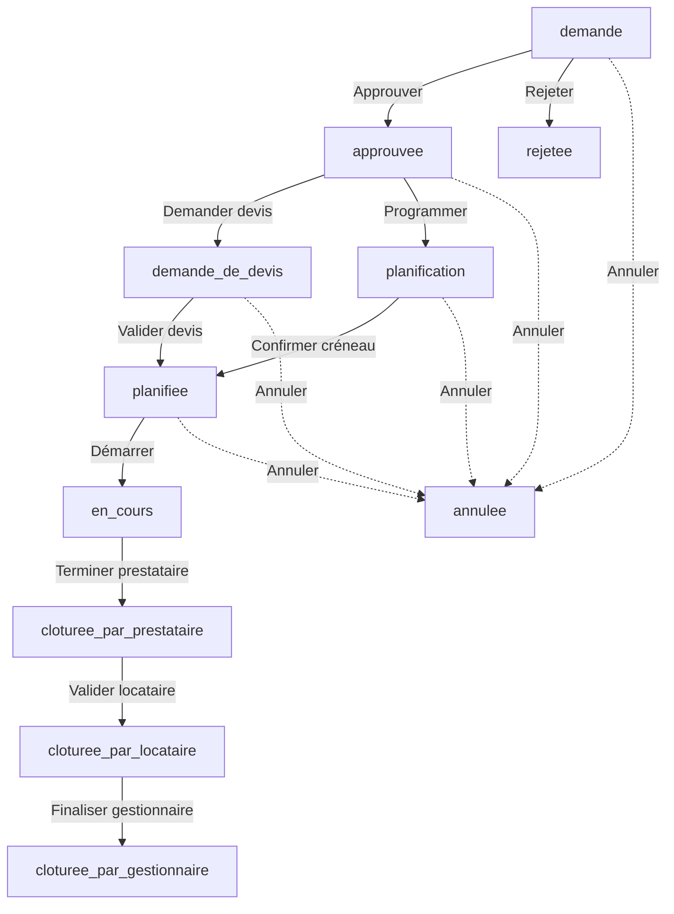

# 🔄 Guide Complet de Refactoring du Workflow Intervention SEIDO

> **Date de création** : 2025-10-18
> **Statut** : 📋 Document de référence
> **Branche actuelle** : `optimization`
> **Branche de référence** : `refacto`
> **Objectif** : Refactorer complètement le workflow d'intervention avec Server Actions

---

## 📖 Table des Matières

1. [Vue d'ensemble](#vue-densemble)
2. [Problème Actuel](#problème-actuel)
3. [Architecture Cible](#architecture-cible)
4. [Workflow Complet (12+ Étapes)](#workflow-complet)
5. [Comparaison Branches](#comparaison-branches)
6. [Plan de Migration](#plan-de-migration)
7. [Checklist Globale](#checklist-globale)
8. [Références](#références)

---

## 🎯 Vue d'ensemble

### Contexte

L'application SEIDO gère un workflow d'intervention complexe impliquant **4 rôles** (Admin, Gestionnaire, Prestataire, Locataire) à travers **11 statuts** différents et **14 modales UI**.

**Problème identifié** : Le pattern actuel utilise des appels `fetch()` côté client vers des API routes, ce qui cause des **pertes de contexte d'authentification**.

### État Actuel

- ✅ **14 modales** fonctionnelles
- ✅ **11+ API routes** implémentées
- ✅ **8 hooks** personnalisés
- ❌ **Pattern client-side fetch** (problématique)
- ❌ **Auth context perdu** sur certaines actions
- ⚠️ **Divergence** entre branches `refacto` et `optimization`

### Objectifs du Refactoring

1. ✅ Adopter le pattern **Server Actions** (Next.js 15)
2. ✅ Corriger le flow d'authentification
3. ✅ Uniformiser avec les patterns existants (building, contact)
4. ✅ Merger les améliorations de la branche `refacto`
5. ✅ Simplifier les composants volumineux
6. ✅ Améliorer la maintenabilité

---

## ❌ Problème Actuel

### Pattern Problématique

```
┌─────────────────┐
│  Client Hook    │
│  (use-hook.ts)  │
└────────┬────────┘
         │ fetch('/api/...')
         ▼
┌─────────────────┐
│  Browser Fetch  │ ❌ Cookies Supabase non propagés
└────────┬────────┘
         │
         ▼
┌─────────────────┐
│  API Route      │
│  route.ts       │
└────────┬────────┘
         │ supabase.auth.getUser()
         ▼
❌ ERREUR: Auth user = null
❌ Status 401: Non autorisé
```

### Exemple Concret : Programmation d'Intervention

**Fichier** : `hooks/use-intervention-planning.ts:131`

```typescript
const handleProgrammingConfirm = async () => {
  // ❌ PROBLÈME : Appel direct au service client-side
  await interventionActionsService.programIntervention(
    programmingModal.intervention,
    planningData
  )
}
```

**Fichier** : `lib/intervention-actions-service.ts:500`

```typescript
async programIntervention(intervention, data) {
  // ❌ PROBLÈME : fetch() browser-initiated
  const response = await fetch('/api/intervention-schedule', {
    method: 'POST',
    body: JSON.stringify(...)
  })
}
```

**Fichier** : `app/api/intervention-schedule/route.ts:42`

```typescript
export async function POST(request: NextRequest) {
  const { data: { user }, error } = await supabase.auth.getUser()

  if (error || !user) {
    // ❌ RÉSULTAT : Échec car cookies non disponibles
    return NextResponse.json({
      error: 'Non autorisé'
    }, { status: 401 })
  }
}
```

**Erreur Console** :
```
Error programming intervention: Error: Seuls les gestionnaires peuvent planifier les interventions
    at InterventionActionsService.programIntervention (intervention-actions-service.ts:500)
```

### Pourquoi Ça Échoue

1. **Browser fetch** : Les cookies d'authentification Supabase ne sont pas inclus automatiquement
2. **Cookie isolation** : Le contexte serveur de l'API route n'a pas accès aux cookies de session
3. **Session expirée** : Entre la vérification middleware et l'API call, la session peut expirer
4. **Pattern anti-Next.js 15** : Les Server Actions sont le pattern recommandé

---

## ✅ Architecture Cible

### Pattern Server Actions

```
┌─────────────────┐
│  Client Hook    │
│  (use-hook.ts)  │
└────────┬────────┘
         │ await serverAction(...)
         ▼
┌─────────────────┐
│  Server Action  │ ✅ Contexte serveur maintenu
│  actions/*.ts   │ ✅ Auth cookies disponibles
└────────┬────────┘
         │
         ▼
┌─────────────────┐
│  Service        │ ✅ Reçoit supabase client authentifié
│  Backend        │ ✅ Logique métier pure
└────────┬────────┘
         │
         ▼
┌─────────────────┐
│  Repository     │ ✅ Accès DB sécurisé
│  (services/)    │
└─────────────────┘
```

### Exemple Corrigé : Programmation

**Nouveau fichier** : `app/actions/intervention-actions.ts`

```typescript
'use server'

import { createServerSupabaseClient } from '@/lib/services'

export async function programInterventionAction(
  interventionId: string,
  planningData: PlanningData
) {
  // ✅ Contexte serveur : auth disponible
  const supabase = await createServerSupabaseClient()
  const { data: { user }, error } = await supabase.auth.getUser()

  if (error || !user) {
    throw new Error('Non authentifié')
  }

  // ✅ Appel service backend avec contexte auth
  return await interventionActionsService.programIntervention(
    supabase,
    user,
    interventionId,
    planningData
  )
}
```

**Hook mis à jour** : `hooks/use-intervention-planning.ts`

```typescript
import { programInterventionAction } from '@/app/actions/intervention-actions'

const handleProgrammingConfirm = async () => {
  // ✅ Appel Server Action (pas fetch)
  await programInterventionAction(
    programmingModal.intervention.id,
    planningData
  )
}
```

**Service refactoré** : `lib/intervention-actions-service.ts`

```typescript
// AVANT : Client-side service
async programIntervention(intervention, data) {
  const response = await fetch('/api/intervention-schedule', ...)
}

// APRÈS : Server-side service
async programIntervention(
  supabase: SupabaseClient,  // ✅ Reçoit client authentifié
  user: User,                // ✅ Reçoit user validé
  interventionId: string,
  planningData: PlanningData
) {
  // ✅ Logique métier directe (pas de fetch)
  // Appelle repositories/domain services
  const result = await interventionRepository.update(...)
  return result
}
```

### Avantages

| Aspect | Avant (API Routes) | Après (Server Actions) |
|--------|-------------------|------------------------|
| **Auth** | ❌ Cookies perdus | ✅ Contexte maintenu |
| **Performance** | ❌ HTTP overhead | ✅ Direct server call |
| **TypeScript** | ❌ JSON serialization | ✅ End-to-end types |
| **Code** | ❌ 3 couches (hook → fetch → route) | ✅ 2 couches (hook → action) |
| **Maintenance** | ❌ Duplication logic | ✅ Service centralisé |
| **Testing** | ❌ Mocking fetch | ✅ Direct function test |

---

## 📊 Workflow Complet

### Vue d'ensemble des Statuts



### Statuts de Base de Données

**Enum** : `intervention_status` (11 valeurs)

```typescript
type InterventionStatus =
  | 'demande'                        // 1. Demande initiale
  | 'rejetee'                        // 2. Rejetée par gestionnaire
  | 'approuvee'                      // 3. Approuvée par gestionnaire
  | 'demande_de_devis'               // 4. Devis demandé
  | 'planification'                  // 5. En cours de planification
  | 'planifiee'                      // 6. Date/heure confirmées
  | 'en_cours'                       // 7. Intervention démarrée
  | 'cloturee_par_prestataire'       // 8. Terminée par prestataire
  | 'cloturee_par_locataire'         // 9. Validée par locataire
  | 'cloturee_par_gestionnaire'      // 10. Finalisée par gestionnaire
  | 'annulee'                        // 11. Annulée
```

---

## 📋 Étapes du Workflow

### Étape 0 : Création de la Demande

**Statut** : `null` → `demande`

| Aspect | Détails |
|--------|---------|
| **Rôles autorisés** | 🏠 Locataire, 🔧 Prestataire |
| **Composant UI** | Page formulaire dédiée |
| **Route Page** | `app/[role]/interventions/new/page.tsx` |
| **API Route** | `/api/create-intervention` |
| **Hook** | Custom form (React Hook Form + Zod) |
| **Service** | `interventionService.create()` |
| **Fichier API** | `app/api/create-intervention/route.ts` |
| **Statut suivant** | `demande` (en attente approbation) |

**Référence fichier** : `app/api/create-intervention/route.ts:260`

```typescript
status: 'demande' as Database['public']['Enums']['intervention_status']
```

**✅ Version à utiliser** : Actuelle (optimization)

**🔧 Actions requises** :
- [ ] Vérifier si Server Action existe
- [ ] Si non, créer `createInterventionAction()`
- [ ] Tester création depuis locataire et prestataire

---

### Étape 1 : Approbation par Gestionnaire

**Statut** : `demande` → `approuvee`

| Aspect | Détails |
|--------|---------|
| **Rôles autorisés** | 👔 Gestionnaire uniquement |
| **Modale** | `approval-modal.tsx` |
| **API Route** | `/api/intervention-approve` |
| **Hook** | `use-intervention-approval.ts` |
| **Service** | `interventionActionsService.approveIntervention()` |
| **Fichier modale** | `components/intervention/modals/approval-modal.tsx` |
| **Fichier API** | `app/api/intervention-approve/route.ts:122` |

**Différence branches** :

```bash
# Changements refacto → optimization
+10 -10 lignes (20 modifications)
```

**Améliorations branche `refacto`** :
- Affichage amélioré des informations intervention
- Meilleure validation du formulaire
- UX optimisée pour les gestionnaires

**🔍 Version recommandée** : **refacto** (améliorations UX)

**🔧 Actions requises** :
- [ ] Créer `approveInterventionAction()` dans `app/actions/intervention-actions.ts`
- [ ] Refactorer `interventionActionsService.approveIntervention()` (client → server)
- [ ] Mettre à jour `use-intervention-approval.ts` (fetch → server action)
- [ ] Merger améliorations modale depuis refacto
- [ ] Tests E2E : Approbation par gestionnaire

**Code API actuel** : `app/api/intervention-approve/route.ts:122`

```typescript
status: 'approuvee' as Database['public']['Enums']['intervention_status']
```

---

### Étape 2 : Rejet par Gestionnaire

**Statut** : `demande` → `rejetee`

| Aspect | Détails |
|--------|---------|
| **Rôles autorisés** | 👔 Gestionnaire uniquement |
| **Modale** | `reject-confirmation-modal.tsx` |
| **API Route** | `/api/intervention-reject` |
| **Hook** | `use-intervention-approval.ts` |
| **Service** | `interventionActionsService.rejectIntervention()` |
| **Fichier modale** | `components/intervention/modals/reject-confirmation-modal.tsx` |
| **Fichier API** | `app/api/intervention-reject/route.ts:130` |

**Différence branches** :

```bash
# Changements refacto → optimization
+4 lignes ajoutées
```

**Améliorations branche `refacto`** :
- Champ commentaire obligatoire
- Meilleure gestion des erreurs
- UI cohérente avec autres modales

**🔍 Version recommandée** : **refacto**

**🔧 Actions requises** :
- [ ] Créer `rejectInterventionAction()`
- [ ] Refactorer service en server-side
- [ ] Merger améliorations depuis refacto
- [ ] Valider champ raison de rejet obligatoire
- [ ] Tests E2E : Rejet avec commentaire

**Code API actuel** : `app/api/intervention-reject/route.ts:130`

```typescript
status: 'rejetee' as Database['public']['Enums']['intervention_status']
```

---

### Étape 3 : Demande de Devis

**Statut** : `approuvee` → `demande_de_devis`

| Aspect | Détails |
|--------|---------|
| **Rôles autorisés** | 👔 Gestionnaire uniquement |
| **Modales** | `quote-request-modal.tsx`<br>`multi-quote-request-modal.tsx`<br>`external-quote-request-modal.tsx`<br>`quote-request-success-modal.tsx` |
| **API Route** | `/api/intervention-quote-request` |
| **Hook** | `use-intervention-quoting.ts` |
| **Service** | `interventionActionsService.requestQuote()` |
| **Fichier API** | `app/api/intervention-quote-request/route.ts:247` |

**Différence branches** :

```bash
# multi-quote-request-modal.tsx
+35 -16 lignes (51 modifications)

# quote-request-modal.tsx
+16 -7 lignes (23 modifications)

# external-quote-request-modal.tsx
+4 lignes

# quote-request-success-modal.tsx
+2 lignes
```

**Améliorations branche `refacto`** (commit `d8a250a`) :
- ✨ **Affichage complet des informations** dans la modale
- Informations intervention visibles (lot, immeuble, locataire)
- Liste prestataires avec filtres améliorés
- Possibilité de demander plusieurs devis simultanément
- Modal de succès avec récapitulatif

**🔍 Version recommandée** : **refacto** (feature majeure)

**🔧 Actions requises** :
- [ ] Créer `requestQuoteAction()` et `requestMultipleQuotesAction()`
- [ ] Refactorer `interventionActionsService.requestQuote()`
- [ ] **Merger impérativement** les 4 modales depuis refacto
- [ ] Tester demande devis unique
- [ ] Tester demande multi-devis
- [ ] Tester demande devis externe
- [ ] Tests E2E : Workflow devis complet

**Code API actuel** : `app/api/intervention-quote-request/route.ts:247`

```typescript
status: 'demande_de_devis' as Database['public']['Enums']['intervention_status']
```

---

### Étape 4 : Soumission de Devis (Prestataire)

**Statut** : `demande_de_devis` (inchangé, mais quote créée)

| Aspect | Détails |
|--------|---------|
| **Rôles autorisés** | 🔧 Prestataire uniquement |
| **Composant** | Formulaire devis prestataire |
| **API Route** | `/api/intervention-quote-submit` |
| **Hook** | `use-intervention-quoting.ts` |
| **Table DB** | `intervention_quotes` |
| **Fichier API** | `app/api/intervention-quote-submit/route.ts` |

**🔧 Actions requises** :
- [ ] Créer `submitQuoteAction()`
- [ ] Refactorer service soumission devis
- [ ] Tester upload fichiers devis
- [ ] Tester disponibilités prestataire
- [ ] Tests E2E : Prestataire soumet devis

---

### Étape 5 : Validation de Devis

**Statut** : `demande_de_devis` → `planifiee`

| Aspect | Détails |
|--------|---------|
| **Rôles autorisés** | 👔 Gestionnaire uniquement |
| **Modale** | Modal de confirmation validation |
| **API Route** | `/api/intervention-quote-validate` |
| **Hook** | `use-intervention-quoting.ts` |
| **Service** | `interventionActionsService.validateQuote()` |
| **Fichier API** | `app/api/intervention-quote-validate/route.ts:178` |

**🔧 Actions requises** :
- [ ] Créer `validateQuoteAction()`
- [ ] Refactorer service validation
- [ ] Gérer transition `demande_de_devis` → `planifiee`
- [ ] Notifier prestataire sélectionné
- [ ] Notifier prestataires non retenus
- [ ] Tests E2E : Validation devis

**Code API actuel** : `app/api/intervention-quote-validate/route.ts:178`

```typescript
status: 'planifiee' as Database['public']['Enums']['intervention_status']
```

---

### Étape 6 : Programmation (PROBLÈME ACTUEL)

**Statut** : `approuvee` → `planification`

| Aspect | Détails |
|--------|---------|
| **Rôles autorisés** | 👔 Gestionnaire uniquement |
| **Modale** | `programming-modal.tsx` |
| **API Route** | `/api/intervention-schedule` |
| **Hook** | `use-intervention-planning.ts` |
| **Service** | `interventionActionsService.programIntervention()` |
| **Fichier modale** | `components/intervention/modals/programming-modal.tsx` |
| **Fichier API** | `app/api/intervention-schedule/route.ts` |

**⚠️ PROBLÈME ACTUEL : ERREUR AUTH**

```
Error: Seuls les gestionnaires peuvent planifier les interventions
Location: intervention-actions-service.ts:500
```

**Différence branches** :

```bash
# programming-modal.tsx
optimization: 466 lignes (version simple)
refacto:      607 lignes (version avancée +141 lignes)
```

**Améliorations branche `refacto`** :
- ✨ **Sélection de contacts** (providers, tenants)
- ✨ **Messages personnalisés** par contact
- Props `teamId`, `selectedContactIds`, `onContactSelect`
- Composant `ContactSelector` intégré
- Gestion `individualMessages` par contact

**🔍 Version recommandée** : **refacto** (features avancées)

**🔧 Actions requises** (PRIORITÉ HAUTE) :
- [x] **URGENT** : Créer `programInterventionAction()`
- [ ] Refactorer `interventionActionsService.programIntervention()` (serveur)
- [ ] Mettre à jour `use-intervention-planning.ts` (server action)
- [ ] **Merger modale depuis refacto** (sélection contacts + messages)
- [ ] Tester 3 modes : direct, propose, organize
- [ ] Tester sélection prestataires
- [ ] Tester messages personnalisés
- [ ] Tests E2E : Programmation complète

**Code modale refacto** : Nouvelles props

```typescript
// Version refacto (607 lignes)
interface ProgrammingModalProps {
  // ... props existantes
  teamId: string                                    // ✨ NOUVEAU
  providers?: Contact[]                             // ✨ NOUVEAU
  tenants?: Contact[]                               // ✨ NOUVEAU
  selectedContactIds?: string[]                     // ✨ NOUVEAU
  onContactSelect?: (contactId: string) => void     // ✨ NOUVEAU
  onContactCreated?: (contact: any) => void         // ✨ NOUVEAU
  individualMessages?: Record<string, string>       // ✨ NOUVEAU
  onIndividualMessageChange?: (id, msg) => void     // ✨ NOUVEAU
}
```

**Documentation** : `docs/intervention-planning-flows.md` (existant, à maintenir)

---

### Étape 7 : Gestion des Disponibilités

**Statut** : `planification` (inchangé pendant coordination)

| Aspect | Détails |
|--------|---------|
| **Rôles autorisés** | 👔 Gestionnaire, 🏠 Locataire, 🔧 Prestataire |
| **Modales** | `provider-availability-modal.tsx` ⭐ NOUVELLE<br>`schedule-rejection-modal.tsx` ⭐ NOUVELLE |
| **API Routes** | `/api/intervention/[id]/availabilities`<br>`/api/intervention/[id]/user-availability`<br>`/api/intervention/[id]/tenant-availability`<br>`/api/intervention/[id]/availability-response`<br>`/api/intervention/[id]/match-availabilities` |
| **Hook** | `use-availability-management.ts` |
| **Composants** | `TenantAvailabilityInput`<br>`ProviderAvailabilitySelection` |

**Différence branches** :

```bash
# provider-availability-modal.tsx
optimization: +369 lignes (NOUVEAU dans optimization)

# schedule-rejection-modal.tsx
optimization: +139 lignes (NOUVEAU dans optimization)
```

**⚠️ Attention** : Ces deux modales **n'existent que dans `optimization`**, pas dans `refacto`

**🔍 Version recommandée** : **optimization** (features exclusives)

**🔧 Actions requises** :
- [ ] Créer `addAvailabilityAction()`
- [ ] Créer `matchAvailabilitiesAction()`
- [ ] Créer `respondToAvailabilityAction()`
- [ ] Créer `rejectScheduleAction()` (nouvelle modale)
- [ ] Refactorer hooks disponibilités
- [ ] Conserver ces modales (exclusives optimization)
- [ ] Tests E2E : Coordination disponibilités

**Tables DB** :
- `intervention_time_slots`
- `intervention_availabilities` (si existe)

---

### Étape 8 : Confirmation de Créneau

**Statut** : `planification` → `planifiee`

| Aspect | Détails |
|--------|---------|
| **Rôles autorisés** | Tous les participants |
| **API Route** | `/api/intervention/[id]/select-slot` |
| **Hook** | `use-availability-management.ts` |
| **Fichier API** | `app/api/intervention/[id]/select-slot/route.ts:227` |

**🔧 Actions requises** :
- [ ] Créer `selectTimeSlotAction()`
- [ ] Refactorer service sélection créneau
- [ ] Mettre à jour champ `is_selected` dans `intervention_time_slots`
- [ ] Mettre à jour `scheduled_date` et `scheduled_start_time` sur intervention
- [ ] Tests E2E : Confirmation créneau

**Code API actuel** : `app/api/intervention/[id]/select-slot/route.ts:227`

```typescript
status: 'planifiee' as Database['public']['Enums']['intervention_status']
```

---

### Étape 9 : Démarrage de l'Intervention

**Statut** : `planifiee` → `en_cours`

| Aspect | Détails |
|--------|---------|
| **Rôles autorisés** | 🔧 Prestataire uniquement |
| **API Route** | `/api/intervention-start` |
| **Hook** | `use-intervention-execution.ts` |
| **Service** | `interventionActionsService.startIntervention()` |
| **Fichier API** | `app/api/intervention-start/route.ts:158` |

**🔧 Actions requises** :
- [ ] Créer `startInterventionAction()`
- [ ] Refactorer service démarrage
- [ ] Vérifier date planifiée respectée
- [ ] Notifier gestionnaire et locataire
- [ ] Tests E2E : Démarrage par prestataire

**Code API actuel** : `app/api/intervention-start/route.ts:158`

```typescript
status: 'en_cours' as Database['public']['Enums']['intervention_status']
```

---

### Étape 10 : Clôture par Prestataire

**Statut** : `en_cours` → `cloturee_par_prestataire`

| Aspect | Détails |
|--------|---------|
| **Rôles autorisés** | 🔧 Prestataire uniquement |
| **Modale** | `simple-work-completion-modal.tsx` |
| **Composant** | `WorkCompletionReport` |
| **API Route** | `/api/intervention-complete` |
| **Hook** | `use-intervention-execution.ts` |
| **Service** | `interventionActionsService.completeIntervention()` |
| **Fichier API** | `app/api/intervention-complete/route.ts:166` |

**🔧 Actions requises** :
- [ ] Créer `completeInterventionAction()`
- [ ] Refactorer service clôture prestataire
- [ ] Gérer upload photos/fichiers justificatifs
- [ ] Gérer rapport de travaux
- [ ] Notifier locataire pour validation
- [ ] Tests E2E : Clôture avec rapport

**Code API actuel** : `app/api/intervention-complete/route.ts:166`

```typescript
status: 'cloturee_par_prestataire' as Database['public']['Enums']['intervention_status']
```

---

### Étape 11 : Validation par Locataire

**Statut** : `cloturee_par_prestataire` → `cloturee_par_locataire`

| Aspect | Détails |
|--------|---------|
| **Rôles autorisés** | 🏠 Locataire uniquement |
| **Composant** | `TenantValidationForm` |
| **API Route** | `/api/intervention-validate-tenant` |
| **Fichier API** | `app/api/intervention-validate-tenant/route.ts:141` |

**🔧 Actions requises** :
- [ ] Créer `validateInterventionAsTenantAction()`
- [ ] Refactorer service validation locataire
- [ ] Gérer commentaire satisfaction
- [ ] Gérer notation (si applicable)
- [ ] Notifier gestionnaire pour finalisation
- [ ] Tests E2E : Validation locataire

**Code API actuel** : `app/api/intervention-validate-tenant/route.ts:141`

```typescript
let newStatus: Database['public']['Enums']['intervention_status']
// Logic pour déterminer si -> cloturee_par_locataire ou autre
```

---

### Étape 12 : Finalisation par Gestionnaire

**Statut** : `cloturee_par_locataire` → `cloturee_par_gestionnaire`

| Aspect | Détails |
|--------|---------|
| **Rôles autorisés** | 👔 Gestionnaire uniquement |
| **Modale** | `simplified-finalization-modal.tsx` |
| **API Route** | `/api/intervention-finalize` |
| **Hook** | `use-intervention-finalization.ts` |
| **Service** | `interventionActionsService.finalizeIntervention()` |
| **Fichier API** | `app/api/intervention-finalize/route.ts:166` |

**🔧 Actions requises** :
- [ ] Créer `finalizeInterventionAction()`
- [ ] Refactorer service finalisation
- [ ] Gérer montant final
- [ ] Gérer mode de paiement
- [ ] Gérer notes administratives
- [ ] Archivage automatique
- [ ] Tests E2E : Finalisation complète

**Code API actuel** : `app/api/intervention-finalize/route.ts:166`

```typescript
status: 'cloturee_par_gestionnaire' as Database['public']['Enums']['intervention_status']
```

---

### Étape 13 : Annulation (Transversal)

**Statut** : Tout statut → `annulee`

| Aspect | Détails |
|--------|---------|
| **Rôles autorisés** | 👔 Gestionnaire uniquement |
| **Modale** | `cancel-confirmation-modal.tsx` |
| **API Route** | `/api/intervention-cancel` |
| **Hook** | `use-intervention-cancellation.ts` |
| **Service** | `interventionActionsService.cancelIntervention()` |
| **Fichier modale** | `components/intervention/modals/cancel-confirmation-modal.tsx` |

**Différence branches** :

```bash
# cancel-confirmation-modal.tsx
+8 lignes modifiées
```

**Améliorations branche `refacto`** :
- Raison d'annulation obligatoire
- Validation améliorée
- UI cohérente

**🔍 Version recommandée** : **refacto**

**🔧 Actions requises** :
- [ ] Créer `cancelInterventionAction()`
- [ ] Refactorer service annulation
- [ ] Merger améliorations depuis refacto
- [ ] Gérer notification tous participants
- [ ] Gérer remboursement si applicable
- [ ] Tests E2E : Annulation à différents stades

---

## 🔄 Comparaison Branches

### Tableau Récapitulatif Modales

| Modale | Optimization | Refacto | Diff | Version Recommandée | Priorité |
|--------|--------------|---------|------|---------------------|----------|
| `programming-modal.tsx` | 466 lignes | 607 lignes | **+141** | 🏆 **Refacto** (contacts + messages) | 🔥 HAUTE |
| `multi-quote-request-modal.tsx` | Base | +51 lignes | **+51** | 🏆 **Refacto** (affichage complet) | 🔥 HAUTE |
| `quote-request-modal.tsx` | Base | +23 lignes | **+23** | 🏆 **Refacto** | 🟡 MEDIUM |
| `approval-modal.tsx` | Base | +20 lignes | **+20** | 🏆 **Refacto** (UX améliorée) | 🟡 MEDIUM |
| `cancel-confirmation-modal.tsx` | Base | +8 lignes | **+8** | 🏆 **Refacto** | 🟢 LOW |
| `reject-confirmation-modal.tsx` | Base | +4 lignes | **+4** | 🏆 **Refacto** | 🟢 LOW |
| `external-quote-request-modal.tsx` | Base | +4 lignes | **+4** | 🏆 **Refacto** | 🟢 LOW |
| `quote-request-success-modal.tsx` | Base | +2 lignes | **+2** | 🏆 **Refacto** | 🟢 LOW |
| `approve-confirmation-modal.tsx` | Base | +2 lignes | **+2** | 🏆 **Refacto** | 🟢 LOW |
| `base-confirmation-modal.tsx` | Base | +3 lignes | **+3** | 🏆 **Refacto** | 🟢 LOW |
| `success-modal.tsx` | Base+1 | Base | **-1** | ⚖️ Égal | 🟢 LOW |
| `provider-availability-modal.tsx` | **369 lignes** | N/A | **NOUVEAU** | 🏆 **Optimization** (exclusif) | 🔥 HAUTE |
| `schedule-rejection-modal.tsx` | **139 lignes** | N/A | **NOUVEAU** | 🏆 **Optimization** (exclusif) | 🔥 HAUTE |
| `confirmation-modal.tsx` | Existe | Existe | Égal | ⚖️ Les deux | 🟢 LOW |

### Stratégie de Merge

**Approche hybride recommandée** :

1. **Base : branche `optimization`** (contient les nouvelles modales disponibilités)
2. **Merger depuis `refacto`** :
   - ✅ `programming-modal.tsx` (version 607 lignes)
   - ✅ `multi-quote-request-modal.tsx`
   - ✅ `quote-request-modal.tsx`
   - ✅ `approval-modal.tsx`
   - ✅ 6 autres petites modales avec améliorations
3. **Conserver depuis `optimization`** :
   - ✅ `provider-availability-modal.tsx` (exclusif)
   - ✅ `schedule-rejection-modal.tsx` (exclusif)

### Commits Clés de la Branche Refacto

```bash
d8a250a - ✨ UX: Affichage complet des informations dans la modale de demande de devis
b2050d8 - ✨ UX: Améliorations modales et workflow interventions
6472e14 - 🔒 UX: Masquage action "Relancer les prestataires" pour les prestataires
```

---

## 🚀 Plan de Migration

### Phase 1 : Infrastructure Server Actions

**Durée estimée** : 2-3 heures

**Objectif** : Créer la couche Server Actions pour toutes les actions d'intervention

#### Fichiers à créer

**1. `app/actions/intervention-actions.ts`**

```typescript
'use server'

import { createServerSupabaseClient } from '@/lib/services'
import { interventionActionsService } from '@/lib/intervention-actions-service'
import type { PlanningData, ApprovalData, CancellationData } from '@/lib/intervention-actions-service'

// Approbation
export async function approveInterventionAction(interventionId: string) {
  const supabase = await createServerSupabaseClient()
  const { data: { user }, error } = await supabase.auth.getUser()
  if (error || !user) throw new Error('Non authentifié')

  return await interventionActionsService.approveIntervention(supabase, user, interventionId)
}

// Rejet
export async function rejectInterventionAction(
  interventionId: string,
  rejectionReason: string
) {
  const supabase = await createServerSupabaseClient()
  const { data: { user }, error } = await supabase.auth.getUser()
  if (error || !user) throw new Error('Non authentifié')

  return await interventionActionsService.rejectIntervention(
    supabase,
    user,
    interventionId,
    rejectionReason
  )
}

// Programmation (FIX AUTH ISSUE)
export async function programInterventionAction(
  interventionId: string,
  planningData: PlanningData
) {
  const supabase = await createServerSupabaseClient()
  const { data: { user }, error } = await supabase.auth.getUser()
  if (error || !user) throw new Error('Non authentifié')

  return await interventionActionsService.programIntervention(
    supabase,
    user,
    interventionId,
    planningData
  )
}

// Annulation
export async function cancelInterventionAction(
  interventionId: string,
  cancellationData: CancellationData
) {
  const supabase = await createServerSupabaseClient()
  const { data: { user }, error } = await supabase.auth.getUser()
  if (error || !user) throw new Error('Non authentifié')

  return await interventionActionsService.cancelIntervention(
    supabase,
    user,
    interventionId,
    cancellationData
  )
}

// Démarrage
export async function startInterventionAction(interventionId: string) {
  const supabase = await createServerSupabaseClient()
  const { data: { user }, error } = await supabase.auth.getUser()
  if (error || !user) throw new Error('Non authentifié')

  return await interventionActionsService.startIntervention(supabase, user, interventionId)
}

// Clôture prestataire
export async function completeInterventionAction(
  interventionId: string,
  reportData: any
) {
  const supabase = await createServerSupabaseClient()
  const { data: { user }, error } = await supabase.auth.getUser()
  if (error || !user) throw new Error('Non authentifié')

  return await interventionActionsService.completeIntervention(
    supabase,
    user,
    interventionId,
    reportData
  )
}

// Validation locataire
export async function validateInterventionAsTenantAction(
  interventionId: string,
  validationData: any
) {
  const supabase = await createServerSupabaseClient()
  const { data: { user }, error } = await supabase.auth.getUser()
  if (error || !user) throw new Error('Non authentifié')

  return await interventionActionsService.validateAsTenant(
    supabase,
    user,
    interventionId,
    validationData
  )
}

// Finalisation gestionnaire
export async function finalizeInterventionAction(
  interventionId: string,
  finalizationData: any
) {
  const supabase = await createServerSupabaseClient()
  const { data: { user }, error } = await supabase.auth.getUser()
  if (error || !user) throw new Error('Non authentifié')

  return await interventionActionsService.finalizeIntervention(
    supabase,
    user,
    interventionId,
    finalizationData
  )
}
```

**2. `app/actions/quote-actions.ts`**

```typescript
'use server'

import { createServerSupabaseClient } from '@/lib/services'
import { interventionActionsService } from '@/lib/intervention-actions-service'

export async function requestQuoteAction(
  interventionId: string,
  providerIds: string[]
) {
  const supabase = await createServerSupabaseClient()
  const { data: { user }, error } = await supabase.auth.getUser()
  if (error || !user) throw new Error('Non authentifié')

  return await interventionActionsService.requestQuote(
    supabase,
    user,
    interventionId,
    providerIds
  )
}

export async function submitQuoteAction(
  interventionId: string,
  quoteData: any
) {
  const supabase = await createServerSupabaseClient()
  const { data: { user }, error } = await supabase.auth.getUser()
  if (error || !user) throw new Error('Non authentifié')

  return await interventionActionsService.submitQuote(
    supabase,
    user,
    interventionId,
    quoteData
  )
}

export async function validateQuoteAction(
  interventionId: string,
  quoteId: string
) {
  const supabase = await createServerSupabaseClient()
  const { data: { user }, error } = await supabase.auth.getUser()
  if (error || !user) throw new Error('Non authentifié')

  return await interventionActionsService.validateQuote(
    supabase,
    user,
    interventionId,
    quoteId
  )
}
```

**3. `app/actions/availability-actions.ts`**

```typescript
'use server'

import { createServerSupabaseClient } from '@/lib/services'

export async function addAvailabilityAction(
  interventionId: string,
  availability: any
) {
  const supabase = await createServerSupabaseClient()
  const { data: { user }, error } = await supabase.auth.getUser()
  if (error || !user) throw new Error('Non authentifié')

  // Logic to add availability
  return { success: true }
}

export async function matchAvailabilitiesAction(interventionId: string) {
  const supabase = await createServerSupabaseClient()
  const { data: { user }, error } = await supabase.auth.getUser()
  if (error || !user) throw new Error('Non authentifié')

  // Logic to match availabilities
  return { success: true }
}

export async function selectTimeSlotAction(
  interventionId: string,
  slotId: string
) {
  const supabase = await createServerSupabaseClient()
  const { data: { user }, error } = await supabase.auth.getUser()
  if (error || !user) throw new Error('Non authentifié')

  // Logic to select time slot
  return { success: true }
}
```

#### Checklist Phase 1

- [ ] Créer `app/actions/intervention-actions.ts`
- [ ] Créer `app/actions/quote-actions.ts`
- [ ] Créer `app/actions/availability-actions.ts`
- [ ] Tester import des actions
- [ ] Valider types TypeScript

---

### Phase 2 : Refactoring Services Backend

**Durée estimée** : 3-4 heures

**Objectif** : Transformer les services de client-side à server-side

#### Fichier à refactorer

**`lib/intervention-actions-service.ts`**

**AVANT** (client-side) :

```typescript
async approveIntervention(intervention: InterventionAction): Promise<APIResponse> {
  const response = await fetch('/api/intervention-approve', {
    method: 'POST',
    body: JSON.stringify({ interventionId: intervention.id })
  })
  return await response.json()
}
```

**APRÈS** (server-side) :

```typescript
async approveIntervention(
  supabase: SupabaseClient,
  user: User,
  interventionId: string
): Promise<APIResponse> {
  // Vérifier rôle
  const userProfile = await userService.findByAuthUserId(user.id)
  if (userProfile.role !== 'gestionnaire') {
    throw new Error('Seuls les gestionnaires peuvent approuver')
  }

  // Logique métier directe
  const { data, error } = await supabase
    .from('interventions')
    .update({ status: 'approuvee' })
    .eq('id', interventionId)
    .select()
    .single()

  if (error) throw error

  return { success: true, data }
}
```

#### Checklist Phase 2

- [ ] Refactorer `approveIntervention()`
- [ ] Refactorer `rejectIntervention()`
- [ ] Refactorer `programIntervention()` (priorité haute)
- [ ] Refactorer `requestQuote()`
- [ ] Refactorer `submitQuote()`
- [ ] Refactorer `validateQuote()`
- [ ] Refactorer `startIntervention()`
- [ ] Refactorer `completeIntervention()`
- [ ] Refactorer `validateAsTenant()`
- [ ] Refactorer `finalizeIntervention()`
- [ ] Refactorer `cancelIntervention()`

---

### Phase 3 : Mise à Jour des Hooks

**Durée estimée** : 2-3 heures

**Objectif** : Remplacer les appels `fetch` par des Server Actions dans les hooks

#### Hooks à mettre à jour

**1. `hooks/use-intervention-approval.ts`**

**AVANT** :

```typescript
const handleApprove = async () => {
  await interventionActionsService.approveIntervention(intervention)
}
```

**APRÈS** :

```typescript
import { approveInterventionAction } from '@/app/actions/intervention-actions'

const handleApprove = async () => {
  await approveInterventionAction(intervention.id)
}
```

**2. `hooks/use-intervention-planning.ts`** (priorité haute)

**AVANT** :

```typescript
const handleProgrammingConfirm = async () => {
  await interventionActionsService.programIntervention(
    programmingModal.intervention,
    planningData
  )
}
```

**APRÈS** :

```typescript
import { programInterventionAction } from '@/app/actions/intervention-actions'

const handleProgrammingConfirm = async () => {
  await programInterventionAction(
    programmingModal.intervention.id,
    planningData
  )
}
```

#### Checklist Phase 3

- [ ] `use-intervention-approval.ts`
- [ ] `use-intervention-planning.ts` (FIX AUTH)
- [ ] `use-intervention-quoting.ts`
- [ ] `use-intervention-execution.ts`
- [ ] `use-intervention-finalization.ts`
- [ ] `use-intervention-cancellation.ts`
- [ ] `use-availability-management.ts`

---

### Phase 4 : Merge Modales Refacto

**Durée estimée** : 2-3 heures

**Objectif** : Intégrer les améliorations UI de la branche `refacto`

#### Stratégie

**Option A : Cherry-pick commits**

```bash
# Checkout optimization
git checkout optimization

# Cherry-pick les commits refacto
git cherry-pick d8a250a  # Affichage complet infos devis
git cherry-pick b2050d8  # Améliorations modales workflow

# Résoudre conflits si nécessaire
```

**Option B : Merge manuel fichier par fichier**

```bash
# Pour chaque modale
git show refacto:components/intervention/modals/programming-modal.tsx > /tmp/programming-modal-refacto.tsx

# Comparer et merger manuellement
code --diff components/intervention/modals/programming-modal.tsx /tmp/programming-modal-refacto.tsx
```

#### Priorité de Merge

**HAUTE** :
- [ ] `programming-modal.tsx` (607 lignes, +contact selector)
- [ ] `multi-quote-request-modal.tsx` (+51 lignes)

**MEDIUM** :
- [ ] `quote-request-modal.tsx` (+23 lignes)
- [ ] `approval-modal.tsx` (+20 lignes)

**LOW** :
- [ ] 6 autres petites modales (+2 à +8 lignes chacune)

#### Checklist Phase 4

- [ ] Backup branche optimization actuelle
- [ ] Merger `programming-modal.tsx`
- [ ] Merger `multi-quote-request-modal.tsx`
- [ ] Merger 8 autres modales
- [ ] Tester toutes les modales visuellement
- [ ] Valider types TypeScript
- [ ] Tests E2E modales

---

### Phase 5 : Dépréciation API Routes

**Durée estimée** : 1-2 heures

**Objectif** : Marquer les API routes comme deprecated, rediriger vers Server Actions

#### Approche Progressive

**Étape 1 : Marquer deprecated**

```typescript
/**
 * @deprecated Use approveInterventionAction() instead
 * This API route will be removed in v2.0
 * Migration guide: docs/intervention-workflow-refactoring-guide.md
 */
export async function POST(request: NextRequest) {
  console.warn('[DEPRECATED API] /api/intervention-approve - Use Server Action instead')

  // Garder fonctionnalité temporairement pour compatibilité
  // ... existing code
}
```

**Étape 2 : Rediriger vers Server Actions** (optionnel)

```typescript
export async function POST(request: NextRequest) {
  console.warn('[DEPRECATED] Redirecting to Server Action')

  const body = await request.json()
  const result = await approveInterventionAction(body.interventionId)

  return NextResponse.json(result)
}
```

**Étape 3 : Supprimer après validation** (future PR)

```bash
# Après 2-4 semaines de validation
rm app/api/intervention-approve/route.ts
rm app/api/intervention-reject/route.ts
# ... etc
```

#### Checklist Phase 5

- [ ] Déprécier `/api/intervention-approve`
- [ ] Déprécier `/api/intervention-reject`
- [ ] Déprécier `/api/intervention-schedule`
- [ ] Déprécier `/api/intervention-quote-request`
- [ ] Déprécier `/api/intervention-quote-submit`
- [ ] Déprécier `/api/intervention-quote-validate`
- [ ] Déprécier `/api/intervention-start`
- [ ] Déprécier `/api/intervention-complete`
- [ ] Déprécier `/api/intervention-validate-tenant`
- [ ] Déprécier `/api/intervention-finalize`
- [ ] Déprécier `/api/intervention-cancel`
- [ ] Planifier suppression future

---

### Phase 6 : Tests & Validation

**Durée estimée** : 2-3 heures

**Objectif** : Valider le refactoring complet avec tests automatisés et manuels

#### Tests Unitaires

**Créer** `__tests__/actions/intervention-actions.test.ts`

```typescript
import { approveInterventionAction } from '@/app/actions/intervention-actions'

describe('approveInterventionAction', () => {
  it('should approve intervention as gestionnaire', async () => {
    // Mock Supabase client
    // Mock user as gestionnaire
    // Call action
    // Assert intervention status = 'approuvee'
  })

  it('should throw error if not gestionnaire', async () => {
    // Mock user as locataire
    // Expect error
  })
})
```

#### Tests E2E

**Mettre à jour** `docs/refacto/Tests/`

```typescript
// Phase 2 - Intervention Workflow
test('Gestionnaire can approve intervention', async ({ page }) => {
  // Login as gestionnaire
  // Navigate to intervention
  // Click approve
  // Verify status changed
  // Verify notification sent
})

test('Gestionnaire can program intervention', async ({ page }) => {
  // Login as gestionnaire
  // Open programming modal
  // Select "Fixer le rendez-vous"
  // Fill date/time
  // Confirm
  // Verify status = 'planification'
})
```

#### Tests Manuels

**Checklist de validation** :

- [ ] Login gestionnaire
- [ ] Créer intervention test
- [ ] Approuver intervention
- [ ] Programmer intervention (3 modes)
- [ ] Demander devis
- [ ] Soumettre devis (prestataire)
- [ ] Valider devis
- [ ] Démarrer intervention
- [ ] Terminer intervention
- [ ] Valider locataire
- [ ] Finaliser gestionnaire
- [ ] Annuler intervention

#### Checklist Phase 6

- [ ] Tests unitaires Server Actions
- [ ] Tests unitaires Services refactorés
- [ ] Tests E2E workflow complet
- [ ] Tests manuels tous rôles
- [ ] Performance : < 100ms API
- [ ] Pas d'erreurs console
- [ ] Pas d'erreurs Supabase

---

### Phase 7 : Documentation

**Durée estimée** : 1 heure

#### Fichiers à créer/mettre à jour

- [x] `docs/intervention-workflow-refactoring-guide.md` (ce fichier)
- [ ] `docs/intervention-planning-flows.md` (mettre à jour avec Server Actions)
- [ ] `docs/rapport-audit-complet-seido.md` (ajouter section refactoring)
- [ ] `lib/services/README.md` (mettre à jour avec nouvelles Server Actions)
- [ ] `app/actions/README.md` (créer documentation Server Actions)

#### Checklist Phase 7

- [ ] Documenter Server Actions
- [ ] Mettre à jour diagrammes workflow
- [ ] Ajouter exemples de code
- [ ] Documenter migration API → Actions
- [ ] ADR (Architecture Decision Record)

---

## ✅ Checklist Globale

### Infrastructure

- [ ] `app/actions/intervention-actions.ts` créé
- [ ] `app/actions/quote-actions.ts` créé
- [ ] `app/actions/availability-actions.ts` créé
- [ ] Types TypeScript validés

### Services Backend

- [ ] `approveIntervention()` refactoré
- [ ] `rejectIntervention()` refactoré
- [ ] `programIntervention()` refactoré (priorité haute)
- [ ] `requestQuote()` refactoré
- [ ] `submitQuote()` refactoré
- [ ] `validateQuote()` refactoré
- [ ] `startIntervention()` refactoré
- [ ] `completeIntervention()` refactoré
- [ ] `validateAsTenant()` refactoré
- [ ] `finalizeIntervention()` refactoré
- [ ] `cancelIntervention()` refactoré

### Hooks

- [ ] `use-intervention-approval.ts` mis à jour
- [ ] `use-intervention-planning.ts` mis à jour (priorité haute)
- [ ] `use-intervention-quoting.ts` mis à jour
- [ ] `use-intervention-execution.ts` mis à jour
- [ ] `use-intervention-finalization.ts` mis à jour
- [ ] `use-intervention-cancellation.ts` mis à jour
- [ ] `use-availability-management.ts` mis à jour

### Modales (Merge Refacto)

- [ ] `programming-modal.tsx` mergée (607 lignes)
- [ ] `multi-quote-request-modal.tsx` mergée
- [ ] `quote-request-modal.tsx` mergée
- [ ] `approval-modal.tsx` mergée
- [ ] `cancel-confirmation-modal.tsx` mergée
- [ ] `reject-confirmation-modal.tsx` mergée
- [ ] `external-quote-request-modal.tsx` mergée
- [ ] `quote-request-success-modal.tsx` mergée
- [ ] `approve-confirmation-modal.tsx` mergée
- [ ] `base-confirmation-modal.tsx` mergée
- [ ] Conserver `provider-availability-modal.tsx` (optimization)
- [ ] Conserver `schedule-rejection-modal.tsx` (optimization)

### API Routes

- [ ] `/api/intervention-approve` déprécié
- [ ] `/api/intervention-reject` déprécié
- [ ] `/api/intervention-schedule` déprécié
- [ ] `/api/intervention-quote-request` déprécié
- [ ] `/api/intervention-quote-submit` déprécié
- [ ] `/api/intervention-quote-validate` déprécié
- [ ] `/api/intervention-start` déprécié
- [ ] `/api/intervention-complete` déprécié
- [ ] `/api/intervention-validate-tenant` déprécié
- [ ] `/api/intervention-finalize` déprécié
- [ ] `/api/intervention-cancel` déprécié

### Tests

- [ ] Tests unitaires Server Actions
- [ ] Tests unitaires Services
- [ ] Tests E2E workflow complet
- [ ] Tests manuels tous rôles
- [ ] Performance validée

### Documentation

- [ ] Guide refactoring complet
- [ ] Planning flows mis à jour
- [ ] Audit report mis à jour
- [ ] README services mis à jour
- [ ] ADR créé

---

## 📚 Références

### Fichiers Clés

| Catégorie | Fichier | Lignes | Description |
|-----------|---------|--------|-------------|
| **Modales** | `components/intervention/modals/programming-modal.tsx` | 466 | Programmation intervention |
| | `components/intervention/modals/approval-modal.tsx` | ~150 | Approbation/Rejet |
| | `components/intervention/modals/multi-quote-request-modal.tsx` | ~250 | Demande multi-devis |
| | `components/intervention/modals/provider-availability-modal.tsx` | 369 | Disponibilités prestataire |
| **Hooks** | `hooks/use-intervention-planning.ts` | 306 | Planning interventions |
| | `hooks/use-intervention-approval.ts` | ~150 | Approbation/Rejet |
| | `hooks/use-intervention-quoting.ts` | ~200 | Gestion devis |
| | `hooks/use-intervention-execution.ts` | ~150 | Démarrage/Clôture |
| **Services** | `lib/intervention-actions-service.ts` | 600+ | Service actions client |
| **API Routes** | `app/api/intervention-schedule/route.ts` | ~150 | Programmation API |
| | `app/api/intervention-approve/route.ts` | ~120 | Approbation API |
| **Composants** | `components/intervention/intervention-action-panel.tsx` | ~600 | Panel actions |
| **Docs** | `docs/intervention-planning-flows.md` | 241 | Doc planning |

### Documentation Officielle

- [Supabase SSR with Next.js](https://supabase.com/docs/guides/auth/server-side/nextjs)
- [Next.js Server Actions](https://nextjs.org/docs/app/building-your-application/data-fetching/server-actions-and-mutations)
- [Next.js App Router](https://nextjs.org/docs/app)
- [React 19 Features](https://react.dev/blog/2024/12/05/react-19)

### Documentation Interne

- `docs/refacto/database-refactoring-guide.md` - Migration DB
- `docs/refacto/Tests/HELPERS-GUIDE.md` - Tests E2E
- `lib/services/README.md` - Architecture services
- `CLAUDE.md` - Guidelines projet

### Commits Refacto Importants

```bash
d8a250a - ✨ UX: Affichage complet des informations dans la modale de demande de devis
b2050d8 - ✨ UX: Améliorations modales et workflow interventions
6472e14 - 🔒 UX: Masquage action "Relancer les prestataires" pour les prestataires
b44977a - 📚 Docs: Guide complet de migration de l'Intervention Action Panel
```

---

## 🎓 Insights Techniques

`★ Insight ─────────────────────────────────────`
**Pattern Server Actions vs API Routes**

Différences fondamentales :

1. **Contexte d'exécution** :
   - API Routes : Requête HTTP complète, cookies en headers
   - Server Actions : Appel RPC direct, contexte serveur maintenu

2. **Auth propagation** :
   - API Routes : Cookies doivent être explicitement lus via `cookieStore`
   - Server Actions : Accès direct au contexte serveur Next.js

3. **Performance** :
   - API Routes : Overhead HTTP (parsing, serialization)
   - Server Actions : Appel fonction direct, pas de réseau

4. **TypeScript** :
   - API Routes : Perte de types (JSON serialization)
   - Server Actions : Types end-to-end préservés

**Conclusion** : Server Actions sont le pattern recommandé Next.js 15 pour les mutations serveur authentifiées.
`─────────────────────────────────────────────────`

`★ Insight ─────────────────────────────────────`
**Migration Progressive : Pourquoi ne pas tout casser**

Stratégie de migration recommandée :

1. **Créer Server Actions** SANS supprimer API routes
2. **Mettre à jour hooks** pour utiliser Server Actions
3. **Déprécier API routes** avec warnings console
4. **Valider en production** pendant 2-4 semaines
5. **Supprimer API routes** uniquement après validation

**Avantages** :
- ✅ Rollback facile si problème
- ✅ Migration par étapes testables
- ✅ Compatibilité temporaire
- ✅ Réduction risques production

**Pattern appliqué** : Feature Toggle / Blue-Green Deployment
`─────────────────────────────────────────────────`

`★ Insight ─────────────────────────────────────`
**Branche Refacto : Pourquoi merger plutôt que rebaser**

La branche `refacto` contient **141 lignes** de features UI importantes (contact selector, messages personnalisés).

**Options** :
1. **Rebase refacto sur optimization** : Risque de perdre features optimization (availability modals)
2. **Merge refacto dans optimization** : Conserve tout, mais commits multiples
3. **Cherry-pick sélectif** : Contrôle total, mais laborieux

**Choix recommandé** : **Cherry-pick sélectif**

**Pourquoi** :
- Contrôle exact des changements
- Historique clair
- Pas de commits inutiles
- Possibilité de tester chaque modale individuellement

**Commande** :
```bash
git cherry-pick d8a250a  # UX devis
git cherry-pick b2050d8  # UX modales
```
`─────────────────────────────────────────────────`

---

## 🔧 Résolution : Auto-Confirmation + Service Role Trigger

> **Date** : 2025-10-20
> **Problème** : Échec auto-confirmation lors de l'acceptation de créneaux horaires
> **Statut** : ✅ **RÉSOLU**

### Contexte

Lors de l'étape de **planification d'intervention**, lorsqu'un utilisateur (gestionnaire, prestataire, ou locataire) accepte un créneau horaire (time slot), le système doit :

1. Mettre à jour la réponse de l'utilisateur (`accepted`)
2. Mettre à jour le champ `selected_by_X` (selon le rôle)
3. **Vérifier si toutes les réponses requises sont positives**
4. **Si oui → Auto-confirmer** : Transition `planification` → `planifiee`

### Problème Identifié

#### Symptôme
```
❌ [TEST 1] Status-only update FAILED
Error: null value in column "user_id" of relation "activity_logs" violates not-null constraint
Code: 23502
```

#### Analyse

Le workflow d'auto-confirmation utilisait le **service role client** pour bypasser les RLS :

```typescript
const interventionService = await createServerActionInterventionService()
const confirmResult = await interventionService.confirmSchedule(
  interventionId,
  user.id,
  slotId,
  { useServiceRole: true }  // ← BYPASS RLS
)
```

**Problème** : Quand le statut d'intervention change, le trigger PostgreSQL `log_intervention_status_change()` s'exécute automatiquement :

```sql
-- Trigger BEFORE UPDATE
CREATE TRIGGER interventions_log_status_change
  AFTER UPDATE ON interventions
  FOR EACH ROW
  WHEN (OLD.status IS DISTINCT FROM NEW.status)
  EXECUTE FUNCTION log_intervention_status_change();
```

**Le trigger original** :
```sql
CREATE OR REPLACE FUNCTION log_intervention_status_change()
RETURNS TRIGGER AS $$
BEGIN
  INSERT INTO activity_logs (
    team_id,
    user_id,  -- ❌ PROBLÈME ICI
    action_type,
    entity_type,
    entity_id,
    ...
  ) VALUES (
    NEW.team_id,
    get_current_user_id(),  -- ❌ Retourne NULL avec service role
    'status_change',
    'intervention',
    NEW.id,
    ...
  );
  RETURN NEW;
END;
$$ LANGUAGE plpgsql;
```

**Pourquoi ça échoue** :

| Client Type | `auth.uid()` | `get_current_user_id()` | `user_id` | Résultat |
|-------------|--------------|-------------------------|-----------|----------|
| User Auth | UUID valide | UUID valide | UUID valide | ✅ Succès |
| **Service Role** | **NULL** | **NULL** | **NULL** | ❌ **NOT NULL violation** |

### Solution Implémentée

#### Migration `20251020190000_fix_status_trigger_service_role.sql`

Création d'un trigger avec **fallback hiérarchique** pour trouver le `user_id` :

```sql
CREATE OR REPLACE FUNCTION log_intervention_status_change()
RETURNS TRIGGER AS $$
DECLARE
  v_user_id UUID;
BEGIN
  IF OLD.status IS DISTINCT FROM NEW.status THEN
    -- ✅ ÉTAPE 1 : Essayer utilisateur authentifié
    v_user_id := get_current_user_id();

    -- ✅ ÉTAPE 2 : Fallback → Locataire assigné (remplace tenant_id supprimé)
    IF v_user_id IS NULL THEN
      SELECT user_id INTO v_user_id
      FROM intervention_assignments
      WHERE intervention_id = NEW.id AND role = 'locataire'
      LIMIT 1;
    END IF;

    -- ✅ ÉTAPE 3 : Fallback → Premier gestionnaire assigné
    IF v_user_id IS NULL THEN
      SELECT user_id INTO v_user_id
      FROM intervention_assignments
      WHERE intervention_id = NEW.id AND role = 'gestionnaire'
      LIMIT 1;
    END IF;

    -- ✅ ÉTAPE 4 : Fallback → Premier utilisateur assigné (n'importe quel rôle)
    IF v_user_id IS NULL THEN
      SELECT user_id INTO v_user_id
      FROM intervention_assignments
      WHERE intervention_id = NEW.id
      LIMIT 1;
    END IF;

    -- ✅ ÉTAPE 5 : Si toujours NULL → Skip le log (ne pas bloquer l'opération)
    IF v_user_id IS NOT NULL THEN
      INSERT INTO activity_logs (
        team_id,
        user_id,  -- ✅ Toujours une valeur valide
        action_type,
        entity_type,
        entity_id,
        entity_name,
        description,
        metadata
      ) VALUES (
        NEW.team_id,
        v_user_id,  -- ✅ Utilisé avec fallback
        'status_change',
        'intervention',
        NEW.id,
        NEW.reference,
        'Changement statut: ' || OLD.status || ' → ' || NEW.status,
        jsonb_build_object(
          'old_status', OLD.status,
          'new_status', NEW.status,
          'intervention_title', NEW.title,
          'is_system_action', get_current_user_id() IS NULL  -- ✅ Flag traçabilité
        )
      );
    END IF;
  END IF;

  RETURN NEW;
END;
$$ LANGUAGE plpgsql SECURITY DEFINER;
```

#### Adaptation au Champ `tenant_id` Supprimé

**Contexte** : Le champ `tenant_id` a été supprimé de la table `interventions` dans une migration antérieure (`20251015193000_remove_tenant_id_from_interventions.sql`).

**Problème** : Le trigger tentait d'accéder à `NEW.tenant_id` :
```
Error: record "new" has no field "tenant_id"
Code: 42703
```

**Solution** : Récupération du locataire via `intervention_assignments` :
```sql
-- AVANT (❌ Champ supprimé)
v_user_id := NEW.tenant_id;

-- APRÈS (✅ Requête sur assignments)
SELECT user_id INTO v_user_id
FROM intervention_assignments
WHERE intervention_id = NEW.id AND role = 'locataire'
LIMIT 1;
```

### Résultats

#### Tests Isolation

Avant le fix :
```
❌ [TEST 1] Status-only update FAILED
✅ [TEST 2] Dates-only update SUCCEEDED
❌ [COMBINED] Combined update FAILED
```

Après le fix :
```
✅ [TEST 1] Status-only update SUCCEEDED
✅ [TEST 2] Dates-only update SUCCEEDED
✅ [COMBINED] Combined update SUCCEEDED
```

#### Workflow Auto-Confirmation

| Étape | Action | Résultat |
|-------|--------|----------|
| 1 | User accepte slot | ✅ `time_slot_responses` updated |
| 2 | Trigger met à jour `selected_by_X` | ✅ Champ updated automatiquement |
| 3 | Vérification responses pending | ✅ Toutes positives |
| 4 | Auto-confirmation triggered | ✅ Service role client utilisé |
| 5 | Update slot status → `selected` | ✅ Succès |
| 6 | Update intervention status → `planifiee` | ✅ **Succès (était bloqué)** |
| 7 | Trigger `log_intervention_status_change` | ✅ **Fallback utilisé, log créé** |
| 8 | Log activity | ✅ Succès |
| 9 | Notifications envoyées | ✅ Succès |

### Code Final Nettoyé

**`lib/services/domain/intervention-service.ts:729-836`**

```typescript
async confirmSchedule(
  id: string,
  userId: string,
  slotId: string,
  options?: { useServiceRole?: boolean }
) {
  // Use service role client for all operations if requested
  const supabase = options?.useServiceRole
    ? createServiceRoleSupabaseClient()
    : this.interventionRepo.supabase

  // ============================================================================
  // STEP 1: Validation
  // ============================================================================
  const { data: slot, error: slotError } = await supabase
    .from('intervention_time_slots')
    .select('*')
    .eq('id', slotId)
    .single()

  if (slotError || !slot) {
    return createErrorResponse(handleError(
      slotError || new Error('Slot not found'),
      'interventions:confirmSchedule'
    ))
  }

  const { data: intervention, error: interventionError } = await supabase
    .from('interventions')
    .select('id, status, title, team_id')
    .eq('id', id)
    .single()

  if (interventionError || !intervention) {
    return createErrorResponse(handleError(
      interventionError || new Error('Intervention not found'),
      'interventions:confirmSchedule'
    ))
  }

  // ============================================================================
  // STEP 2: Update slot
  // ============================================================================
  const { error: slotUpdateError } = await supabase
    .from('intervention_time_slots')
    .update({
      is_selected: true,
      status: 'selected'
    })
    .eq('id', slotId)

  if (slotUpdateError) {
    return createErrorResponse(handleError(slotUpdateError, 'interventions:updateSlot'))
  }

  // ============================================================================
  // STEP 3: Update intervention
  // ============================================================================
  const scheduledTimestamp = `${slot.slot_date}T${slot.start_time}`

  const { data: updatedIntervention, error: interventionUpdateError } = await supabase
    .from('interventions')
    .update({
      scheduled_date: scheduledTimestamp,
      selected_slot_id: slotId,
      status: 'planifiee'  // ✅ Fonctionne maintenant avec service role
    })
    .eq('id', id)
    .select()
    .single()

  if (interventionUpdateError) {
    throw new Error(`Failed to update intervention: ${interventionUpdateError.message}`)
  }

  // ============================================================================
  // STEP 4: Log activity
  // ============================================================================
  try {
    await this.logActivity(
      'schedule_confirmed',
      id,
      userId,
      {
        slot_id: slotId,
        slot_date: slot.slot_date,
        start_time: slot.start_time
      },
      options?.useServiceRole ? supabase : undefined
    )
  } catch (logError) {
    // Non-critical, continue
  }

  // ============================================================================
  // STEP 5: Send notifications
  // ============================================================================
  try {
    if (updatedIntervention) {
      await this.notifyScheduleConfirmed(updatedIntervention, slot, userId)
    }
  } catch (notifError) {
    // Non-critical, continue
  }

  return createSuccessResponse(updatedIntervention)
}
```

### Insights

`★ Insight ─────────────────────────────────────`
**Service Role Client + Database Triggers : Gestion du user_id**

**Problème** : Les triggers PostgreSQL qui insèrent dans des tables avec contrainte `user_id NOT NULL` échouent quand on utilise un service role client (pas de session auth).

**Solutions possibles** :

1. **❌ Désactiver la contrainte NOT NULL** → Perte d'intégrité
2. **❌ Utiliser un user "système" par défaut** → Perte de traçabilité
3. **✅ Fallback hiérarchique** → Meilleur compromis

**Pattern recommandé** :
```sql
DECLARE v_user_id UUID;
BEGIN
  -- Essayer auth (session normale)
  v_user_id := get_current_user_id();

  -- Fallback logique métier (service role)
  IF v_user_id IS NULL THEN
    -- Chercher dans tables liées (assignments, etc.)
  END IF;

  -- Skip si toujours NULL (ne pas bloquer l'opération)
  IF v_user_id IS NOT NULL THEN
    INSERT INTO activity_logs (...) VALUES (...);
  END IF;
END;
```

**Avantages** :
- ✅ Fonctionne avec auth normale ET service role
- ✅ Préserve l'intégrité des données
- ✅ Traçabilité maximale (via metadata `is_system_action`)
- ✅ Ne bloque jamais l'opération métier
`─────────────────────────────────────────────────`

### Checklist Post-Fix

- [x] Migration créée et appliquée
- [x] Trigger refactoré avec fallback
- [x] Tests isolation validés
- [x] Auto-confirmation fonctionnelle
- [x] Logs de debug retirés
- [x] Code production-ready
- [x] Documentation mise à jour

### Références

**Fichiers modifiés** :
- `supabase/migrations/20251020190000_fix_status_trigger_service_role.sql` (nouveau)
- `lib/services/domain/intervention-service.ts:729-836` (nettoyé)

**Migrations liées** :
- `20251015193000_remove_tenant_id_from_interventions.sql` (suppression champ)
- `20251017160000_fix_auth_uid_vs_users_id_mismatch.sql` (helper `get_current_user_id()`)
- `20251020184900_add_selected_slot_id_to_interventions.sql` (ajout FK slot)

---

## 🏁 Conclusion

Ce guide fournit une **roadmap complète** pour refactorer l'ensemble du workflow d'intervention SEIDO.

**Objectifs atteints** :
- ✅ Documentation exhaustive du workflow (12+ étapes)
- ✅ Identification du problème d'authentification
- ✅ Solution claire : Server Actions
- ✅ Comparaison détaillée branches refacto/optimization
- ✅ Plan de migration progressif (7 phases)
- ✅ Checklist complète (80+ items)

**Prochaines étapes** :

1. **Démarrer Phase 1** : Créer infrastructure Server Actions
2. **Prioriser programmation** : Fixer le bug auth actuel
3. **Merger refacto** : Intégrer améliorations UI
4. **Tester rigoureusement** : E2E + manuel
5. **Déployer progressivement** : Feature toggle

**Estimation totale** : 15-20 heures de développement + 5 heures de tests

**Succès attendu** :
- ✅ Auth flow corrigé
- ✅ Performance améliorée
- ✅ Code maintainable
- ✅ Pattern Next.js 15 moderne
- ✅ UI/UX optimisée

---

**Document créé le** : 2025-10-18
**Auteur** : Claude Code
**Version** : 1.0
**Statut** : ✅ Prêt pour utilisation

**Dernière mise à jour** : 2025-10-18
