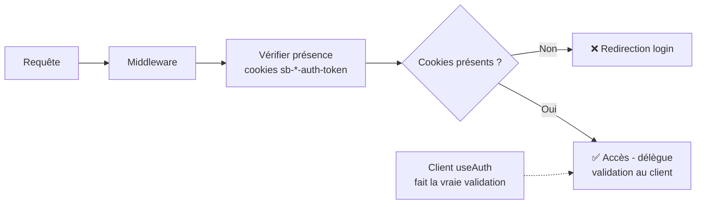

# 🔍 Analyse détaillée du Middleware et des Cookies Supabase

## 🍪 Pourquoi plusieurs cookies Supabase ?

### **Vos cookies actuels :**
```
sb-netethvyfpbscudpnnze-auth-token
sb-vqgiwtojibiutomvtkkv-auth-token-code-verifier  
sb-vqgiwtojibiutomvtkkv-auth-token
sb-gaueiohjxluzmultqxti-auth-token
sb-127-auth-token-code-verifier
```

### **Causes des multiples cookies :**

1. **🔄 Rechargements de développement**
   - Hot reload de Next.js crée de nouveaux clients Supabase
   - Chaque instance peut générer ses propres cookies
   - Les anciens ne sont pas forcément nettoyés

2. **🌍 Différents environnements**
   - `127` = localhost (127.0.0.1)
   - Les autres IDs = projets Supabase différents (dev/staging/prod)
   - Migration entre projets sans nettoyage

3. **📱 Types de cookies**
   - `auth-token` = session principale
   - `auth-token-code-verifier` = utilisé pour OAuth/PKCE flow
   - Différents flows d'authentification créent différents cookies

## 🛡️ Fonctionnement du Middleware

### **Ce que fait NOTRE middleware :**

```typescript
// 1. Intercepte TOUTES les requêtes vers le serveur
export async function middleware(request: NextRequest) {
  const { pathname } = request.nextUrl
  
  // 2. Filtre les routes publiques (pas de vérification)
  if (publicRoutes.includes(pathname)) return NextResponse.next()
  
  // 3. Identifie les routes protégées à sécuriser  
  if (!protectedRoutes.some(route => pathname.startsWith(route))) {
    return NextResponse.next()
  }
  
  // 4. Cherche des cookies d'auth Supabase
  const supabaseCookies = request.cookies.getAll().filter(cookie => 
    cookie.name.startsWith('sb-') && 
    cookie.name.includes('auth-token') && 
    !cookie.name.includes('code-verifier')
  )
  
  // 5. Décision : redirige ou laisse passer
  if (supabaseCookies.length === 0) {
    return NextResponse.redirect('/auth/login')
  }
  
  return NextResponse.next()
}
```

### **Ce que faisait l'ANCIEN middleware (problématique) :**

```typescript
// ❌ APPROCHE COMPLEXE QUI CAUSAIT LES PROBLÈMES
const supabase = createServerClient(/* config */)
const { data: { user }, error } = await supabase.auth.getUser() // 👈 REQUÊTE API

// Problème : Supabase côté serveur ne sait pas quel cookie utiliser
// Résultat : "Auth session missing!" même avec cookies présents
```

## 🔄 Différences entre les approches

### **🔴 Ancienne méthode (Validation côté serveur)**
```mermaid
graph LR
    A[Requête] --> B[Middleware]
    B --> C[Créer client Supabase]
    C --> D[API: getUser()]
    D --> E{User valide ?}
    E -->|Non| F[❌ Redirection login]
    E -->|Oui| G[✅ Accès]
    
    H[Problème: Multiple cookies<br/>conflictuels] -.-> D
```

**Problèmes :**
- Conflit entre multiples cookies
- Requête API coûteuse à chaque requête  
- Session non reconnue → boucles infinies

### **🟢 Nouvelle méthode (Présence de cookies)**


**Avantages :**
- Pas de conflit entre cookies
- Pas de requête API coûteuse
- Validation fine déléguée au client qui fonctionne

## 🎯 Résultat

**Le middleware actuel :**
- ✅ **Simple et efficace** : vérifie juste la présence d'auth
- ✅ **Compatible multi-cookies** : fonctionne avec vos 5 cookies
- ✅ **Délègue la validation** : laisse `useAuth` faire le vrai travail
- ✅ **Évite les conflits** : pas de tentative de validation serveur

**Sécurité maintenue :**
- Route protégée sans cookies → redirection login
- Cookies expirés/invalides → `useAuth` côté client gère
- Tentative d'accès non-auth → bloqué par absence de cookies
