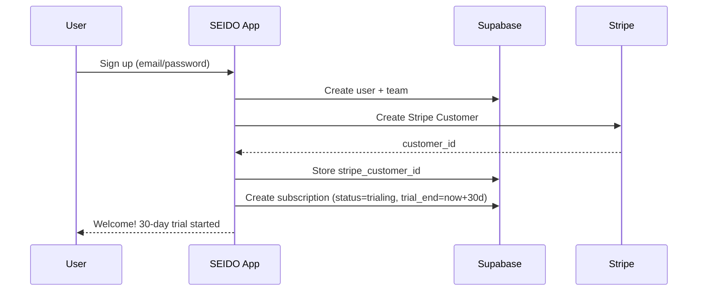
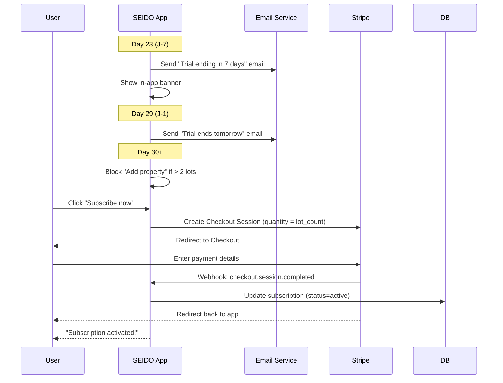
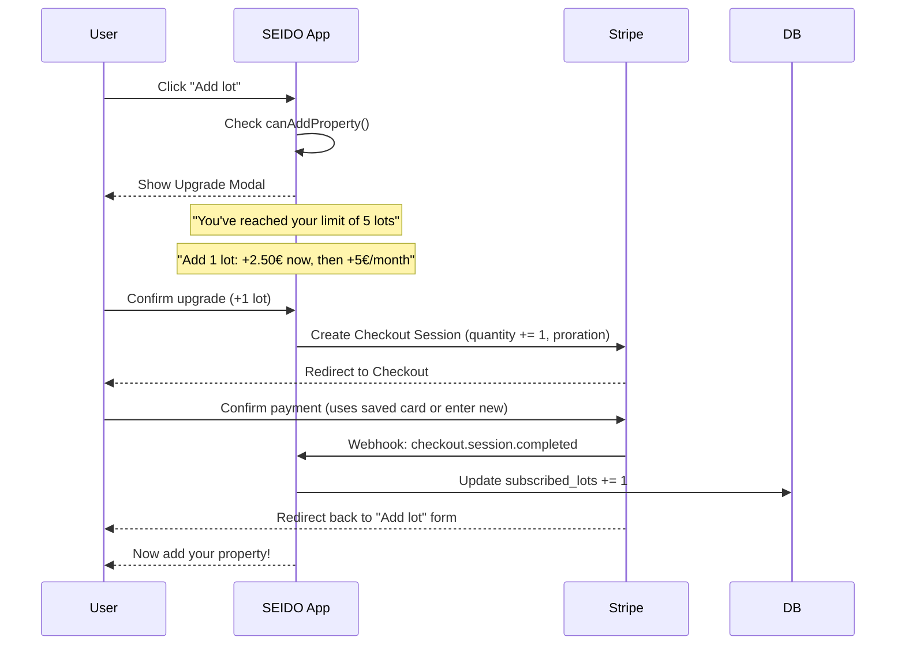
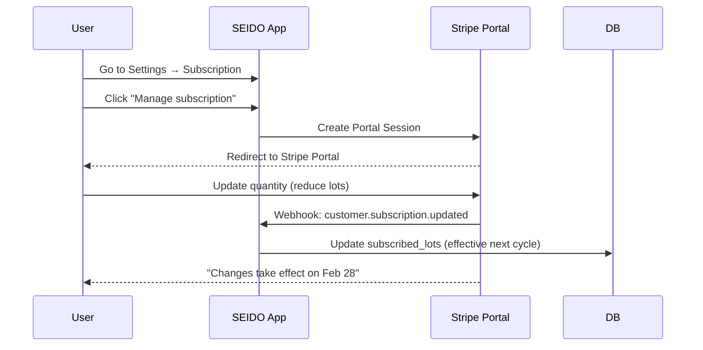

# Stripe Subscription Integration - Design Document

> **Status:** Draft - Ready for review
> **Date:** 2026-01-30
> **Author:** Claude Code (Brainstorming Session)

---

## 1. Executive Summary

### Objective
Implement a complete Stripe subscription system for SEIDO with:
- **Per-lot pricing:** 5€/lot/month or 50€/lot/year
- **Free tier:** 1-2 lots = free forever
- **30-day trial:** No credit card required
- **Smooth upgrade UX:** In-app popup when hitting limits

### Key User Flows
1. **Signup → Trial:** User signs up → Gets 30-day free trial (unlimited features)
2. **Trial End:** Day 23-29 → Email + banner alerts → Redirect to Stripe Checkout
3. **Add Property Beyond Limit:** Popup → Show prorated price → Stripe Checkout → Instant upgrade
4. **Manage Subscription:** Settings → Link to Stripe Customer Portal

---

## 2. Business Rules

### 2.1 Pricing Model

| Plan | Price per Lot | Billing |
|------|---------------|---------|
| Monthly | 5€/lot/month | Recurring monthly |
| Annual | 50€/lot/year (≈4.17€/month) | Recurring yearly |
| Free | 0€ | 1-2 lots, forever |

### 2.2 Billing Unit: LOTS (Not Buildings)

**Critical Rule:** Only **lots** are counted for billing.
- Buildings are organizational containers, NOT billing units
- A building with 10 lots = 10 billable units
- A standalone lot = 1 billable unit

```sql
-- Billing count formula
SELECT COUNT(*)
FROM lots
WHERE team_id = :team_id
  AND deleted_at IS NULL
```

### 2.3 Trial Period

| Aspect | Value |
|--------|-------|
| Duration | 30 days |
| Credit Card | NOT required at signup |
| Features | All features unlocked |
| Limit | No lot limit during trial |

### 2.4 Subscription Quantity Behavior

| Action | Effect | Billing |
|--------|--------|---------|
| **Add lot (within limit)** | Allowed | No change |
| **Add lot (over limit)** | Blocked → Upgrade popup | Prorated immediate charge |
| **Remove lot** | Subscription quantity unchanged | No refund/credit |
| **Reduce subscription** | User goes to Stripe Portal | Effective next cycle |

### 2.5 Free Tier Rules

- **Threshold:** ≤2 lots
- **Status:** `subscription_status = 'free_tier'` (custom status)
- **Features:** All features available (except AI/external APIs)
- **Upgrade Path:** Automatic when adding 3rd lot

---

## 3. Architecture

### 3.1 High-Level Flow

```
┌─────────────────────────────────────────────────────────────────────┐
│                           SEIDO App                                  │
├─────────────────────────────────────────────────────────────────────┤
│                                                                      │
│  ┌──────────────┐    ┌──────────────┐    ┌──────────────┐          │
│  │   Signup     │───▶│   Trial      │───▶│  Checkout    │          │
│  │   Flow       │    │   Period     │    │  (Day 30)    │          │
│  └──────────────┘    └──────────────┘    └──────────────┘          │
│         │                   │                   │                   │
│         ▼                   ▼                   ▼                   │
│  ┌──────────────────────────────────────────────────────┐          │
│  │              Subscription Service                     │          │
│  │  - checkTrialStatus()                                │          │
│  │  - canAddProperty()                                  │          │
│  │  - createCheckoutSession()                           │          │
│  │  - createUpgradeCheckoutSession()                    │          │
│  │  - createPortalSession()                             │          │
│  └──────────────────────────────────────────────────────┘          │
│                              │                                      │
└──────────────────────────────┼──────────────────────────────────────┘
                               │
                               ▼
┌─────────────────────────────────────────────────────────────────────┐
│                         Stripe API                                   │
├─────────────────────────────────────────────────────────────────────┤
│  Checkout Sessions │ Subscriptions │ Customer Portal │ Webhooks    │
└─────────────────────────────────────────────────────────────────────┘
                               │
                               ▼
┌─────────────────────────────────────────────────────────────────────┐
│                      Supabase Database                               │
├─────────────────────────────────────────────────────────────────────┤
│  stripe_customers │ subscriptions │ stripe_invoices │ teams         │
└─────────────────────────────────────────────────────────────────────┘
```

### 3.2 Database Schema

The database tables are already designed in `docs/architecture/optimal-database-architecture-rbac-subscriptions.md`. Key modifications needed:

#### 3.2.1 Update `subscriptions` Table

```sql
-- Add new columns for SEIDO-specific tracking
ALTER TABLE subscriptions ADD COLUMN IF NOT EXISTS
  subscribed_lots INTEGER NOT NULL DEFAULT 0;  -- User's subscribed quantity

-- Update billable_properties to only count lots
COMMENT ON COLUMN subscriptions.billable_properties IS
  'Actual lot count (buildings + standalone lots) - used for tracking, NOT billing';
```

#### 3.2.2 New Trigger for Lot Counting

```sql
-- Replace the existing trigger to ONLY count lots
CREATE OR REPLACE FUNCTION update_subscription_lot_count()
RETURNS TRIGGER AS $$
DECLARE
  v_team_id UUID;
  v_count INTEGER;
BEGIN
  IF TG_OP = 'DELETE' THEN
    v_team_id := OLD.team_id;
  ELSE
    v_team_id := NEW.team_id;
  END IF;

  -- Count ALL lots (both in buildings and standalone)
  SELECT COUNT(*) INTO v_count
  FROM lots
  WHERE team_id = v_team_id
    AND deleted_at IS NULL;

  -- Update subscription tracking (NOT the subscribed quantity)
  UPDATE subscriptions
  SET billable_properties = v_count,
      updated_at = NOW()
  WHERE team_id = v_team_id;

  RETURN COALESCE(NEW, OLD);
END;
$$ LANGUAGE plpgsql SECURITY DEFINER;

-- Drop old triggers and create new one
DROP TRIGGER IF EXISTS tr_buildings_subscription_count ON buildings;
DROP TRIGGER IF EXISTS tr_lots_subscription_count ON lots;

CREATE TRIGGER tr_lots_subscription_count
AFTER INSERT OR UPDATE OF deleted_at OR DELETE ON lots
FOR EACH ROW EXECUTE FUNCTION update_subscription_lot_count();
```

#### 3.2.3 Add `subscription_status` Enum Value

```sql
-- Add 'free_tier' status to the enum
ALTER TYPE subscription_status ADD VALUE IF NOT EXISTS 'free_tier';
```

### 3.3 Stripe Configuration

#### Products & Prices (to create in Stripe Dashboard)

| Product | Price ID Pattern | Amount | Interval |
|---------|------------------|--------|----------|
| SEIDO Monthly | `price_seido_monthly` | 500 cents (5€) | month |
| SEIDO Annual | `price_seido_annual` | 5000 cents (50€) | year |

**Price Configuration:**
- **Type:** Recurring
- **Usage type:** Licensed (not metered)
- **Billing scheme:** Per unit
- **Unit amount:** 500 cents (monthly) / 5000 cents (annual)

#### Webhook Events to Handle

| Event | Action |
|-------|--------|
| `checkout.session.completed` | Create/update subscription, activate team |
| `customer.subscription.created` | Sync subscription data |
| `customer.subscription.updated` | Update status, quantity, dates |
| `customer.subscription.deleted` | Mark as canceled, downgrade access |
| `invoice.paid` | Record successful payment |
| `invoice.payment_failed` | Send alert, mark as past_due |
| `customer.subscription.trial_will_end` | Trigger email notification |

---

## 4. Implementation Phases

### Phase 1: Foundation (Database + Stripe Setup)
1. Create Stripe products/prices in Dashboard
2. Run migration for schema updates
3. Set up webhook endpoint
4. Install `stripe` npm package

### Phase 2: Core Subscription Flow
1. Implement subscription service
2. Create Checkout Session API route
3. Handle webhooks
4. Sync subscription status with DB

### Phase 3: Trial Management
1. Auto-create trial subscription on signup
2. Implement trial status checking
3. Add trial end notification emails
4. Create in-app banner component

### Phase 4: Upgrade Flow (Limit Check)
1. Create `canAddProperty()` service method
2. Implement upgrade popup modal
3. Create upgrade Checkout Session
4. Handle immediate proration

### Phase 5: Customer Portal Integration
1. Create portal session API route
2. Add portal link to settings page
3. Configure portal in Stripe Dashboard

### Phase 6: UI Integration
1. Update settings page subscription section
2. Add trial status indicator to header
3. Implement property limit enforcement in forms

---

## 5. User Flows (Detailed)

### 5.1 Signup → Trial Flow



### 5.2 Trial End → Payment Flow



### 5.3 Add Property Beyond Limit Flow



### 5.4 Reduce Subscription Flow



---

## 6. API Endpoints

### 6.1 Server Actions / API Routes

| Endpoint | Method | Purpose |
|----------|--------|---------|
| `/api/stripe/checkout` | POST | Create Checkout Session for new subscription |
| `/api/stripe/checkout/upgrade` | POST | Create Checkout Session for quantity upgrade |
| `/api/stripe/portal` | POST | Create Customer Portal Session |
| `/api/stripe/webhook` | POST | Handle Stripe webhooks |

### 6.2 Server Actions (app/actions/subscription-actions.ts)

```typescript
// Actions for subscription management
export async function getSubscriptionStatus(teamId: string)
export async function canAddProperty(teamId: string): Promise<{allowed: boolean, reason?: string}>
export async function getUpgradePrice(teamId: string, additionalLots: number): Promise<{amount: number, currency: string}>
export async function createCheckoutSession(teamId: string, priceId: string, quantity: number)
export async function createUpgradeSession(teamId: string, additionalLots: number)
export async function createPortalSession(teamId: string)
```

---

## 7. Components

### 7.1 New Components to Create

| Component | Location | Purpose |
|-----------|----------|---------|
| `TrialBanner` | `components/billing/trial-banner.tsx` | Shows trial status in header |
| `UpgradeModal` | `components/billing/upgrade-modal.tsx` | Popup when hitting limit |
| `SubscriptionCard` | `components/billing/subscription-card.tsx` | Shows current plan in settings |
| `PricingPreview` | `components/billing/pricing-preview.tsx` | Shows proration preview |

### 7.2 Component Details

#### TrialBanner
```tsx
// Persistent banner at top of app during trial
// Shows: "Trial ends in X days" + CTA to subscribe
// Hidden after subscription is active
```

#### UpgradeModal
```tsx
// Triggered when user tries to add lot over limit
// Shows:
// - Current lot count vs limit
// - Price preview for upgrade
// - Quantity selector (+1, +5, +10)
// - "Upgrade now" button → Stripe Checkout
```

---

## 8. Email Templates

### 8.1 Trial Ending (J-7)

**Subject:** Votre période d'essai SEIDO se termine dans 7 jours

**Content:**
```
Bonjour {prenom},

Votre période d'essai gratuite de SEIDO se termine le {date_fin}.

Vous gérez actuellement {nb_lots} lots.
→ {nb_lots <= 2 ? "Bonne nouvelle ! Avec 2 lots ou moins, SEIDO reste gratuit." : `Pour continuer, votre abonnement sera de ${price}€/mois.`}

[Configurer mon abonnement]

L'équipe SEIDO
```

### 8.2 Trial Ending (J-1)

**Subject:** ⏰ Dernier jour d'essai SEIDO

**Content:**
```
Bonjour {prenom},

Votre période d'essai se termine demain.

Ne perdez pas l'accès à vos {nb_lots} lots et {nb_interventions} interventions.

[Activer mon abonnement maintenant]
```

---

## 9. Security Considerations

### 9.1 Webhook Verification
```typescript
// Always verify Stripe webhook signatures
const sig = headers['stripe-signature']
const event = stripe.webhooks.constructEvent(body, sig, webhookSecret)
```

### 9.2 RLS Policies
- Subscription data only visible to team managers
- Portal sessions scoped to authenticated user's team
- Checkout sessions validated server-side

### 9.3 Idempotency
- Webhook handlers must be idempotent
- Use Stripe event IDs to prevent duplicate processing

---

## 10. Testing Strategy

### 10.1 Test Scenarios

| Scenario | Test Method |
|----------|-------------|
| New subscription | Stripe test mode + Checkout |
| Trial expiration | Stripe Test Clocks |
| Upgrade mid-cycle | Test proration preview |
| Payment failure | Stripe test card 4000000000000341 |
| Webhook handling | Stripe CLI webhook forward |

### 10.2 Test Cards

| Card | Behavior |
|------|----------|
| 4242424242424242 | Success |
| 4000000000000341 | Card declined |
| 4000002500003155 | Requires 3D Secure |

---

## 11. Environment Variables

```env
# Stripe
STRIPE_SECRET_KEY=sk_test_xxx
STRIPE_PUBLISHABLE_KEY=pk_test_xxx
STRIPE_WEBHOOK_SECRET=whsec_xxx
STRIPE_PRICE_MONTHLY=price_xxx
STRIPE_PRICE_ANNUAL=price_xxx

# URLs
NEXT_PUBLIC_APP_URL=https://app.seido.be
```

---

## 12. Rollout Plan

### Phase A: Internal Testing (Week 1)
- Deploy to staging
- Test all flows with test cards
- Verify webhook handling

### Phase B: Beta Users (Week 2)
- Enable for select beta users
- Monitor Stripe Dashboard
- Collect feedback

### Phase C: General Availability (Week 3)
- Enable for all new signups
- Migrate existing beta users to trial
- Monitor conversion rates

---

## 13. Success Metrics

| Metric | Target |
|--------|--------|
| Trial → Paid conversion | >20% |
| Checkout abandonment | <30% |
| Payment failure rate | <5% |
| Upgrade flow completion | >80% |

---

---

## 14. Edge Cases & Scénarios Spéciaux

### 14.1 Multi-Team Users

**Scénario:** Un utilisateur appartient à plusieurs équipes (ex: gestionnaire freelance).

| Situation | Comportement |
|-----------|--------------|
| User switch team context | Subscription liée à la team, pas au user |
| Vérification limits | Toujours vérifier `team_id` du contexte actif |
| Dashboard | Afficher subscription de la team active |

**Règle:** La subscription est **toujours au niveau team**, jamais user.

### 14.2 Transition Free Tier → Payant

**Scénario:** User en free tier (2 lots) veut ajouter un 3ème lot.

```
User a 2 lots (free_tier)
  → Clic "Ajouter lot"
  → Upgrade Modal apparaît
  → "Passez à l'abonnement Pro pour ajouter plus de biens"
  → Checkout (quantity = 3, car minimum facturable)
  → Webhook: subscription.created (status=active, subscribed_lots=3)
```

**Important:** Le minimum facturable est **3 lots** (car 1-2 = gratuit).

### 14.3 Trial avec 0 lots puis ajout massif

**Scénario:** User démarre trial sans aucun bien, puis importe 50 lots via CSV.

| Phase | Comportement |
|-------|--------------|
| Pendant trial | Import autorisé sans limite |
| Fin trial | Checkout proposé avec quantity = 50 |
| Si abandon | Accès en lecture seule (pas de nouvelles interventions) |

### 14.4 Past Due Grace Period

**Scénario:** Paiement échoué, que se passe-t-il?

```
Day 0: invoice.payment_failed → status = past_due
Day 1-7: Grace period
  - App fonctionnelle
  - Banner rouge "Paiement échoué, mettez à jour votre carte"
  - Email de relance Day 1, 3, 5
Day 7: Si toujours impayé → status = unpaid
  - Blocage ajout lots/interventions
  - Données en lecture seule
Day 30: status = canceled
  - Export données proposé (GDPR)
```

### 14.5 Annulation & Rétention Données

**Scénario:** User annule son abonnement.

| Étape | Action |
|-------|--------|
| Annulation | cancel_at_period_end = true |
| Fin de période | status = canceled |
| Immédiat | Mode lecture seule si > 2 lots |
| J+30 après cancel | Email "Vos données seront supprimées dans 60 jours" |
| J+90 après cancel | Anonymisation données (GDPR) |
| Exception | Si ≤ 2 lots → Retour au free tier |

### 14.6 Changement de Plan (Annual ↔ Monthly)

**Scénario:** User veut passer de mensuel à annuel (ou inverse).

| Changement | Comportement |
|------------|--------------|
| Monthly → Annual | Crédit prorata mois en cours, facture annuelle |
| Annual → Monthly | Crédit prorata année, début mensuel |
| Via | Customer Portal Stripe uniquement |

### 14.7 Webhook Idempotency

**Problème:** Stripe peut renvoyer le même webhook plusieurs fois.

**Solution:**
```typescript
// Table pour tracking
CREATE TABLE stripe_webhook_events (
  event_id TEXT PRIMARY KEY,  -- Stripe event ID (evt_xxx)
  processed_at TIMESTAMP WITH TIME ZONE DEFAULT NOW()
);

// Dans le handler
const { data: existing } = await supabase
  .from('stripe_webhook_events')
  .select('event_id')
  .eq('event_id', event.id)
  .single()

if (existing) {
  return NextResponse.json({ received: true, duplicate: true })
}

await supabase.from('stripe_webhook_events').insert({ event_id: event.id })
```

### 14.8 TVA / Taxes (Belgique B2B)

**Règle:** SEIDO est B2B, donc TVA applicable.

| Configuration Stripe |
|---------------------|
| Tax behavior: `exclusive` (TVA ajoutée au prix affiché) |
| Tax rate: 21% (Belgique) |
| Automatic tax: Activé avec Stripe Tax |
| Reverse charge: Pour clients EU hors Belgique avec VAT ID |

**Affichage prix:**
- Landing page: "5€ HT/lot/mois"
- Checkout: Prix + TVA détaillée

### 14.9 Codes Promo & Réductions

**Types de promos prévues:**

| Code | Réduction | Conditions |
|------|-----------|------------|
| EARLY2026 | 3 mois gratuits | Early adopters |
| REFERRAL | 1 mois gratuit | Parrainage |
| ANNUAL20 | 20% sur annuel | Black Friday |

**Configuration:** Via Stripe Dashboard > Coupons

### 14.10 Remboursements

**Scénario:** Stripe émet un remboursement (via support ou dispute).

| Event | Action |
|-------|--------|
| `charge.refunded` | Log dans activity_logs |
| Refund partiel | Aucun changement subscription |
| Refund complet | Annuler subscription si demandé |
| Dispute ouvert | Alerter admin via email |

### 14.11 Concurrent Upgrade Race Condition

**Scénario:** Deux gestionnaires cliquent "Ajouter lot" en même temps.

**Solution:**
1. Vérification server-side AVANT Checkout
2. `SELECT ... FOR UPDATE` sur subscription
3. Si déjà en cours de checkout → Message "Upgrade en cours par un autre utilisateur"

### 14.12 Extension de Trial (Admin)

**Scénario:** Support veut étendre le trial d'un client.

**Solution:** Admin Dashboard ou Stripe Dashboard direct
```typescript
// Via Stripe API
await stripe.subscriptions.update(subscriptionId, {
  trial_end: Math.floor(newTrialEndDate.getTime() / 1000)
})
```

### 14.13 Pause Subscription

**Alternative à l'annulation:**

| Option | Implémentation |
|--------|----------------|
| Pause (Stripe native) | `pause_collection` API |
| Durée max | 3 mois |
| Pendant pause | Lecture seule, pas de facture |
| Reprise | Automatique ou manuelle |

---

## 15. Améliorations UX : Techniques de Conversion Éthiques

### 15.1 Indicateurs d'Urgence Légitimes

**Trial Banner amélioré:**

```tsx
// Progression visuelle
<div className="relative">
  <div className="h-1 bg-gray-200 rounded">
    <div
      className="h-1 bg-gradient-to-r from-green-500 to-red-500 rounded"
      style={{ width: `${(30 - daysLeft) / 30 * 100}%` }}
    />
  </div>
  <span className="text-sm">
    {daysLeft > 7
      ? `${daysLeft} jours restants`
      : daysLeft > 1
        ? `⚠️ Plus que ${daysLeft} jours !`
        : `🔴 Dernier jour !`
    }
  </span>
</div>
```

### 15.2 Loss Aversion Framing (Aversion à la perte)

**Message personnalisé basé sur l'usage:**

```tsx
// Dans UpgradeModal ou TrialBanner
const stats = await getTeamStats(teamId)

// Message dynamique
"Ne perdez pas l'accès à :"
• {stats.interventions_count} interventions en cours
• {stats.documents_count} documents importés
• {formatHours(stats.estimated_time_saved)} d'historique de travail
```

### 15.3 Value Anchoring (Ancrage de valeur)

**Calculateur d'économies dans Settings:**

```tsx
// Montrer la valeur créée
<Card className="bg-green-50 border-green-200">
  <CardHeader>
    <CardTitle className="text-green-800">
      Valeur créée avec SEIDO
    </CardTitle>
  </CardHeader>
  <CardContent>
    <div className="text-3xl font-bold text-green-600">
      ~{calculateTimeSaved(stats)}h économisées
    </div>
    <p className="text-sm text-green-700">
      Soit ~{calculateMoneySaved(stats)}€ de productivité
    </p>
    <p className="text-xs text-muted-foreground mt-2">
      Basé sur {stats.interventions_closed} interventions clôturées
      et un taux horaire moyen de 45€
    </p>
  </CardContent>
</Card>
```

### 15.4 Social Proof (Preuve sociale)

**Compteur dynamique sur Trial Banner:**

```tsx
<div className="flex items-center gap-2 text-sm text-white/80">
  <Users className="h-4 w-4" />
  <span>
    Rejoint par <strong>{activeCustomers}+</strong> gestionnaires ce mois
  </span>
</div>
```

### 15.5 Decoy Pricing (Prix d'ancrage)

**Mise en avant annuel:**

```tsx
// PricingCards amélioré
<div className="relative">
  {/* Badge "Économisez X€" plus visible */}
  <div className="absolute -top-3 -right-3 bg-green-500 text-white
                  px-3 py-1 rounded-full text-sm font-bold
                  animate-bounce">
    -{annualSavings}€/an
  </div>

  {/* Prix barré mensuel pour comparaison */}
  <div className="text-sm text-muted-foreground">
    <span className="line-through">{monthlyEquivalent}€/mois</span>
    <span className="ml-2 text-green-600 font-semibold">
      {annualMonthly}€/mois
    </span>
  </div>
</div>
```

### 15.6 Friction-Free Upgrade (Upgrade en 1 clic)

**Pour utilisateurs avec CB enregistrée:**

```tsx
// Si le user a déjà une payment method
const hasPaymentMethod = await checkPaymentMethod(customerId)

if (hasPaymentMethod) {
  // Upgrade direct via API (pas de redirect Checkout)
  <Button onClick={handleDirectUpgrade}>
    Ajouter 1 lot maintenant (+2,50€)
  </Button>
} else {
  // Redirect vers Checkout
  <Button onClick={handleCheckoutUpgrade}>
    Ajouter 1 lot →
  </Button>
}
```

### 15.7 Progress Indicators (Indicateurs de progression)

**Onboarding avec gamification:**

```tsx
// Checklist d'onboarding
const steps = [
  { id: 'profile', label: 'Compléter votre profil', done: true },
  { id: 'building', label: 'Ajouter votre premier immeuble', done: true },
  { id: 'lot', label: 'Créer un lot', done: true },
  { id: 'intervention', label: 'Première intervention', done: false },
  { id: 'provider', label: 'Inviter un prestataire', done: false },
]

// Badge de progression
<Badge variant="outline">
  {completedSteps}/{totalSteps} étapes complétées
</Badge>
```

### 15.8 Contextual Upgrade Prompts

**Messages contextuels selon l'action bloquée:**

```typescript
const upgradeMessages = {
  add_lot: {
    title: "Ajoutez plus de biens",
    description: "Débloquez la gestion illimitée de votre patrimoine",
    cta: "Passer à Pro"
  },
  add_intervention: {
    title: "Gérez toutes vos interventions",
    description: "Continuez à suivre vos travaux sans interruption",
    cta: "Continuer avec Pro"
  },
  export_data: {
    title: "Exportez vos données",
    description: "Téléchargez vos rapports et historiques",
    cta: "Débloquer l'export"
  }
}
```

### 15.9 Email Sequences Persuasives

**Séquence trial optimisée:**

| Jour | Email | Objectif |
|------|-------|----------|
| J+1 | "Bienvenue ! Voici comment démarrer" | Activation |
| J+7 | "Avez-vous essayé [feature]?" | Engagement |
| J+14 | "Vous avez économisé Xh cette semaine" | Valeur |
| J+21 | "[Prénom], votre essai se termine bientôt" | Urgence |
| J+27 | "Plus que 3 jours - ne perdez pas vos données" | Loss aversion |
| J+29 | "Dernier jour ! Gardez accès à [X] interventions" | FOMO |
| J+30 | "Votre essai est terminé" | Réactivation |
| J+33 | "Vous nous manquez - 20% offert" | Win-back |

### 15.10 In-App Notifications Stratégiques

**Moments clés pour notifier:**

```typescript
const strategicMoments = {
  // Après une action positive
  after_intervention_closed: {
    message: "Intervention clôturée ! Vous avez économisé ~30min.",
    showUpgrade: trialDaysLeft < 7
  },

  // Après usage intensif
  after_10_interventions: {
    message: "Déjà 10 interventions gérées ! 🎉",
    showUpgrade: true
  },

  // Quand proche de la limite
  at_90_percent_capacity: {
    message: "Vous utilisez 90% de votre quota",
    showUpgrade: true,
    urgency: 'high'
  }
}
```

---

## 16. Cohérence Design ↔ Implementation

### 16.1 Corrections identifiées

| Élément | Design Doc | Implementation Plan | Action |
|---------|------------|---------------------|--------|
| Emails J-7/J-1 | Prévu | Stub seulement | **Ajouter Phase Email** |
| Upgrade flow | Checkout Session | OK mais pas optimal | **Utiliser subscription.update pour users avec CB** |
| Free tier | "free forever" | Crée un trial | **Clarifier logique initiale** |
| Webhook idempotency | Mentionné | Pas implémenté | **Ajouter table + check** |
| TVA | Non mentionné | Non mentionné | **Ajouter config Stripe Tax** |
| Grace period | Non détaillé | Non implémenté | **Ajouter logique** |
| Admin tools | Non mentionné | Non prévu | **Ajouter extension trial** |

### 16.2 Tasks manquantes dans Implementation Plan

**À ajouter:**

1. **Task 3.2:** Table `stripe_webhook_events` pour idempotency
2. **Task 5.4:** Composant `ValueCalculator` pour settings
3. **Task 5.5:** Composant `UpgradePrompt` contextuel
4. **Phase 8:** Email automation (Resend ou Stripe built-in)
5. **Phase 9:** Admin tools (trial extension, manual subscription)

---

## 17. References

- [Stripe Subscriptions Documentation](https://docs.stripe.com/billing/subscriptions/build-subscriptions)
- [Stripe Prorations Guide](https://docs.stripe.com/billing/subscriptions/prorations)
- [Stripe Customer Portal](https://docs.stripe.com/billing/subscriptions/integrating-customer-portal)
- [Stripe Webhooks](https://docs.stripe.com/webhooks)
- [Stripe Tax (TVA)](https://docs.stripe.com/tax)
- [Stripe Dunning Management](https://docs.stripe.com/billing/revenue-recovery)
- [SEIDO Database Architecture](../architecture/optimal-database-architecture-rbac-subscriptions.md)
