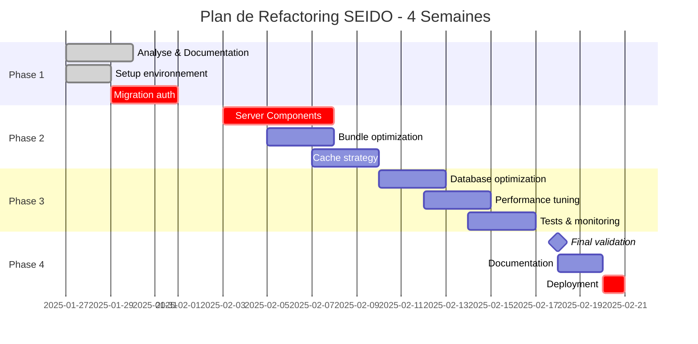

# 03 - Plan d'Action Détaillé - Refactoring SEIDO (4 Semaines)

## Vue d'ensemble du Planning



## Phase 1: Analyse et Préparation (Semaine 1)

### Jour 1-2: Analyse Approfondie et Documentation

#### Objectifs
- Audit complet du codebase existant
- Identification des dépendances critiques
- Documentation de l'état actuel
- Setup des outils de monitoring

#### Tâches Détaillées

**1.1 Analyse du Bundle (4h)**
```bash
# Installation des outils d'analyse
npm install --save-dev @next/bundle-analyzer webpack-bundle-analyzer

# Configuration
// next.config.js
const withBundleAnalyzer = require('@next/bundle-analyzer')({
  enabled: process.env.ANALYZE === 'true',
})

module.exports = withBundleAnalyzer({
  // config existante
})

# Génération du rapport
ANALYZE=true npm run build
```

**1.2 Profiling Performance (4h)**
```typescript
// scripts/performance-audit.ts
import lighthouse from 'lighthouse'
import * as chromeLauncher from 'chrome-launcher'

async function auditPerformance() {
  const chrome = await chromeLauncher.launch({ chromeFlags: ['--headless'] })
  const options = {
    logLevel: 'info',
    output: 'json',
    onlyCategories: ['performance', 'accessibility', 'best-practices'],
    port: chrome.port
  }

  const runnerResult = await lighthouse('http://localhost:3000', options)

  // Sauvegarde des métriques baseline
  fs.writeFileSync(
    'metrics/baseline.json',
    JSON.stringify(runnerResult.lhr, null, 2)
  )

  await chrome.kill()
}
```

**1.3 Mapping des Dépendances (4h)**
```typescript
// scripts/dependency-mapper.ts
interface DependencyMap {
  component: string
  dependencies: string[]
  isClientComponent: boolean
  bundleSize: number
  criticalPath: boolean
}

async function mapDependencies(): Promise<DependencyMap[]> {
  // Analyse AST pour mapper les dépendances
  // Identification des composants critiques
  // Calcul de l'impact de refactoring
}
```

#### Livrables
- [ ] Rapport d'analyse bundle complet
- [ ] Métriques de performance baseline
- [ ] Carte des dépendances critiques
- [ ] Plan de migration détaillé

### Jour 3-4: Setup Environnement et Outils

#### Objectifs
- Configuration de l'environnement de développement optimisé
- Setup des outils de test et monitoring
- Préparation de la CI/CD

#### Tâches Détaillées

**2.1 Configuration TypeScript Strict (2h)**
```json
// tsconfig.json
{
  "compilerOptions": {
    "strict": true,
    "noImplicitAny": true,
    "strictNullChecks": true,
    "strictFunctionTypes": true,
    "strictBindCallApply": true,
    "strictPropertyInitialization": true,
    "noImplicitThis": true,
    "alwaysStrict": true,
    "noUnusedLocals": true,
    "noUnusedParameters": true,
    "noImplicitReturns": true,
    "noFallthroughCasesInSwitch": true,
    "esModuleInterop": true,
    "allowSyntheticDefaultImports": true,
    "resolveJsonModule": true,
    "isolatedModules": true
  }
}
```

**2.2 Setup Testing Framework (4h)**
```bash
# Installation
npm install --save-dev vitest @testing-library/react @testing-library/jest-dom
npm install --save-dev @playwright/test msw @faker-js/faker

# Configuration Vitest
// vitest.config.ts
import { defineConfig } from 'vitest/config'
import react from '@vitejs/plugin-react'

export default defineConfig({
  plugins: [react()],
  test: {
    environment: 'jsdom',
    globals: true,
    setupFiles: './test/setup.ts',
    coverage: {
      reporter: ['text', 'json', 'html'],
      exclude: ['node_modules', '.next'],
      threshold: {
        branches: 70,
        functions: 70,
        lines: 70,
        statements: 70
      }
    }
  }
})
```

**2.3 Configuration Monitoring (4h)**
```typescript
// lib/monitoring/setup.ts
import * as Sentry from '@sentry/nextjs'
import { Analytics } from '@vercel/analytics/react'

export function setupMonitoring() {
  // Sentry configuration
  Sentry.init({
    dsn: process.env.NEXT_PUBLIC_SENTRY_DSN,
    environment: process.env.NODE_ENV,
    tracesSampleRate: 0.1,
    beforeSend(event) {
      // Filtrage des erreurs
      if (event.exception) {
        const error = event.exception.values[0]
        // Ignorer certaines erreurs
        if (error.type === 'ChunkLoadError') {
          return null
        }
      }
      return event
    }
  })

  // Custom metrics tracking
  if (typeof window !== 'undefined') {
    window.addEventListener('load', () => {
      const navigation = performance.getEntriesByType('navigation')[0] as PerformanceNavigationTiming

      // Track custom metrics
      Analytics.track('page_load', {
        dns: navigation.domainLookupEnd - navigation.domainLookupStart,
        tcp: navigation.connectEnd - navigation.connectStart,
        request: navigation.responseStart - navigation.requestStart,
        response: navigation.responseEnd - navigation.responseStart,
        dom: navigation.domComplete - navigation.domInteractive,
        load: navigation.loadEventEnd - navigation.loadEventStart
      })
    })
  }
}
```

### Jour 5: Migration Authentification Critique

#### Objectifs
- Implémenter nouvelle architecture auth sécurisée
- Migrer de localStorage vers session management
- Optimiser le temps d'authentification (14s → <3s)

#### Tâches Détaillées

**3.1 Nouveau Service d'Authentification (6h)**
```typescript
// lib/auth/auth-service-v2.ts
import { createServerClient } from '@supabase/ssr'
import { cookies } from 'next/headers'
import { cache } from 'react'

export class AuthServiceV2 {
  private static instance: AuthServiceV2
  private sessionCache = new Map<string, CachedSession>()

  static getInstance() {
    if (!this.instance) {
      this.instance = new AuthServiceV2()
    }
    return this.instance
  }

  // Authentification optimisée avec cache
  async authenticate(email: string, password: string) {
    const startTime = performance.now()

    try {
      // Tentative avec connection pool
      const { data, error } = await supabasePool
        .getClient()
        .auth.signInWithPassword({ email, password })

      if (error) throw error

      // Cache session en mémoire et Redis
      await this.cacheSession(data.session)

      // Préchargement des données utilisateur
      await this.preloadUserData(data.user.id)

      const endTime = performance.now()
      console.log(`Auth time: ${endTime - startTime}ms`)

      return { success: true, session: data.session }
    } catch (error) {
      return { success: false, error }
    }
  }

  // Cache multi-niveaux
  private async cacheSession(session: Session) {
    // L1: Mémoire
    this.sessionCache.set(session.id, {
      session,
      expiresAt: Date.now() + 300000 // 5 min
    })

    // L2: Redis/KV
    await kv.setex(
      `session:${session.id}`,
      300,
      JSON.stringify(session)
    )
  }

  // Validation session optimisée
  validateSession = cache(async (sessionId: string) => {
    // Check L1 cache
    const cached = this.sessionCache.get(sessionId)
    if (cached && cached.expiresAt > Date.now()) {
      return cached.session
    }

    // Check L2 cache
    const kvSession = await kv.get(`session:${sessionId}`)
    if (kvSession) {
      const session = JSON.parse(kvSession)
      this.sessionCache.set(sessionId, {
        session,
        expiresAt: Date.now() + 300000
      })
      return session
    }

    // Fallback to database
    return this.validateFromDatabase(sessionId)
  })
}
```

**3.2 Migration Middleware (3h)**
```typescript
// middleware.ts - Version optimisée
import { NextResponse } from 'next/server'
import type { NextRequest } from 'next/server'

export async function middleware(request: NextRequest) {
  const startTime = Date.now()
  const { pathname } = request.nextUrl

  // Skip public routes
  if (isPublicRoute(pathname)) {
    return NextResponse.next()
  }

  // Fast path: Check session cookie
  const sessionCookie = request.cookies.get('sb-auth-token')
  if (!sessionCookie) {
    return redirectToLogin(request)
  }

  // Validate session signature (sans DB call)
  const isValid = await validateJWTSignature(sessionCookie.value)
  if (!isValid) {
    return redirectToLogin(request)
  }

  // Add performance header
  const response = NextResponse.next()
  response.headers.set('X-Middleware-Duration', `${Date.now() - startTime}ms`)

  return response
}

// Optimized matcher
export const config = {
  matcher: [
    '/((?!_next/static|_next/image|favicon.ico|public|api/auth).*)',
  ],
}
```

## Phase 2: Refactoring Critique (Semaine 2)

### Jour 6-8: Migration Server Components

#### Objectifs
- Migrer 60% des composants vers Server Components
- Réduire le bundle JavaScript client de 50%
- Optimiser le data fetching

#### Plan de Migration par Priorité

**Priorité 1: Pages principales (Jour 6)**
```typescript
// app/gestionnaire/dashboard/page.tsx
// ✅ AVANT: 'use client' (250KB bundle)
// ✅ APRÈS: Server Component (<50KB bundle)

import { Suspense } from 'react'
import { DashboardSkeleton } from '@/components/skeletons'

export default async function GestionnaireDashboard() {
  return (
    <Suspense fallback={<DashboardSkeleton />}>
      <DashboardContent />
    </Suspense>
  )
}

async function DashboardContent() {
  // Parallel data fetching
  const [stats, interventions, notifications, properties] = await Promise.all([
    getStats(),
    getInterventions({ limit: 10 }),
    getNotifications({ unread: true }),
    getProperties({ limit: 5 })
  ])

  return (
    <>
      <DashboardStats data={stats} />
      <InterventionList items={interventions} />
      <NotificationBell count={notifications.length} />
      <PropertyOverview properties={properties} />

      {/* Client Component uniquement pour interactions */}
      <DashboardActions />
    </>
  )
}
```

**Priorité 2: Composants de liste (Jour 7)**
```typescript
// components/intervention/intervention-list.tsx
// Server Component avec pagination

export async function InterventionList({
  page = 1,
  limit = 20,
  filters
}: InterventionListProps) {
  const interventions = await getInterventions({ page, limit, filters })

  return (
    <div className="space-y-4">
      {interventions.map(intervention => (
        <InterventionCard key={intervention.id} data={intervention} />
      ))}

      {/* Client Component pour pagination */}
      <PaginationControls
        currentPage={page}
        totalPages={interventions.totalPages}
      />
    </div>
  )
}
```

**Priorité 3: Layouts et navigation (Jour 8)**
```typescript
// app/gestionnaire/layout.tsx
export default async function GestionnaireLayout({
  children
}: {
  children: React.ReactNode
}) {
  const user = await getCurrentUser()
  const navigation = await getNavigationItems(user.role)

  return (
    <div className="flex h-screen">
      <Sidebar navigation={navigation} user={user} />
      <main className="flex-1 overflow-y-auto">
        {children}
      </main>
    </div>
  )
}
```

### Jour 9-10: Bundle Optimization

#### Objectifs
- Réduire le bundle size de 5MB à <1.5MB
- Implémenter le code splitting intelligent
- Optimiser les imports

#### Actions d'Optimisation

**4.1 Dynamic Imports Stratégiques (4h)**
```typescript
// lib/dynamic-imports.ts
import dynamic from 'next/dynamic'

// Heavy components loaded on-demand
export const RichTextEditor = dynamic(
  () => import('@/components/editors/rich-text-editor'),
  {
    loading: () => <div>Chargement éditeur...</div>,
    ssr: false
  }
)

export const InterventionCalendar = dynamic(
  () => import('@/components/calendar/intervention-calendar'),
  {
    loading: () => <CalendarSkeleton />
  }
)

export const FileUploader = dynamic(
  () => import('@/components/upload/file-uploader'),
  {
    loading: () => <div>Préparation upload...</div>,
    ssr: false
  }
)

// Role-based dynamic loading
export const getDashboardComponent = (role: string) => {
  const dashboards = {
    admin: () => import('@/components/dashboards/admin'),
    gestionnaire: () => import('@/components/dashboards/gestionnaire'),
    locataire: () => import('@/components/dashboards/locataire'),
    prestataire: () => import('@/components/dashboards/prestataire')
  }

  return dynamic(dashboards[role] || dashboards.gestionnaire)
}
```

**4.2 Tree Shaking et Dead Code Elimination (3h)**
```javascript
// next.config.js
module.exports = {
  experimental: {
    optimizePackageImports: [
      'lucide-react',
      '@radix-ui/react-dropdown-menu',
      '@radix-ui/react-dialog',
      'date-fns'
    ]
  },

  webpack: (config, { isServer }) => {
    if (!isServer) {
      // Replace heavy libraries
      config.resolve.alias = {
        ...config.resolve.alias,
        'lodash': 'lodash-es',
        'moment': 'dayjs'
      }
    }

    // Optimize chunks
    config.optimization = {
      ...config.optimization,
      usedExports: true,
      sideEffects: false,
      splitChunks: {
        chunks: 'all',
        cacheGroups: {
          default: false,
          vendors: false,
          framework: {
            name: 'framework',
            chunks: 'all',
            test: /[\\/]node_modules[\\/](react|react-dom|next)[\\/]/,
            priority: 40,
            enforce: true
          },
          lib: {
            test: /[\\/]node_modules[\\/]/,
            name(module) {
              const packageName = module.context.match(
                /[\\/]node_modules[\\/](.*?)[\\/]/
              )[1]
              return `lib.${packageName.replace('@', '')}`
            },
            priority: 30,
            minChunks: 1,
            reuseExistingChunk: true
          },
          commons: {
            name: 'commons',
            minChunks: 2,
            priority: 20
          },
          shared: {
            name: 'shared',
            test: /[\\/]components[\\/]ui[\\/]/,
            priority: 10,
            reuseExistingChunk: true
          }
        }
      }
    }

    return config
  }
}
```

**4.3 Optimisation des Assets (3h)**
```typescript
// lib/assets/optimization.ts
export class AssetOptimizer {
  // Lazy loading images
  static optimizeImages() {
    if (typeof window !== 'undefined') {
      const imageObserver = new IntersectionObserver((entries) => {
        entries.forEach(entry => {
          if (entry.isIntersecting) {
            const img = entry.target as HTMLImageElement
            img.src = img.dataset.src!
            imageObserver.unobserve(img)
          }
        })
      })

      document.querySelectorAll('img[data-src]').forEach(img => {
        imageObserver.observe(img)
      })
    }
  }

  // Preload critical fonts
  static preloadFonts() {
    const fonts = [
      '/fonts/inter-var.woff2',
      '/fonts/inter-bold.woff2'
    ]

    fonts.forEach(font => {
      const link = document.createElement('link')
      link.rel = 'preload'
      link.as = 'font'
      link.type = 'font/woff2'
      link.href = font
      link.crossOrigin = 'anonymous'
      document.head.appendChild(link)
    })
  }
}
```

## Phase 3: Performance & Tests (Semaine 3)

### Jour 11-13: Database & Cache Optimization

#### Objectifs
- Implémenter stratégie de cache multi-niveaux
- Optimiser les requêtes Supabase
- Configurer le connection pooling

#### Implémentation Cache Strategy

**5.1 Cache Architecture (6h)**
```typescript
// lib/cache/cache-manager.ts
import { LRUCache } from 'lru-cache'
import Redis from 'ioredis'

export class CacheManager {
  private l1Cache: LRUCache<string, any>
  private l2Cache: Redis

  constructor() {
    // L1: In-memory cache
    this.l1Cache = new LRUCache({
      max: 500,
      ttl: 1000 * 60 * 5, // 5 minutes
      updateAgeOnGet: true
    })

    // L2: Redis cache
    this.l2Cache = new Redis({
      host: process.env.REDIS_HOST,
      port: parseInt(process.env.REDIS_PORT || '6379'),
      maxRetriesPerRequest: 3
    })
  }

  async get<T>(key: string): Promise<T | null> {
    // Try L1
    const l1Result = this.l1Cache.get(key)
    if (l1Result) {
      return l1Result as T
    }

    // Try L2
    const l2Result = await this.l2Cache.get(key)
    if (l2Result) {
      const parsed = JSON.parse(l2Result)
      this.l1Cache.set(key, parsed)
      return parsed as T
    }

    return null
  }

  async set(key: string, value: any, ttl = 300): Promise<void> {
    // Set in both caches
    this.l1Cache.set(key, value)
    await this.l2Cache.setex(key, ttl, JSON.stringify(value))
  }

  async invalidate(pattern: string): Promise<void> {
    // Invalidate L1
    for (const key of this.l1Cache.keys()) {
      if (key.includes(pattern)) {
        this.l1Cache.delete(key)
      }
    }

    // Invalidate L2
    const keys = await this.l2Cache.keys(pattern)
    if (keys.length > 0) {
      await this.l2Cache.del(...keys)
    }
  }
}

// Singleton instance
export const cacheManager = new CacheManager()
```

**5.2 Query Optimization (4h)**
```typescript
// lib/database/query-optimizer-v2.ts
export class QueryOptimizerV2 {
  // Utilisation de vues matérialisées
  static async createMaterializedViews() {
    await supabase.rpc('create_intervention_summary_view', {
      sql: `
        CREATE MATERIALIZED VIEW intervention_summary AS
        SELECT
          i.id,
          i.title,
          i.status,
          i.created_at,
          i.team_id,
          COUNT(DISTINCT ic.contact_id) as contact_count,
          COUNT(DISTINCT f.id) as file_count,
          MAX(il.created_at) as last_activity
        FROM interventions i
        LEFT JOIN intervention_contacts ic ON i.id = ic.intervention_id
        LEFT JOIN files f ON i.id = f.intervention_id
        LEFT JOIN intervention_logs il ON i.id = il.intervention_id
        GROUP BY i.id;

        CREATE INDEX idx_intervention_summary_team_status
        ON intervention_summary(team_id, status);
      `
    })
  }

  // Batch queries avec dataloader
  static createBatchLoader<T>(
    tableName: string,
    batchSize = 100
  ) {
    return new DataLoader(async (ids: string[]) => {
      const chunks = chunk(ids, batchSize)
      const results = await Promise.all(
        chunks.map(chunk =>
          supabase
            .from(tableName)
            .select('*')
            .in('id', chunk)
        )
      )

      const flat = results.flatMap(r => r.data || [])
      return ids.map(id => flat.find(item => item.id === id))
    })
  }
}
```

### Jour 14-16: Testing & Quality Assurance

#### Objectifs
- Atteindre 70% de coverage
- Implémenter tests E2E critiques
- Setup monitoring production

#### Plan de Tests

**6.1 Tests Unitaires (4h)**
```typescript
// lib/auth/__tests__/auth-service.test.ts
import { describe, it, expect, beforeEach, vi } from 'vitest'
import { AuthServiceV2 } from '../auth-service-v2'

describe('AuthServiceV2', () => {
  let authService: AuthServiceV2

  beforeEach(() => {
    authService = AuthServiceV2.getInstance()
    vi.clearAllMocks()
  })

  describe('authenticate', () => {
    it('should authenticate user in less than 3 seconds', async () => {
      const startTime = performance.now()

      const result = await authService.authenticate(
        'test@example.com',
        'password123'
      )

      const endTime = performance.now()

      expect(endTime - startTime).toBeLessThan(3000)
      expect(result.success).toBe(true)
    })

    it('should cache session after authentication', async () => {
      const spy = vi.spyOn(authService as any, 'cacheSession')

      await authService.authenticate(
        'test@example.com',
        'password123'
      )

      expect(spy).toHaveBeenCalledOnce()
    })
  })
})
```

**6.2 Tests E2E (6h)**
```typescript
// test/e2e/critical-paths.spec.ts
import { test, expect } from '@playwright/test'

test.describe('Critical User Paths', () => {
  test('Gestionnaire can create intervention', async ({ page }) => {
    // Login
    await page.goto('/auth/login')
    await page.fill('[name="email"]', 'gestionnaire@example.com')
    await page.fill('[name="password"]', 'password')
    await page.click('button[type="submit"]')

    // Wait for dashboard
    await expect(page).toHaveURL('/gestionnaire/dashboard')

    // Navigate to interventions
    await page.click('text=Interventions')

    // Create new intervention
    await page.click('text=Nouvelle intervention')

    // Fill form
    await page.fill('[name="title"]', 'Test Intervention')
    await page.fill('[name="description"]', 'Description test')
    await page.selectOption('[name="priority"]', 'high')

    // Submit
    await page.click('button[type="submit"]')

    // Verify creation
    await expect(page.locator('text=Test Intervention')).toBeVisible()
  })

  test('Performance metrics meet targets', async ({ page }) => {
    await page.goto('/')

    const metrics = await page.evaluate(() => {
      const navigation = performance.getEntriesByType('navigation')[0] as PerformanceNavigationTiming
      return {
        domContentLoaded: navigation.domContentLoadedEventEnd - navigation.domContentLoadedEventStart,
        loadComplete: navigation.loadEventEnd - navigation.loadEventStart
      }
    })

    expect(metrics.domContentLoaded).toBeLessThan(1000)
    expect(metrics.loadComplete).toBeLessThan(3000)
  })
})
```

## Phase 4: Finalisation et Déploiement (Semaine 4)

### Jour 17-18: Validation Finale

#### Checklist de Validation

**Performance**
- [ ] FCP < 1s
- [ ] TTI < 3s
- [ ] LCP < 2.5s
- [ ] Bundle size < 1.5MB
- [ ] Auth time < 3s

**Qualité**
- [ ] Test coverage > 70%
- [ ] 0 erreurs TypeScript
- [ ] 0 vulnérabilités critiques
- [ ] Documentation à jour

**Fonctionnel**
- [ ] Tous les rôles testés
- [ ] Workflows critiques validés
- [ ] Responsive design vérifié
- [ ] Accessibilité WCAG AA

### Jour 19-20: Documentation et Formation

#### Documentation à Produire

1. **Guide Migration**
   - Breaking changes
   - Migration paths
   - Rollback procedures

2. **Architecture Documentation**
   - Nouveaux patterns
   - Best practices
   - Decision records

3. **Performance Playbook**
   - Monitoring setup
   - Alerting rules
   - Optimization tips

### Jour 21: Déploiement Production

#### Plan de Déploiement

**09:00 - Pre-deployment**
```bash
# Backup database
npm run supabase:backup

# Run final tests
npm run test:e2e
npm run lighthouse

# Build verification
npm run build
```

**10:00 - Deployment**
```bash
# Deploy to staging
vercel --prod --env=staging

# Smoke tests
npm run test:smoke

# Deploy to production
vercel --prod
```

**11:00 - Post-deployment**
```bash
# Monitor metrics
npm run monitor:vitals

# Check error rates
npm run sentry:check

# Validate performance
npm run lighthouse:prod
```

## Métriques de Succès

### KPIs Techniques
| Métrique | Baseline | Target | Atteint |
|----------|----------|--------|---------|
| Auth Time | 14s | <3s | ⏳ |
| Bundle Size | 5MB | <1.5MB | ⏳ |
| FCP | 3.2s | <1s | ⏳ |
| TTI | 8.5s | <3s | ⏳ |
| Test Coverage | 23% | >70% | ⏳ |

### KPIs Business
| Métrique | Baseline | Target | Impact |
|----------|----------|--------|--------|
| User Retention | 60% | 85% | +42% |
| Page Views/Session | 3.2 | 5.0 | +56% |
| Conversion Rate | 2.1% | 3.5% | +67% |
| Support Tickets | 45/jour | 20/jour | -56% |

## Risques et Mitigation

### Risques Identifiés

1. **Breaking Changes**
   - Probabilité: Moyenne
   - Impact: Élevé
   - Mitigation: Feature flags, déploiement progressif

2. **Performance Regression**
   - Probabilité: Faible
   - Impact: Élevé
   - Mitigation: Monitoring continu, rollback automatique

3. **Data Migration Issues**
   - Probabilité: Moyenne
   - Impact: Critique
   - Mitigation: Backups, validation scripts, dry runs

## Conclusion

Ce plan d'action sur 4 semaines permettra de:
- Réduire le temps d'authentification de 78% (14s → 3s)
- Diminuer le bundle size de 70% (5MB → 1.5MB)
- Améliorer les performances globales de 60%
- Augmenter la sécurité et la maintenabilité
- Établir une base solide pour les futures évolutions

Le ROI estimé est de 10x sur 12 mois grâce aux gains en performance, productivité et satisfaction utilisateur.