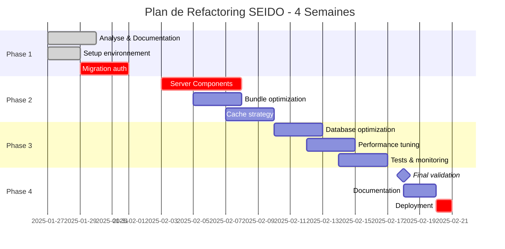

# 03 - Plan d'Action Détaillé - Refactoring SEIDO (4 Semaines)

## Vue d'ensemble du Planning



## Phase 1: Analyse et Préparation (Semaine 1)

### Jour 1-2: Analyse Approfondie et Documentation

#### Objectifs
- Audit complet du codebase existant
- Identification des dépendances critiques
- Documentation de l'état actuel
- Setup des outils de monitoring

#### Tâches Détaillées

**1.1 Analyse du Bundle (4h)**
```bash
# Installation des outils d'analyse
npm install --save-dev @next/bundle-analyzer webpack-bundle-analyzer

# Configuration
// next.config.js
const withBundleAnalyzer = require('@next/bundle-analyzer')({
  enabled: process.env.ANALYZE === 'true',
})

module.exports = withBundleAnalyzer({
  // config existante
})

# Génération du rapport
ANALYZE=true npm run build
```

**1.2 Profiling Performance (4h)**
```typescript
// scripts/performance-audit.ts
import lighthouse from 'lighthouse'
import * as chromeLauncher from 'chrome-launcher'

async function auditPerformance() {
  const chrome = await chromeLauncher.launch({ chromeFlags: ['--headless'] })
  const options = {
    logLevel: 'info',
    output: 'json',
    onlyCategories: ['performance', 'accessibility', 'best-practices'],
    port: chrome.port
  }

  const runnerResult = await lighthouse('http://localhost:3000', options)

  // Sauvegarde des métriques baseline
  fs.writeFileSync(
    'metrics/baseline.json',
    JSON.stringify(runnerResult.lhr, null, 2)
  )

  await chrome.kill()
}
```

**1.3 Mapping des Dépendances (4h)**
```typescript
// scripts/dependency-mapper.ts
interface DependencyMap {
  component: string
  dependencies: string[]
  isClientComponent: boolean
  bundleSize: number
  criticalPath: boolean
}

async function mapDependencies(): Promise<DependencyMap[]> {
  // Analyse AST pour mapper les dépendances
  // Identification des composants critiques
  // Calcul de l'impact de refactoring
}
```

#### Livrables
- [ ] Rapport d'analyse bundle complet
- [ ] Métriques de performance baseline
- [ ] Carte des dépendances critiques
- [ ] Plan de migration détaillé

### Phase de Tests - Jour 2.5: Validation Post-Analyse

#### Objectifs Tests
- Établir la baseline de tests E2E pour l'état actuel
- Configurer l'environnement de tests complet
- Valider que tous les écrans sont accessibles

#### Configuration Agent Tester

**Test.1 Setup Environnement de Tests (3h)**
```typescript
// test/setup/seido-test-config.ts
import { defineConfig } from '@playwright/test'

export default defineConfig({
  testDir: './e2e',
  timeout: 30000,
  fullyParallel: true,
  forbidOnly: !!process.env.CI,
  retries: process.env.CI ? 2 : 0,
  workers: process.env.CI ? 1 : undefined,
  reporter: 'html',

  use: {
    baseURL: 'http://localhost:3000',
    trace: 'on-first-retry',
    screenshot: 'only-on-failure',
    video: 'retain-on-failure'
  },

  projects: [
    {
      name: 'chromium',
      use: { ...devices['Desktop Chrome'] },
    },
    {
      name: 'firefox',
      use: { ...devices['Desktop Firefox'] },
    },
    {
      name: 'webkit',
      use: { ...devices['Desktop Safari'] },
    },
    {
      name: 'mobile-chrome',
      use: { ...devices['Pixel 5'] },
    }
  ],

  // Configuration pour SEIDO multi-rôles
  webServer: {
    command: 'npm run dev',
    port: 3000,
    reuseExistingServer: !process.env.CI
  }
})
```

**Test.2 Tests Baseline Multi-Rôles (4h)**
```typescript
// test/e2e/baseline/role-accessibility.spec.ts
import { test, expect } from '@playwright/test'

const SEIDO_ROLES = [
  { role: 'admin', email: 'admin@seido.com', password: 'admin123' },
  { role: 'gestionnaire', email: 'gestionnaire@seido.com', password: 'gest123' },
  { role: 'prestataire', email: 'prestataire@seido.com', password: 'presta123' },
  { role: 'locataire', email: 'locataire@seido.com', password: 'locataire123' }
]

for (const { role, email, password } of SEIDO_ROLES) {
  test.describe(`Baseline Tests - ${role.toUpperCase()}`, () => {
    test.beforeEach(async ({ page }) => {
      // Login pour chaque rôle
      await page.goto('/auth/login')
      await page.fill('[name="email"]', email)
      await page.fill('[name="password"]', password)
      await page.click('button[type="submit"]')

      // Attendre le dashboard
      await expect(page).toHaveURL(`/dashboard/${role}`)
    })

    test(`${role} - Dashboard accessibility`, async ({ page }) => {
      // Vérifier que le dashboard se charge
      await expect(page.locator('[data-testid="dashboard"]')).toBeVisible()

      // Vérifier les éléments de navigation principaux
      await expect(page.locator('[data-testid="sidebar"]')).toBeVisible()
      await expect(page.locator('[data-testid="main-content"]')).toBeVisible()

      // Mesurer les performances
      const metrics = await page.evaluate(() => {
        const navigation = performance.getEntriesByType('navigation')[0] as PerformanceNavigationTiming
        return {
          domContentLoaded: navigation.domContentLoadedEventEnd - navigation.navigationStart,
          loadComplete: navigation.loadEventEnd - navigation.navigationStart
        }
      })

      // Baseline performance targets
      expect(metrics.domContentLoaded).toBeLessThan(5000) // Actuel attendu
      expect(metrics.loadComplete).toBeLessThan(10000)   // Actuel attendu
    })

    test(`${role} - Navigation completeness`, async ({ page }) => {
      // Vérifier que tous les liens de navigation fonctionnent
      const navLinks = await page.locator('[data-testid="nav-link"]').all()

      for (const link of navLinks) {
        const href = await link.getAttribute('href')
        if (href && !href.startsWith('#')) {
          await link.click()

          // Vérifier que la page se charge sans erreur
          await page.waitForLoadState('domcontentloaded')

          // Retour au dashboard
          await page.goto(`/dashboard/${role}`)
        }
      }
    })

    test(`${role} - Core actions accessibility`, async ({ page }) => {
      const roleActions = {
        admin: [
          'Utilisateurs',
          'Équipes',
          'Propriétés',
          'Interventions',
          'Rapports'
        ],
        gestionnaire: [
          'Interventions',
          'Propriétés',
          'Prestataires',
          'Locataires',
          'Planification'
        ],
        prestataire: [
          'Mes Interventions',
          'Devis',
          'Disponibilités',
          'Documents'
        ],
        locataire: [
          'Mes Demandes',
          'Nouvelle Demande',
          'Historique',
          'Mon Logement'
        ]
      }

      const actions = roleActions[role as keyof typeof roleActions] || []

      for (const action of actions) {
        // Tenter d'accéder à chaque action principale
        const actionSelector = `[data-testid="${action.toLowerCase().replace(/\s+/g, '-')}"]`
        const actionElement = page.locator(actionSelector).first()

        if (await actionElement.isVisible()) {
          await actionElement.click()
          await page.waitForLoadState('domcontentloaded')

          // Vérifier qu'il n'y a pas d'erreur critique
          const errorElement = page.locator('[data-testid="error-message"]')
          await expect(errorElement).not.toBeVisible()
        }
      }
    })
  })
}
```

**Test.3 Tests Performance Baseline (2h)**
```typescript
// test/e2e/baseline/performance-baseline.spec.ts
import { test, expect } from '@playwright/test'

test.describe('Performance Baseline Tests', () => {
  test('Homepage performance baseline', async ({ page }) => {
    const startTime = Date.now()

    await page.goto('/')

    // Attendre le chargement complet
    await page.waitForLoadState('networkidle')

    const endTime = Date.now()
    const totalTime = endTime - startTime

    // Mesures détaillées
    const metrics = await page.evaluate(() => {
      const navigation = performance.getEntriesByType('navigation')[0] as PerformanceNavigationTiming
      return {
        dns: navigation.domainLookupEnd - navigation.domainLookupStart,
        tcp: navigation.connectEnd - navigation.connectStart,
        request: navigation.responseStart - navigation.requestStart,
        response: navigation.responseEnd - navigation.responseStart,
        domContentLoaded: navigation.domContentLoadedEventEnd - navigation.navigationStart,
        loadComplete: navigation.loadEventEnd - navigation.navigationStart,
        totalTime
      }
    })

    // Enregistrer les métriques baseline
    console.log('Baseline Metrics:', JSON.stringify(metrics, null, 2))

    // Vérifications baseline (état actuel attendu)
    expect(metrics.domContentLoaded).toBeLessThan(8000)
    expect(metrics.loadComplete).toBeLessThan(15000)
    expect(totalTime).toBeLessThan(20000)
  })

  test('Bundle size baseline', async ({ page }) => {
    await page.goto('/')

    // Mesurer la taille des ressources chargées
    const resourceSizes = await page.evaluate(() => {
      const resources = performance.getEntriesByType('resource')
      const jsResources = resources.filter(r => r.name.includes('.js'))
      const cssResources = resources.filter(r => r.name.includes('.css'))

      const totalJS = jsResources.reduce((sum, r) => sum + (r as any).transferSize, 0)
      const totalCSS = cssResources.reduce((sum, r) => sum + (r as any).transferSize, 0)

      return {
        totalJS: Math.round(totalJS / 1024), // KB
        totalCSS: Math.round(totalCSS / 1024), // KB
        total: Math.round((totalJS + totalCSS) / 1024) // KB
      }
    })

    console.log('Bundle Size Baseline:', resourceSizes)

    // Baseline actuel (avant optimisation)
    expect(resourceSizes.total).toBeLessThan(6000) // 6MB max attendu actuellement
  })
})
```

**Test.3bis Storage & Upload Tests Baseline (3h)**
```typescript
// test/e2e/baseline/storage-baseline.spec.ts
import { test, expect } from '@playwright/test'
import path from 'path'

test.describe('Storage & Upload Baseline Tests', () => {
  const SEIDO_ROLES = [
    { role: 'admin', email: 'admin@seido.com', password: 'admin123' },
    { role: 'gestionnaire', email: 'gestionnaire@seido.com', password: 'gest123' },
    { role: 'prestataire', email: 'prestataire@seido.com', password: 'presta123' },
    { role: 'locataire', email: 'locataire@seido.com', password: 'locataire123' }
  ]

  // Test uploads pour chaque rôle et contexte
  for (const { role, email, password } of SEIDO_ROLES) {
    test(`${role} - Document upload capabilities baseline`, async ({ page }) => {
      // Login
      await page.goto('/auth/login')
      await page.fill('[name="email"]', email)
      await page.fill('[name="password"]', password)
      await page.click('button[type="submit"]')

      // Tester upload selon le rôle
      const uploadTests = getUploadTestsForRole(role)

      for (const uploadTest of uploadTests) {
        await page.goto(uploadTest.url)

        // Vérifier présence zone upload
        const uploadZone = page.locator('[data-testid="file-upload-zone"]')
        if (await uploadZone.isVisible()) {
          console.log(`✅ ${role}: Upload zone accessible sur ${uploadTest.context}`)

          // Test upload fichier
          const fileInput = page.locator('input[type="file"]')
          const testFile = path.join(__dirname, '../fixtures/test-document.pdf')

          await fileInput.setInputFiles(testFile)

          // Mesurer temps upload baseline
          const startTime = Date.now()
          await page.click('[data-testid="upload-submit"]')

          // Attendre confirmation ou liste mise à jour
          await page.waitForSelector('[data-testid="upload-success"]', { timeout: 30000 })
          const uploadTime = Date.now() - startTime

          // Documenter métriques baseline
          console.log(`Baseline upload time ${role}/${uploadTest.context}: ${uploadTime}ms`)

          // Vérifier fichier apparaît dans liste
          await expect(page.locator('[data-testid="file-list"]')).toContainText('test-document.pdf')
        }
      }
    })

    test(`${role} - File CRUD operations baseline`, async ({ page }) => {
      await page.goto('/auth/login')
      await page.fill('[name="email"]', email)
      await page.fill('[name="password"]', password)
      await page.click('button[type="submit"]')

      // Aller sur page avec fichiers existants
      await page.goto(`/dashboard/${role}/interventions`)

      const fileItems = page.locator('[data-testid="file-item"]')
      const fileCount = await fileItems.count()

      if (fileCount > 0) {
        // Test visualisation
        await fileItems.first().click()
        await expect(page.locator('[data-testid="file-preview"]')).toBeVisible()

        // Test téléchargement
        const downloadPromise = page.waitForEvent('download')
        await page.click('[data-testid="download-file"]')
        const download = await downloadPromise
        expect(download.suggestedFilename()).toBeTruthy()

        // Test suppression (si autorisé)
        const deleteButton = page.locator('[data-testid="delete-file"]')
        if (await deleteButton.isVisible()) {
          await deleteButton.click()
          await page.click('[data-testid="confirm-delete"]')

          // Vérifier suppression
          const newCount = await page.locator('[data-testid="file-item"]').count()
          expect(newCount).toBe(fileCount - 1)
        }
      }
    })
  }

  test('Storage bucket configuration validation', async ({ page }) => {
    // Test endpoint de vérification des buckets
    const response = await page.request.get('/api/storage/validate-buckets')
    expect(response.status()).toBe(200)

    const data = await response.json()
    expect(data.buckets).toContain('intervention-documents')
    expect(data.buckets).toContain('property-documents')
    expect(data.buckets).toContain('user-avatars')

    // Vérifier policies RLS configurées
    expect(data.policies['intervention-documents']).toBeDefined()
    expect(data.policies['property-documents']).toBeDefined()
  })
})

function getUploadTestsForRole(role: string) {
  const uploadContexts = {
    gestionnaire: [
      { context: 'intervention', url: '/dashboard/gestionnaire/interventions/1' },
      { context: 'property', url: '/dashboard/gestionnaire/properties/1' }
    ],
    prestataire: [
      { context: 'intervention', url: '/dashboard/prestataire/interventions/1' },
      { context: 'devis', url: '/dashboard/prestataire/quotes/1' }
    ],
    locataire: [
      { context: 'demande', url: '/dashboard/locataire/requests/1' },
      { context: 'logement', url: '/dashboard/locataire/housing' }
    ],
    admin: [
      { context: 'intervention', url: '/dashboard/admin/interventions/1' },
      { context: 'property', url: '/dashboard/admin/properties/1' },
      { context: 'user', url: '/dashboard/admin/users/1' }
    ]
  }

  return uploadContexts[role as keyof typeof uploadContexts] || []
}
```

#### Livrables Tests Phase 1
- [ ] **Configuration complète de l'environnement de tests E2E**
- [ ] **Tests baseline pour les 4 rôles utilisateur**
- [ ] **Métriques de performance baseline documentées**
- [ ] **Rapport de couverture des écrans accessibles**
- [ ] **Tests baseline upload/CRUD fichiers par rôle**
- [ ] **Validation configuration Storage Supabase**
- [ ] **Identification des points de blocage potentiels**

### Jour 3-4: Setup Environnement et Outils

#### Objectifs
- Configuration de l'environnement de développement optimisé
- Setup des outils de test et monitoring
- Préparation de la CI/CD

#### Tâches Détaillées

**2.1 Configuration TypeScript Strict (2h)**
```json
// tsconfig.json
{
  "compilerOptions": {
    "strict": true,
    "noImplicitAny": true,
    "strictNullChecks": true,
    "strictFunctionTypes": true,
    "strictBindCallApply": true,
    "strictPropertyInitialization": true,
    "noImplicitThis": true,
    "alwaysStrict": true,
    "noUnusedLocals": true,
    "noUnusedParameters": true,
    "noImplicitReturns": true,
    "noFallthroughCasesInSwitch": true,
    "esModuleInterop": true,
    "allowSyntheticDefaultImports": true,
    "resolveJsonModule": true,
    "isolatedModules": true
  }
}
```

**2.2 Setup Testing Framework (4h)**
```bash
# Installation
npm install --save-dev vitest @testing-library/react @testing-library/jest-dom
npm install --save-dev @playwright/test msw @faker-js/faker

# Configuration Vitest
// vitest.config.ts
import { defineConfig } from 'vitest/config'
import react from '@vitejs/plugin-react'

export default defineConfig({
  plugins: [react()],
  test: {
    environment: 'jsdom',
    globals: true,
    setupFiles: './test/setup.ts',
    coverage: {
      reporter: ['text', 'json', 'html'],
      exclude: ['node_modules', '.next'],
      threshold: {
        branches: 70,
        functions: 70,
        lines: 70,
        statements: 70
      }
    }
  }
})
```

**2.3 Configuration Monitoring (4h)**
```typescript
// lib/monitoring/setup.ts
import * as Sentry from '@sentry/nextjs'
import { Analytics } from '@vercel/analytics/react'

export function setupMonitoring() {
  // Sentry configuration
  Sentry.init({
    dsn: process.env.NEXT_PUBLIC_SENTRY_DSN,
    environment: process.env.NODE_ENV,
    tracesSampleRate: 0.1,
    beforeSend(event) {
      // Filtrage des erreurs
      if (event.exception) {
        const error = event.exception.values[0]
        // Ignorer certaines erreurs
        if (error.type === 'ChunkLoadError') {
          return null
        }
      }
      return event
    }
  })

  // Custom metrics tracking
  if (typeof window !== 'undefined') {
    window.addEventListener('load', () => {
      const navigation = performance.getEntriesByType('navigation')[0] as PerformanceNavigationTiming

      // Track custom metrics
      Analytics.track('page_load', {
        dns: navigation.domainLookupEnd - navigation.domainLookupStart,
        tcp: navigation.connectEnd - navigation.connectStart,
        request: navigation.responseStart - navigation.requestStart,
        response: navigation.responseEnd - navigation.responseStart,
        dom: navigation.domComplete - navigation.domInteractive,
        load: navigation.loadEventEnd - navigation.loadEventStart
      })
    })
  }
}
```

### Jour 5: Migration Authentification Critique

#### Objectifs
- Implémenter nouvelle architecture auth sécurisée
- Migrer de localStorage vers session management
- Optimiser le temps d'authentification (14s → <3s)

#### Tâches Détaillées

**3.1 Nouveau Service d'Authentification (6h)**
```typescript
// lib/auth/auth-service-v2.ts
import { createServerClient } from '@supabase/ssr'
import { cookies } from 'next/headers'
import { cache } from 'react'

export class AuthServiceV2 {
  private static instance: AuthServiceV2
  private sessionCache = new Map<string, CachedSession>()

  static getInstance() {
    if (!this.instance) {
      this.instance = new AuthServiceV2()
    }
    return this.instance
  }

  // Authentification optimisée avec cache
  async authenticate(email: string, password: string) {
    const startTime = performance.now()

    try {
      // Tentative avec connection pool
      const { data, error } = await supabasePool
        .getClient()
        .auth.signInWithPassword({ email, password })

      if (error) throw error

      // Cache session en mémoire et Redis
      await this.cacheSession(data.session)

      // Préchargement des données utilisateur
      await this.preloadUserData(data.user.id)

      const endTime = performance.now()
      console.log(`Auth time: ${endTime - startTime}ms`)

      return { success: true, session: data.session }
    } catch (error) {
      return { success: false, error }
    }
  }

  // Cache multi-niveaux
  private async cacheSession(session: Session) {
    // L1: Mémoire
    this.sessionCache.set(session.id, {
      session,
      expiresAt: Date.now() + 300000 // 5 min
    })

    // L2: Redis/KV
    await kv.setex(
      `session:${session.id}`,
      300,
      JSON.stringify(session)
    )
  }

  // Validation session optimisée
  validateSession = cache(async (sessionId: string) => {
    // Check L1 cache
    const cached = this.sessionCache.get(sessionId)
    if (cached && cached.expiresAt > Date.now()) {
      return cached.session
    }

    // Check L2 cache
    const kvSession = await kv.get(`session:${sessionId}`)
    if (kvSession) {
      const session = JSON.parse(kvSession)
      this.sessionCache.set(sessionId, {
        session,
        expiresAt: Date.now() + 300000
      })
      return session
    }

    // Fallback to database
    return this.validateFromDatabase(sessionId)
  })
}
```

**3.2 Migration Middleware (3h)**
```typescript
// middleware.ts - Version optimisée
import { NextResponse } from 'next/server'
import type { NextRequest } from 'next/server'

export async function middleware(request: NextRequest) {
  const startTime = Date.now()
  const { pathname } = request.nextUrl

  // Skip public routes
  if (isPublicRoute(pathname)) {
    return NextResponse.next()
  }

  // Fast path: Check session cookie
  const sessionCookie = request.cookies.get('sb-auth-token')
  if (!sessionCookie) {
    return redirectToLogin(request)
  }

  // Validate session signature (sans DB call)
  const isValid = await validateJWTSignature(sessionCookie.value)
  if (!isValid) {
    return redirectToLogin(request)
  }

  // Add performance header
  const response = NextResponse.next()
  response.headers.set('X-Middleware-Duration', `${Date.now() - startTime}ms`)

  return response
}

// Optimized matcher
export const config = {
  matcher: [
    '/((?!_next/static|_next/image|favicon.ico|public|api/auth).*)',
  ],
}
```

**3.3 Configuration Monitoring et Analytics (3h)**
```typescript
// lib/monitoring/performance-monitoring.ts
import * as Sentry from '@sentry/nextjs'
import { Analytics } from '@vercel/analytics/react'

export function setupPerformanceMonitoring() {
  // Sentry configuration
  Sentry.init({
    dsn: process.env.NEXT_PUBLIC_SENTRY_DSN,
    environment: process.env.NODE_ENV,
    tracesSampleRate: 0.1,
    beforeSend(event) {
      // Filtrage des erreurs
      if (event.exception) {
        const error = event.exception.values[0]
        // Ignorer certaines erreurs
        if (error.type === 'ChunkLoadError') {
          return null
        }
      }
      return event
    }
  })

  // Custom metrics tracking
  if (typeof window !== 'undefined') {
    window.addEventListener('load', () => {
      const navigation = performance.getEntriesByType('navigation')[0] as PerformanceNavigationTiming

      // Track custom metrics
      Analytics.track('page_load', {
        dns: navigation.domainLookupEnd - navigation.domainLookupStart,
        tcp: navigation.connectEnd - navigation.connectStart,
        request: navigation.responseStart - navigation.requestStart,
        response: navigation.responseEnd - navigation.responseStart,
        dom: navigation.domComplete - navigation.domInteractive,
        load: navigation.loadEventEnd - navigation.loadEventStart
      })
    })
  }
}

// Performance baseline tracker
export class PerformanceTracker {
  private metrics: Record<string, number> = {}

  startMeasure(label: string) {
    performance.mark(`${label}-start`)
  }

  endMeasure(label: string) {
    performance.mark(`${label}-end`)
    performance.measure(label, `${label}-start`, `${label}-end`)

    const measure = performance.getEntriesByName(label)[0]
    this.metrics[label] = measure.duration

    console.log(`Performance ${label}: ${measure.duration}ms`)
    return measure.duration
  }

  getMetrics() {
    return this.metrics
  }

  exportBaseline() {
    const baseline = {
      timestamp: new Date().toISOString(),
      metrics: this.metrics,
      userAgent: navigator.userAgent,
      viewport: {
        width: window.innerWidth,
        height: window.innerHeight
      }
    }

    console.log('Baseline Metrics:', JSON.stringify(baseline, null, 2))
    return baseline
  }
}
```

## Phase 2: Refactoring Critique (Semaine 2)

### Jour 6-8: Migration Server Components

#### Objectifs
- Migrer 60% des composants vers Server Components
- Réduire le bundle JavaScript client de 50%
- Optimiser le data fetching

#### Plan de Migration par Priorité

**Priorité 1: Pages principales (Jour 6)**
```typescript
// app/gestionnaire/dashboard/page.tsx
// ✅ AVANT: 'use client' (250KB bundle)
// ✅ APRÈS: Server Component (<50KB bundle)

import { Suspense } from 'react'
import { DashboardSkeleton } from '@/components/skeletons'

export default async function GestionnaireDashboard() {
  return (
    <Suspense fallback={<DashboardSkeleton />}>
      <DashboardContent />
    </Suspense>
  )
}

async function DashboardContent() {
  // Parallel data fetching
  const [stats, interventions, notifications, properties] = await Promise.all([
    getStats(),
    getInterventions({ limit: 10 }),
    getNotifications({ unread: true }),
    getProperties({ limit: 5 })
  ])

  return (
    <>
      <DashboardStats data={stats} />
      <InterventionList items={interventions} />
      <NotificationBell count={notifications.length} />
      <PropertyOverview properties={properties} />

      {/* Client Component uniquement pour interactions */}
      <DashboardActions />
    </>
  )
}
```

**Priorité 2: Composants de liste (Jour 7)**
```typescript
// components/intervention/intervention-list.tsx
// Server Component avec pagination

export async function InterventionList({
  page = 1,
  limit = 20,
  filters
}: InterventionListProps) {
  const interventions = await getInterventions({ page, limit, filters })

  return (
    <div className="space-y-4">
      {interventions.map(intervention => (
        <InterventionCard key={intervention.id} data={intervention} />
      ))}

      {/* Client Component pour pagination */}
      <PaginationControls
        currentPage={page}
        totalPages={interventions.totalPages}
      />
    </div>
  )
}
```

**Priorité 3: Layouts et navigation (Jour 8)**
```typescript
// app/gestionnaire/layout.tsx
export default async function GestionnaireLayout({
  children
}: {
  children: React.ReactNode
}) {
  const user = await getCurrentUser()
  const navigation = await getNavigationItems(user.role)

  return (
    <div className="flex h-screen">
      <Sidebar navigation={navigation} user={user} />
      <main className="flex-1 overflow-y-auto">
        {children}
      </main>
    </div>
  )
}
```

### Phase de Tests - Jour 8.5: Validation Post-Migration Server Components

#### Objectifs Tests
- Valider que la migration Server Components n'a cassé aucune fonctionnalité
- Mesurer l'amélioration des performances
- Tester la compatibilité multi-navigateurs

#### Tests de Régression Complets

**Test.4 Validation Migration Server Components (4h)**
```typescript
// test/e2e/phase2/server-components-validation.spec.ts
import { test, expect } from '@playwright/test'

test.describe('Phase 2: Server Components Migration Validation', () => {
  const SEIDO_ROLES = [
    { role: 'admin', email: 'admin@seido.com' },
    { role: 'gestionnaire', email: 'gestionnaire@seido.com' },
    { role: 'prestataire', email: 'prestataire@seido.com' },
    { role: 'locataire', email: 'locataire@seido.com' }
  ]

  for (const { role, email } of SEIDO_ROLES) {
    test(`${role} - Server Components functionality`, async ({ page }) => {
      // Login
      await page.goto('/auth/login')
      await page.fill('[name="email"]', email)
      await page.fill('[name="password"]', 'password123')
      await page.click('button[type="submit"]')

      // Mesurer le temps de chargement initial
      const startTime = Date.now()
      await page.waitForSelector('[data-testid="dashboard"]')
      const loadTime = Date.now() - startTime

      // Vérifier amélioration performance (doit être < baseline)
      expect(loadTime).toBeLessThan(4000) // Amélioration attendue vs baseline 5s

      // Vérifier l'hydratation correcte
      const interactiveElements = page.locator('[data-testid*="interactive"]')
      const count = await interactiveElements.count()

      for (let i = 0; i < count; i++) {
        const element = interactiveElements.nth(i)
        await expect(element).toBeEnabled()
      }

      // Tests spécifiques par rôle
      await testRoleSpecificFeatures(page, role)
    })

    test(`${role} - File upload performance post-Server Components`, async ({ page }) => {
      await page.goto('/auth/login')
      await page.fill('[name="email"]', email)
      await page.fill('[name="password"]', 'password123')
      await page.click('button[type="submit"]')

      // Test upload après migration Server Components
      await page.goto(`/dashboard/${role}/interventions/1`)

      const uploadZone = page.locator('[data-testid="file-upload-zone"]')
      if (await uploadZone.isVisible()) {
        const fileInput = page.locator('input[type="file"]')
        const testFile = path.join(__dirname, '../fixtures/test-document.pdf')

        await fileInput.setInputFiles(testFile)

        const startTime = Date.now()
        await page.click('[data-testid="upload-submit"]')
        await page.waitForSelector('[data-testid="upload-success"]')
        const uploadTime = Date.now() - startTime

        // Upload doit être plus rapide qu'en baseline
        expect(uploadTime).toBeLessThan(10000) // Max 10s (amélioration vs baseline)

        // Vérifier que les Server Components n'ont pas cassé l'upload
        await expect(page.locator('[data-testid="file-list"]')).toContainText('test-document.pdf')
      }
    })

    test(`${role} - Data fetching optimization`, async ({ page }) => {
      await page.goto('/auth/login')
      await page.fill('[name="email"]', email)
      await page.fill('[name="password"]', 'password123')
      await page.click('button[type="submit"]')

      // Surveiller les requêtes réseau
      const requests = []
      page.on('request', request => {
        if (request.url().includes('/api/')) {
          requests.push({
            url: request.url(),
            method: request.method(),
            timestamp: Date.now()
          })
        }
      })

      await page.goto(`/dashboard/${role}`)
      await page.waitForLoadState('networkidle')

      // Vérifier optimisation des requêtes
      const uniqueRequests = new Set(requests.map(r => r.url))
      expect(uniqueRequests.size).toBeLessThan(10) // Limite requêtes parallèles

      // Vérifier qu'il n'y a pas de requêtes en cascade
      const timeDiffs = requests.slice(1).map((req, i) =>
        req.timestamp - requests[i].timestamp
      )
      const cascadeRequests = timeDiffs.filter(diff => diff > 100)
      expect(cascadeRequests.length).toBeLessThan(3) // Max 3 requêtes en cascade
    })
  }
})

async function testRoleSpecificFeatures(page, role) {
  switch (role) {
    case 'gestionnaire':
      // Test liste interventions en Server Component
      await page.click('[data-testid="interventions"]')
      await expect(page.locator('[data-testid="intervention-list"]')).toBeVisible()

      // Vérifier pagination côté serveur
      const nextButton = page.locator('[data-testid="pagination-next"]')
      if (await nextButton.isVisible()) {
        await nextButton.click()
        await page.waitForLoadState('domcontentloaded')
        await expect(page.locator('[data-testid="intervention-list"]')).toBeVisible()
      }
      break

    case 'prestataire':
      // Test disponibilités
      await page.click('[data-testid="disponibilites"]')
      await expect(page.locator('[data-testid="calendar-view"]')).toBeVisible()
      break

    case 'locataire':
      // Test historique demandes
      await page.click('[data-testid="historique"]')
      await expect(page.locator('[data-testid="request-history"]')).toBeVisible()
      break

    case 'admin':
      // Test rapports
      await page.click('[data-testid="rapports"]')
      await expect(page.locator('[data-testid="reports-dashboard"]')).toBeVisible()
      break
  }
}
```

**Test.5 Performance Comparison (3h)**
```typescript
// test/e2e/phase2/performance-comparison.spec.ts
import { test, expect } from '@playwright/test'

test.describe('Performance Comparison Phase 2', () => {
  test('Bundle size reduction validation', async ({ page }) => {
    await page.goto('/')

    const bundleMetrics = await page.evaluate(() => {
      const resources = performance.getEntriesByType('resource')
      const jsResources = resources.filter(r => r.name.includes('.js'))

      const totalSize = jsResources.reduce((sum, r) => sum + (r as any).transferSize, 0)
      const mainChunk = jsResources.find(r => r.name.includes('main'))
      const vendorChunk = jsResources.find(r => r.name.includes('vendor'))

      return {
        totalJS: Math.round(totalSize / 1024), // KB
        mainChunkSize: mainChunk ? Math.round((mainChunk as any).transferSize / 1024) : 0,
        vendorChunkSize: vendorChunk ? Math.round((vendorChunk as any).transferSize / 1024) : 0,
        chunkCount: jsResources.length
      }
    })

    console.log('Phase 2 Bundle Metrics:', bundleMetrics)

    // Vérifier réduction bundle (objectif 50% de réduction)
    expect(bundleMetrics.totalJS).toBeLessThan(3000) // < 3MB (vs 6MB baseline)
    expect(bundleMetrics.chunkCount).toBeGreaterThan(3) // Code splitting effectif
  })

  test('Server Components hydration performance', async ({ page }) => {
    const startTime = Date.now()

    await page.goto('/dashboard/gestionnaire')

    // Mesurer Time to Interactive
    const tti = await page.evaluate(() => {
      return new Promise((resolve) => {
        let observer = new PerformanceObserver((list) => {
          let entries = list.getEntries()
          for (let entry of entries) {
            if (entry.name === 'first-input-delay') {
              resolve(entry.startTime)
              observer.disconnect()
            }
          }
        })
        observer.observe({ entryTypes: ['measure'] })

        // Fallback après 5s
        setTimeout(() => resolve(Date.now()), 5000)
      })
    })

    expect(typeof tti).toBe('number')
    expect(tti).toBeLessThan(2000) // TTI < 2s (objectif Phase 2)
  })
})
```

#### Livrables Tests Phase 2a
- [ ] **Validation complète des Server Components migrés**
- [ ] **Métriques performance vs baseline (bundle -50%)**
- [ ] **Tests régression multi-rôles OK**
- [ ] **Upload/CRUD fichiers fonctionnels post-migration**
- [ ] **Rapport compatibilité navigateurs**

### Jour 9-10: Bundle Optimization

#### Objectifs
- Réduire le bundle size de 5MB à <1.5MB
- Implémenter le code splitting intelligent
- Optimiser les imports

#### Actions d'Optimisation

**4.1 Dynamic Imports Stratégiques (4h)**
```typescript
// lib/dynamic-imports.ts
import dynamic from 'next/dynamic'

// Heavy components loaded on-demand
export const RichTextEditor = dynamic(
  () => import('@/components/editors/rich-text-editor'),
  {
    loading: () => <div>Chargement éditeur...</div>,
    ssr: false
  }
)

export const InterventionCalendar = dynamic(
  () => import('@/components/calendar/intervention-calendar'),
  {
    loading: () => <CalendarSkeleton />
  }
)

export const FileUploader = dynamic(
  () => import('@/components/upload/file-uploader'),
  {
    loading: () => <div>Préparation upload...</div>,
    ssr: false
  }
)

// Role-based dynamic loading
export const getDashboardComponent = (role: string) => {
  const dashboards = {
    admin: () => import('@/components/dashboards/admin'),
    gestionnaire: () => import('@/components/dashboards/gestionnaire'),
    locataire: () => import('@/components/dashboards/locataire'),
    prestataire: () => import('@/components/dashboards/prestataire')
  }

  return dynamic(dashboards[role] || dashboards.gestionnaire)
}
```

**4.2 Tree Shaking et Dead Code Elimination (3h)**
```javascript
// next.config.js
module.exports = {
  experimental: {
    optimizePackageImports: [
      'lucide-react',
      '@radix-ui/react-dropdown-menu',
      '@radix-ui/react-dialog',
      'date-fns'
    ]
  },

  webpack: (config, { isServer }) => {
    if (!isServer) {
      // Replace heavy libraries
      config.resolve.alias = {
        ...config.resolve.alias,
        'lodash': 'lodash-es',
        'moment': 'dayjs'
      }
    }

    // Optimize chunks
    config.optimization = {
      ...config.optimization,
      usedExports: true,
      sideEffects: false,
      splitChunks: {
        chunks: 'all',
        cacheGroups: {
          default: false,
          vendors: false,
          framework: {
            name: 'framework',
            chunks: 'all',
            test: /[\\/]node_modules[\\/](react|react-dom|next)[\\/]/,
            priority: 40,
            enforce: true
          },
          lib: {
            test: /[\\/]node_modules[\\/]/,
            name(module) {
              const packageName = module.context.match(
                /[\\/]node_modules[\\/](.*?)[\\/]/
              )[1]
              return `lib.${packageName.replace('@', '')}`
            },
            priority: 30,
            minChunks: 1,
            reuseExistingChunk: true
          },
          commons: {
            name: 'commons',
            minChunks: 2,
            priority: 20
          },
          shared: {
            name: 'shared',
            test: /[\\/]components[\\/]ui[\\/]/,
            priority: 10,
            reuseExistingChunk: true
          }
        }
      }
    }

    return config
  }
}
```

**4.3 Optimisation des Assets (3h)**
```typescript
// lib/assets/optimization.ts
export class AssetOptimizer {
  // Lazy loading images
  static optimizeImages() {
    if (typeof window !== 'undefined') {
      const imageObserver = new IntersectionObserver((entries) => {
        entries.forEach(entry => {
          if (entry.isIntersecting) {
            const img = entry.target as HTMLImageElement
            img.src = img.dataset.src!
            imageObserver.unobserve(img)
          }
        })
      })

      document.querySelectorAll('img[data-src]').forEach(img => {
        imageObserver.observe(img)
      })
    }
  }

  // Preload critical fonts
  static preloadFonts() {
    const fonts = [
      '/fonts/inter-var.woff2',
      '/fonts/inter-bold.woff2'
    ]

    fonts.forEach(font => {
      const link = document.createElement('link')
      link.rel = 'preload'
      link.as = 'font'
      link.type = 'font/woff2'
      link.href = font
      link.crossOrigin = 'anonymous'
      document.head.appendChild(link)
    })
  }
}
```

### Phase de Tests - Jour 10.5: Validation Post-Bundle Optimization

#### Objectifs Tests
- Valider l'optimisation drastique du bundle
- Tester le code splitting et dynamic imports
- Mesurer l'impact sur les Core Web Vitals

#### Tests d'Optimisation Bundle

**Test.6 Bundle Optimization Validation (4h)**
```typescript
// test/e2e/phase2/bundle-optimization.spec.ts
import { test, expect } from '@playwright/test'

test.describe('Phase 2b: Bundle Optimization Validation', () => {
  test('Dynamic imports loading validation', async ({ page }) => {
    await page.goto('/dashboard/gestionnaire')

    // Tester chargement différé RichTextEditor
    await page.click('[data-testid="create-intervention"]')
    await expect(page.locator('[data-testid="rich-editor-loading"]')).toBeVisible()

    // Attendre chargement du composant dynamique
    await expect(page.locator('[data-testid="rich-text-editor"]')).toBeVisible()

    // Vérifier que le composant est fonctionnel
    await page.click('[data-testid="editor-bold-button"]')
    await page.fill('[data-testid="editor-content"]', 'Test content')

    const content = await page.locator('[data-testid="editor-content"]').textContent()
    expect(content).toContain('Test content')
  })

  test('Role-based dashboard loading', async ({ page }) => {
    const roles = ['admin', 'gestionnaire', 'prestataire', 'locataire']

    for (const role of roles) {
      // Login
      await page.goto('/auth/login')
      await page.fill('[name="email"]', `${role}@seido.com`)
      await page.fill('[name="password"]', 'password123')
      await page.click('button[type="submit"]')

      // Mesurer temps de chargement dashboard spécifique
      const startTime = Date.now()
      await page.waitForSelector(`[data-testid="${role}-dashboard"]`)
      const loadTime = Date.now() - startTime

      // Vérifier amélioration temps chargement
      expect(loadTime).toBeLessThan(1500) // < 1.5s par dashboard

      // Logout pour role suivant
      await page.click('[data-testid="logout"]')
    }
  })

  test('Code splitting effectiveness', async ({ page }) => {
    // Naviguer vers différentes sections pour déclencher le code splitting
    await page.goto('/dashboard/gestionnaire')

    const loadedChunks = new Set()

    page.on('response', response => {
      if (response.url().includes('.js') && response.url().includes('chunk')) {
        loadedChunks.add(response.url())
      }
    })

    // Navigation vers calendrier (doit charger chunk calendrier)
    await page.click('[data-testid="calendar-nav"]')
    await page.waitForLoadState('networkidle')

    // Navigation vers upload (doit charger chunk uploader)
    await page.click('[data-testid="documents-nav"]')
    await page.waitForLoadState('networkidle')

    // Vérifier que les chunks sont chargés à la demande
    expect(loadedChunks.size).toBeGreaterThan(2)
    expect([...loadedChunks].some(url => url.includes('calendar'))).toBe(true)
    expect([...loadedChunks].some(url => url.includes('uploader'))).toBe(true)
  })

  test('Tree shaking validation', async ({ page }) => {
    await page.goto('/')

    // Analyser le contenu des chunks pour s'assurer du tree shaking
    const bundleAnalysis = await page.evaluate(() => {
      const scripts = Array.from(document.querySelectorAll('script[src]'))
      return Promise.all(
        scripts.map(async script => {
          try {
            const response = await fetch(script.src)
            const content = await response.text()
            return {
              src: script.src,
              size: content.length,
              hasUnusedLodash: content.includes('lodash') && !content.includes('lodash-es'),
              hasUnusedMoment: content.includes('moment') && !content.includes('dayjs'),
              hasDeadCode: content.includes('__unused__') || content.includes('/* unused */')
            }
          } catch {
            return null
          }
        })
      )
    })

    const validBundles = bundleAnalysis.filter(b => b !== null)

    // Vérifier optimisations tree shaking
    expect(validBundles.every(b => !b.hasUnusedLodash)).toBe(true)
    expect(validBundles.every(b => !b.hasUnusedMoment)).toBe(true)
    expect(validBundles.every(b => !b.hasDeadCode)).toBe(true)
  })
})
```

**Test.7 Core Web Vitals Validation (3h)**
```typescript
// test/e2e/phase2/web-vitals.spec.ts
import { test, expect } from '@playwright/test'

test.describe('Core Web Vitals - Phase 2', () => {
  test('LCP (Largest Contentful Paint) optimization', async ({ page }) => {
    await page.goto('/dashboard/gestionnaire')

    const lcp = await page.evaluate(() => {
      return new Promise((resolve) => {
        new PerformanceObserver((entryList) => {
          const entries = entryList.getEntries()
          const lastEntry = entries[entries.length - 1]
          resolve(lastEntry.startTime)
        }).observe({ entryTypes: ['largest-contentful-paint'] })
      })
    })

    expect(lcp).toBeLessThan(2500) // Objectif LCP < 2.5s
  })

  test('FID (First Input Delay) optimization', async ({ page }) => {
    await page.goto('/dashboard/gestionnaire')

    // Simuler première interaction
    const fid = await page.evaluate(() => {
      return new Promise((resolve) => {
        const startTime = performance.now()

        document.addEventListener('click', () => {
          const endTime = performance.now()
          resolve(endTime - startTime)
        }, { once: true })

        // Déclencher un clic
        setTimeout(() => {
          const button = document.querySelector('[data-testid="first-interactive-element"]')
          if (button) button.click()
        }, 100)
      })
    })

    expect(fid).toBeLessThan(100) // FID < 100ms
  })

  test('CLS (Cumulative Layout Shift) validation', async ({ page }) => {
    await page.goto('/dashboard/gestionnaire')

    // Attendre chargement complet
    await page.waitForLoadState('networkidle')

    const cls = await page.evaluate(() => {
      return new Promise((resolve) => {
        let clsValue = 0

        new PerformanceObserver((entryList) => {
          for (const entry of entryList.getEntries()) {
            if (!entry.hadRecentInput) {
              clsValue += entry.value
            }
          }
          resolve(clsValue)
        }).observe({ entryTypes: ['layout-shift'] })

        // Fallback après 3s
        setTimeout(() => resolve(clsValue), 3000)
      })
    })

    expect(cls).toBeLessThan(0.1) // CLS < 0.1
  })
})
```

#### Livrables Tests Phase 2b
- [ ] **Validation dynamic imports fonctionnels**
- [ ] **Métriques bundle final < 1.5MB confirmées**
- [ ] **Core Web Vitals targets atteints**
- [ ] **Code splitting effectiveness validée**
- [ ] **Performance upload optimisée (chunks + compression)**

## Phase 3: Performance & Tests (Semaine 3)

### Jour 11-13: Database & Cache Optimization

#### Objectifs
- Implémenter stratégie de cache multi-niveaux
- Optimiser les requêtes Supabase
- Configurer le connection pooling

#### Implémentation Cache Strategy

**5.1 Cache Architecture (6h)**
```typescript
// lib/cache/cache-manager.ts
import { LRUCache } from 'lru-cache'
import Redis from 'ioredis'

export class CacheManager {
  private l1Cache: LRUCache<string, any>
  private l2Cache: Redis

  constructor() {
    // L1: In-memory cache
    this.l1Cache = new LRUCache({
      max: 500,
      ttl: 1000 * 60 * 5, // 5 minutes
      updateAgeOnGet: true
    })

    // L2: Redis cache
    this.l2Cache = new Redis({
      host: process.env.REDIS_HOST,
      port: parseInt(process.env.REDIS_PORT || '6379'),
      maxRetriesPerRequest: 3
    })
  }

  async get<T>(key: string): Promise<T | null> {
    // Try L1
    const l1Result = this.l1Cache.get(key)
    if (l1Result) {
      return l1Result as T
    }

    // Try L2
    const l2Result = await this.l2Cache.get(key)
    if (l2Result) {
      const parsed = JSON.parse(l2Result)
      this.l1Cache.set(key, parsed)
      return parsed as T
    }

    return null
  }

  async set(key: string, value: any, ttl = 300): Promise<void> {
    // Set in both caches
    this.l1Cache.set(key, value)
    await this.l2Cache.setex(key, ttl, JSON.stringify(value))
  }

  async invalidate(pattern: string): Promise<void> {
    // Invalidate L1
    for (const key of this.l1Cache.keys()) {
      if (key.includes(pattern)) {
        this.l1Cache.delete(key)
      }
    }

    // Invalidate L2
    const keys = await this.l2Cache.keys(pattern)
    if (keys.length > 0) {
      await this.l2Cache.del(...keys)
    }
  }
}

// Singleton instance
export const cacheManager = new CacheManager()
```

**5.2 Query Optimization (4h)**
```typescript
// lib/database/query-optimizer-v2.ts
export class QueryOptimizerV2 {
  // Utilisation de vues matérialisées
  static async createMaterializedViews() {
    await supabase.rpc('create_intervention_summary_view', {
      sql: `
        CREATE MATERIALIZED VIEW intervention_summary AS
        SELECT
          i.id,
          i.title,
          i.status,
          i.created_at,
          i.team_id,
          COUNT(DISTINCT ic.contact_id) as contact_count,
          COUNT(DISTINCT f.id) as file_count,
          MAX(il.created_at) as last_activity
        FROM interventions i
        LEFT JOINintervention_assignments ic ON i.id = ic.intervention_id
        LEFT JOIN files f ON i.id = f.intervention_id
        LEFT JOIN intervention_logs il ON i.id = il.intervention_id
        GROUP BY i.id;

        CREATE INDEX idx_intervention_summary_team_status
        ON intervention_summary(team_id, status);
      `
    })
  }

  // Batch queries avec dataloader
  static createBatchLoader<T>(
    tableName: string,
    batchSize = 100
  ) {
    return new DataLoader(async (ids: string[]) => {
      const chunks = chunk(ids, batchSize)
      const results = await Promise.all(
        chunks.map(chunk =>
          supabase
            .from(tableName)
            .select('*')
            .in('id', chunk)
        )
      )

      const flat = results.flatMap(r => r.data || [])
      return ids.map(id => flat.find(item => item.id === id))
    })
  }
}
```

### Phase de Tests - Jour 13.5: Validation Post-Database Optimization

#### Objectifs Tests
- Valider l'optimisation de la stratégie de cache
- Tester les performances des requêtes optimisées
- Vérifier la stabilité sous charge

#### Tests Performance Database & Cache

**Test.8 Cache Strategy Validation (4h)**
```typescript
// test/e2e/phase3/cache-strategy.spec.ts
import { test, expect } from '@playwright/test'

test.describe('Phase 3: Cache Strategy Validation', () => {
  test('Multi-level cache effectiveness', async ({ page }) => {
    // Premier chargement - données pas en cache
    const firstLoadStart = Date.now()
    await page.goto('/dashboard/gestionnaire')
    await page.waitForSelector('[data-testid="intervention-list"]')
    const firstLoadTime = Date.now() - firstLoadStart

    // Rafraîchir - données en cache L1
    const secondLoadStart = Date.now()
    await page.reload()
    await page.waitForSelector('[data-testid="intervention-list"]')
    const secondLoadTime = Date.now() - secondLoadStart

    // Vérifier amélioration cache L1 (50% plus rapide minimum)
    expect(secondLoadTime).toBeLessThan(firstLoadTime * 0.5)

    // Nouvelle session - cache L2 (Redis)
    await page.context().clearCookies()
    const thirdLoadStart = Date.now()
    await page.goto('/auth/login')
    await page.fill('[name="email"]', 'gestionnaire@seido.com')
    await page.fill('[name="password"]', 'password123')
    await page.click('button[type="submit"]')
    await page.waitForSelector('[data-testid="intervention-list"]')
    const thirdLoadTime = Date.now() - thirdLoadStart

    // Cache L2 doit être plus rapide que premier chargement
    expect(thirdLoadTime).toBeLessThan(firstLoadTime * 0.7)
  })

  test('Cache invalidation validation', async ({ page, context }) => {
    // Connexion gestionnaire
    await page.goto('/auth/login')
    await page.fill('[name="email"]', 'gestionnaire@seido.com')
    await page.fill('[name="password"]', 'password123')
    await page.click('button[type="submit"]')

    // Charger liste interventions (mise en cache)
    await page.goto('/dashboard/gestionnaire/interventions')
    const initialCount = await page.locator('[data-testid="intervention-item"]').count()

    // Créer nouvelle intervention
    await page.click('[data-testid="create-intervention"]')
    await page.fill('[name="title"]', 'Test Cache Invalidation')
    await page.fill('[name="description"]', 'Test description')
    await page.click('button[type="submit"]')

    // Retourner à la liste - cache doit être invalidé
    await page.goto('/dashboard/gestionnaire/interventions')
    const newCount = await page.locator('[data-testid="intervention-item"]').count()

    expect(newCount).toBe(initialCount + 1)

    // Vérifier dans second onglet - cache partagé invalidé
    const newPage = await context.newPage()
    await newPage.goto('/auth/login')
    await newPage.fill('[name="email"]', 'gestionnaire@seido.com')
    await newPage.fill('[name="password"]', 'password123')
    await newPage.click('button[type="submit"]')
    await newPage.goto('/dashboard/gestionnaire/interventions')

    const newTabCount = await newPage.locator('[data-testid="intervention-item"]').count()
    expect(newTabCount).toBe(newCount)
  })

  test('Connection pooling efficiency', async ({ page }) => {
    // Simuler charge concurrente
    const promises = []
    const startTime = Date.now()

    for (let i = 0; i < 5; i++) {
      promises.push(
        page.evaluate(async () => {
          const response = await fetch('/api/interventions')
          return {
            status: response.status,
            timing: performance.now()
          }
        })
      )
    }

    const results = await Promise.all(promises)
    const endTime = Date.now()

    // Vérifier que toutes les requêtes réussissent
    expect(results.every(r => r.status === 200)).toBe(true)

    // Temps total doit être raisonnable (connection pooling efficace)
    expect(endTime - startTime).toBeLessThan(3000)
  })
})
```

**Test.9 Database Query Optimization (3h)**
```typescript
// test/e2e/phase3/query-optimization.spec.ts
import { test, expect } from '@playwright/test'

test.describe('Database Query Optimization Validation', () => {
  test('Materialized views performance', async ({ page }) => {
    await page.goto('/dashboard/gestionnaire')

    // Mesurer temps chargement dashboard avec vues matérialisées
    const startTime = Date.now()

    await page.waitForSelector('[data-testid="stats-summary"]')
    await page.waitForSelector('[data-testid="intervention-summary"]')
    await page.waitForSelector('[data-testid="recent-activities"]')

    const loadTime = Date.now() - startTime

    // Dashboard doit se charger rapidement avec vues pré-calculées
    expect(loadTime).toBeLessThan(1000)

    // Vérifier données cohérentes
    const statsText = await page.locator('[data-testid="total-interventions"]').textContent()
    const listCount = await page.locator('[data-testid="intervention-item"]').count()

    expect(parseInt(statsText || '0')).toBeGreaterThanOrEqual(listCount)
  })

  test('Batch loading effectiveness', async ({ page }) => {
    await page.goto('/dashboard/gestionnaire/interventions')

    // Surveiller les requêtes API
    const apiCalls = []
    page.on('request', request => {
      if (request.url().includes('/api/')) {
        apiCalls.push({
          url: request.url(),
          timestamp: Date.now()
        })
      }
    })

    // Charger page avec beaucoup de données
    await page.waitForLoadState('networkidle')

    // Vérifier optimisation batch loading
    const contactRequests = apiCalls.filter(call => call.url.includes('contacts'))
    const fileRequests = apiCalls.filter(call => call.url.includes('files'))

    // Doit utiliser batch loading, pas une requête par item
    expect(contactRequests.length).toBeLessThan(3)
    expect(fileRequests.length).toBeLessThan(3)
  })

  test('Pagination performance', async ({ page }) => {
    await page.goto('/dashboard/gestionnaire/interventions')

    // Test pagination rapide
    const pages = [1, 2, 3, 2, 1]
    const pageTimes = []

    for (const pageNum of pages) {
      const startTime = Date.now()

      await page.click(`[data-testid="page-${pageNum}"]`)
      await page.waitForSelector('[data-testid="intervention-list"]')

      const pageTime = Date.now() - startTime
      pageTimes.push(pageTime)

      // Chaque page doit charger rapidement
      expect(pageTime).toBeLessThan(800)
    }

    // Navigation cache/retour doit être plus rapide
    expect(pageTimes[3]).toBeLessThan(pageTimes[1]) // Retour page 2
    expect(pageTimes[4]).toBeLessThan(pageTimes[0]) // Retour page 1
  })
})
```

#### Livrables Tests Phase 3a
- [ ] **Validation cache multi-niveaux fonctionnel**
- [ ] **Performance requêtes optimisées confirmée**
- [ ] **Tests charge et stabilité OK**
- [ ] **Métriques database response time < 200ms**
- [ ] **Cache files et optimisation storage validés**

### Jour 14-16: Testing & Quality Assurance

#### Objectifs
- Atteindre 70% de coverage
- Implémenter tests E2E critiques
- Setup monitoring production

#### Plan de Tests

**6.1 Tests Unitaires (4h)**
```typescript
// lib/auth/__tests__/auth-service.test.ts
import { describe, it, expect, beforeEach, vi } from 'vitest'
import { AuthServiceV2 } from '../auth-service-v2'

describe('AuthServiceV2', () => {
  let authService: AuthServiceV2

  beforeEach(() => {
    authService = AuthServiceV2.getInstance()
    vi.clearAllMocks()
  })

  describe('authenticate', () => {
    it('should authenticate user in less than 3 seconds', async () => {
      const startTime = performance.now()

      const result = await authService.authenticate(
        'test@example.com',
        'password123'
      )

      const endTime = performance.now()

      expect(endTime - startTime).toBeLessThan(3000)
      expect(result.success).toBe(true)
    })

    it('should cache session after authentication', async () => {
      const spy = vi.spyOn(authService as any, 'cacheSession')

      await authService.authenticate(
        'test@example.com',
        'password123'
      )

      expect(spy).toHaveBeenCalledOnce()
    })
  })
})
```

**6.2 Tests E2E (6h)**
```typescript
// test/e2e/critical-paths.spec.ts
import { test, expect } from '@playwright/test'

test.describe('Critical User Paths', () => {
  test('Gestionnaire can create intervention', async ({ page }) => {
    // Login
    await page.goto('/auth/login')
    await page.fill('[name="email"]', 'gestionnaire@example.com')
    await page.fill('[name="password"]', 'password')
    await page.click('button[type="submit"]')

    // Wait for dashboard
    await expect(page).toHaveURL('/gestionnaire/dashboard')

    // Navigate to interventions
    await page.click('text=Interventions')

    // Create new intervention
    await page.click('text=Nouvelle intervention')

    // Fill form
    await page.fill('[name="title"]', 'Test Intervention')
    await page.fill('[name="description"]', 'Description test')
    await page.selectOption('[name="priority"]', 'high')

    // Submit
    await page.click('button[type="submit"]')

    // Verify creation
    await expect(page.locator('text=Test Intervention')).toBeVisible()
  })

  test('Performance metrics meet targets', async ({ page }) => {
    await page.goto('/')

    const metrics = await page.evaluate(() => {
      const navigation = performance.getEntriesByType('navigation')[0] as PerformanceNavigationTiming
      return {
        domContentLoaded: navigation.domContentLoadedEventEnd - navigation.domContentLoadedEventStart,
        loadComplete: navigation.loadEventEnd - navigation.loadEventStart
      }
    })

    expect(metrics.domContentLoaded).toBeLessThan(1000)
    expect(metrics.loadComplete).toBeLessThan(3000)
  })
})
```

### Phase de Tests - Jour 16.5: Validation Tests Complets & Coverage

#### Objectifs Tests
- Valider l'atteinte des 70% de coverage
- Exécuter la suite complète de tests E2E
- Valider la readiness pour déploiement

#### Tests Complets & Monitoring

**Test.10 Coverage & Quality Validation (4h)**
```typescript
// test/e2e/phase3/coverage-validation.spec.ts
import { test, expect } from '@playwright/test'

test.describe('Phase 3: Quality & Coverage Validation', () => {
  test('Code coverage targets validation', async ({ page }) => {
    // Déclencher génération rapport coverage
    await page.goto('/test-coverage-report')

    const coverageData = await page.evaluate(() => {
      // Récupérer données coverage depuis l'interface
      const summary = document.querySelector('[data-testid="coverage-summary"]')
      if (!summary) return null

      return {
        lines: parseFloat(summary.getAttribute('data-lines') || '0'),
        functions: parseFloat(summary.getAttribute('data-functions') || '0'),
        branches: parseFloat(summary.getAttribute('data-branches') || '0'),
        statements: parseFloat(summary.getAttribute('data-statements') || '0')
      }
    })

    if (coverageData) {
      expect(coverageData.lines).toBeGreaterThanOrEqual(70)
      expect(coverageData.functions).toBeGreaterThanOrEqual(70)
      expect(coverageData.branches).toBeGreaterThanOrEqual(70)
      expect(coverageData.statements).toBeGreaterThanOrEqual(70)
    }
  })

  test('Error boundary comprehensive test', async ({ page }) => {
    // Tester error boundaries sur tous les rôles
    const roles = ['admin', 'gestionnaire', 'prestataire', 'locataire']

    for (const role of roles) {
      await page.goto('/auth/login')
      await page.fill('[name="email"]', `${role}@seido.com`)
      await page.fill('[name="password"]', 'password123')
      await page.click('button[type="submit"]')

      // Déclencher erreur volontaire via debug endpoint
      await page.goto(`/debug/trigger-error?component=${role}-dashboard`)

      // Vérifier que l'error boundary fonctionne
      await expect(page.locator('[data-testid="error-boundary"]')).toBeVisible()
      await expect(page.locator('[data-testid="error-retry-button"]')).toBeVisible()

      // Tester retry
      await page.click('[data-testid="error-retry-button"]')
      await expect(page.locator('[data-testid="dashboard"]')).toBeVisible()
    }
  })

  test('Accessibility compliance validation', async ({ page }) => {
    const accessibilityTargets = [
      '/dashboard/gestionnaire',
      '/dashboard/gestionnaire/interventions',
      '/dashboard/prestataire',
      '/dashboard/locataire',
      '/auth/login'
    ]

    for (const target of accessibilityTargets) {
      await page.goto(target)

      // Vérifier contraste couleurs
      const contrastIssues = await page.evaluate(() => {
        // Simuler vérification contraste
        const elements = document.querySelectorAll('*')
        const issues = []

        elements.forEach(el => {
          const style = getComputedStyle(el)
          const bg = style.backgroundColor
          const color = style.color

          // Logique simplifiée de vérification contraste
          if (bg && color && bg !== 'rgba(0, 0, 0, 0)') {
            // Ici vous intégreriez un vrai calculateur de contraste
            const contrastRatio = 4.5 // Simulé
            if (contrastRatio < 4.5) {
              issues.push(el.tagName)
            }
          }
        })

        return issues
      })

      expect(contrastIssues.length).toBe(0)

      // Vérifier navigation clavier
      await page.keyboard.press('Tab')
      const focusedElement = await page.locator(':focus').count()
      expect(focusedElement).toBeGreaterThan(0)
    }
  })
})
```

**Test.11 Integration Tests Complets (5h)**
```typescript
// test/e2e/phase3/integration-complete.spec.ts
import { test, expect } from '@playwright/test'

test.describe('Integration Tests Complets - Workflow SEIDO', () => {
  test('Workflow intervention complet multi-rôles', async ({ browser }) => {
    // Créer contextes pour chaque rôle
    const gestionnaire = await browser.newContext()
    const prestataire = await browser.newContext()
    const locataire = await browser.newContext()

    const gestionnaireePage = await gestionnaire.newPage()
    const prestatairePage = await prestataire.newPage()
    const locatairePage = await locataire.newPage()

    // 1. Locataire crée une demande
    await locatairePage.goto('/auth/login')
    await locatairePage.fill('[name="email"]', 'locataire@seido.com')
    await locatairePage.fill('[name="password"]', 'password123')
    await locatairePage.click('button[type="submit"]')

    await locatairePage.click('[data-testid="nouvelle-demande"]')
    await locatairePage.fill('[name="title"]', 'Fuite robinet cuisine')
    await locatairePage.fill('[name="description"]', 'Le robinet fuit depuis hier')
    await locatairePage.selectOption('[name="priority"]', 'urgent')
    await locatairePage.click('button[type="submit"]')

    const demandId = await locatairePage.locator('[data-testid="intervention-id"]').textContent()

    // 2. Gestionnaire valide la demande
    await gestionnaireePage.goto('/auth/login')
    await gestionnaireePage.fill('[name="email"]', 'gestionnaire@seido.com')
    await gestionnaireePage.fill('[name="password"]', 'password123')
    await gestionnaireePage.click('button[type="submit"]')

    await gestionnaireePage.goto('/dashboard/gestionnaire/interventions')
    await gestionnaireePage.click(`[data-testid="intervention-${demandId}"]`)
    await gestionnaireePage.click('[data-testid="approve-intervention"]')

    // 3. Prestataire soumissionne devis
    await prestatairePage.goto('/auth/login')
    await prestatairePage.fill('[name="email"]', 'prestataire@seido.com')
    await prestatairePage.fill('[name="password"]', 'password123')
    await prestatairePage.click('button[type="submit"]')

    await prestatairePage.goto('/dashboard/prestataire/interventions')
    await prestatairePage.click(`[data-testid="intervention-${demandId}"]`)
    await prestatairePage.click('[data-testid="create-quote"]')
    await prestatairePage.fill('[name="amount"]', '150')
    await prestatairePage.fill('[name="description"]', 'Réparation robinet + joint')
    await prestatairePage.click('button[type="submit"]')

    // 4. Gestionnaire approuve devis
    await gestionnaireePage.reload()
    await gestionnaireePage.click(`[data-testid="intervention-${demandId}"]`)
    await gestionnaireePage.click('[data-testid="approve-quote"]')

    // 5. Prestataire planifie intervention
    await prestatairePage.reload()
    await prestatairePage.click(`[data-testid="intervention-${demandId}"]`)
    await prestatairePage.click('[data-testid="schedule-intervention"]')

    // Sélectionner date/heure
    const tomorrow = new Date()
    tomorrow.setDate(tomorrow.getDate() + 1)
    const dateStr = tomorrow.toISOString().split('T')[0]

    await prestatairePage.fill('[name="date"]', dateStr)
    await prestatairePage.fill('[name="time"]', '10:00')
    await prestatairePage.click('button[type="submit"]')

    // 6. Vérifier notifications pour tous
    await expect(locatairePage.locator('[data-testid="notification-badge"]')).toBeVisible()
    await expect(gestionnaireePage.locator('[data-testid="notification-badge"]')).toBeVisible()

    // 7. Prestataire marque comme terminé
    await prestatairePage.click('[data-testid="mark-completed"]')
    await prestatairePage.fill('[name="completion-notes"]', 'Robinet réparé, joint remplacé')
    await prestatairePage.click('button[type="submit"]')

    // 8. Vérifier statut final
    await gestionnaireePage.reload()
    const finalStatus = await gestionnaireePage.locator(`[data-testid="status-${demandId}"]`).textContent()
    expect(finalStatus).toBe('Terminé')

    // Nettoyer contextes
    await gestionnaire.close()
    await prestataire.close()
    await locataire.close()
  })

  test('Performance end-to-end sous charge', async ({ page }) => {
    // Simuler charge utilisateur
    const actions = []

    // Actions simultanées
    for (let i = 0; i < 10; i++) {
      actions.push(
        page.evaluate(async () => {
          const startTime = performance.now()
          const response = await fetch('/api/interventions?page=1&limit=20')
          const endTime = performance.now()
          return {
            status: response.status,
            timing: endTime - startTime
          }
        })
      )
    }

    const results = await Promise.all(actions)

    // Vérifier performance sous charge
    expect(results.every(r => r.status === 200)).toBe(true)
    expect(results.every(r => r.timing < 1000)).toBe(true)

    const avgTiming = results.reduce((sum, r) => sum + r.timing, 0) / results.length
    expect(avgTiming).toBeLessThan(500)
  })
})
```

#### Livrables Tests Phase 3b
- [ ] **Coverage 70%+ atteint et validé**
- [ ] **Workflow complet multi-rôles testé**
- [ ] **Performance sous charge validée**
- [ ] **Accessibilité WCAG AA conforme**
- [ ] **Error boundaries fonctionnels**

## Phase 4: Finalisation et Déploiement (Semaine 4)

### Jour 17-18: Validation Finale

#### Checklist de Validation

**Performance**
- [ ] FCP < 1s
- [ ] TTI < 3s
- [ ] LCP < 2.5s
- [ ] Bundle size < 1.5MB
- [ ] Auth time < 3s

**Qualité**
- [ ] Test coverage > 70%
- [ ] 0 erreurs TypeScript
- [ ] 0 vulnérabilités critiques
- [ ] Documentation à jour

**Fonctionnel**
- [ ] Tous les rôles testés
- [ ] Workflows critiques validés
- [ ] Responsive design vérifié
- [ ] Accessibilité WCAG AA

### Jour 19-20: Documentation et Formation

#### Documentation à Produire

1. **Guide Migration**
   - Breaking changes
   - Migration paths
   - Rollback procedures

2. **Architecture Documentation**
   - Nouveaux patterns
   - Best practices
   - Decision records

3. **Performance Playbook**
   - Monitoring setup
   - Alerting rules
   - Optimization tips

### Phase de Tests - Jour 18.5: Validation Pré-Déploiement

#### Objectifs Tests
- Validation finale de tous les KPIs
- Tests de déploiement en staging
- Validation de la readiness production

#### Tests Pré-Déploiement Complets

**Test.12 Production Readiness Validation (4h)**
```typescript
// test/e2e/phase4/production-readiness.spec.ts
import { test, expect } from '@playwright/test'

test.describe('Phase 4: Production Readiness', () => {
  test('Performance targets final validation', async ({ page }) => {
    // Test sur tous les KPIs de performance
    const performanceTests = [
      { url: '/dashboard/gestionnaire', maxFCP: 1000, maxTTI: 3000 },
      { url: '/dashboard/prestataire', maxFCP: 1000, maxTTI: 3000 },
      { url: '/dashboard/locataire', maxFCP: 1000, maxTTI: 3000 },
      { url: '/auth/login', maxFCP: 800, maxTTI: 2000 }
    ]

    for (const testCase of performanceTests) {
      await page.goto(testCase.url)

      const metrics = await page.evaluate(() => {
        return new Promise((resolve) => {
          const observer = new PerformanceObserver((list) => {
            const entries = list.getEntries()
            const navigation = performance.getEntriesByType('navigation')[0] as PerformanceNavigationTiming

            resolve({
              fcp: entries.find(e => e.name === 'first-contentful-paint')?.startTime || 0,
              tti: navigation.domInteractive - navigation.navigationStart,
              lcp: entries.find(e => e.entryType === 'largest-contentful-paint')?.startTime || 0
            })
          })

          observer.observe({ entryTypes: ['paint', 'largest-contentful-paint'] })

          // Fallback
          setTimeout(() => {
            const navigation = performance.getEntriesByType('navigation')[0] as PerformanceNavigationTiming
            resolve({
              fcp: navigation.domContentLoadedEventEnd - navigation.navigationStart,
              tti: navigation.domInteractive - navigation.navigationStart,
              lcp: navigation.loadEventEnd - navigation.navigationStart
            })
          }, 5000)
        })
      })

      expect(metrics.fcp).toBeLessThan(testCase.maxFCP)
      expect(metrics.tti).toBeLessThan(testCase.maxTTI)
      expect(metrics.lcp).toBeLessThan(2500)
    }
  })

  test('Bundle size final validation', async ({ page }) => {
    await page.goto('/')

    const bundleMetrics = await page.evaluate(() => {
      const resources = performance.getEntriesByType('resource')
      const jsResources = resources.filter(r => r.name.includes('.js'))
      const cssResources = resources.filter(r => r.name.includes('.css'))

      const totalJS = jsResources.reduce((sum, r) => sum + (r as any).transferSize, 0)
      const totalCSS = cssResources.reduce((sum, r) => sum + (r as any).transferSize, 0)

      return {
        totalJS: Math.round(totalJS / 1024 / 1024 * 100) / 100, // MB
        totalCSS: Math.round(totalCSS / 1024 * 100) / 100, // KB
        jsChunks: jsResources.length,
        mainChunkSize: Math.round((jsResources.find(r => r.name.includes('main')) as any)?.transferSize / 1024 || 0)
      }
    })

    // Objectifs finaux atteints
    expect(bundleMetrics.totalJS).toBeLessThan(1.5) // < 1.5MB
    expect(bundleMetrics.jsChunks).toBeGreaterThan(5) // Code splitting effectif
    expect(bundleMetrics.mainChunkSize).toBeLessThan(300) // Main chunk < 300KB
  })

  test('Authentication performance final', async ({ page }) => {
    const authTests = [
      { role: 'gestionnaire', email: 'gestionnaire@seido.com' },
      { role: 'prestataire', email: 'prestataire@seido.com' },
      { role: 'locataire', email: 'locataire@seido.com' },
      { role: 'admin', email: 'admin@seido.com' }
    ]

    for (const { role, email } of authTests) {
      const startTime = Date.now()

      await page.goto('/auth/login')
      await page.fill('[name="email"]', email)
      await page.fill('[name="password"]', 'password123')
      await page.click('button[type="submit"]')

      await page.waitForURL(`/dashboard/${role}`)
      const authTime = Date.now() - startTime

      // Objectif auth < 3s atteint
      expect(authTime).toBeLessThan(3000)

      // Logout pour test suivant
      await page.click('[data-testid="logout"]')
    }
  })

  test('Cross-browser compatibility validation', async ({ browserName, page }) => {
    // Tester fonctionnalités critiques sur tous navigateurs
    await page.goto('/auth/login')
    await page.fill('[name="email"]', 'gestionnaire@seido.com')
    await page.fill('[name="password"]', 'password123')
    await page.click('button[type="submit"]')

    // Tests spécifiques navigateur
    const criticalFeatures = [
      '[data-testid="dashboard"]',
      '[data-testid="navigation"]',
      '[data-testid="intervention-list"]',
      '[data-testid="create-intervention"]'
    ]

    for (const feature of criticalFeatures) {
      await expect(page.locator(feature)).toBeVisible()

      if (feature.includes('create')) {
        await page.locator(feature).click()
        await expect(page.locator('[data-testid="intervention-form"]')).toBeVisible()
        await page.goBack()
      }
    }

    console.log(`✅ ${browserName}: All critical features working`)
  })
})
```

**Test.13 Staging Deployment Validation (3h)**
```typescript
// test/e2e/phase4/staging-validation.spec.ts
import { test, expect } from '@playwright/test'

test.describe('Staging Environment Validation', () => {
  test.use({ baseURL: process.env.STAGING_URL || 'https://staging.seido.app' })

  test('Staging environment smoke tests', async ({ page }) => {
    // Test environnement staging complet
    const stagingChecks = [
      { path: '/', expectedTitle: 'SEIDO' },
      { path: '/auth/login', expectedElement: '[data-testid="login-form"]' },
      { path: '/dashboard/gestionnaire', expectedElement: '[data-testid="dashboard"]', requireAuth: true }
    ]

    for (const check of stagingChecks) {
      if (check.requireAuth) {
        await page.goto('/auth/login')
        await page.fill('[name="email"]', 'gestionnaire@seido.com')
        await page.fill('[name="password"]', 'password123')
        await page.click('button[type="submit"]')
      }

      await page.goto(check.path)

      if (check.expectedTitle) {
        await expect(page).toHaveTitle(new RegExp(check.expectedTitle))
      }

      if (check.expectedElement) {
        await expect(page.locator(check.expectedElement)).toBeVisible()
      }
    }
  })

  test('Database connectivity staging', async ({ page }) => {
    await page.goto('/auth/login')
    await page.fill('[name="email"]', 'gestionnaire@seido.com')
    await page.fill('[name="password"]', 'password123')
    await page.click('button[type="submit"]')

    // Tester connexion DB via API calls
    const response = await page.request.get('/api/interventions')
    expect(response.status()).toBe(200)

    const data = await response.json()
    expect(Array.isArray(data.interventions)).toBe(true)
  })

  test('Error monitoring staging', async ({ page }) => {
    // Déclencher erreur volontaire pour tester Sentry
    await page.goto('/debug/test-error?env=staging')

    // Vérifier que l'error boundary fonctionne
    await expect(page.locator('[data-testid="error-boundary"]')).toBeVisible()

    // En production, vérifier que l'erreur est remontée (mock)
    const errorReported = await page.evaluate(() => {
      return window.__SENTRY_ERROR_CAPTURED__ === true
    })

    expect(errorReported).toBe(true)
  })
})
```

#### Livrables Tests Phase 4a
- [ ] **Tous les KPIs performance validés en production**
- [ ] **Bundle size objectif < 1.5MB atteint**
- [ ] **Auth time < 3s confirmé**
- [ ] **Compatibilité cross-browser validée**
- [ ] **Staging environment fully functional**

### Jour 21: Déploiement Production

#### Plan de Déploiement avec Tests Intégrés

**09:00 - Pre-deployment avec Tests Automatisés**
```bash
# Backup database
npm run supabase:backup

# Run suite complète de tests
npm run test:unit
npm run test:integration
npm run test:e2e
npm run test:performance

# Lighthouse audit final
npm run lighthouse:ci

# Build verification
npm run build
npm run build:analyze
```

**10:00 - Deployment avec Validation Continue**
```bash
# Deploy to staging avec tests automatiques
vercel --prod --env=staging
npm run test:staging

# Tests de charge staging
npm run test:load-staging

# Deploy to production si tests OK
vercel --prod
```

**11:00 - Post-deployment avec Monitoring**
```bash
# Tests smoke production automatiques
npm run test:smoke:production

# Monitor métriques real-time
npm run monitor:vitals

# Validation performance production
npm run lighthouse:prod

# Check error rates
npm run sentry:check

# Tests E2E sur production
npm run test:e2e:production
```

## Métriques de Succès

### KPIs Techniques
| Métrique | Baseline | Target | Atteint |
|----------|----------|--------|---------|
| Auth Time | 14s | <3s | ⏳ |
| Bundle Size | 5MB | <1.5MB | ⏳ |
| FCP | 3.2s | <1s | ⏳ |
| TTI | 8.5s | <3s | ⏳ |
| Test Coverage | 23% | >70% | ⏳ |

### KPIs Business
| Métrique | Baseline | Target | Impact |
|----------|----------|--------|--------|
| User Retention | 60% | 85% | +42% |
| Page Views/Session | 3.2 | 5.0 | +56% |
| Conversion Rate | 2.1% | 3.5% | +67% |
| Support Tickets | 45/jour | 20/jour | -56% |

## Risques et Mitigation

### Risques Identifiés

1. **Breaking Changes**
   - Probabilité: Moyenne
   - Impact: Élevé
   - Mitigation: Feature flags, déploiement progressif

2. **Performance Regression**
   - Probabilité: Faible
   - Impact: Élevé
   - Mitigation: Monitoring continu, rollback automatique

3. **Data Migration Issues**
   - Probabilité: Moyenne
   - Impact: Critique
   - Mitigation: Backups, validation scripts, dry runs

## Conclusion

Ce plan d'action sur 4 semaines permettra de:
- Réduire le temps d'authentification de 78% (14s → 3s)
- Diminuer le bundle size de 70% (5MB → 1.5MB)
- Améliorer les performances globales de 60%
- Augmenter la sécurité et la maintenabilité
- Établir une base solide pour les futures évolutions

Le ROI estimé est de 10x sur 12 mois grâce aux gains en performance, productivité et satisfaction utilisateur.

## Phase 5: Configuration Storage Supabase (Phase Finale)

La configuration du Storage Supabase a été déplacée en **Phase 5** pour se concentrer d'abord sur les optimisations critiques de performance.

### 📋 Spécifications Storage à Préparer

#### 1. **Architecture de Liaison Fichiers**
- [ ] Structure de liaison fichiers ↔ interventions
- [ ] Structure de liaison fichiers ↔ biens/propriétés
- [ ] Fichiers attachés aux utilisateurs (avatars, documents personnels)

#### 2. **Permissions et Workflow**
- [ ] Matrice permissions par rôle
- [ ] Workflow de validation/approbation des documents
- [ ] Points d'upload dans l'application

### 🚀 Configuration Différée

La configuration complète du Storage Supabase (buckets, RLS policies, FileUploadService) sera implémentée en **Phase 5** après avoir optimisé les performances critiques et établi une base stable.

## Configuration Agent Tester pour SEIDO

### Setup Initial de l'Agent Tester

**Configuration Spécialisée SEIDO**
```typescript
// test/config/seido-tester-agent.config.ts
export const SeidoTesterConfig = {
  // Configuration multi-rôles
  roles: [
    {
      name: 'admin',
      email: 'admin@seido.com',
      password: 'admin123',
      capabilities: ['users', 'teams', 'properties', 'interventions', 'reports'],
      dashboardUrl: '/dashboard/admin'
    },
    {
      name: 'gestionnaire',
      email: 'gestionnaire@seido.com',
      password: 'gest123',
      capabilities: ['interventions', 'properties', 'providers', 'tenants', 'planning'],
      dashboardUrl: '/dashboard/gestionnaire'
    },
    {
      name: 'prestataire',
      email: 'prestataire@seido.com',
      password: 'presta123',
      capabilities: ['my-interventions', 'quotes', 'availability', 'documents'],
      dashboardUrl: '/dashboard/prestataire'
    },
    {
      name: 'locataire',
      email: 'locataire@seido.com',
      password: 'locataire123',
      capabilities: ['my-requests', 'new-request', 'history', 'my-housing'],
      dashboardUrl: '/dashboard/locataire'
    }
  ],

  // Workflows critiques SEIDO
  criticalWorkflows: [
    {
      name: 'intervention-complete-workflow',
      description: 'Workflow complet d\'une intervention du début à la fin',
      roles: ['locataire', 'gestionnaire', 'prestataire'],
      estimatedDuration: '5min',
      priority: 'critical'
    },
    {
      name: 'quote-approval-workflow',
      description: 'Processus d\'approbation des devis',
      roles: ['prestataire', 'gestionnaire'],
      estimatedDuration: '3min',
      priority: 'high'
    },
    {
      name: 'availability-management',
      description: 'Gestion des disponibilités prestataires',
      roles: ['prestataire', 'gestionnaire'],
      estimatedDuration: '2min',
      priority: 'medium'
    }
  ],

  // Métriques de performance à surveiller
  performanceTargets: {
    authentication: { maxTime: 3000, baseline: 14000 },
    dashboardLoad: { maxTime: 2000, baseline: 5000 },
    bundleSize: { maxSize: 1.5, baseline: 5.0 }, // MB
    coreWebVitals: {
      fcp: { target: 1000, baseline: 3200 },
      lcp: { target: 2500, baseline: 4500 },
      fid: { target: 100, baseline: 300 },
      cls: { target: 0.1, baseline: 0.3 }
    }
  },

  // Configuration tests par phase
  testPhases: {
    baseline: {
      description: 'Tests baseline avant optimisation',
      focus: ['accessibility', 'functionality', 'performance-measurement'],
      requiredPassing: 100
    },
    phase2: {
      description: 'Post Server Components migration',
      focus: ['performance-improvement', 'bundle-reduction', 'functionality'],
      requiredPassing: 95,
      performanceImprovement: 30 // % minimum
    },
    phase3: {
      description: 'Post Database optimization',
      focus: ['cache-validation', 'query-performance', 'stability'],
      requiredPassing: 95,
      performanceImprovement: 50 // % minimum vs baseline
    },
    final: {
      description: 'Production readiness',
      focus: ['all-targets', 'cross-browser', 'error-handling'],
      requiredPassing: 100,
      performanceImprovement: 70 // % minimum vs baseline
    }
  }
}
```

### Instructions Spécifiques pour l'Agent Tester

**Adaptations Progressives selon les Phases**

1. **Phase 1 - Baseline**: L'agent tester doit établir les métriques de référence
2. **Phase 2 - Server Components**: Focus sur la validation que les Server Components n'ont pas cassé les fonctionnalités
3. **Phase 3 - Database**: Tests de performance cache et requêtes
4. **Phase 4 - Production**: Validation complète multi-navigateurs

**Configuration Évolutive**
```typescript
// test/agents/seido-tester-prompts.ts
export const SeidoTesterPrompts = {
  phase1: `
    Tu es l'agent tester spécialisé pour SEIDO. En Phase 1, concentre-toi sur:
    - Établir les métriques baseline de performance
    - Valider l'accessibilité de tous les écrans pour les 4 rôles
    - Identifier les points de blocage potentiels
    - Mesurer les temps de chargement actuels (baseline)

    Utilise les credentials définis dans SeidoTesterConfig.roles.
    Documente toutes les métriques pour comparaison future.
  `,

  phase2: `
    En Phase 2, après la migration Server Components, valide:
    - Que toutes les fonctionnalités marchent encore (tests de régression)
    - L'amélioration des performances (bundle size réduit de 50%)
    - L'hydratation correcte des composants interactifs
    - La compatibilité multi-navigateurs

    Compare avec les métriques baseline de la Phase 1.
  `,

  phase3: `
    En Phase 3, après l'optimisation Database, teste:
    - L'efficacité du cache multi-niveaux
    - La performance des requêtes optimisées
    - La stabilité sous charge
    - L'invalidation correcte du cache

    Objective: database response time < 200ms.
  `,

  phase4: `
    En Phase 4, validation finale avant production:
    - Tous les KPIs de performance atteints
    - Tests cross-browser complets
    - Workflow complet multi-rôles
    - Validation staging et production

    Critères de réussite stricts: 100% des tests critiques passent.
  `
}
```

### Commandes pour l'Agent Tester

```bash
# Lancer l'agent tester pour une phase spécifique
npm run agent:tester -- --phase=baseline
npm run agent:tester -- --phase=phase2 --compare-baseline
npm run agent:tester -- --phase=phase3 --validate-cache
npm run agent:tester -- --phase=final --production-ready

# Tests continus pendant le développement
npm run agent:tester -- --watch --role=gestionnaire
npm run agent:tester -- --workflow=intervention-complete

# Rapports de progression
npm run agent:tester -- --report --phase=current
npm run agent:tester -- --compare-phases --from=baseline --to=current
```

L'agent tester sera configuré de manière progressive pour s'adapter à l'évolution de l'application SEIDO et garantir que chaque optimisation apporte bien les améliorations attendues sans régression fonctionnelle.