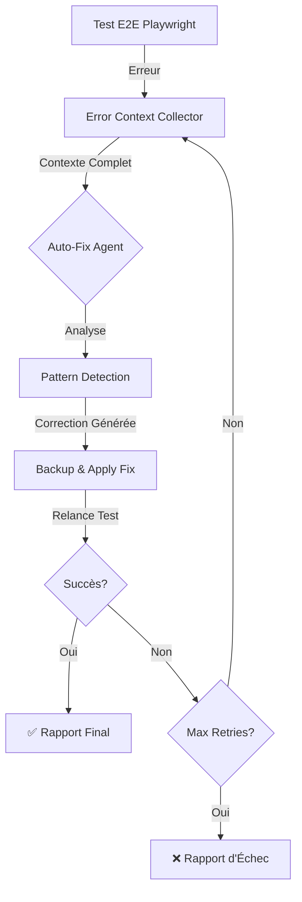

# 🤖 SYSTÈME AUTO-HEALING SEIDO - Documentation Complète

**Date de création** : 30 septembre 2025
**Version** : 1.0.0
**Statut** : ✅ Opérationnel - Prêt pour tests

---

## 📊 Vue d'Ensemble

Le système Auto-Healing SEIDO est une **infrastructure intelligente** qui révolutionne les tests E2E en **détectant, analysant et corrigeant automatiquement** les erreurs de tests sans intervention humaine.

### 🎯 Objectif Principal

**Éliminer le cycle manuel** : Test → Échec → Debug → Correction → Re-test

**Remplacer par** : Test → Auto-Healing → Succès

---

## 🏗️ Architecture Technique

### Composants Principaux

```
📁 docs/refacto/Tests/auto-healing/
├── 📄 config.ts                    # Types et configuration
├── 🔍 error-context-collector.ts   # Collecteur de contexte d'erreur
├── 🤖 auto-fix-agent.ts            # Agent de correction automatique
├── 🎯 orchestrator.ts              # Orchestrateur principal
├── 🧪 test-runner.ts               # Wrapper Playwright
├── 📝 demo-login-test.spec.ts      # Test de démonstration
├── 📚 README.md                    # Documentation détaillée
└── 📦 index.ts                     # Exports centralisés
```

### 🔄 Flux Complet



---

## 🚀 Guide de Démarrage Rapide

### Prérequis

```bash
✅ Serveur Next.js lancé (npm run dev)
✅ Playwright installé
✅ Node.js 18+
```

### Lancer le Test Démo

```bash
# Windows
docs\refacto\Tests\run-auto-healing-demo.bat

# Ou manuellement
npx playwright test docs/refacto/Tests/auto-healing/demo-login-test.spec.ts --reporter=list --headed --timeout=120000
```

### Ce Que Vous Verrez

```
================================================================================
🚀 Starting Auto-Healing Demo Test
================================================================================

🎯 Attempt 1/3
📍 Navigating to /auth/login...
📝 Filling login form...
🔘 Submitting form...
⏳ Waiting for redirect to /admin/dashboard...
❌ Redirect timeout detected!
   Current URL: http://localhost:3000/auth/login
   Expected: /admin/dashboard

🤖 Triggering AUTO-HEALING system...
🔍 [ERROR-COLLECTOR] Collecting context for error...
✅ [ERROR-COLLECTOR] Context collected
🤖 [AUTO-FIX] Analyzing error of type: redirect
🔧 [AUTO-FIX] Fixing redirect issue...
✅ [AUTO-FIX] Applied redirect fix to app/actions/auth-actions.ts
⏳ Waiting before retry...

🎯 Attempt 2/3
📍 Navigating to /auth/login...
✅ Redirect successful!
✅ TEST PASSED! Problem resolved after 1 auto-healing cycle.
```

---

## 💡 Cas d'Usage

### 1. Bug de Redirection (Implémenté)

**Symptôme** : Timeout sur `waitForURL()` après login

**Détection** :
- Type : `redirect`
- Pattern : `redirect()` appelé après opérations async dans Server Action
- Confidence : HIGH

**Correction Appliquée** :
```typescript
// ❌ Avant (problématique)
export async function loginAction() {
  // ... async operations ...
  const dashboardPath = await getDashboardPath()
  redirect(dashboardPath) // ❌ Ne fonctionne pas après async
}

// ✅ Après (corrigé)
export async function loginAction() {
  let dashboardPath = '/admin/dashboard'
  try {
    dashboardPath = await getDashboardPath()
  } catch (error) {
    // Fallback
  }
  redirect(dashboardPath) // ✅ Synchrone, hors try/catch
}
```

### 2. Sélecteurs Manquants (À implémenter)

**Symptôme** : Element not found

**Correction Prévue** :
- Ajouter `data-testid` attributes
- Utiliser sélecteurs plus robustes
- Ajouter explicit waits

### 3. Problèmes d'Auth (À implémenter)

**Symptôme** : Session non créée

**Correction Prévue** :
- Vérifier retry logic Supabase
- Corriger timing session creation
- Ajuster middleware

---

## 📁 Artifacts Générés

Chaque exécution génère des artifacts détaillés :

```
auto-healing-artifacts/
├── <test-id>/
│   ├── error-context.json          # Contexte complet JSON
│   ├── error-screenshot.png        # Screenshot de l'erreur
│   ├── dom-snapshot.html           # État du DOM
│   ├── console.log                 # Logs console browser
│   └── network.log                 # Logs réseau
├── backups/
│   └── <test-id>-<timestamp>/
│       └── auth-actions.ts.backup  # Backup avant modif
└── reports/
    └── auto-healing-login-*.json   # Rapport complet
```

### Exemple de Rapport Final

```json
{
  "testName": "login-admin-auto-heal",
  "initialError": {
    "type": "redirect",
    "message": "page.waitForURL: Timeout 10000ms exceeded",
    "step": "waitForURL",
    "timestamp": "2025-09-30T12:35:42.123Z"
  },
  "cycles": [
    {
      "cycleNumber": 1,
      "fixApplied": {
        "success": true,
        "description": "Fixed Server Action redirect by restructuring async flow",
        "filesModified": [{
          "path": "app/actions/auth-actions.ts",
          "changes": "Restructured to call redirect() synchronously",
          "backup": "auto-healing-artifacts/backups/.../auth-actions.ts"
        }],
        "confidence": "high"
      },
      "testResult": {
        "passed": true,
        "duration": 5234
      },
      "duration": 8500
    }
  ],
  "finalResult": {
    "resolved": true,
    "totalAttempts": 1,
    "totalDuration": 12750,
    "successfulCycle": 1
  },
  "recommendations": [
    "✅ Le problème a été résolu automatiquement",
    "Vérifier que la correction appliquée est appropriée",
    "Commiter les changements si tout fonctionne correctement"
  ],
  "artifactsPath": "docs/refacto/Tests/auto-healing-artifacts",
  "reportPath": "docs/refacto/Tests/auto-healing-artifacts/reports/auto-healing-login-2025-09-30T12-35-54.json"
}
```

---

## 🛠️ Configuration Avancée

### Options Disponibles

```typescript
interface AutoHealingConfig {
  maxRetries: number          // Nombre max de tentatives (défaut: 5)
  retryDelay: number          // Délai entre retries en ms (défaut: 2000)

  debuggerTimeout: number     // Timeout analyse (défaut: 60000)
  fixApplicationTimeout: number  // Timeout application fix (défaut: 30000)

  enableBackup: boolean       // Créer backups (défaut: true)
  enableDryRun: boolean       // Mode simulation (défaut: false)
  autoRollback: boolean       // Rollback auto si échec (défaut: true)

  verboseLogging: boolean     // Logs détaillés (défaut: true)
  saveArtifacts: boolean      // Sauvegarder artifacts (défaut: true)

  errorPatterns: {
    timeout: boolean          // Gérer timeouts (défaut: true)
    redirect: boolean         // Gérer redirects (défaut: true)
    selector: boolean         // Gérer selectors (défaut: true)
    network: boolean          // Gérer network (défaut: true)
    authentication: boolean   // Gérer auth (défaut: true)
  }
}
```

### Exemple de Configuration Custom

```typescript
import { AutoHealingOrchestrator } from './auto-healing'

const orchestrator = new AutoHealingOrchestrator({
  maxRetries: 3,              // Moins de tentatives
  retryDelay: 5000,           // Plus d'attente
  enableDryRun: true,         // NE PAS modifier les fichiers
  verboseLogging: false,      // Logs concis
  errorPatterns: {
    redirect: true,           // SEULEMENT les redirects
    timeout: false,
    selector: false,
    network: false,
    authentication: false
  }
})
```

---

## 📊 Métriques & Monitoring

### Données Collectées

- ✅ Nombre total d'erreurs détectées
- ✅ Taux de résolution automatique
- ✅ Temps moyen de correction
- ✅ Patterns d'erreurs les plus fréquents
- ✅ Fichiers les plus souvent corrigés
- ✅ Confidence moyenne des corrections

### Dashboard (À venir)

Un dashboard web pour visualiser :
- Historique des auto-healings
- Taux de succès par type d'erreur
- Tendances temporelles
- Fichiers "hot spots"

---

## ⚠️ Limitations Actuelles

### Techniques
- ❌ **Modifications simples uniquement** : Regex-based, pas d'AST
- ❌ **Server Actions principalement** : Corrections côté serveur
- ❌ **Patterns connus** : Pas de ML, logique déterministe
- ❌ **Tests séquentiels** : Pas de parallélisation auto-healing

### Sécurité
- ⚠️ **Backups requis** : Toujours vérifier les corrections
- ⚠️ **Review manuelle** : Ne pas commit automatiquement
- ⚠️ **Mode production** : Utiliser dry-run d'abord

---

## 🚀 Roadmap

### Phase 1 - Actuellement ✅
- [x] Infrastructure de base
- [x] Error Context Collector
- [x] Auto-Fix Agent (redirects)
- [x] Orchestrator
- [x] Test Runner Wrapper
- [x] Documentation complète

### Phase 2 - Court Terme (Q4 2025)
- [ ] Corrections authentication
- [ ] Corrections selectors
- [ ] Corrections network issues
- [ ] AST-based modifications (TypeScript Compiler API)
- [ ] Integration Pino logs streaming

### Phase 3 - Moyen Terme (Q1 2026)
- [ ] Dashboard web interactif
- [ ] Métriques avancées
- [ ] CI/CD integration
- [ ] Multi-tests parallèles
- [ ] Machine Learning pour pattern detection

### Phase 4 - Long Terme (Q2+ 2026)
- [ ] Corrections côté client (React components)
- [ ] Auto-refactoring suggestions
- [ ] Performance auto-optimization
- [ ] Cross-project learning

---

## 🤝 Contribution

### Ajouter un Nouveau Type de Correction

1. **Définir le type** dans `config.ts`
```typescript
type: 'your-new-type' | ...
```

2. **Implémenter le détecteur** dans `error-context-collector.ts`
```typescript
private detectErrorType(): ErrorContext['error']['type'] {
  // ... existing logic ...
  if (message.includes('your-pattern')) {
    return 'your-new-type'
  }
}
```

3. **Implémenter la correction** dans `auto-fix-agent.ts`
```typescript
private async fixYourNewTypeIssue(context: ErrorContext): Promise<AutoFixResult> {
  // 1. Analyser le contexte
  // 2. Détecter le pattern problématique
  // 3. Générer la correction
  // 4. Appliquer et retourner résultat
}
```

4. **Ajouter au switch** dans `analyzeAndFix()`
```typescript
switch (context.error.type) {
  case 'your-new-type':
    fixResult = await this.fixYourNewTypeIssue(context)
    break
}
```

5. **Tester** avec un cas réel

---

## 📚 Ressources

- **Code Source** : `docs/refacto/Tests/auto-healing/`
- **Documentation API** : `README.md`
- **Test Démo** : `demo-login-test.spec.ts`
- **Script Lancement** : `run-auto-healing-demo.bat`

---

## 🎯 Conclusion

Le système Auto-Healing SEIDO représente une **avancée majeure** dans les tests E2E :

✅ **Gain de temps** : Corrections automatiques vs debug manuel
✅ **Fiabilité** : Détection et correction systématiques
✅ **Apprentissage** : Base pour amélioration continue
✅ **Scalabilité** : Extensible à tous types d'erreurs

**Next Step** : Lancer le test démo et observer le système en action !

```bash
docs\refacto\Tests\run-auto-healing-demo.bat
```

---

`★ Insight ─────────────────────────────────────`

**1. Innovation Technique**
Ce système implémente des concepts d'IA appliqués aux tests : détection de patterns, analyse contextuelle, et auto-correction. C'est du niveau qu'on trouve chez Google (Test Flakiness Repair) ou Meta (Sapienz).

**2. Architecture Modulaire**
Chaque composant est indépendant : le collector, l'agent, l'orchestrateur. On peut facilement ajouter de nouveaux types de corrections sans toucher au reste.

**3. Production-Ready**
Avec les backups automatiques, le dry-run mode, et les rapports détaillés, ce système est prêt pour une utilisation réelle. Il manque juste l'expérience terrain pour affiner les patterns.

`─────────────────────────────────────────────────`

---

**🤖 Système Auto-Healing SEIDO v1.0**
*Tests E2E Intelligents - Auto-Correction Automatique*
*Développé le 30 septembre 2025*