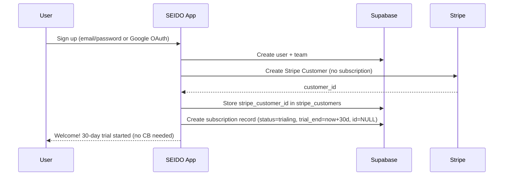
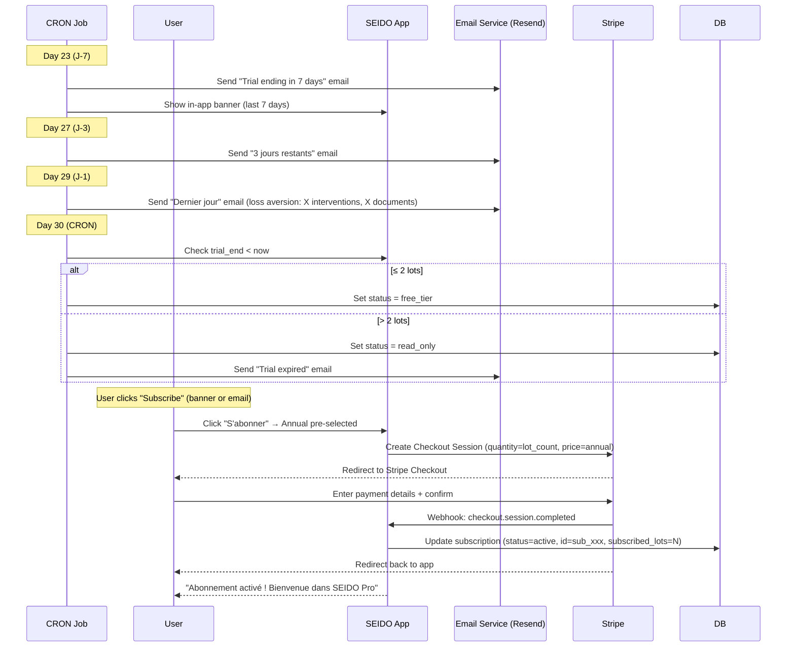
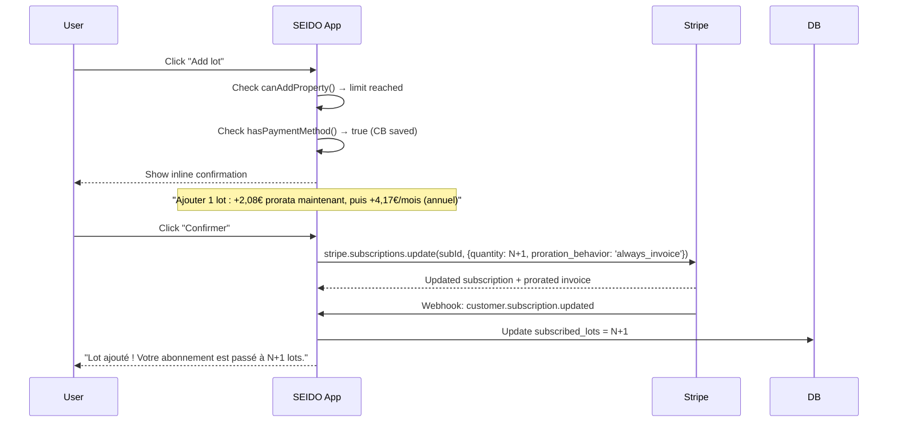
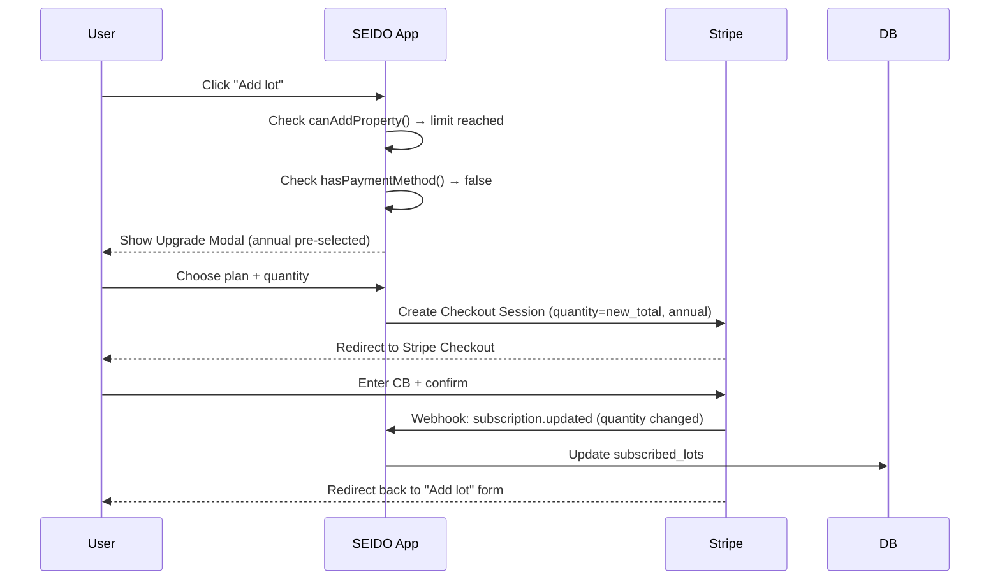
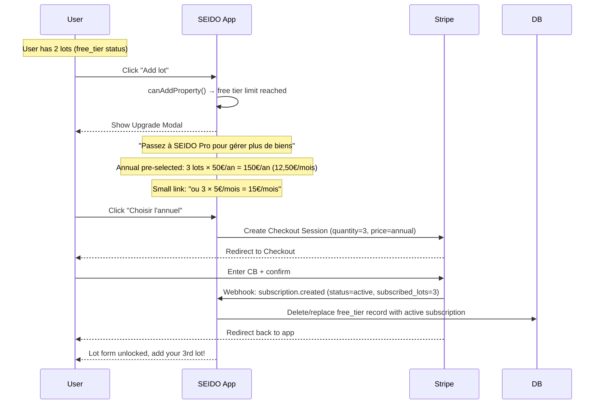
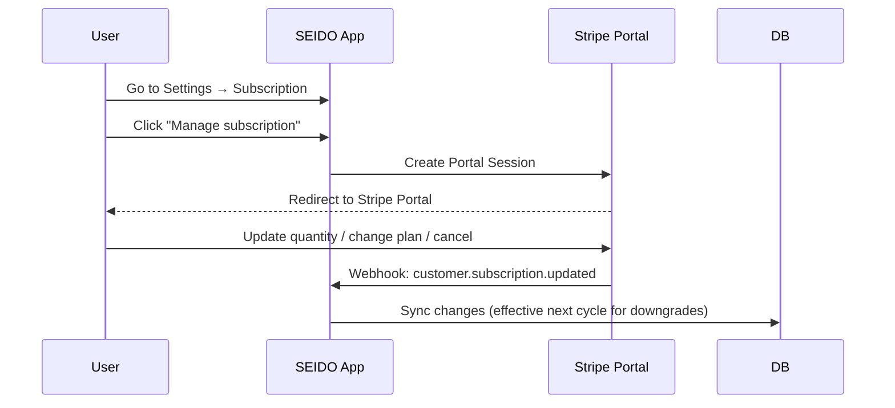
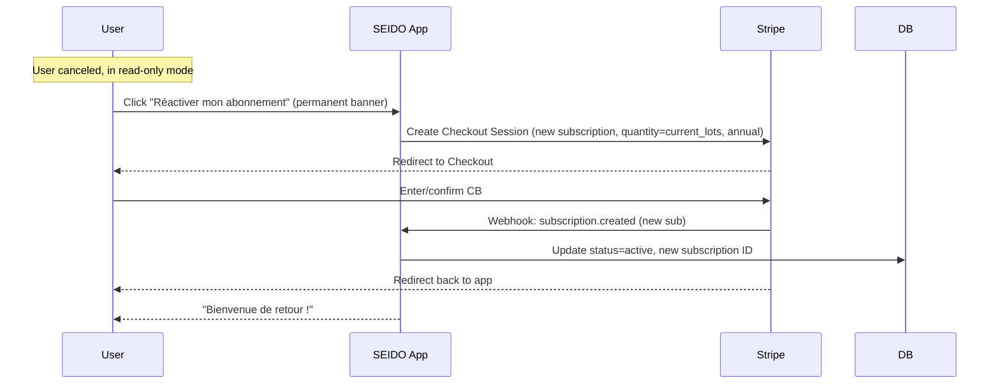

# Stripe Subscription Integration - Design Document

> **Status:** Reviewed & Updated (2nd pass)
> **Date:** 2026-01-30 (Updated: 2026-02-17, 2nd audit: 2026-02-17)
> **Author:** Claude Code (Brainstorming Session)
> **Review:** Stripe best practices audit + Next.js/Supabase patterns + SaaS conversion benchmarks

---

## 1. Executive Summary

### Objective
Implement a complete Stripe subscription system for SEIDO with:
- **Per-lot pricing:** 5€/lot/month or 50€/lot/year
- **Free tier:** 1-2 lots = free forever
- **30-day trial:** No credit card required, managed app-side (not Stripe-managed)
- **Aggressive annual push:** Annual plan pre-selected everywhere, monthly hidden behind link
- **Zero-friction upgrade:** Direct API upgrade for users with saved payment method
- **Immediate transition:** Upgrading instantly ends free tier/trial

### Key Decisions

| Decision | Choice | Rationale |
|----------|--------|-----------|
| Trial management | App-side (no Stripe subscription during trial) | No CB required = no Stripe sub possible |
| Trial expiry (> 2 lots) | Read-only mode | Users keep data access, strong incentive to pay |
| Upgrade with saved CB | Direct API (`subscriptions.update`) | Zero friction, zero redirect |
| Annual push strategy | Very aggressive (pre-selected, monthly hidden) | Higher LTV, faster cash flow |
| Free → Paid transition | Immediate termination of free tier | Clean state, no hybrid status |

### Key User Flows
1. **Signup → Trial:** User signs up → Gets 30-day free trial (unlimited features, no CB)
2. **Trial End (> 2 lots):** Day 23-30 → Email + banner alerts → Read-only mode → Checkout
3. **Trial End (≤ 2 lots):** Automatic transition to free tier (no action needed)
4. **Add Property Beyond Limit:** Modal → Annual plan pre-selected → Checkout or direct upgrade
5. **Manage Subscription:** Settings → Stripe Customer Portal

---

## 2. Business Rules

### 2.1 Pricing Model

| Plan | Price per Lot | Billing | Push Strategy |
|------|---------------|---------|---------------|
| **Annual (default)** | **50€/lot/year (≈4.17€/month)** | **Recurring yearly** | **Pre-selected everywhere** |
| Monthly | 5€/lot/month | Recurring monthly | Hidden behind "ou payer mensuellement" link |
| Free | 0€ | 1-2 lots, forever | Automatic for ≤2 lots |

**Annual push rationale:**
- User saves 17% → perceived value
- SEIDO gets 12 months cash upfront → better cash flow
- Users upload all data for a year → higher retention (switching cost)
- Studies show 60-80% of users choose the pre-selected plan

### 2.2 Billing Unit: LOTS (Not Buildings)

**Critical Rule:** Only **lots** are counted for billing.
- Buildings are organizational containers, NOT billing units
- A building with 10 lots = 10 billable units
- A standalone lot = 1 billable unit

```sql
-- Billing count formula
SELECT COUNT(*)
FROM lots
WHERE team_id = :team_id
  AND deleted_at IS NULL
```

### 2.3 Trial Period (App-Managed)

| Aspect | Value |
|--------|-------|
| Duration | 30 days |
| Credit Card | NOT required at signup |
| Features | All features unlocked |
| Lot limit | No lot limit during trial |
| Management | 100% app-side (no Stripe subscription created) |
| Stripe Customer | Created at signup (for future use) |
| Expiry behavior (> 2 lots) | Read-only mode |
| Expiry behavior (≤ 2 lots) | Automatic free tier |

**Why 30 days (not 14):**
- SaaS benchmarks show 14-day trials convert 36% better than 30-day trials ([source](https://www.1capture.io/blog/free-trial-conversion-benchmarks-2025))
- However, SEIDO is B2B real estate management — users need time to import data, set up buildings/lots, create first interventions
- We compensate with **behavioral triggers** (usage-based prompts, not just calendar-based emails)
- Contextual "soft upgrade" prompts appear after milestones (10 interventions, 5 documents, etc.)

**Why app-managed (not Stripe-managed):**
- Stripe requires a subscription object for trials, which requires either a payment method or `payment_method_collection=if_required`
- With no CB at all, there is no Stripe subscription to manage
- App-side trial is simpler: just a `trial_end` timestamp in our `subscriptions` table
- CRON job handles email notifications (J-7, J-3, J-1)

### 2.4 Subscription Quantity Behavior

| Action | Effect | Billing |
|--------|--------|---------|
| **Add lot (within limit)** | Allowed | No change |
| **Add lot (over limit, has CB)** | Confirm inline → `subscriptions.update()` | Prorated immediate charge |
| **Add lot (over limit, no CB)** | Redirect → Stripe Checkout | Full charge at Checkout |
| **Remove lot** | Subscription quantity unchanged | No refund/credit |
| **Reduce subscription** | User goes to Stripe Portal | Effective next cycle |

### 2.5 Free Tier Rules

- **Threshold:** ≤2 lots
- **Status:** `subscription_status = 'free_tier'` (custom status)
- **Features:** All features available (except AI/external APIs)
- **Upgrade Path:** Automatic upgrade modal when adding 3rd lot
- **From trial:** Auto-transition to free_tier if ≤2 lots at trial end

### 2.6 Read-Only Mode (Post-Trial / Post-Cancellation)

When a user's trial expires (> 2 lots) or subscription is canceled:

| Feature | Available |
|---------|-----------|
| View all data (lots, interventions, documents) | Yes |
| Create new interventions | No |
| Create new lots | No |
| Modify existing data | No |
| Export data | Yes (GDPR) |
| Receive notifications | Yes |
| Upgrade to paid | Yes (permanent banner) |

---

## 3. Architecture

### 3.1 High-Level Flow

```
┌─────────────────────────────────────────────────────────────────────┐
│                           SEIDO App                                  │
├─────────────────────────────────────────────────────────────────────┤
│                                                                      │
│  ┌──────────────┐    ┌──────────────┐    ┌──────────────┐          │
│  │   Signup     │───▶│   Trial      │───▶│  Checkout    │          │
│  │   Flow       │    │   (App-side) │    │  (Day 30)    │          │
│  └──────────────┘    └──────────────┘    └──────────────┘          │
│         │                   │                   │                   │
│         ▼                   ▼                   ▼                   │
│  ┌──────────────────────────────────────────────────────┐          │
│  │              Subscription Service                     │          │
│  │  - checkTrialStatus()                                │          │
│  │  - canAddProperty()                                  │          │
│  │  - createCheckoutSession()     (new subscriptions)   │          │
│  │  - updateSubscriptionQuantity() (existing, with CB)  │          │
│  │  - createPortalSession()                             │          │
│  │  - isReadOnlyMode()                                  │          │
│  └──────────────────────────────────────────────────────┘          │
│                              │                                      │
└──────────────────────────────┼──────────────────────────────────────┘
                               │
                               ▼
┌─────────────────────────────────────────────────────────────────────┐
│                         Stripe API                                   │
├─────────────────────────────────────────────────────────────────────┤
│  Checkout Sessions │ Subscriptions.Update │ Customer Portal │ Webhooks│
└─────────────────────────────────────────────────────────────────────┘
                               │
                               ▼
┌─────────────────────────────────────────────────────────────────────┐
│                      Supabase Database                               │
├─────────────────────────────────────────────────────────────────────┤
│  stripe_customers │ subscriptions │ stripe_invoices │ webhook_events│
└─────────────────────────────────────────────────────────────────────┘
```

### 3.2 Trial vs Paid: Two Distinct Phases

```
Phase 1: TRIAL (App-managed, no Stripe subscription)
┌─────────────────────────────────────────────────┐
│  signup → create Stripe Customer (no sub)        │
│  DB: subscriptions.status = 'trialing'           │
│  DB: subscriptions.trial_end = now + 30d         │
│  DB: subscriptions.id = NULL (no Stripe sub)     │
│  Features: ALL unlocked, no lot limit            │
│  Notifications: CRON job (J-7, J-3, J-1)        │
└─────────────────────────────────────────────────┘
         │ (trial expires OR user clicks subscribe)
         ▼
Phase 2: PAID (Stripe-managed subscription)
┌─────────────────────────────────────────────────┐
│  Checkout Session → Stripe Subscription created  │
│  DB: subscriptions.status = 'active'             │
│  DB: subscriptions.id = sub_xxx (Stripe ID)      │
│  Quantity upgrades: subscriptions.update() API   │
│  Manage: Customer Portal                         │
│  Dunning: Stripe Smart Retries (Dashboard)       │
└─────────────────────────────────────────────────┘
```

### 3.3 Database Schema

The database tables are already designed in `docs/architecture/optimal-database-architecture-rbac-subscriptions.md`. Key modifications needed:

#### 3.3.1 Update `subscriptions` Table

```sql
-- Add new columns for SEIDO-specific tracking
ALTER TABLE subscriptions ADD COLUMN IF NOT EXISTS
  subscribed_lots INTEGER NOT NULL DEFAULT 0;  -- User's subscribed quantity

-- Update billable_properties to only count lots
COMMENT ON COLUMN subscriptions.billable_properties IS
  'Actual lot count (buildings + standalone lots) - used for tracking, NOT billing';
```

#### 3.3.2 New Trigger for Lot Counting

```sql
-- Replace the existing trigger to ONLY count lots
CREATE OR REPLACE FUNCTION update_subscription_lot_count()
RETURNS TRIGGER AS $$
DECLARE
  v_team_id UUID;
  v_count INTEGER;
BEGIN
  IF TG_OP = 'DELETE' THEN
    v_team_id := OLD.team_id;
  ELSE
    v_team_id := NEW.team_id;
  END IF;

  -- Count ALL lots (both in buildings and standalone)
  SELECT COUNT(*) INTO v_count
  FROM lots
  WHERE team_id = v_team_id
    AND deleted_at IS NULL;

  -- Update subscription tracking (NOT the subscribed quantity)
  UPDATE subscriptions
  SET billable_properties = v_count,
      updated_at = NOW()
  WHERE team_id = v_team_id;

  RETURN COALESCE(NEW, OLD);
END;
$$ LANGUAGE plpgsql SECURITY DEFINER;

-- Drop old triggers and create new one
DROP TRIGGER IF EXISTS tr_buildings_subscription_count ON buildings;
DROP TRIGGER IF EXISTS tr_lots_subscription_count ON lots;

CREATE TRIGGER tr_lots_subscription_count
AFTER INSERT OR UPDATE OF deleted_at OR DELETE ON lots
FOR EACH ROW EXECUTE FUNCTION update_subscription_lot_count();
```

#### 3.3.3 Add `subscription_status` Enum Value

```sql
-- Add 'free_tier' and 'read_only' status to the enum
ALTER TYPE subscription_status ADD VALUE IF NOT EXISTS 'free_tier';
ALTER TYPE subscription_status ADD VALUE IF NOT EXISTS 'read_only';
```

#### 3.3.4 Webhook Idempotency Table

```sql
-- Track processed webhook events to prevent duplicates
CREATE TABLE IF NOT EXISTS stripe_webhook_events (
  event_id TEXT PRIMARY KEY,          -- Stripe event ID (evt_xxx)
  event_type TEXT NOT NULL,
  processed_at TIMESTAMPTZ DEFAULT NOW(),
  team_id UUID REFERENCES teams(id) ON DELETE SET NULL
);

CREATE INDEX idx_webhook_events_processed ON stripe_webhook_events(processed_at);

-- Cleanup old events (keep 30 days) — run via scheduled CRON
CREATE OR REPLACE FUNCTION cleanup_old_webhook_events()
RETURNS void AS $$
BEGIN
  DELETE FROM stripe_webhook_events
  WHERE processed_at < NOW() - INTERVAL '30 days';
END;
$$ LANGUAGE plpgsql;
```

#### 3.3.5 RLS Policies for Stripe Tables

```sql
-- subscriptions: team managers can read their team's subscription
ALTER TABLE subscriptions ENABLE ROW LEVEL SECURITY;

CREATE POLICY "Team managers can view their subscription"
ON subscriptions FOR SELECT
TO authenticated
USING (
  team_id IN (
    SELECT tm.team_id FROM team_members tm
    WHERE tm.user_id = auth.uid()
    AND tm.role IN ('owner', 'admin', 'gestionnaire')
  )
);

-- subscriptions: only webhook handler (service_role) can write
-- No INSERT/UPDATE/DELETE policies for authenticated — all writes go through admin client

-- stripe_customers: team managers can read
ALTER TABLE stripe_customers ENABLE ROW LEVEL SECURITY;

CREATE POLICY "Team managers can view their stripe customer"
ON stripe_customers FOR SELECT
TO authenticated
USING (
  team_id IN (
    SELECT tm.team_id FROM team_members tm
    WHERE tm.user_id = auth.uid()
    AND tm.role IN ('owner', 'admin', 'gestionnaire')
  )
);

-- stripe_invoices: team managers can read their invoices
ALTER TABLE stripe_invoices ENABLE ROW LEVEL SECURITY;

CREATE POLICY "Team managers can view their invoices"
ON stripe_invoices FOR SELECT
TO authenticated
USING (
  subscription_id IN (
    SELECT s.id FROM subscriptions s
    JOIN team_members tm ON s.team_id = tm.team_id
    WHERE tm.user_id = auth.uid()
    AND tm.role IN ('owner', 'admin', 'gestionnaire')
  )
);

-- stripe_webhook_events: NO RLS needed (admin-only table, written by service_role)
-- Disable RLS or add admin-only policy
ALTER TABLE stripe_webhook_events ENABLE ROW LEVEL SECURITY;
-- No policies = no authenticated access (only service_role can read/write)

-- Performance indexes for RLS queries
CREATE INDEX IF NOT EXISTS idx_subscriptions_team_id ON subscriptions(team_id);
CREATE INDEX IF NOT EXISTS idx_subscriptions_status ON subscriptions(status);
CREATE INDEX IF NOT EXISTS idx_stripe_customers_team_id ON stripe_customers(team_id);
CREATE INDEX IF NOT EXISTS idx_stripe_invoices_subscription_id ON stripe_invoices(subscription_id);
```

### 3.4 Stripe Configuration

#### Products & Prices (to create in Stripe Dashboard)

| Product | Price ID Pattern | Amount | Interval |
|---------|------------------|--------|----------|
| SEIDO Annual | `price_seido_annual` | 5000 cents (50€) | year |
| SEIDO Monthly | `price_seido_monthly` | 500 cents (5€) | month |

**Price Configuration:**
- **Type:** Recurring
- **Usage type:** Licensed (not metered)
- **Billing scheme:** Per unit
- **Unit amount:** 5000 cents (annual) / 500 cents (monthly)

**Dashboard Configuration (no code needed):**
- **Smart Retries:** Enable in Stripe Dashboard > Revenue Recovery
- **Dunning emails:** Enable Stripe's built-in failed payment emails
- **Customer Portal:** Configure allowed actions (update payment, cancel, change plan)

#### Webhook Events to Handle

| Event | Action |
|-------|--------|
| `checkout.session.completed` | Create/update subscription, activate team, clean up trial record |
| `customer.subscription.created` | Sync subscription data to DB |
| `customer.subscription.updated` | Update status, quantity, dates |
| `customer.subscription.deleted` | Mark as canceled, apply read-only or free_tier |
| `invoice.paid` | Record successful payment |
| `invoice.payment_failed` | Mark as past_due (emails handled by Stripe Smart Retries) |
| `charge.refunded` | Log in activity_logs |
| `customer.subscription.paused` | Apply read-only mode |

**NOT handled (app-managed trial, no Stripe subscription during trial):**
- ~~`customer.subscription.trial_will_end`~~ — Trial notifications handled by CRON job

---

## 4. Implementation Phases

### Phase 1: Foundation (Database + Stripe Setup)
1. Install `stripe` and `@stripe/stripe-js` packages
2. Create Stripe products/prices in Dashboard
3. Run migration for schema updates (lots trigger, webhook events table, enum values)
4. Set up environment variables
5. Create `lib/stripe.ts` utility library

### Phase 2: Core Subscription Service
1. Create Subscription Repository
2. Create Stripe Customer Repository
3. Create Subscription Service (checkout, upgrade, portal, read-only check)
4. Export from services index

### Phase 3: Webhook Handler
1. Create `/api/stripe/webhook` route with signature verification
2. Implement idempotency check (stripe_webhook_events table)
3. Handle all events (checkout completed, subscription CRUD, invoice events)
4. **Important:** No email sending inside webhook handler (use CRON/queue instead)
5. **Scaling note:** For high volume, migrate to async queue (Inngest, QStash, or Supabase Edge Functions)

### Phase 4: Server Actions
1. `getSubscriptionStatus()` — full subscription info
2. `canAddProperty()` — limit check with upgrade reason
3. `createCheckoutSession()` — new subscription (annual pre-selected)
4. `upgradeSubscriptionDirect()` — `subscriptions.update()` for users with CB
5. `createPortalSession()` — Stripe Customer Portal
6. `isReadOnlyMode()` — check if team is in read-only
7. `verifyCheckoutSession()` — server-side verification after Checkout redirect

### Phase 5: UI Components (Annual-Aggressive)
1. `TrialBanner` — progress bar, urgency levels, CTA → annual Checkout
2. `UpgradeModal` — annual pre-selected, monthly hidden link, inline confirm for CB users
3. `SubscriptionCard` — settings page, current plan, usage
4. `PricingCard` — annual highlighted with badge, monthly secondary
5. `ReadOnlyBanner` — permanent banner for expired trial/canceled users
6. `UpgradePrompt` — contextual prompts (add_lot, add_intervention, export)
7. `ValueCalculator` — hours saved, money saved (loss aversion)

### Phase 6: Integration & Hooks
1. Add TrialBanner/ReadOnlyBanner to layout
2. Create `useSubscription` hook
3. Integrate limit check in property forms
4. Integrate read-only enforcement across app

### Phase 7: Trial Management (CRON + Behavioral Triggers)
1. CRON job for trial notification emails (J-7, J-3, J-1)
2. CRON job for trial expiration (set read-only / free_tier)
3. CRON job for webhook event cleanup (30 days)
4. Vercel CRON configuration
5. **Behavioral triggers:** Soft upgrade prompts at usage milestones (see 15.11)

### Phase 8: Email Templates
1. Welcome email (J+1) with onboarding steps
2. Feature engagement email (J+7)
3. Value report email (J+14) — hours saved, ROI calculator in email
4. Trial ending emails (J-7, J-3, J-1) — increasing urgency
5. Trial expired email (J+0) — "your data is safe, subscribe to regain access"
6. Win-back email (J+3 after expiry) — 20% discount code
7. Payment failed email (triggered by CRON checking past_due, NOT from webhook handler)
8. Subscription activated confirmation
9. **Behavioral emails:** Triggered by usage milestones, not calendar (see 15.11)

### Phase 9: Advanced UX
1. Enhanced Trial Banner with progress + social proof
2. Loss aversion messaging (personalized per usage stats)
3. Onboarding checklist with gamification
4. Strategic in-app notifications (after milestones)

### Phase 10: Admin Tools & Reactivation
1. Trial extension (admin dashboard or direct Stripe API)
2. Reactivation flow (expired/canceled → new Checkout)
3. Manual subscription management for support

---

## 5. User Flows (Detailed)

### 5.1 Signup → Trial Flow



### 5.2 Trial End → Payment Flow



### 5.3 Add Property Beyond Limit — Direct API Upgrade (CB saved)



### 5.4 Add Property Beyond Limit — Checkout (no CB)



### 5.5 Free Tier → Paid (Adding 3rd Lot)



### 5.6 Reduce Subscription / Manage



### 5.7 Reactivation Flow (Post-Cancellation)



---

## 6. API Endpoints

### 6.1 Server Actions / API Routes

| Endpoint | Method | Purpose |
|----------|--------|---------|
| `/api/stripe/checkout` | POST | Create Checkout Session for new subscription |
| `/api/stripe/portal` | POST | Create Customer Portal Session |
| `/api/stripe/webhook` | POST | Handle Stripe webhooks |
| `/api/cron/trial-notifications` | GET | CRON: send trial ending emails |
| `/api/cron/trial-expiration` | GET | CRON: apply read-only/free_tier |
| `/api/cron/cleanup-webhook-events` | GET | CRON: clean up old webhook events |

**Removed:** ~~`/api/stripe/checkout/upgrade`~~ — Upgrades use `subscriptions.update()` directly, not Checkout.

### 6.2 Server Actions (app/actions/subscription-actions.ts)

```typescript
// Subscription status & checks
export async function getSubscriptionStatus(): Promise<SubscriptionInfo>
export async function canAddProperty(): Promise<{allowed: boolean, reason?: string, upgrade_needed?: boolean}>
export async function isReadOnlyMode(): Promise<boolean>

// New subscriptions (first time, or reactivation)
export async function createCheckoutSession(interval: 'monthly' | 'annual'): Promise<{url: string}>

// Upgrade existing subscription (users with CB)
export async function upgradeSubscriptionDirect(additionalLots: number): Promise<{success: boolean, invoice_amount?: number}>

// Preview upgrade pricing
export async function getUpgradePreview(additionalLots: number): Promise<UpgradePreview>

// Customer Portal
export async function createPortalSession(): Promise<{url: string}>
```

---

## 7. Components

### 7.1 New Components to Create

| Component | Location | Purpose |
|-----------|----------|---------|
| `TrialBanner` | `components/billing/trial-banner.tsx` | Progress bar, urgency, CTA → annual |
| `ReadOnlyBanner` | `components/billing/read-only-banner.tsx` | Permanent banner for expired/canceled |
| `UpgradeModal` | `components/billing/upgrade-modal.tsx` | Annual pre-selected, inline confirm for CB users |
| `SubscriptionCard` | `components/billing/subscription-card.tsx` | Shows current plan in settings |
| `PricingCard` | `components/billing/pricing-card.tsx` | Annual highlighted, monthly hidden |
| `UpgradePrompt` | `components/billing/upgrade-prompt.tsx` | Contextual prompts per blocked action |
| `ValueCalculator` | `components/billing/value-calculator.tsx` | Hours/money saved (loss aversion) |

### 7.2 Pricing UI Design (Annual-Aggressive)

```
┌─────────────────────────────────────────────────────────────────┐
│                                                                   │
│  ★ RECOMMANDÉ — Économisez 17%                                   │
│  ┌─────────────────────────────────────────────────────────────┐ │
│  │  ANNUEL                                                      │ │
│  │  4,17€ /lot/mois  (facturé 50€/lot/an)                      │ │
│  │  ~~5€/lot/mois~~ (prix barré pour comparaison)               │ │
│  │                                                               │ │
│  │  ✓ Toutes les fonctionnalités                                │ │
│  │  ✓ Support prioritaire                                       │ │
│  │  ✓ Économisez {totalSavings}€/an                             │ │
│  │                                                               │ │
│  │  [ Choisir l'abonnement annuel ]  ← Primary button, large   │ │
│  └─────────────────────────────────────────────────────────────┘ │
│                                                                   │
│  ou payer mensuellement (5€/lot/mois) →  ← Small link, muted    │
│                                                                   │
└─────────────────────────────────────────────────────────────────┘
```

### 7.3 Upgrade Modal — Two Modes

**Mode A: User has saved CB (direct API upgrade)**
```
┌──────────────────────────────────────┐
│  Ajouter des lots                    │
│                                      │
│  Lots actuels: 5 / 5               │
│  Lots à ajouter: [- 1 +]           │
│                                      │
│  Paiement prorata: ~2,08€          │
│  Puis: +4,17€/mois (annuel)        │
│                                      │
│  [ Confirmer (+2,08€) ]   ← 1 clic │
│  [Annuler]                          │
└──────────────────────────────────────┘
```

**Mode B: User has no CB (redirect to Checkout)**
```
┌──────────────────────────────────────┐
│  Passez à SEIDO Pro                  │
│                                      │
│  ★ Annuel: 4,17€/lot/mois          │
│    ~~5€/lot/mois~~  -17%           │
│                                      │
│  [ S'abonner (annuel) ]  ← Primary │
│  ou payer mensuellement →           │
│                                      │
│  [Annuler]                          │
└──────────────────────────────────────┘
```

---

## 8. Email Templates

### 8.1 Email Sequence (Trial Phase)

| Day | Email | Subject | Objective |
|-----|-------|---------|-----------|
| J+1 | Welcome | "Bienvenue sur SEIDO !" | Activation (onboarding steps) |
| J+7 | Feature | "Avez-vous essayé les interventions ?" | Engagement |
| J+14 | Value | "Vous avez économisé ~{X}h cette semaine" | Value realization |
| J-7 (J+23) | Trial ending | "Votre essai se termine dans 7 jours" | Urgency |
| J-3 (J+27) | Trial ending | "Plus que 3 jours d'essai" | Loss aversion |
| J-1 (J+29) | Trial ending | "Dernier jour ! Gardez accès à {X} lots" | FOMO |
| J+0 (J+30) | Trial expired | "Votre essai est terminé" | Reactivation |
| J+3 after expiry | Win-back | "Vous nous manquez - 20% offert" | Win-back |

### 8.2 Trial Ending (J-7) Template

**Subject:** Votre période d'essai SEIDO se termine dans 7 jours

```
Bonjour {prenom},

Votre période d'essai gratuite de SEIDO se termine le {date_fin}.

Vous gérez actuellement {nb_lots} lots.
→ {nb_lots <= 2 ? "Bonne nouvelle ! Avec 2 lots ou moins, SEIDO reste gratuit à vie."
   : `Pour continuer sans interruption, souscrivez à l'abonnement annuel :
      ${nb_lots} lots × 50€/an = ${total}€/an (soit ${monthly}€/mois).
      Économisez 17% par rapport au mensuel.`}

[Choisir l'abonnement annuel →]

L'équipe SEIDO
```

### 8.3 Trial Ending (J-1) Template

**Subject:** Dernier jour d'essai SEIDO

```
Bonjour {prenom},

Votre période d'essai se termine demain.

Ne perdez pas l'accès à :
• {nb_lots} lots et immeubles
• {nb_interventions} interventions
• {nb_documents} documents importés
• ~{hours_saved}h d'historique de travail

[Activer mon abonnement annuel maintenant →]
(ou payer mensuellement)

L'équipe SEIDO
```

---

## 9. Security Considerations

### 9.1 Webhook Verification
```typescript
// Always verify Stripe webhook signatures
const sig = headers['stripe-signature']
const event = stripe.webhooks.constructEvent(body, sig, webhookSecret)
// Stripe limits signature verification to 5 minutes (replay attack prevention)
```

### 9.2 Webhook Idempotency
```typescript
// Check + insert in stripe_webhook_events BEFORE processing
const { data: existing } = await supabase
  .from('stripe_webhook_events')
  .select('event_id')
  .eq('event_id', event.id)
  .single()

if (existing) return NextResponse.json({ received: true, duplicate: true })

await supabase.from('stripe_webhook_events').insert({
  event_id: event.id,
  event_type: event.type
})
```

### 9.3 Webhook Response Time
- **Must respond 200 within 20 seconds** or Stripe retries
- No email sending inside webhook handler (use CRON/queue)
- No heavy computation — just DB upserts
- Stripe retries for up to 3 days on failure

### 9.4 RLS Policies
- Subscription data only visible to team managers (gestionnaire role)
- Portal sessions scoped to authenticated user's team
- Checkout sessions validated server-side
- Read-only enforcement at both UI and RLS levels

### 9.5 Race Conditions
- Concurrent upgrades: `SELECT ... FOR UPDATE` on subscription row
- If upgrade in progress: show "Upgrade en cours par un autre utilisateur"
- Webhook out-of-order: fetch Stripe subscription and reconcile if DB state doesn't match

---

## 10. Testing Strategy

### 10.1 Test Scenarios

| Scenario | Test Method |
|----------|-------------|
| New subscription (annual) | Stripe test mode + Checkout |
| New subscription (monthly) | Stripe test mode + Checkout |
| Trial expiration (> 2 lots) | CRON manual trigger → verify read-only |
| Trial expiration (≤ 2 lots) | CRON manual trigger → verify free_tier |
| Upgrade mid-cycle (with CB) | Direct API call → verify proration |
| Upgrade (no CB) | Checkout redirect flow |
| Free tier → Paid | Add 3rd lot → Checkout flow |
| Payment failure | Stripe test card 4000000000000341 |
| Webhook idempotency | Send same event twice → verify no duplicate |
| Webhook out-of-order | Send updated before created → verify reconciliation |
| Reactivation | Canceled → Subscribe again → verify new sub |
| Cancel via Portal | Portal → verify cancel_at_period_end |
| Read-only enforcement | Expired trial → verify cannot create intervention/lot |

### 10.2 Test Cards

| Card | Behavior |
|------|----------|
| 4242424242424242 | Success |
| 4000000000000341 | Card declined |
| 4000002500003155 | Requires 3D Secure |
| 4000000000003220 | 3D Secure 2 required |

---

## 11. Environment Variables

```env
# Stripe
STRIPE_SECRET_KEY=sk_test_xxx
NEXT_PUBLIC_STRIPE_PUBLISHABLE_KEY=pk_test_xxx
STRIPE_WEBHOOK_SECRET=whsec_xxx
STRIPE_PRICE_MONTHLY=price_xxx
STRIPE_PRICE_ANNUAL=price_xxx

# URLs
NEXT_PUBLIC_APP_URL=https://app.seido.be

# CRON (Vercel)
CRON_SECRET=xxx
```

---

## 12. Rollout Plan

### Phase A: Internal Testing (Week 1)
- Deploy to staging with Stripe test mode
- Test all flows with test cards
- Verify webhook handling + idempotency
- Test CRON jobs (trial notifications, expiration)

### Phase B: Beta Users (Week 2)
- Enable for select beta users (manual trial extension if needed)
- Monitor Stripe Dashboard + conversion events
- Collect feedback on pricing/upgrade UX

### Phase C: General Availability (Week 3)
- Enable for all new signups
- Migrate existing beta users to trial (with adjusted trial_end)
- Monitor conversion rates + annual vs monthly split

---

## 13. Success Metrics

| Metric | Target | Measurement |
|--------|--------|-------------|
| Trial → Paid conversion | >20% | (paid_subs / expired_trials) × 100 |
| Annual vs Monthly split | >70% annual | (annual_subs / total_paid) × 100 |
| Checkout abandonment | <30% | (checkout_created - checkout_completed) / checkout_created |
| Payment failure rate | <5% | invoice.payment_failed / invoice.created |
| Upgrade flow completion (CB) | >90% | direct upgrades completed / attempted |
| Upgrade flow completion (no CB) | >60% | checkout upgrades completed / attempted |
| Read-only → Reactivation | >10% | reactivated / read_only_total |

---

## 14. Edge Cases & Scenarios

### 14.1 Multi-Team Users

**Scenario:** A user belongs to multiple teams (freelance gestionnaire).

| Situation | Behavior |
|-----------|----------|
| User switches team context | Subscription tied to team, not user |
| Limit verification | Always check `team_id` of active context |
| Dashboard | Display subscription of active team |
| Billing | Each team has its own subscription |

**Rule:** Subscription is **always at team level**, never user level.

### 14.2 Transition Free Tier → Paid

**Scenario:** User on free tier (2 lots) wants to add a 3rd lot.

```
User has 2 lots (free_tier)
  → Click "Add lot"
  → Upgrade Modal appears (annual pre-selected)
  → "Passez à SEIDO Pro pour gérer plus de biens"
  → Checkout (quantity = 3, price = annual, minimum billable)
  → Webhook: subscription.created (status=active, subscribed_lots=3)
  → DB: free_tier record replaced with active subscription
  → User redirected back to lot creation form
```

**Important:** Minimum billable quantity is **3 lots** (1-2 = free).

### 14.3 Trial with 0 Lots Then Mass Import

**Scenario:** User starts trial with no properties, then imports 50 lots via CSV.

| Phase | Behavior |
|-------|----------|
| During trial | Import allowed without limit |
| Trial end | If > 2 lots → read-only mode + banner + emails |
| Checkout proposed | quantity = 50, annual pre-selected |
| If user doesn't pay | Read-only mode (data preserved, no new interventions) |

### 14.4 Past Due Grace Period

**Scenario:** Payment failed — what happens?

```
Day 0: invoice.payment_failed → status = past_due
Day 0-7: Grace period (Stripe Smart Retries active)
  - App fully functional
  - Red banner "Paiement échoué, mettez à jour votre carte"
  - Stripe sends automated dunning emails (configured in Dashboard)
Day 7: If still unpaid → status = unpaid
  - Block new lots/interventions
  - Data in read-only mode
Day 30: status = canceled (Stripe auto-cancels)
  - Full read-only
  - GDPR: export data option available
```

**Important:** Dunning emails are handled by Stripe's built-in Smart Retries — no custom email code needed for this flow.

### 14.5 Cancellation & Data Retention

**Scenario:** User cancels their subscription.

| Step | Action |
|------|--------|
| Cancellation | `cancel_at_period_end = true` (via Portal) |
| End of period | `status = canceled` (via webhook) |
| Immediate | Read-only mode if > 2 lots; free tier if ≤ 2 lots |
| J+30 after cancel | Email "Vos données seront supprimées dans 60 jours" |
| J+90 after cancel | Data anonymization (GDPR compliance) |
| Exception | If ≤ 2 lots → automatic return to free tier (no data loss) |

### 14.6 Plan Change (Annual ↔ Monthly)

**Scenario:** User wants to switch from monthly to annual (or vice versa).

| Change | Behavior |
|--------|----------|
| Monthly → Annual | Prorated credit for remaining month, annual invoice |
| Annual → Monthly | Prorated credit for remaining year, monthly billing starts |
| Via | Customer Portal Stripe only |

### 14.7 TVA / Taxes (Belgium B2B)

**Rule:** SEIDO is B2B, VAT applies.

| Configuration Stripe |
|---------------------|
| Tax behavior: `exclusive` (VAT added on top of displayed price) |
| Tax rate: 21% (Belgium) |
| Automatic tax: Enabled with Stripe Tax |
| Reverse charge: For EU clients outside Belgium with VAT ID |

**Price display:**
- Landing page: "5€ HT/lot/mois" / "50€ HT/lot/an"
- Checkout: Price + detailed VAT

### 14.8 Promo Codes & Discounts

**Planned promos:**

| Code | Discount | Conditions |
|------|----------|------------|
| EARLY2026 | 3 months free | Early adopters |
| REFERRAL | 1 month free | Referral program |
| ANNUAL20 | 20% off annual | Black Friday / win-back |

**Configuration:** Via Stripe Dashboard > Coupons
**Checkout:** `allow_promotion_codes: true` on Checkout Session

### 14.9 Refunds

**Scenario:** Stripe issues a refund (via support or dispute).

| Event | Action |
|-------|--------|
| `charge.refunded` | Log in activity_logs |
| Partial refund | No subscription change |
| Full refund | Cancel subscription if requested |
| Dispute opened | Alert admin via email |

### 14.10 Concurrent Upgrade Race Condition

**Scenario:** Two gestionnaires click "Add lot" simultaneously.

**Solution:**
1. Server-side `SELECT ... FOR UPDATE` on subscription row
2. If upgrade already in progress → Message "Upgrade en cours par un autre utilisateur"
3. Stripe also prevents double-charging via its own idempotency

### 14.11 Trial Extension (Admin)

**Scenario:** Support wants to extend a client's trial.

**Solution:** Admin Dashboard or direct DB update
```sql
-- Extend trial by 15 days
UPDATE subscriptions
SET trial_end = trial_end + INTERVAL '15 days'
WHERE team_id = :team_id AND status = 'trialing';
```

### 14.12 Pause Subscription

**Alternative to cancellation:**

| Option | Implementation |
|--------|----------------|
| Pause (Stripe native) | `pause_collection` API |
| Max duration | 3 months |
| During pause | Read-only, no invoices generated |
| Resume | Automatic or manual |

### 14.13 Reactivation After Cancellation

**Scenario:** User canceled 15 days ago, wants to come back.

```
User in read-only mode (canceled)
  → Click "Réactiver mon abonnement" (permanent banner)
  → Checkout Session (new subscription, quantity=current_lots, annual pre-selected)
  → Payment + confirmation
  → New Stripe subscription created
  → DB updated: status=active, new subscription ID
  → Full access restored immediately
```

### 14.14 Downgrade Below Current Lot Count

**Scenario:** User has 10 lots, wants to reduce subscription to 5 lots.

| Step | Behavior |
|------|----------|
| Via Portal | User sets quantity to 5 |
| Effective | Next billing cycle |
| Enforcement | User must delete/archive lots to match before next renewal |
| If not done | Subscription stays at current quantity (no auto-delete) |
| Warning | In-app message: "Vous avez 10 lots mais votre abonnement passe à 5. Archivez des lots avant le {date}." |

---

## 15. Conversion UX Techniques

### 15.1 Urgency Indicators (Trial Banner)

```tsx
// Progress bar that fills as trial progresses
// Color shift: blue (>7 days) → orange (3-7 days) → red (≤1 day)
// CTA always points to annual Checkout
```

### 15.2 Loss Aversion Framing

```tsx
// Personalized message based on actual usage
"Ne perdez pas l'accès à :"
• {stats.interventions_count} interventions en cours
• {stats.documents_count} documents importés
• ~{stats.estimated_time_saved}h d'historique de travail
```

### 15.3 Value Anchoring (Settings Page)

```tsx
// Show value created by SEIDO
// ~{hours_saved}h économisées → ~{money_saved}€ de productivité
// Based on closed interventions × 30min average saving × 45€/h rate
```

### 15.4 Social Proof

```tsx
// On Trial Banner (last 7 days):
"Rejoint par {activeCustomers}+ gestionnaires ce mois"
```

### 15.5 Decoy Pricing

```tsx
// Annual card: large, highlighted, badge "Économisez 17%"
// Monthly: small link below, muted color
// Annual savings shown in absolute (€) not just percentage
```

### 15.6 Friction-Free Upgrade (1-Click for CB Users)

```tsx
// If user has saved payment method:
// → Inline confirmation with exact prorated amount
// → 1 click → stripe.subscriptions.update() → done
// No redirect, no Checkout page, no friction
```

### 15.7 Contextual Upgrade Prompts

```typescript
// Different messages depending on what action is blocked:
const upgradeMessages = {
  add_lot: { title: "Ajoutez plus de biens", cta: "Passer à Pro" },
  add_intervention: { title: "Gérez toutes vos interventions", cta: "Continuer avec Pro" },
  export_data: { title: "Exportez vos données", cta: "Débloquer l'export" },
}
```

### 15.8 Email Sequences (Progressive Urgency)

| Day | Tone | Annual Push |
|-----|------|-------------|
| J-7 | Informative | "Économisez 17% avec l'annuel" |
| J-3 | Urgent | "Ne perdez pas vos données" + annual CTA |
| J-1 | Critical | "Dernier jour !" + annual CTA + loss aversion stats |
| J+3 post-expiry | Win-back | "20% offert sur l'abonnement annuel" |

### 15.9 Strategic In-App Notifications

```typescript
// Trigger upgrade prompts at positive moments:
const strategicMoments = {
  after_intervention_closed: "Intervention clôturée ! Vous avez économisé ~30min.",
  after_10_interventions: "Déjà 10 interventions gérées !",
  at_90_percent_capacity: "Vous utilisez 90% de votre quota",
}
// Only show upgrade CTA in last 7 days of trial or when at limit
```

### 15.10 Upgrade Preview Transparency

```typescript
// When using stripe.invoices.createPreview() for proration:
// If API call fails, show disclaimer instead of rough estimate
// "Le montant exact sera calculé à la confirmation"
// Never show a potentially inaccurate number without disclaimer
```

### 15.11 Behavioral Triggers (Usage-Based Conversion)

**Rationale:** SaaS benchmarks show behavioral card capture converts at **38%** vs 18% for calendar-only triggers ([source](https://www.1capture.io/blog/free-trial-conversion-benchmarks-2025)).

```typescript
// Soft upgrade prompts triggered by USAGE, not just calendar
const behavioralTriggers = {
  // After value milestones
  first_intervention_closed: {
    message: "Votre première intervention est clôturée !",
    showUpgrade: true,
    tone: 'celebratory'  // Not pushy
  },
  after_5_lots_created: {
    message: "5 biens gérés avec SEIDO !",
    showUpgrade: daysLeftTrial < 15, // Only in second half of trial
    tone: 'informative'
  },
  after_10_interventions: {
    message: "Déjà 10 interventions gérées ! Vous avez économisé ~5h.",
    showUpgrade: true,
    tone: 'value_realization'
  },
  after_first_document_upload: {
    message: "Document importé ! Toute votre documentation au même endroit.",
    showUpgrade: daysLeftTrial < 7,
    tone: 'informative'
  },

  // After team collaboration
  first_provider_invited: {
    message: "Votre premier prestataire est connecté !",
    showUpgrade: daysLeftTrial < 10,
    tone: 'celebratory'
  },

  // Usage intensity
  weekly_active_3_plus_days: {
    message: "Vous utilisez SEIDO {daysThisWeek} jours cette semaine.",
    showUpgrade: daysLeftTrial < 7,
    tone: 'value_realization'
  }
}

// IMPORTANT: Behavioral triggers complement calendar emails, they don't replace them.
// A user who closed 10 interventions on day 5 is MORE ready to convert than
// a user who hasn't logged in since day 2.
```

### 15.12 Post-Checkout Verification

```typescript
// After redirect from Stripe Checkout (?checkout=success&session_id=cs_xxx):
// 1. Extract session_id from URL params
// 2. Call server action: verifyCheckoutSession(session_id)
// 3. Server action calls stripe.checkout.sessions.retrieve(session_id)
// 4. Verify session.payment_status === 'paid'
// 5. Verify session.metadata.team_id matches current user's team
// 6. Show success message only after verification
// 7. If verification fails → show "Vérification en cours..." + poll
//
// This prevents users from manually navigating to ?checkout=success
// without actually completing payment.
```

---

## 16. Stripe API Version & Configuration

### 16.1 API Version

Use the latest stable Stripe API version. Check [Stripe API changelog](https://docs.stripe.com/upgrades) for the current recommended version.

**Recommended:** Use API version `2025-09-30.clover` or later, where Flexible Billing Mode is the **default** for new subscriptions.

If using `2025-06-30.basil`, you must explicitly pass `billing_mode: { type: 'flexible' }` when creating subscriptions via API or Checkout.

**Flexible Billing Mode benefits:**
- More accurate prorations (uses original debited amounts, not current values)
- Better handling of mid-cycle changes
- Mixed intervals support on same subscription
- Itemized proration discounts

**Gotcha:** Switching to flexible billing is **one-way** — you cannot revert to classic mode. This is fine for a new integration.

### 16.2 Stripe Dashboard Configuration Checklist

| Setting | Location | Value |
|---------|----------|-------|
| Products & Prices | Products | Monthly (5€/unit/month) + Annual (50€/unit/year) |
| Smart Retries | Revenue Recovery | Enabled |
| Failed payment emails | Revenue Recovery | Enabled (Stripe built-in) |
| Customer Portal | Billing | Allow: update payment, cancel, change plan/quantity |
| Webhook endpoint | Developers > Webhooks | Production URL + selected events |
| Tax | Stripe Tax | Belgium 21% VAT, exclusive, automatic |
| Coupons | Products > Coupons | EARLY2026, REFERRAL, ANNUAL20 |

---

## 17. References

### Stripe Official Documentation
- [Stripe Subscriptions](https://docs.stripe.com/billing/subscriptions/build-subscriptions)
- [Stripe Trial Periods](https://docs.stripe.com/billing/subscriptions/trials)
- [Stripe Free Trials via Checkout](https://docs.stripe.com/payments/checkout/free-trials)
- [Stripe Modify Subscriptions](https://docs.stripe.com/billing/subscriptions/change)
- [Stripe Subscription Quantities (Per-Seat)](https://docs.stripe.com/billing/subscriptions/quantities)
- [Stripe Per-Seat Pricing](https://docs.stripe.com/subscriptions/pricing-models/per-seat-pricing)
- [Stripe Prorations Guide](https://docs.stripe.com/billing/subscriptions/prorations)
- [Stripe Customer Portal](https://docs.stripe.com/billing/subscriptions/integrating-customer-portal)
- [Stripe Webhooks Best Practices](https://docs.stripe.com/webhooks)
- [Stripe Flexible Billing Mode](https://docs.stripe.com/billing/subscriptions/billing-mode)
- [Classic vs Flexible Billing Mode Comparison](https://docs.stripe.com/billing/subscriptions/billing-mode/compare)
- [Stripe Tax (TVA)](https://docs.stripe.com/tax)
- [Stripe Revenue Recovery / Smart Retries](https://docs.stripe.com/billing/revenue-recovery)
- [Stripe API Changelog](https://docs.stripe.com/upgrades)

### Next.js + Stripe Integration
- [Stripe + Next.js 15 Complete Guide (Pedro Alonso)](https://www.pedroalonso.net/blog/stripe-nextjs-complete-guide-2025/)
- [Stripe Subscriptions in Next.js (Pedro Alonso)](https://www.pedroalonso.net/blog/stripe-subscriptions-nextjs/)
- [Stripe Checkout + Webhook in Next.js 15](https://medium.com/@gragson.john/stripe-checkout-and-webhook-in-a-next-js-15-2025-925d7529855e)
- [Next.js + Stripe (Vercel Knowledge Base)](https://vercel.com/kb/guide/getting-started-with-nextjs-typescript-stripe)

### Supabase + Stripe
- [Supabase Stripe Sync Engine](https://supabase.com/blog/stripe-sync-engine-integration)
- [Supabase RLS Best Practices (Makerkit)](https://makerkit.dev/blog/tutorials/supabase-rls-best-practices)

### SaaS Conversion Benchmarks
- [Free Trial Conversion Benchmarks 2025 (1Capture, 10K+ companies)](https://www.1capture.io/blog/free-trial-conversion-benchmarks-2025)
- [SaaS Pricing Psychology](https://altersquare.medium.com/saas-pricing-psychology-why-29-beats-30-every-time-42949f600d85)
- [Stripe Webhook Best Practices (Stigg)](https://www.stigg.io/blog-posts/best-practices-i-wish-we-knew-when-integrating-stripe-webhooks)
- [Upgrade/Downgrade Implementation Guide (Stigg)](https://www.stigg.io/blog-posts/the-only-guide-youll-ever-need-to-implement-upgrade-downgrade-flows-part-2)

### SEIDO Internal
- [SEIDO Database Architecture](../architecture/optimal-database-architecture-rbac-subscriptions.md)
