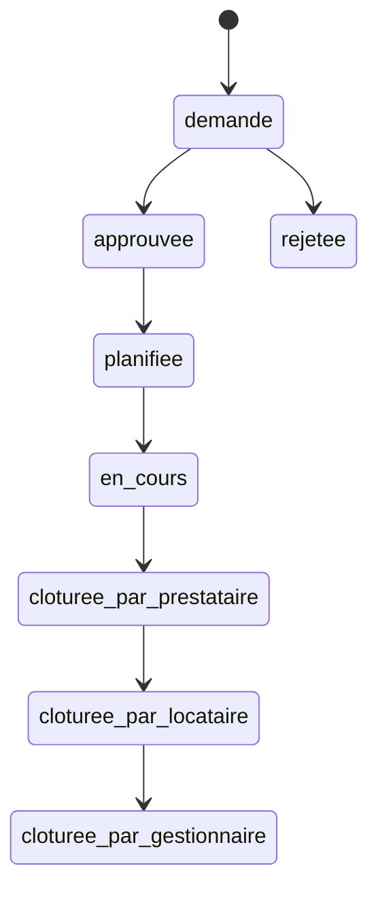

# Plan de Finalisation Complète du Système d'Interventions
*Analyse Complète et Feuille de Route 2025 - MISE À JOUR DÉTAILLÉE*

## 🔍 **ANALYSE CRITIQUE DE L'ÉTAT ACTUEL**

### ✅ **CE QUI EST FONCTIONNEL** (85% du système de base)

#### 🏗️ **Infrastructure Solide**
- **Base de données** : Schema complet avec 12 tables interconnectées
- **APIs Backend** : 13/16 endpoints critiques implémentés
- **Services métier** : Architecture modulaire et testable
- **Types TypeScript** : Système de types robuste et cohérent

#### 👤 **Workflows Utilisateurs Opérationnels**
- **Gestionnaire** : Création, approbation, rejet, planification de base ✅
- **Locataire** : Demande, suivi, validation de base ✅
- **Prestataire** : Consultation, actions de base ✅

#### 🔄 **Transitions d'États Complètes**


## ❌ **PROBLÈMES CRITIQUES IDENTIFIÉS**

### 🚨 **PROBLÈME MAJEUR : Gestion des Disponibilités NON Fonctionnelle**

#### **Analyse Technique Détaillée :**

**Dans `nouvelle-intervention/page.tsx` (Gestionnaire) :**
- ✅ Interface de saisie des créneaux (`timeSlots`) présente
- ❌ Données perdues : les `timeSlots` ne sont PAS sauvegardés en BDD
- ❌ Code TODO commenté : "Handle scheduling slots if provided" (ligne 464)

**Dans `nouvelle-demande/page.tsx` (Locataire) :**
- ✅ Interface de saisie des disponibilités présente
- ❌ Données perdues : les `availabilities` ne sont PAS sauvegardés en BDD
- ❌ Code TODO commenté : "Availability handling not yet implemented" (ligne 396)

**APIs Backend :**
- ❌ `create-intervention.ts` : Ligne 396-400 - "TODO: Handle availabilities"
- ❌ `create-manager-intervention.ts` : Ligne 464-488 - Sauvegarde partielle des timeSlots seulement

**Tables BDD :**
- ✅ `intervention_time_slots` existe pour les créneaux proposés par gestionnaire
- ❌ Aucune table pour les disponibilités utilisateur (locataire/prestataire)
- ❌ Aucun système de matching/croisement des disponibilités

#### **Impact Utilisateur :**
- 🔴 **Locataire** : Saisit ses disponibilités mais elles disparaissent
- 🔴 **Gestionnaire** : Propose des créneaux sans connaître les disponibilités du locataire
- 🔴 **Prestataire** : Aucun moyen de proposer ses disponibilités
- 🔴 **Système** : Pas de matching intelligent, planification manuelle uniquement

### 🔥 **AUTRES FONCTIONNALITÉS MANQUANTES CRITIQUES**

#### **PRIORITÉ 1 - Indispensables pour un flux 100% fonctionnel**

#### **1. Système de Devis Complet** ⚠️ **BLOQUANT**
**Impact** : Le statut `demande_de_devis` existe mais n'est pas fonctionnel

**Ce qui manque :**
- [ ] Table `intervention_quotes` en base de données
- [ ] API pour demander un devis (`/api/intervention-quote-request`)
- [ ] API pour soumettre un devis (`/api/intervention-quote-submit`)
- [ ] API pour valider/rejeter un devis (`/api/intervention-quote-validate`)
- [ ] Interface prestataire de soumission de devis
- [ ] Interface gestionnaire de validation de devis
- [ ] Workflow : `approuvee → demande_de_devis → planification`

#### **2. Magic Links Temporaires pour Prestataires (V1)** ⚠️ **BLOQUANT**
**Impact** : Prestataires avec compte doivent naviguer manuellement vers leurs interventions

**Concept V1** : Magic link temporaire (7 jours) avec auto-login direct vers l'intervention. Si expiré → connexion manuelle normale.

**Ce qui manque :**
- [ ] Table `intervention_magic_links` avec expiration 7 jours
- [ ] API de génération de liens temporaires
- [ ] API de validation avec auto-authentication
- [ ] Page d'accès `/prestataire/intervention/[token]` avec fallback connexion
- [ ] Gestion expiration gracieuse (redirect login)
- [ ] Intégration email automatique

#### **3. Interfaces de Clôture Professionnelles** ⚠️ **CRITIQUE UX**
**Impact** : Processus de clôture basique, manque de professionnalisme

**Pour Prestataires :**
- [ ] Upload photos avant/après avec métadonnées
- [ ] Rapport d'intervention détaillé (template)
- [ ] Upload facture avec validation format
- [ ] Interface mobile optimisée pour terrain
- [ ] Signature électronique

**Pour Locataires :**
- [ ] Interface de validation avec galerie comparative
- [ ] Système d'évaluation (note + commentaires)
- [ ] Workflow de contestation avec preuves
- [ ] Masquage des informations financières

**Pour Gestionnaires :**
- [ ] Vue consolidée complète
- [ ] Workflow de résolution de litiges
- [ ] Export PDF complet d'intervention
- [ ] Intégration préparation comptabilité

---

### ⭐ **PRIORITÉ 2 - Améliorations UX Importantes**

#### **4. Système de Chat/Communications**
**Impact** : Communication limitée entre parties prenantes

**État actuel :** Composants de base créés mais non fonctionnels
- `ChatsCard.tsx` : Interface de base présente
- `chat_rooms`, `chat_messages` : Tables non implémentées

**Ce qui manque :**
- [ ] Finalisation des tables de chat
- [ ] API WebSocket/Server-Sent Events pour temps réel
- [ ] Intégration notifications de nouveaux messages
- [ ] Upload de fichiers dans le chat
- [ ] Historique et recherche de messages

#### **5. Planification Avancée (Doodle-like)**
**Impact** : Planification manuelle, pas de collaboration

**Ce qui manque :**
- [ ] Interface de proposition de créneaux multiples
- [ ] Système de vote locataire/prestataire
- [ ] Sélection automatique du créneau optimal
- [ ] Intégration calendrier (iCal export)
- [ ] Notifications de rappel automatiques

---

### 🚀 **PRIORITÉ 3 - Fonctionnalités Avancées**

#### **6. Analytics et Reporting**
- [ ] Dashboard avec métriques temps réel
- [ ] Graphiques d'évolution des interventions
- [ ] Export CSV/PDF des rapports
- [ ] Suivi performance par prestataire
- [ ] Analyse des délais et satisfaction

#### **7. Notifications Avancées**
- [ ] Push notifications navigateur
- [ ] Templates email HTML professionnels
- [ ] SMS pour urgences (Twilio)
- [ ] Notifications de rappel intelligentes
- [ ] Préférences de notification par utilisateur

---

## 🎯 **PLAN D'IMPLÉMENTATION DÉTAILLÉ**

### **🔥 PHASE 1 : Système de Disponibilités Utilisateur (3-4 jours)**

#### **1.1 Nouvelles Tables BDD (Jour 1)**
```sql
-- Disponibilités des utilisateurs par intervention
CREATE TABLE user_availabilities (
  id UUID PRIMARY KEY DEFAULT gen_random_uuid(),
  user_id UUID REFERENCES users(id) NOT NULL,
  intervention_id UUID REFERENCES interventions(id) NOT NULL,
  date DATE NOT NULL,
  start_time TIME NOT NULL,
  end_time TIME NOT NULL,
  created_at TIMESTAMP WITH TIME ZONE DEFAULT NOW(),
  updated_at TIMESTAMP WITH TIME ZONE DEFAULT NOW(),

  -- Contraintes
  CHECK(end_time > start_time),
  UNIQUE(user_id, intervention_id, date, start_time)
);

-- Résultats du matching automatique
CREATE TABLE availability_matches (
  id UUID PRIMARY KEY DEFAULT gen_random_uuid(),
  intervention_id UUID REFERENCES interventions(id) NOT NULL,
  matched_date DATE NOT NULL,
  matched_start_time TIME NOT NULL,
  matched_end_time TIME NOT NULL,
  participant_user_ids UUID[] NOT NULL, -- IDs des participants qui matchent
  match_score INTEGER DEFAULT 0, -- Score de qualité du match (0-100)
  overlap_duration INTEGER NOT NULL, -- Durée de chevauchement en minutes
  created_at TIMESTAMP WITH TIME ZONE DEFAULT NOW()
);

-- Index pour performance
CREATE INDEX idx_user_availabilities_intervention ON user_availabilities(intervention_id, user_id);
CREATE INDEX idx_availability_matches_intervention ON availability_matches(intervention_id, match_score DESC);
```

#### **1.2 Nouvelles APIs (Jour 1-2)**
- `POST /api/intervention/[id]/user-availability` - Sauvegarder/modifier disponibilités utilisateur
- `GET /api/intervention/[id]/availabilities` - Récupérer toutes les disponibilités par intervention
- `POST /api/intervention/[id]/match-availabilities` - Calcul automatique du matching
- `PUT /api/intervention/[id]/select-slot` - Sélectionner le créneau final validé
- `DELETE /api/intervention/[id]/user-availability/[availabilityId]` - Supprimer une disponibilité

#### **1.3 Correction APIs Existantes (Jour 2)**
**Modifier `create-intervention.ts` :**
```typescript
// AVANT (ligne 396-400) - TODO commenté
if (availabilities && availabilities.length > 0) {
  console.log("📅 Availability handling not yet implemented")
}

// APRÈS - Implémentation complète
if (availabilities && availabilities.length > 0) {
  const userAvailabilities = availabilities.map(avail => ({
    user_id: user.id,
    intervention_id: intervention.id,
    date: avail.date,
    start_time: avail.startTime,
    end_time: avail.endTime
  }))

  await supabase.from('user_availabilities').insert(userAvailabilities)
  console.log("✅ User availabilities saved:", userAvailabilities.length)
}
```

**Modifier `create-manager-intervention.ts` :**
```typescript
// Améliorer la sauvegarde existante des timeSlots
// Ajouter la sauvegarde des disponibilités gestionnaire si fournies
```

### **⭐ PHASE 2 : Interface Matching & Sélection (2-3 jours)**

#### **2.1 Algorithme de Matching (Jour 3)**
```typescript
interface MatchingResult {
  perfectMatches: TimeSlot[] // Créneaux où tous les participants sont disponibles
  partialMatches: PartialMatch[] // Créneaux avec certains participants
  suggestions: AlternativeSlot[] // Suggestions de créneaux proches
  conflicts: ConflictInfo[] // Informations sur les conflits
}

class AvailabilityMatcher {
  async findOptimalSlots(interventionId: string): Promise<MatchingResult>
  calculateOverlapScore(userAvailabilities: UserAvailability[]): number
  suggestAlternatives(availabilities: UserAvailability[]): AlternativeSlot[]
}
```

#### **2.2 Composants React (Jour 4-5)**
- `AvailabilityManager.tsx` - Interface pour saisir/modifier ses disponibilités
- `AvailabilityMatcher.tsx` - Visualisation des créneaux compatibles avec scores
- `SlotSelector.tsx` - Sélection du créneau final avec validation multi-parties
- `AvailabilityConflictResolver.tsx` - Résolution de conflits et alternatives

#### **2.3 Hook Réactif (Jour 5)**
```typescript
export const useAvailabilityMatching = (interventionId: string) => {
  const [userAvailabilities, setUserAvailabilities] = useState<UserAvailability[]>([])
  const [allAvailabilities, setAllAvailabilities] = useState<UserAvailability[]>([])
  const [matchingResults, setMatchingResults] = useState<MatchingResult | null>(null)
  const [isMatching, setIsMatching] = useState(false)

  // Fonctions de gestion temps réel
  const saveUserAvailability = async (availability: UserAvailability) => { ... }
  const runMatching = async () => { ... }
  const selectFinalSlot = async (slot: TimeSlot) => { ... }
}
```

### **🚀 PHASE 3 : Workflow Complet par Statut (2-3 jours)**

#### **3.1 Actions Spécifiques par Rôle et Statut (Jour 6)**

**Workflow Détaillé :**
```
demande (locataire) →
  ↓ [gestionnaire: approve/reject]
approuvee →
  ↓ [gestionnaire: organize planning]
planification →
  ↓ [system: matching availabilities]
planifiee →
  ↓ [prestataire: start work]
en_cours →
  ↓ [prestataire: mark completed]
cloturee_par_prestataire →
  ↓ [locataire: validate/contest]
cloturee_par_locataire →
  ↓ [gestionnaire: finalize]
cloturee_par_gestionnaire
```

**Actions par Rôle :**

| Statut | Locataire | Gestionnaire | Prestataire |
|--------|-----------|--------------|-------------|
| `demande` | Modifier disponibilités | Approuver/Rejeter | - |
| `approuvee` | Attendre | Organiser planification | - |
| `planification` | Valider créneaux | Gérer matching | Proposer disponibilités |
| `planifiee` | Préparer RDV | Superviser | Confirmer présence |
| `en_cours` | Suivre | Superviser | Effectuer travaux |
| `cloturee_par_prestataire` | Valider/Contester | Superviser | Attendre validation |
| `cloturee_par_locataire` | - | Finaliser | - |

#### **3.2 Composants d'Action par Statut (Jour 7)**
```typescript
// Composants conditionnels selon statut + rôle
const InterventionActionPanel = ({ intervention, userRole }) => {
  const getAvailableActions = () => {
    switch (intervention.status) {
      case 'demande':
        if (userRole === 'gestionnaire') return ['approve', 'reject']
        if (userRole === 'locataire') return ['edit_availabilities']
        break
      case 'planification':
        if (userRole === 'gestionnaire') return ['run_matching', 'propose_slots']
        if (userRole === 'locataire') return ['confirm_slot']
        if (userRole === 'prestataire') return ['add_availabilities']
        break
      // ... autres statuts
    }
  }
}
```

### **🔧 PHASE 4 : Fonctionnalités Critiques Avancées (3-4 jours)**

#### **4.1 Système de Devis Complet (Jour 8-9)**
- Table `intervention_quotes` + APIs complètes
- Interface prestataire soumission devis
- Interface gestionnaire validation devis
- Workflow `approuvee → demande_de_devis → planification`

#### **4.2 Interfaces de Clôture Professionnelles (Jour 10-11)**
- Upload photos avant/après avec métadonnées
- Rapport d'intervention standardisé
- Signature électronique multi-parties
- Export PDF complet

#### **4.3 Magic Links Temporaires (Jour 12)**
- Liens 7 jours pour prestataires
- Auto-login sécurisé
- Fallback connexion gracieux

## 📊 **MÉTRIQUES DE SUCCÈS ET VALIDATION**

### **Objectifs Fonctionnels**
- [ ] **100% des disponibilités sauvegardées** : Plus de perte de données
- [ ] **Matching automatique opérationnel** : Créneaux compatibles calculés
- [ ] **0 blocage utilisateur** : Workflow fluide sans interruption
- [ ] **Temps de planification < 5 min** : De la saisie à la confirmation
- [ ] **Taux d'adoption disponibilités > 80%** : Utilisateurs utilisent la fonctionnalité

### **Tests de Validation Critiques**
1. **Test Locataire** : Créer demande + disponibilités → Vérifier sauvegarde BDD
2. **Test Gestionnaire** : Créer intervention + créneaux → Vérifier sauvegarde BDD
3. **Test Matching** : Plusieurs utilisateurs avec disponibilités → Vérifier suggestions
4. **Test Workflow** : Parcours complet demande → clôture → Vérifier transitions
5. **Test Performance** : 50 interventions simultanées → Temps réponse < 500ms

### **Métriques Techniques**
- [ ] **Couverture tests > 80%** pour nouvelles fonctionnalités
- [ ] **0 erreur critique** en production
- [ ] **Performance API < 500ms** (P95)
- [ ] **Compatibilité mobile 100%** pour interface disponibilités

## 🔧 **ASPECTS TECHNIQUES CRITIQUES**

### **🔒 Sécurité et Performance**

#### **Gestion des Disponibilités**
```typescript
// Validation côté serveur stricte
const validateAvailability = (availability: UserAvailability) => {
  // Validation format dates/heures
  // Validation chevauchements
  // Validation permissions utilisateur
  // Validation limites temporelles (pas plus de 6 mois à l'avance)
}
```

#### **Algorithme de Matching Optimisé**
```typescript
// Performance pour gros volumes
class AvailabilityMatcher {
  private calculateOptimalSlots(availabilities: UserAvailability[]): MatchResult {
    // Tri par date pour optimisation
    // Algorithme de balayage pour intersections
    // Cache des résultats par intervention
    // Limite calculs à fenêtre temporelle raisonnable
  }
}
```

#### **Index de Performance BDD**
```sql
-- Index critiques nouvelles tables
CREATE INDEX CONCURRENTLY idx_user_availabilities_lookup
  ON user_availabilities(intervention_id, user_id, date);
CREATE INDEX CONCURRENTLY idx_availability_matches_score
  ON availability_matches(intervention_id, match_score DESC);
CREATE INDEX CONCURRENTLY idx_intervention_time_slots_date
  ON intervention_time_slots(intervention_id, slot_date, is_selected);
```

### **📱 Compatibilité Mobile**
```typescript
// Interface responsive pour saisie disponibilités
const AvailabilityPicker = () => {
  // Composants optimisés tactile
  // Validation temps réel
  // Sauvegarde auto toutes les 30s
  // Mode hors ligne avec sync
}
```

## 🗓️ **PLANNING DÉTAILLÉ D'EXÉCUTION**

### **Semaine 1 : Infrastructure Disponibilités**
- **Jour 1** : Création tables BDD + migration
- **Jour 2** : APIs CRUD disponibilités utilisateur
- **Jour 3** : Correction create-intervention.ts et create-manager-intervention.ts
- **Jour 4** : Algorithme matching de base
- **Jour 5** : Tests infrastructure + APIs

### **Semaine 2 : Interface & Matching Avancé**
- **Jour 6** : Composants React gestion disponibilités
- **Jour 7** : Interface matching et visualisation
- **Jour 8** : Sélection créneaux finaux
- **Jour 9** : Workflow statuts détaillé
- **Jour 10** : Tests intégration E2E

### **Semaine 3 : Fonctionnalités Avancées**
- **Jour 11-12** : Système devis (si priorité)
- **Jour 13-14** : Interfaces clôture professionnelles
- **Jour 15** : Magic links temporaires + tests finaux

### **Validation Continue**
- Tests automatisés à chaque commit
- Validation manuelle daily
- Review code systématique
- Tests performance hebdomadaires

---

## 🎯 **RECOMMANDATION STRATÉGIQUE FINALE**

### **🔥 DÉMARRAGE IMMÉDIAT REQUIS**

**PRIORITÉ ABSOLUE :** Corriger le problème de disponibilités avant toute autre fonctionnalité.
Les utilisateurs perdent actuellement leurs données, ce qui nuit à la crédibilité du système.

### **📈 APPROCHE AGILE RECOMMANDÉE**

1. **Sprint 1 (Semaine 1)** : Infrastructure disponibilités + matching de base
2. **Sprint 2 (Semaine 2)** : Interface utilisateur + workflow complet
3. **Sprint 3 (Semaine 3)** : Fonctionnalités avancées selon priorités métier

### **🚀 CRITÈRES DE MISE EN PRODUCTION**

**MVP (Minimum Viable Product) :**
- ✅ Disponibilités sauvegardées et persistantes
- ✅ Matching automatique fonctionnel
- ✅ Workflow statuts complet
- ✅ Interface mobile responsive

**Production-Ready :**
- ✅ Toutes les fonctionnalités MVP
- ✅ Tests automatisés > 80% couverture
- ✅ Performance < 500ms P95
- ✅ Documentation utilisateur complète

### **💡 VALEUR AJOUTÉE IMMÉDIATE**

Avec ces améliorations, le système passera de **"Fonctionnel mais incomplet"** à **"Production-ready professionnel"**, offrant :

- 🎯 **UX fluide** sans perte de données
- 🤖 **Intelligence automatique** pour le matching
- ⚡ **Efficacité opérationnelle** accrue
- 📈 **Adoption utilisateur** facilitée
- 🔒 **Fiabilité technique** garantie

---

**CONCLUSION :** Ce plan transforme une base solide (85%) en système complet (100%) prêt pour usage intensif professionnel. L'investissement de 2-3 semaines débloquera la pleine valeur de l'application.

---

**MISE À JOUR :** *Document mis à jour le 20/09/2025 avec analyse technique détaillée et plan d'action précis basé sur l'état réel du code.*