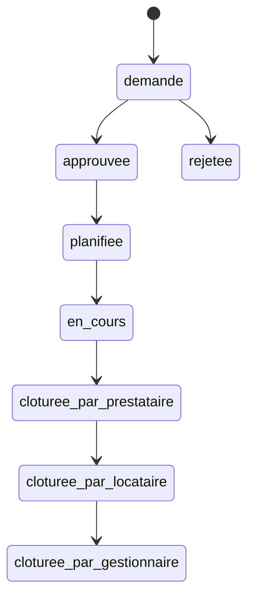

# Plan de Finalisation Complète du Système d'Interventions
*Analyse Complète et Feuille de Route 2025*

## 📋 Vue d'Ensemble de l'État Actuel

### ✅ **CE QUI EST FONCTIONNEL** (85% du système de base)

#### 🏗️ **Infrastructure Solide**
- **Base de données** : Schema complet avec 12 tables interconnectées
- **APIs Backend** : 13/16 endpoints critiques implémentés
- **Services métier** : Architecture modulaire et testable
- **Types TypeScript** : Système de types robuste et cohérent

#### 👤 **Workflows Utilisateurs Opérationnels**
- **Gestionnaire** : Création, approbation, rejet, planification, finalisation ✅
- **Locataire** : Demande, suivi, validation ✅
- **Prestataire** : Consultation, actions de base ✅

#### 🔄 **Transitions d'États Complètes**


---

## ❌ **FONCTIONNALITÉS MANQUANTES CRITIQUES**

### 🔥 **PRIORITÉ 1 - Indispensables pour un flux 100% fonctionnel**

#### **1. Système de Devis Complet** ⚠️ **BLOQUANT**
**Impact** : Le statut `demande_de_devis` existe mais n'est pas fonctionnel

**Ce qui manque :**
- [ ] Table `intervention_quotes` en base de données
- [ ] API pour demander un devis (`/api/intervention-quote-request`)
- [ ] API pour soumettre un devis (`/api/intervention-quote-submit`)
- [ ] API pour valider/rejeter un devis (`/api/intervention-quote-validate`)
- [ ] Interface prestataire de soumission de devis
- [ ] Interface gestionnaire de validation de devis
- [ ] Workflow : `approuvee → demande_de_devis → planification`

#### **2. Magic Links Temporaires pour Prestataires (V1)** ⚠️ **BLOQUANT**
**Impact** : Prestataires avec compte doivent naviguer manuellement vers leurs interventions

**Concept V1** : Magic link temporaire (7 jours) avec auto-login direct vers l'intervention. Si expiré → connexion manuelle normale.

**Ce qui manque :**
- [ ] Table `intervention_magic_links` avec expiration 7 jours
- [ ] API de génération de liens temporaires
- [ ] API de validation avec auto-authentication
- [ ] Page d'accès `/prestataire/intervention/[token]` avec fallback connexion
- [ ] Gestion expiration gracieuse (redirect login)
- [ ] Intégration email automatique

#### **3. Interfaces de Clôture Professionnelles** ⚠️ **CRITIQUE UX**
**Impact** : Processus de clôture basique, manque de professionnalisme

**Pour Prestataires :**
- [ ] Upload photos avant/après avec métadonnées
- [ ] Rapport d'intervention détaillé (template)
- [ ] Upload facture avec validation format
- [ ] Interface mobile optimisée pour terrain
- [ ] Signature électronique

**Pour Locataires :**
- [ ] Interface de validation avec galerie comparative
- [ ] Système d'évaluation (note + commentaires)
- [ ] Workflow de contestation avec preuves
- [ ] Masquage des informations financières

**Pour Gestionnaires :**
- [ ] Vue consolidée complète
- [ ] Workflow de résolution de litiges
- [ ] Export PDF complet d'intervention
- [ ] Intégration préparation comptabilité

---

### ⭐ **PRIORITÉ 2 - Améliorations UX Importantes**

#### **4. Système de Chat/Communications**
**Impact** : Communication limitée entre parties prenantes

**État actuel :** Composants de base créés mais non fonctionnels
- `ChatsCard.tsx` : Interface de base présente
- `chat_rooms`, `chat_messages` : Tables non implémentées

**Ce qui manque :**
- [ ] Finalisation des tables de chat
- [ ] API WebSocket/Server-Sent Events pour temps réel
- [ ] Intégration notifications de nouveaux messages
- [ ] Upload de fichiers dans le chat
- [ ] Historique et recherche de messages

#### **5. Planification Avancée (Doodle-like)**
**Impact** : Planification manuelle, pas de collaboration

**Ce qui manque :**
- [ ] Interface de proposition de créneaux multiples
- [ ] Système de vote locataire/prestataire
- [ ] Sélection automatique du créneau optimal
- [ ] Intégration calendrier (iCal export)
- [ ] Notifications de rappel automatiques

---

### 🚀 **PRIORITÉ 3 - Fonctionnalités Avancées**

#### **6. Analytics et Reporting**
- [ ] Dashboard avec métriques temps réel
- [ ] Graphiques d'évolution des interventions
- [ ] Export CSV/PDF des rapports
- [ ] Suivi performance par prestataire
- [ ] Analyse des délais et satisfaction

#### **7. Notifications Avancées**
- [ ] Push notifications navigateur
- [ ] Templates email HTML professionnels
- [ ] SMS pour urgences (Twilio)
- [ ] Notifications de rappel intelligentes
- [ ] Préférences de notification par utilisateur

---

## 🎯 **PLAN D'IMPLÉMENTATION RECOMMANDÉ**

### **🔥 PHASE 1 : Fonctionnalités Critiques (5-7 jours)**

#### **Jour 1-2 : Système de Devis**
```sql
-- Migration base de données
CREATE TABLE intervention_quotes (
  id UUID PRIMARY KEY DEFAULT gen_random_uuid(),
  intervention_id UUID REFERENCES interventions(id) NOT NULL,
  provider_contact_id UUID REFERENCES contacts(id) NOT NULL,
  amount DECIMAL(10,2) NOT NULL,
  description TEXT NOT NULL,
  estimated_duration INTEGER, -- en heures
  materials_cost DECIMAL(10,2) DEFAULT 0,
  labor_cost DECIMAL(10,2) NOT NULL,
  documents JSONB DEFAULT '[]',
  valid_until TIMESTAMP NOT NULL,
  status quote_status DEFAULT 'pending',
  submitted_at TIMESTAMP DEFAULT now(),
  reviewed_at TIMESTAMP,
  reviewed_by UUID REFERENCES users(id),
  review_comment TEXT,
  created_at TIMESTAMP DEFAULT now()
);

CREATE TYPE quote_status AS ENUM ('pending', 'approved', 'rejected', 'expired');
```

**APIs à développer :**
1. `POST /api/intervention-quote-request` - Gestionnaire demande devis
2. `POST /api/intervention-quote-submit` - Prestataire soumet devis
3. `PUT /api/intervention-quote-validate` - Gestionnaire valide/rejette

**Interfaces UI :**
1. Modale de demande de devis (gestionnaire)
2. Formulaire de soumission (prestataire)
3. Interface de validation (gestionnaire)

#### **Jour 3-4 : Magic Links Temporaires Prestataires (V1)**
```sql
-- Migration base de données - Liens temporaires 7 jours
CREATE TABLE intervention_magic_links (
  id UUID PRIMARY KEY DEFAULT gen_random_uuid(),
  intervention_id UUID REFERENCES interventions(id) NOT NULL,
  user_id UUID REFERENCES users(id) NOT NULL, -- Prestataire avec compte
  token TEXT UNIQUE NOT NULL,
  expires_at TIMESTAMP NOT NULL, -- 7 jours après création
  created_at TIMESTAMP DEFAULT now(),
  used_at TIMESTAMP,
  last_accessed TIMESTAMP,

  -- Index pour nettoyage des liens expirés
  CONSTRAINT valid_expiration CHECK (expires_at > created_at)
);
```

**Développements :**
1. `POST /api/intervention/[id]/generate-magic-link` - Génération avec expiration 7j
2. `GET /api/intervention/magic/[token]` - Validation + auto-login ou redirect
3. `/app/prestataire/intervention/[token]/page.tsx` - Page avec fallback login
4. Service de nettoyage automatique des liens expirés
5. Email automatique avec lien temporaire
6. Page d'erreur gracieuse si lien expiré → redirect login

#### **Jour 5-7 : Interfaces de Clôture Avancées**

**Composants à développer :**
1. `InterventionCompletionForm.tsx` (prestataire)
2. `InterventionValidationInterface.tsx` (locataire)
3. `InterventionFinalizationDashboard.tsx` (gestionnaire)
4. `PhotoGalleryComparison.tsx` (avant/après)
5. `SignaturePad.tsx` (signatures électroniques)

**Fonctionnalités :**
- Upload photos avec géolocalisation
- Templates de rapport standardisés
- Workflow de contestation
- Export PDF complet

### **⭐ PHASE 2 : Améliorations UX (3-4 jours)**

#### **Jour 8-9 : Chat Temps Réel**
```sql
-- Finalisation tables chat
CREATE TABLE chat_rooms (
  id UUID PRIMARY KEY DEFAULT gen_random_uuid(),
  intervention_id UUID REFERENCES interventions(id) NOT NULL,
  participants JSONB NOT NULL, -- Array of user IDs
  created_at TIMESTAMP DEFAULT now(),
  last_message_at TIMESTAMP DEFAULT now()
);

CREATE TABLE chat_messages (
  id UUID PRIMARY KEY DEFAULT gen_random_uuid(),
  room_id UUID REFERENCES chat_rooms(id) NOT NULL,
  sender_id UUID REFERENCES users(id) NOT NULL,
  message_text TEXT NOT NULL,
  message_type message_type DEFAULT 'text',
  attachments JSONB DEFAULT '[]',
  read_by JSONB DEFAULT '[]',
  created_at TIMESTAMP DEFAULT now()
);
```

**Intégrations :**
1. Supabase Realtime pour WebSocket
2. Composant chat responsive
3. Notifications push de nouveaux messages
4. Upload fichiers dans chat

#### **Jour 10-11 : Planification Collaborative**

**Fonctionnalités :**
1. Interface multi-créneaux (gestionnaire)
2. Système de vote (locataire + prestataire)
3. Algorithme de sélection optimal
4. Export iCal automatique

### **🚀 PHASE 3 : Fonctionnalités Premium (2-3 jours)**

#### **Jour 12-13 : Analytics & Notifications**

**Dashboard Analytics :**
- Métriques temps réel (KPIs)
- Graphiques d'évolution
- Performance par prestataire
- Export de rapports

**Notifications Avancées :**
- Push notifications navigateur
- Templates email professionnels
- SMS urgences (Twilio)
- Préférences utilisateur

---

## 🔧 **ASPECTS TECHNIQUES CRITIQUES**

### **🔒 Sécurité Magic Links**
```typescript
// Configuration sécurisée
const MAGIC_LINK_CONFIG = {
  EXPIRATION_HOURS: 48,
  MAX_USES: 3,
  RATE_LIMIT: 5, // par heure par gestionnaire
  TOKEN_LENGTH: 32,
  HTTPS_ONLY: true // Production
};
```

### **📧 Intégration Email**
```typescript
// Service email avec fallback
class EmailService {
  async sendMagicLink(email: string, token: string) {
    try {
      await this.smtp.send(template);
    } catch (error) {
      // Fallback: notification in-app
      await NotificationService.create(fallbackNotif);
    }
  }
}
```

### **💾 Performance Base de Données**
```sql
-- Index critiques pour performance
CREATE INDEX CONCURRENTLY idx_interventions_status_team ON interventions(status, team_id, created_at);
CREATE INDEX CONCURRENTLY idx_quotes_intervention_status ON intervention_quotes(intervention_id, status);
CREATE INDEX CONCURRENTLY idx_magic_links_token_active ON intervention_magic_links(token) WHERE used_at IS NULL;
```

---

## 📊 **MÉTRIQUES DE SUCCÈS**

### **Objectifs Fonctionnels**
- [ ] 100% des workflows d'intervention fonctionnels
- [ ] 0 blocage utilisateur dans le flux
- [ ] Temps de traitement < 5 min par étape
- [ ] Taux d'adoption > 80% par rôle

### **Objectifs Techniques**
- [ ] Temps de réponse API < 500ms (P95)
- [ ] Uptime > 99.5%
- [ ] 0 erreur critique en production
- [ ] Coverage tests > 80%

### **Objectifs UX**
- [ ] Score satisfaction > 4/5
- [ ] Taux de completion workflow > 95%
- [ ] Support mobile 100% fonctionnel
- [ ] Accessibilité WCAG 2.1 AA

---

## 🎯 **RECOMMANDATION STRATÉGIQUE**

### **🔥 DÉMARRAGE IMMÉDIAT**
**Commencer par la Phase 1 (5-7 jours)** pour débloquer le flux complet d'intervention. Ces fonctionnalités sont indispensables pour un système professionnel.

### **📈 DÉVELOPPEMENT ITÉRATIF**
**Phase 2 et 3** peuvent être développées en parallèle de la mise en production, selon les retours utilisateurs et priorités business.

### **🚀 MISE EN PRODUCTION**
Le système actuel (85% fonctionnel) peut déjà être utilisé en environnement contrôlé. La Phase 1 le rendra production-ready à 100%.

---

**Ce plan garantit un système d'intervention complet, professionnel et évolutif, prêt pour une utilisation intensive en production.**